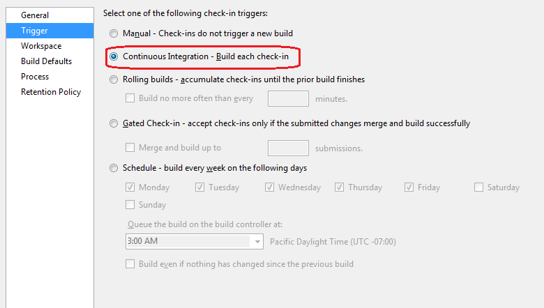

<properties linkid="dev-net-common-tasks-publishing-with-vso" urlDisplayName="Publishing with TFS" pageTitle="Continuous delivery with Visual Studio Online in Azure" metaKeywords="" description="Learn how to configure your Visual Studio Online team projects to automatically build and deploy to Azure web sites or cloud services." metaCanonical="" services="web-sites" documentationCenter=".NET" title="Continuous delivery to Azure using Visual Studio Online" authors="ghogen" solutions="" manager="" editor="" />

使用 Visual Studio Online 連續傳遞至 Azure
==========================================

Visual Studio Online (之前稱為 Team Foundation Service) 是常用的 Microsoft Team Foundation Server (TFS) 軟體的雲端服務版本，提供可靈活自訂的原始程式碼和組建管理、輕快的開發和團隊處理工作流程、問題和工作項目追蹤等。您可以將 Visual Studio Online 小組專案設定為自動建立和部署至 Azure 網站或雲端服務。如需有關如何使用內部部署 Team Foundation Server 來設定連續建立與部署系統，請參閱＜[Azure 中雲端服務的連續傳遞](../cloud-services-dotnet-continuous-delivery)＞。

本教學課程假設您已安裝 Visual Studio 2013 和 Azure SDK。如果尚無 Visual Studio 2013，請至 [www.visualstudio.com](http://www.visualstudio.com) 選擇 **[免費開始用]** 連結來下載。從[這裡](http://go.microsoft.com/fwlink/?LinkId=239540)安裝 Azure SDK。

若要使用 Visual Studio Online 將雲端服務設定為自動建立和部署至 Azure，請依照下列步驟進行：

-   [步驟 1：註冊 Visual Studio Online。](#step1)

-   [步驟 2：將專案簽入至原始檔控制。](#step2)

-   [步驟 3：將專案連線至 Azure。](#step3)

-   [步驟 4：進行變更並觸發重建和重新部署。](#step4)

-   [步驟 5：重新部署舊版組建 (選用)](#step5)

-   [步驟 6：變更生產部署 (僅雲端服務)](#step6)

註冊 Visual Studio Online步驟 1：註冊 Visual Studio Online
----------------------------------------------------------

1.  瀏覽至 <http://www.visualstudio.com> 建立 Visual Studio Online 帳戶。按一下 **[登入]** 連結。您需要使用 Microsoft 帳戶登入。如果是第一 次登入，系統會要求您提供一些關於您本人的資訊，例如姓名和電子郵件地址。 

     

2.  如果不是第一次登入，則登入時會看到此畫面。按一下 **[Create a free account now]** 連結。

     

3.  為新專案建立帳戶 URL。帳戶的格式為：https://&lt;accountname\>.visualstudio.com.

     

4.  現在您可以建立第一個專案。輸入專案名稱和說明。選擇您要使用的版本控制系統。Team Foundation 版本控制 (TFVC) 或 Git 都有支援。您可以在＜[使用版本控制](http://go.microsoft.com/fwlink/?LinkId=324037)＞找到這些選項的詳細資訊。本逐步解說假設您使用 TFVC。然後，選擇您的組織所使用的流程範本，再選擇 **[建立專案]** 按鈕。如需流程範本的詳細資訊，請參閱＜[使用 Team 專案成品，選擇流程範本](http://go.microsoft.com/fwlink/?LinkId=324035)＞。

     

5.  建立專案之後，按一下 **[Open with Visual Studio to connect]** 按鈕，自動啟動 Visual Studio 來連線至小組專案。如果出現任何安全性對話方塊，請選擇 [允許]。

     

將專案簽入至原始檔控制。步驟 2：將專案簽入至原始檔控制
------------------------------------------------------

1.  在 Visual Studio 中，開啟您要部署的方案，或建立新方案。您可以依照本逐步解說的步驟來部署網站或雲端服務 (Azure 應用程式)。如果要建立新方案，請建立新的 Azure 雲端服務專案，或建立新的 ASP.NET MVC 專案。請確定專案以 .NET Framework 4 或 4.5 為目標，如果是建立雲端服務專案，請加入 ASP.NET MVC Web 角色和背景工作角色，然後對 Web 角色選擇網際網路應用程式。出現提示時，選擇 **[網際網路應用程式]**。如果要建立網站，請選擇 ASP.NET Web 應用程式專案範本，然後選擇 MVC。請參閱＜[開始使用 Azure 和 ASP.NET](http://www.windowsazure.com/zh-tw/documentation/articles/web-sites-dotnet-get-started/)＞。

2.  開啟方案的內容功能表，選取 **[將方案加入至原始檔控制]**。

     

3.  接受或變更預設值，然後選擇 **[確定]** 按鈕。處理完成之後，[方案總管] 中會出現原始檔控制圖示。

     

4.  開啟方案的捷徑功能表，選擇 **[簽入]**。

     

5.  在 Team Explorer 的 [暫止的變更] 區域中，輸入簽入註解，然後選擇 **[簽入]** 按鈕。

     

 
請注意簽入時用來包含或排除特定變更的選項。如果已排除所需的變更，請選擇 **[全部包含]** 連結。

將專案連線至 Azure步驟 3：將專案連線至 Azure
--------------------------------------------

1.  您現有一個 VSO 小組專案，且裡面有一些原始程式碼，可以準備將小組專案連線至 Azure。在 [Azure 入口網站](http://manage.windowsazure.com) 中，選取您的雲端服務或網站，或選取左下方的 + 圖示，選擇 **[雲端服務]** 或 **[網站]**，然後選取 **[快速建立]**，以建立新的雲端服務或網站。選擇 **[Set up publishing with Visual Studio Online]** 連結。

     

2.  在精靈中，在文字方塊中輸入 Visual Studio Online 帳戶的名稱，然後按一下 **[立即授權]** 連結。可能會要求您登入。

     

3.  在 OAuth 快顯對話方塊中，選擇 **[接受]**，授權 Azure 在 VSO 中設定小組專案。

     

4.  授權成功時，將出現含有 Visual Studio Online 小組專案清單的下拉清單。選取您在先前步驟中建立的小組專案，然後選擇精靈的勾選記號按鈕。

     

5.  連結專案之後，將出現一些指示，指出如何將變更簽入至 Visual Studio Online 小組專案。下次簽入時，Visual Studio Online 就會建立專案並部署至 Azure。現在就試著按一下 **[從 Visual Studio 簽入]** 連結，再按一下 **[啟動 Visual Studio]** 連結 (或入口網站畫面底部同等的 **Visual Studio** 按鈕)。

     

觸發重建步驟 4：觸發重建和重新部署專案
--------------------------------------

1.  在 Visual Studio 的 Team Explorer 中，按一下 **[原始檔控制總管]** 連結。

     

2.  瀏覽至方案檔並開啟。

     

3.  在 [方案總管] 中，開啟檔案進行變更。例如，在 MVC Web 角色中，變更 Views\\Shared 資料夾下的 \_Layout.cshtml 檔案。

     

4.  編輯網站的標誌，然後按一下 Ctrl+S 儲存檔案。

     

5.  在 Team Explorer 中，選擇 **[暫止的變更]** 連結。

     

6.  輸入註解，然後選擇 **[簽入]** 按鈕。

     

7.  選擇 [首頁] 按鈕回到 Team Explorer 首頁。

     

8.  選擇 **[組建]** 連結來檢視進行中的組件。

    
 
     Team Explorer 會顯示簽入已觸發的組建。

     

9.  按兩下進行中的組建名稱，檢視進行中組建的詳細記錄。

     

10. 當組建進行時，查看您使用精靈將 TFS 連結至 Azure 時所建立的組建定義。開啟組建定義的捷徑功能表，然後選擇 **[編輯組建定義]**。

    
 
    在 **[觸發程序]** 索引標籤中，您會看到已設為依預設每次簽入時建置的組建定義。

    
 
    在 **[處理序]** 索引標籤中，您可以看到部署環境已設為您的雲端服務或網站的名稱。如果您使用網站，則您看到的屬性與這裡顯示的屬性不同。

    
 
    如果不想要使用預設值，請指定屬性的值。下表顯示雲端服務的預設屬性值：

	<table>
<tr><td><b>屬性</b></td><td><b>預設值</b></td></tr>
<tr><td>允許升級</td><td>true</td></tr>
<tr><td>雲端服務環境</td><td>預備</td></tr>
<tr><td>雲端服務名稱e</td><td>您連接的服務名稱</td></tr>
<tr><td>部署標籤</td><td>與服務名稱相同</td></tr>
<tr><td>服務組態</td><td>ServiceConfiguration.Cloud.cscfg</td></tr>
<tr><td>儲存體帳戶名稱</td><td>空白，表示嘗試尋找儲存體帳戶。</td></tr>
<tr><td>發行設定檔</td><td>.azurePubxml 檔案。如果您簽入一個，則可以在這裡選擇它。</td></tr>
</table>
 
 如果儲存體帳戶屬性保留空白，Azure 會搜尋帳戶。如果有一個與雲端服務同名的儲存體帳戶，則會使用此帳戶。否則會使用其他儲存體帳戶，或者，如果沒有儲存體帳戶，則會建立儲存體帳戶。儲存體帳戶在 Azure 中為儲存體檔案和其他資料提供空間。如需詳細資訊，請參閱＜[什麼是儲存體帳戶？](http://www.windowsazure.com/zh-tw/documentation/articles/storage-whatis-account)＞。

11.  現在應該已順利完成您的組建。

     

12.  如果按兩下組建名稱，Visual Studio 會顯示 **[組建摘要]**，包括與單元測試專案相關聯的任何測試結果。

     

13.  在 [Azure 入口網站](http://manage.windowsazure.com)中，選取預備環境之後，您可以在 [部署] 索引標籤上檢視相關聯的部署。

     

14.  瀏覽至網站的 URL。若是網站，請按一下命令列的 [瀏覽] 按鈕。若是雲端服務，請在 **[儀表板]** 頁面的 **[快速概覽]** 區段中選擇 URL，以顯示雲端服務的預備環境。依預設，來自雲端服務連續整合的部署會發行至預備環境。您可以將 [替代雲端服務環境] 屬性設為 [生產] 來變更此設定。此擷取畫面顯示網站 URL 在雲端服務儀表板頁面上的位置：

     
 
     新的瀏覽器索引標籤會開啟來顯示您執行中的網站。

     

5.  若為雲端服務，如果對專案進行其他變更，則會觸發更多組建，將累積多個部署。最後一個會標示為「作用中」。

     

重新部署舊版組建步驟 5：重新部署舊版組建
----------------------------------------

此步驟適用於雲端服務，且為選用的。在管理入口網站中，選取先前的部署，然後按一下 **[重新部署]** 按鈕，將網站倒回到更早的簽入。請注意，這會在 TFS 中觸發新的組建，並在部署歷程記錄中建立新的項目。

 

變更生產部署步驟 6：變更生產部署
--------------------------------

此步驟僅適用於雲端服務，不適用於網站。準備就緒後，您可以在管理入口網站中選擇 [交換] 按鈕，將預備環境升級至生產環境。新部署的預備環境會升級至「生產」，而先前的生產環境 (若有的話) 會變成預備環境。「作用中」部署可能與生產和預備環境不同，但最近組建的部署歷程記錄都一樣，與環境無關。

 

如需詳細資訊，請參閱 [Visual Studio Online](http://go.microsoft.com/fwlink/?LinkId=253861)。如果使用 Git，請參閱＜[在 Git 中共用程式碼](http://www.visualstudio.com/get-started/share-your-code-in-git-vs.aspx)＞和＜[從原始檔控制發行至 Azure 網站](http://www.windowsazure.com/zh-tw/documentation/articles/web-sites-publish-source-control)＞。

