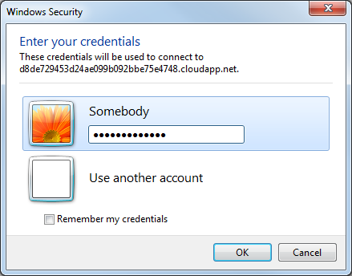
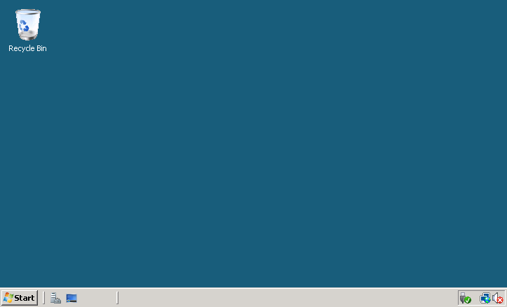

<properties linkid="dev-node-remotedesktop" urlDisplayName="Enable Remote Desktop" pageTitle="Enable remote desktop for cloud services (Node.js)" metaKeywords="Azure Node.js remote access, Azure Node.js remote connection, Azure Node.js VM access, Azure Node.js virtual machine access" description="Learn how to enable remote-desktop access for the virtual machines hosting your Azure Node.js application. " metaCanonical="" services="cloud-services" documentationCenter="Node.js" title="Enabling Remote Desktop in Azure" authors="" solutions="" manager="" editor="" />

在 Azure 中啟用遠端桌面
=======================

遠端桌面可讓您存取執行 Azure 之角色執行個體的桌面。您可以使用遠端桌面連接來設定虛擬機器，或對應用程式的問題進行疑難排解。

**注意**

本文中的步驟僅適用於以 Azure 雲端服務的形式受到代管的節點應用程式。

此工作包含下列步驟：

-   [步驟 1：使用 Azure PowerShell 設定服務的遠端桌面存取](#step1)
-   [步驟 2：連接到角色執行個體](#step2)
-   [步驟 3：使用 Azure PowerShell 將服務設定成停用遠端桌面存取](#step3)

步驟 1：使用 Azure PowerShell 設定服務的遠端桌面存取
----------------------------------------------------

若要使用遠端桌面，您必須使用在雲端中進行角色執行個體驗證的使用者名稱、密碼和憑證，設定您的服務定義和服務組態。[Azure PowerShell](http://go.microsoft.com/?linkid=9790229&clcid=0x409) 包含 **Enable-AzureServiceProjectRemoteDesktop** Cmdlet，可為您執行這項設定。

在建立服務定義的電腦中，執行下列步驟。

1.  在 **[開始]** 功能表中，選取 **[Azure PowerShell]**。

    

2.  將目錄切換至服務目錄，輸入 **Enable-AzureServiceProjectRemoteDesktop**，然後輸入您在雲端中驗證角色執行個體時所使用的使用者名稱和密碼。

    

3.  將服務組態變更發佈至雲端。在 **Azure PowerShell** 提示下，輸入 **Publish-AzureServiceProject**。

    

完成前述步驟後，雲端中的服務即會設定其角色執行個體的遠端桌面存取。

步驟 2：連接到角色執行個體
--------------------------

您的部署已在 Azure 中啟動並執行，現在您可以連接到角色執行個體。

1.  在 [Azure 管理入口網站](http://manage.windowsazure.com)中選取 **[雲端服務]**，然後選取先前在步驟 1 中部署的服務

    

2.  按一下 **[執行個體]**，然後按一下 **[生產]** 或 **[執行]**，以檢視服務的執行個體。選取執行個體，然後按一下頁面底部的 **[連接]**。

    

3.  當您按一下 **[連接]** 時，網頁瀏覽器會提示您儲存 .rdp 檔案。如果您使用的是 Internet Explorer，請按一下 **[開啟]**。

    

4.  檔案開啟時，會出現下列安全性提示：

    

5.  按一下 **[連接]** 時會出現安全性提示，要求您輸入存取執行個體所需的認證。請輸入您在[步驟 1](#step1) 中建立的密碼，然後按一下 **[確定]**。

    

連接建立後，「遠端桌面連接」會在 Azure 中顯示執行個體的桌面。您已成功取得執行個體的遠端存取，並且可執行任何必要工作來管理您的應用程式。

步驟 3：使用 Azure PowerShell 將服務設定成停用遠端桌面存取
----------------------------------------------------------

當您不需要再透過遠端桌面連接到雲端中的角色執行個體時，請使用 [Azure PowerShell](http://go.microsoft.com/?linkid=9790229&clcid=0x409) 停用遠端桌面存取

1.  在 **[開始]** 功能表中，選取 **[Azure PowerShell]**。

2.  將目錄切換至服務目錄，然後輸入 **Disable-AzureServiceProjectRemoteDesktop**：

3.  將服務組態變更發佈至雲端。在 **Azure PowerShell** 提示下，輸入 **Publish-AzureServiceProject**：

其他資源
--------

-   [從遠端存取 Azure 中的角色執行個體](http://msdn.microsoft.com/zh-tw/library/windowsazure/hh124107.aspx)
-   [搭配使用遠端桌面與 Azure 角色](http://msdn.microsoft.com/zh-tw/library/windowsazure/gg443832.aspx)

