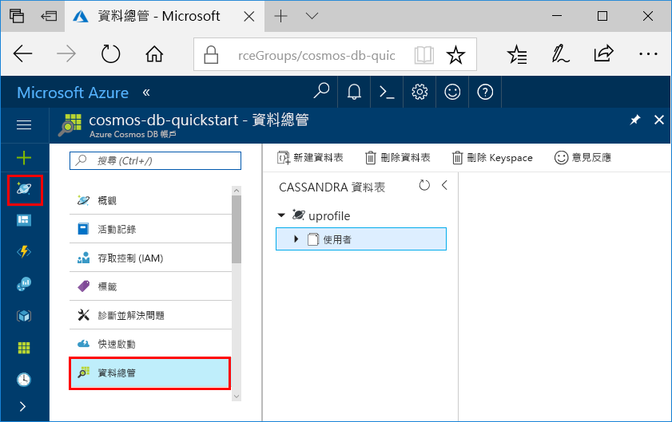

# <a name="quickstart-build-a-cassandra-app-with-java-and-azure-cosmos-db"></a>快速入門：使用 JAVA 和 Azure Cosmos DB 建置 Cassandra 應用程式

本快速入門示範如何使用 JAVA 與 Azure Cosmos DB [Cassandra API](cassandra-introduction.md)，以藉由從 GitHub 複製範例來建置設定檔應用程式。 本快速入門也會逐步引導您使用網頁型 Azure 入口網站建立 Azure Cosmos DB 帳戶。

Azure Cosmos DB 是 Microsoft 的全域分散式多模型資料庫服務。 您可以快速建立及查詢文件、資料表、索引鍵/值及圖形資料庫，所有這些都受惠於位於 Azure Cosmos DB 核心的全域散發和水平調整功能。 

## <a name="prerequisites"></a>先決條件

[!INCLUDE [quickstarts-free-trial-note](../../includes/quickstarts-free-trial-note.md)]或者，您可以[免費試用 Azure Cosmos DB](https://azure.microsoft.com/try/cosmosdb/)，無須 Azure 訂用帳戶，也無須任何費用和約定付款。

Azure Cosmos DB Cassandra API 預覽版程式的存取權。 如果您尚未申請存取權，請[立即註冊](cassandra-introduction.md#sign-up-now)。

此外： 

* [Java Development Kit (JDK) 1.7+](http://www.oracle.com/technetwork/java/javase/downloads/jdk8-downloads-2133151.html)
    * 在 Ubuntu 上，執行 `apt-get install default-jdk` 來安裝 JDK。
    * 務必設定 JAVA_HOME 環境變數，以指向 JDK 安裝所在的資料夾。
* [下載](http://maven.apache.org/download.cgi)和[安裝 ](http://maven.apache.org/install.html) [Maven](http://maven.apache.org/) 二進位封存檔
    * 在 Ubuntu 上，您可以執行 `apt-get install maven` 來安裝 Maven。
* [Git](https://www.git-scm.com/)
    * 在 Ubuntu 上，您可以執行 `sudo apt-get install git` 來安裝 Git。


## <a name="create-a-database-account"></a>建立資料庫帳戶

您必須先使用 Azure Cosmos DB 建立 Cassandra 帳戶，才可以建立文件資料庫。

[!INCLUDE [cosmos-db-create-dbaccount-cassandra](../../includes/cosmos-db-create-dbaccount-cassandra.md)]

## <a name="clone-the-sample-application"></a>複製範例應用程式

現在讓我們切換為使用程式碼。 我們將從 GitHub 複製 Cassandra 應用程式、設定連接字串，然後加以執行。 您會看到，以程式設計方式來處理資料有多麼的容易。 

1. 開啟 git 終端機視窗 (例如 git bash)，並使用 `cd` 命令變更至要安裝範例應用程式的資料夾。 

    ```bash
    cd "C:\git-samples"
    ```

2. 執行下列命令來複製範例存放庫。 此命令會在您的電腦上建立範例應用程式副本。

    ```bash
    git clone https://github.com/Azure-Samples/azure-cosmos-db-cassandra-java-getting-started.git
    ```

## <a name="review-the-code"></a>檢閱程式碼

此為選用步驟。 若您想要瞭解如何在程式碼中建立資料庫資源，則可檢閱下列程式碼片段。 或者也可以直接跳至[更新您的連接字串](#update-your-connection-string)。 這些程式碼片段摘錄自 src/main/java/com/azure/cosmosdb/cassandra/util/CassandraUtils.java。  

* Cassandra 主機、連接埠、使用者名稱、密碼及 SSL 選項已設定。 連接字串資訊來自 Azure 入口網站的連接字串頁面。

   ```java
   cluster = Cluster.builder().addContactPoint(cassandraHost).withPort(cassandraPort).withCredentials(cassandraUsername, cassandraPassword).withSSL(sslOptions).build();
   ```

* `cluster` 會連線至 Azure Cosmos DB Cassandra API，並傳回要存取的工作階段。

    ```java
    return cluster.connect();
    ```

下列程式碼片段摘錄自 src/main/java/com/azure/cosmosdb/cassandra/repository/UserRepository.java 檔案。

* 建立新的 keyspace。

    ```java
    public void createKeyspace() {
        final String query = "CREATE KEYSPACE IF NOT EXISTS uprofile WITH replication = {'class': 'SimpleStrategy', 'replication_factor': '3' } ";
        session.execute(query);
        LOGGER.info("Created keyspace 'uprofile'");
    }
    ```

* 建立新的資料表。

   ```java
   public void createTable() {
        final String query = "CREATE TABLE IF NOT EXISTS uprofile.user (user_id int PRIMARY KEY, user_name text, user_bcity text)";
        session.execute(query);
        LOGGER.info("Created table 'user'");
   }
   ```

* 使用備妥的陳述式物件插入使用者實體。

    ```java
    public PreparedStatement prepareInsertStatement() {
        final String insertStatement = "INSERT INTO  uprofile.user (user_id, user_name , user_bcity) VALUES (?,?,?)";
        return session.prepare(insertStatement);
    }

    public void insertUser(PreparedStatement statement, int id, String name, String city) {
        BoundStatement boundStatement = new BoundStatement(statement);
        session.execute(boundStatement.bind(id, name, city));
    }
    ```

* 取得所有使用者資訊的查詢。

    ```java
   public void selectAllUsers() {
        final String query = "SELECT * FROM uprofile.user";
        List<Row> rows = session.execute(query).all();

        for (Row row : rows) {
            LOGGER.info("Obtained row: {} | {} | {} ", row.getInt("user_id"), row.getString("user_name"), row.getString("user_bcity"));
        }
    }
    ```

* 取得單一使用者資訊的查詢。

    ```java
    public void selectUser(int id) {
        final String query = "SELECT * FROM uprofile.user where user_id = 3";
        Row row = session.execute(query).one();

        LOGGER.info("Obtained row: {} | {} | {} ", row.getInt("user_id"), row.getString("user_name"), row.getString("user_bcity"));
    }
    ```

## <a name="update-your-connection-string"></a>更新您的連接字串

現在，返回 Azure 入口網站以取得連接字串資訊，並將它複製到應用程式中。 這可讓您的應用程式與託管資料庫進行通訊。

1. 在 [Azure 入口網站](http://portal.azure.com/)中，按一下 [連接字串]。 

    ![從 Azure 入口網站 [連接字串] 頁面檢視及複製使用者名稱](./media/create-cassandra-java/keys.png)

2. 使用 ![畫面右方的 [複製] 按鈕](./media/create-cassandra-java/copy.png) 來複製 [連絡點] 值。

3. 從 C:\git-samples\azure-cosmosdb-cassandra-java-getting-started\java-examples\src\main\resources 資料夾開啟 `config.properties` 檔案。 

3. 從入口網站將 [連絡點] 值貼到 `<Cassandra endpoint host>` 的行 2。

    config.properties 的第 2 行現在看起來應該類似於 

    `cassandra_host=cosmos-db-quickstarts.documents.azure.com`

3. 返回入口網站，並複製 [使用者名稱] 值。 從入口網站將 [使用者名稱] 值貼到 `<cassandra endpoint username>` 的行 4。

    config.properties 的第 4 行現在看起來應該類似於 

    `cassandra_username=cosmos-db-quickstart`

4. 返回入口網站，並複製 [密碼] 值。 從入口網站將 [密碼] 值貼到 `<cassandra endpoint password>` 的行 5。

    config.properties 的第 5 行現在看起來應該類似於 

    `cassandra_password=2Ggkr662ifxz2Mg...==`

5. 在第 6 行中，如果您想要使用特定的 SSL 憑證，請將 `<SSL key store file location>` 取代為 SSL 憑證的位置。 如果未提供值，會使用安裝在 <JAVA_HOME>/jre/lib/security/cacerts 的 JDK 憑證。 

6. 如果您變更行 6 為使用特定的 SSL 憑證，請更新行 7 以使用該憑證的密碼。 

7. 儲存 config.properties 檔案。

## <a name="run-the-app"></a>執行應用程式

1. 在 git 終端機視窗中，`cd` 至 azure-cosmosdb-cassandra-java-getting-started\java-examples 資料夾。

    ```git
    cd "C:\git-samples\azure-cosmosdb-cassandra-java-getting-started\java-examples"
    ```

2. 在 git 終端機視窗中，使用下列命令來產生 cosmosdb-cassandra-examples.jar 檔案。

    ```git
    mvn clean install
    ```

3. 在 git 終端機視窗中，執行下列命令以啟動 JAVA 應用程式。

    ```git
    java -cp target/cosmosdb-cassandra-examples.jar com.azure.cosmosdb.cassandra.examples.UserProfile
    ```

    終端機視窗會顯示 keyspace 和資料表已建立的通知。 它會接著選取並傳回資料表中的所有使用者並顯示輸出，然後依識別碼選取資料列並顯示值。  

    按 CTRL + C 來停止執行程式，並關閉主控台視窗。 
    
    您現在可在 Azure 入口網站中開啟 [資料總管]，以查看、查詢、修改及使用這項新資料。 

    

## <a name="review-slas-in-the-azure-portal"></a>在 Azure 入口網站中檢閱 SLA

[!INCLUDE [cosmosdb-tutorial-review-slas](../../includes/cosmos-db-tutorial-review-slas.md)]

## <a name="clean-up-resources"></a>清除資源

[!INCLUDE [cosmosdb-delete-resource-group](../../includes/cosmos-db-delete-resource-group.md)]

## <a name="next-steps"></a>後續步驟

在本快速入門中，您已了解如何使用 [資料總管] 來建立 Azure Cosmos DB 帳戶、Cassandra 資料庫和集合，以及如何執行應用程式來以程式設計方式執行同樣的作業。 您現可將其他資料匯入至 Azure Cosmos DB 集合。 

> [!div class="nextstepaction"]
> [將 Cassandra 資料匯入到 Azure Cosmos DB](cassandra-import-data.md)
