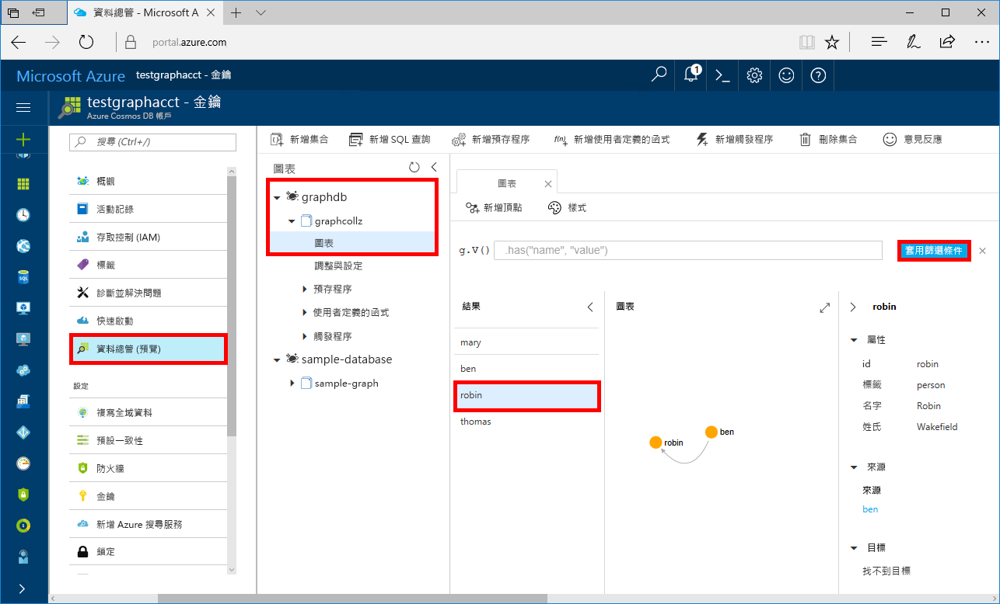

# <a name="azure-cosmos-db-build-a-net-framework-or-core-application-using-the-graph-api"></a>Azure Cosmos DB：使用圖形 API 來建置 .NET Framework 或 Core 應用程式

Azure Cosmos DB 是 Microsoft 的全域分散式多模型資料庫服務。 您可以快速建立及查詢文件、索引鍵/值及圖形資料庫，所有這些都受惠於位於 Azure Cosmos DB 核心的全域散發和水平調整功能。 

本快速入門會示範如何使用 Azure 入口網站建立 Azure Cosmos DB 帳戶、資料庫和圖形 (容器)。 您會接著建置和執行以[圖形 API](graph-sdk-dotnet.md) (預覽) 為基礎的主控台應用程式。  

## <a name="prerequisites"></a>必要條件

如果尚未安裝 Visual Studio 2017，您可以下載並使用**免費的** [Visual Studio 2017 Community 版本](https://www.visualstudio.com/downloads/)。 務必在 Visual Studio 設定期間啟用 **Azure 開發**。

如果您已安裝 Visual Studio 2017，請確定已安裝最多至 [Visual Studio 2017 Update 3](https://www.visualstudio.com/en-us/news/releasenotes/vs2017-relnotes)。

[!INCLUDE [quickstarts-free-trial-note](../../includes/quickstarts-free-trial-note.md)]

## <a name="create-a-database-account"></a>建立資料庫帳戶

[!INCLUDE [cosmos-db-create-dbaccount-graph](../../includes/cosmos-db-create-dbaccount-graph.md)]

## <a name="add-a-graph"></a>新增圖形

[!INCLUDE [cosmos-db-create-graph](../../includes/cosmos-db-create-graph.md)]

## <a name="clone-the-sample-application"></a>複製範例應用程式

現在，我們將從 Github 複製圖形 API 應用程式、設定連接字串，然後執行它。 您會看到，以程式設計方式來處理資料有多麼的容易。 

這個範例專案是使用 .NET Core 專案格式，並已設定為將下列架構作為目標：
 - netcoreapp2.0
 - net461

1. 開啟 Git 終端機視窗 (例如 Git Bash)，然後使用 `cd` 來切換到工作目錄。  

2. 執行下列命令來複製範例存放庫。 

    ```bash
    git clone https://github.com/Azure-Samples/azure-cosmos-db-graph-dotnet-getting-started.git
    ```

3. 然後開啟 Visual Studio 並開啟方案檔案。 

## <a name="review-the-code"></a>檢閱程式碼

讓我們快速檢閱應用程式中所發生的事情。 請開啟 Program.cs 檔案，您會發現這些程式碼行建立 Azure Cosmos DB 資源。 

* 已初始化 DocumentClient。 在預覽中，我們在 Azure Cosmos DB 用戶端上新增了圖形擴充 API。 我們正努力開發與 Azure Cosmos DB 用戶端和資源分離的獨立圖形用戶端。

    ```csharp
    using (DocumentClient client = new DocumentClient(
        new Uri(endpoint),
        authKey,
        new ConnectionPolicy { ConnectionMode = ConnectionMode.Direct, ConnectionProtocol = Protocol.Tcp }))
    ```

* 已建立新資料庫。

    ```csharp
    Database database = await client.CreateDatabaseIfNotExistsAsync(new Database { Id = "graphdb" });
    ```

* 已建立新圖形。

    ```csharp
    DocumentCollection graph = await client.CreateDocumentCollectionIfNotExistsAsync(
        UriFactory.CreateDatabaseUri("graphdb"),
        new DocumentCollection { Id = "graph" },
        new RequestOptions { OfferThroughput = 1000 });
    ```
* 已使用 `CreateGremlinQuery` 方法執行一系列的 Gremlin 步驟。

    ```csharp
    // The CreateGremlinQuery method extensions allow you to execute Gremlin queries and iterate
    // results asychronously
    IDocumentQuery<dynamic> query = client.CreateGremlinQuery<dynamic>(graph, "g.V().count()");
    while (query.HasMoreResults)
    {
        foreach (dynamic result in await query.ExecuteNextAsync())
        {
            Console.WriteLine($"\t {JsonConvert.SerializeObject(result)}");
        }
    }

    ```

## <a name="update-your-connection-string"></a>更新您的連接字串

現在，返回 Azure 入口網站以取得連接字串資訊，並將它複製到應用程式中。

1. 在 Visual Studio 2017 中，開啟 appsettings.json 檔案。 

2. 在 Azure 入口網站的 Azure Cosmos DB 帳戶中，按一下左側瀏覽區中的 [金鑰]。 

    ![在 Azure 入口網站的 [金鑰] 頁面上檢視並複製主要金鑰](./media/create-graph-dotnet/keys.png)

3. 從入口網站複製您的 [URI] 值，並使它成為 appsettings.json 中的端點金鑰值。 您可以使用上面螢幕擷取畫面中所示的複製按鈕來複製此值。

    `"endpoint": "https://FILLME.documents.azure.com:443/",`

4. 從入口網站複製您的**主要金鑰**，並使它成為 App.config 中的 AuthKey 金鑰值，然後儲存變更。 

    `"authkey": "FILLME"`

您現已更新應用程式，使其具有與 Azure Cosmos DB 通訊所需的所有資訊。 

## <a name="run-the-console-app"></a>執行主控台應用程式

在執行應用程式之前，建議您將 Microsoft.Azure.Graphs 套件更新為最新版本。

1. 在 Visual Studio 中，於 方案總管 中的 GraphGetStarted 專案上按一下滑鼠右鍵，然後按一下管理 NuGet 套件。 

2. 在 NuGet 套件管理員的 [更新] 索引標籤中，輸入 Microsoft.Azure.Graphs，並勾選 [包括發行前版本] 方塊。 

3. 從結果中，將 **Microsoft.Azure.Graphs** 文件庫更新為最新版本的套件。 這會安裝 Azure Cosmos DB 圖形擴充程式庫套件以及所有相依性。

    如果您收到關於檢閱方案變更的訊息，請按一下 [確定]。 如果您收到關於接受授權的訊息，請按一下 [我接受]。

4. 按 CTRL + F5 來執行應用程式。

   主控台視窗會顯示將要新增至圖形的頂點和邊緣。 當指令碼完成時，請按兩次 ENTER 以關閉主控台視窗。

## <a name="browse-using-the-data-explorer"></a>使用資料總管進行瀏覽

您現在可以回到 Azure 入口網站中的 [資料總管]，瀏覽及查詢新的圖形資料。

1. 在 [資料總管] 中，新的資料庫會出現在 [圖形] 窗格中。 展開 graphdb、graphcollz，然後按一下圖形。

2. 按一下 [套用篩選條件] 按鈕，以使用預設查詢來檢視圖形中的所有頂點。 範例應用程式所產生的資料會顯示在 [圖形] 窗格中。

    您可以縮放圖形、展開圖形顯示空間、新增其他頂點，並在顯示介面上移動頂點。

    

## <a name="review-slas-in-the-azure-portal"></a>在 Azure 入口網站中檢閱 SLA

[!INCLUDE [cosmosdb-tutorial-review-slas](../../includes/cosmos-db-tutorial-review-slas.md)]

## <a name="clean-up-resources"></a>清除資源

如果您將不繼續使用此應用程式，請使用下列步驟，在 Azure 入口網站中刪除本快速入門所建立的所有資源： 

1. 從 Azure 入口網站的左側功能表中，按一下 [資源群組]，然後按一下您所建立資源的名稱。 
2. 在資源群組頁面上，按一下 刪除，在文字方塊中輸入要刪除之資源的名稱，然後按一下刪除。

## <a name="next-steps"></a>後續步驟

在本快速入門中，您已了解如何建立 Azure Cosmos DB 帳戶、如何使用 [資料總管] 來建立圖形，以及如何執行應用程式。 您現在可以使用 Gremlin 來建置更複雜的查詢和實作強大的圖形周遊邏輯。 

> [!div class="nextstepaction"]
> [使用 Gremlin 進行查詢](tutorial-query-graph.md)

