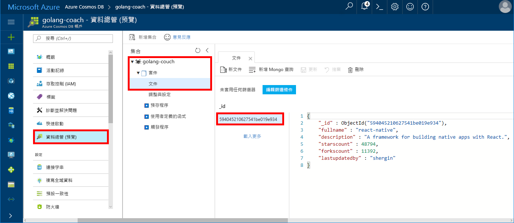

# <a name="azure-cosmos-db-build-a-mongodb-api-console-app-with-golang-and-the-azure-portal"></a>Azure CosmosDB︰使用 Golang 和 Azure 入口網站建置 MongoDB API 主控台應用程式

> [!div class="op_single_selector"]
> * [.NET](create-mongodb-dotnet.md)
> * [Java](create-mongodb-java.md)
> * [Node.js](create-mongodb-nodejs.md)
> * [Python](create-mongodb-flask.md)
> * [Xamarin](create-mongodb-xamarin.md)
> * [Golang](create-mongodb-golang.md)
>  

Azure Cosmos DB 是 Microsoft 的全域分散式多模型資料庫服務。 您可以快速建立及查詢文件、索引鍵/值及圖形資料庫，所有這些都受惠於位於 Azure Cosmos DB 核心的全域散發和水平調整功能。

此快速入門示範如何使用以 [Golang](https://golang.org/) 撰寫的現有 MongoDB 應用程式，並將其連線至可使用 [MongoDB API](mongodb-introduction.md) 來支援 MongoDB 用戶端連線的 Azure Cosmos DB 資料庫。

換句話說，您的 Golang 應用程式只知道它使用 MongoDB API 連線到資料庫。 對於資料儲存在 Azure Cosmos DB 中的應用程式而言是透明的。

## <a name="prerequisites"></a>必要條件

- Azure 訂用帳戶。 如果您沒有 Azure 訂用帳戶，請在開始前建立[免費帳戶](https://azure.microsoft.com/free) 。 

  [!INCLUDE [cosmos-db-emulator-mongodb](../../includes/cosmos-db-emulator-mongodb.md)]

- [Go](https://golang.org/) 語言的 [Go](https://golang.org/dl/) 和基本知識。
- IDE — Jetbrains 的 [GoLand](https://www.jetbrains.com/go/)、Microsoft 的 [Visual Studio 程式碼](https://code.visualstudio.com/) 或 [Atom](https://atom.io/)。 在本教學課程中，我是使用 Goglang。

<a id="create-account"></a>
## <a name="create-a-database-account"></a>建立資料庫帳戶

[!INCLUDE [cosmos-db-create-dbaccount](../../includes/cosmos-db-create-dbaccount-mongodb.md)]

## <a name="clone-the-sample-application"></a>複製範例應用程式

複製範例應用程式並安裝必要的套件。

1. 在 GOROOT\src 資料夾 (預設為 C:\Go\) 內建立名為 CosmosDBSample 的資料夾。
2. 使用 git 終端機視窗 (例如 git bash) 執行下列命令，將範例存放庫複製到 CosmosDBSample 資料夾中。 

    ```bash
    git clone https://github.com/Azure-Samples/azure-cosmos-db-mongodb-golang-getting-started.git
    ```
3.  執行下列命令以取得 mgo 套件。 

    ```
    go get gopkg.in/mgo.v2
    ```

[mgo](http://labix.org/mgo) 驅動程式是 [Go 語言](http://golang.org/)的 [MongoDB](http://www.mongodb.org/) 驅動程式，它可在非常簡單且符合標準 Go 慣用語的 API 之下實作豐富且經過妥善測試的精選功能。

<a id="connection-string"></a>

## <a name="update-your-connection-string"></a>更新您的連接字串

現在，返回 Azure 入口網站以取得連接字串資訊，並將它複製到應用程式中。

1. 按一下左側導覽功能表中的 [快速入門]，然後按一下 [其他] 以檢視 Go 應用程式所需的連接字串資訊。

2. 在 Goglang 中，開啟 GOROOT\CosmosDBSample 目錄中的 main.go 檔案，並從 Azure 入口網站使用連接字串資訊來更新下列程式碼行，如下列螢幕擷取畫面所示。 

    在 Azure 入口網站的連接字串窗格中，資料庫名稱是 [主機] 值的前置詞。 針對下圖中顯示的帳戶，資料庫名稱是 golang-coach。

    ```go
    Database: "The prefix of the Host value in the Azure portal",
    Username: "The Username in the Azure portal",
    Password: "The Password in the Azure portal",
    ```

    ![Azure 入口網站中的 [快速入門] 窗格、顯示連接字串資訊的 [其他] 索引標籤](./media/create-mongodb-golang/cosmos-db-golang-connection-string.png)

3. 儲存 main.go 檔案。

## <a name="review-the-code"></a>檢閱程式碼

此為選用步驟。 若您想要瞭解如何在程式碼中建立資料庫資源，則可檢閱下列程式碼片段。 或是，您可以直接跳到[執行應用程式](#run-the-app)。 

下列程式碼片段全部取自 main.go 檔案。

### <a name="connecting-the-go-app-to-azure-cosmos-db"></a>將 Go 應用程式連線到 Azure Cosmos DB

Azure Cosmos DB 支援啟用 SSL 的 MongoDB。 若要連線至啟用 SSL 的 MongoDB，您需要在 [mgo.DialInfo](http://gopkg.in/mgo.v2#DialInfo) 中定義 **DialServer** 函式，並利用 [tls.*Dial*](http://golang.org/pkg/crypto/tls#Dial) 函式執行連線。

下列 Golang 程式碼片段會透過 Azure Cosmos DB MongoDB API 連線到 Go 應用程式。 DialInfo 類別保存可供建立 MongoDB 叢集之工作階段的選項。

```go
// DialInfo holds options for establishing a session with a MongoDB cluster.
dialInfo := &mgo.DialInfo{
    Addrs:    []string{"golang-couch.documents.azure.com:10255"}, // Get HOST + PORT
    Timeout:  60 * time.Second,
    Database: "database", // It can be anything
    Username: "username", // Username
    Password: "Azure database connect password from Azure Portal", // PASSWORD
    DialServer: func(addr *mgo.ServerAddr) (net.Conn, error) {
        return tls.Dial("tcp", addr.String(), &tls.Config{})
    },
}

// Create a session which maintains a pool of socket connections
// to our Azure Cosmos DB MongoDB database.
session, err := mgo.DialWithInfo(dialInfo)

if err != nil {
    fmt.Printf("Can't connect to mongo, go error %v\n", err)
    os.Exit(1)
}

defer session.Close()

// SetSafe changes the session safety mode.
// If the safe parameter is nil, the session is put in unsafe mode, 
// and writes become fire-and-forget,
// without error checking. The unsafe mode is faster since operations won't hold on waiting for a confirmation.
// 
session.SetSafe(&mgo.Safe{})
```

沒有 SSL 連線時會使用 **mgo.Dial()** 方法。 SSL 連線需使用 **mgo.DialWithInfo()** 方法。

**DialWIthInfo{}** 物件的執行個體用來建立工作階段物件。 一旦建立工作階段，您就可以使用下列程式碼片段來存取集合：

```go
collection := session.DB("database").C("package")
```

<a id="create-document"></a>

### <a name="create-a-document"></a>建立文件

```go
// Model
type Package struct {
    Id bson.ObjectId  `bson:"_id,omitempty"`
    FullName      string
    Description   string
    StarsCount    int
    ForksCount    int
    LastUpdatedBy string
}

// insert Document in collection
err = collection.Insert(&Package{
    FullName:"react",
    Description:"A framework for building native apps with React.",
    ForksCount: 11392,
    StarsCount:48794,
    LastUpdatedBy:"shergin",

})

if err != nil {
    log.Fatal("Problem inserting data: ", err)
    return
}
```

### <a name="query-or-read-a-document"></a>查詢或閱讀文件

Azure Cosmos DB 支援針對儲存於每個集合的 JSON 文件進行豐富查詢。 下列範例程式碼示範您可以針對集合中之文件執行的查詢。

```go
// Get a Document from the collection
result := Package{}
err = collection.Find(bson.M{"fullname": "react"}).One(&result)
if err != nil {
    log.Fatal("Error finding record: ", err)
    return
}

fmt.Println("Description:", result.Description)
```


### <a name="update-a-document"></a>更新文件

```go
// Update a document
updateQuery := bson.M{"_id": result.Id}
change := bson.M{"$set": bson.M{"fullname": "react-native"}}
err = collection.Update(updateQuery, change)
if err != nil {
    log.Fatal("Error updating record: ", err)
    return
}
```

### <a name="delete-a-document"></a>刪除文件

Azure Cosmos DB 支援刪除 JSON 文件。

```go
// Delete a document
query := bson.M{"_id": result.Id}
err = collection.Remove(query)
if err != nil {
   log.Fatal("Error deleting record: ", err)
   return
}
```
    
## <a name="run-the-app"></a>執行應用程式

1. 在 Goglang 中，確定您的 GOPATH (可在 [檔案]、[設定]、[Go]、[GOPATH] 之下取得) 包含 gopkg 的安裝位置，預設為 USERPROFILE\go。 
2. 將可刪除文件的程式碼行 (行 103-107) 註解化，以便在執行應用程式後查看文件。
3. 在 Goglang 中，按一下 [執行]，然後按一下 [執行 [建置 main.go 並執行]]。

    應用程式會完成並顯示在[建立文件](#create-document)中建立之文件的說明。
    
    ```
    Description: A framework for building native apps with React.
    
    Process finished with exit code 0
    ```

    
    
## <a name="review-your-document-in-data-explorer"></a>在資料總管中檢閱您的文件

回到 Azure 入口網站，以在 [資料總管] 中查看您的文件。

1. 按一下左側瀏覽功能表中的 [資料總管 (預覽)]，展開 [golang-coach]、[套件]，然後按一下 [文件]。 在 [文件] 索引標籤上，按一下 \_id 以在右窗格中顯示文件。 

    
    
2. 您可以接著使用內嵌的文件並按一下 [更新] 來儲存它。 您也可以刪除文件，或建立新的文件或查詢。

## <a name="review-slas-in-the-azure-portal"></a>在 Azure 入口網站中檢閱 SLA

[!INCLUDE [cosmosdb-tutorial-review-slas](../../includes/cosmos-db-tutorial-review-slas.md)]

## <a name="clean-up-resources"></a>清除資源

[!INCLUDE [cosmosdb-delete-resource-group](../../includes/cosmos-db-delete-resource-group.md)]

## <a name="next-steps"></a>後續步驟

在本快速入門中，您已了解如何建立 Azure Cosmos DB 帳戶，以及如何使用適用於 MongoDB 的 API 來執行 Golang 應用程式。 您現在可以將其他資料匯入到 Cosmos DB 帳戶。 

> [!div class="nextstepaction"]
> [將資料匯入 MongoDB API 的 Azure Cosmos DB](mongodb-migrate.md)
