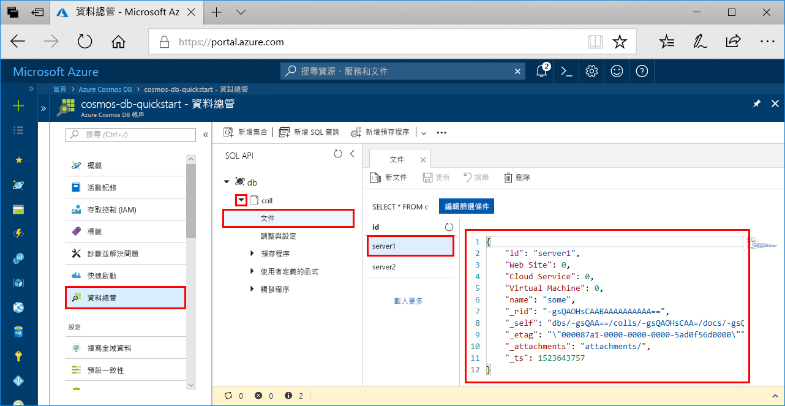

# <a name="azure-cosmos-db-build-a-sql-api-app-with-python-and-the-azure-portal"></a>Azure Cosmos DB︰使用 Python 和 Azure 入口網站建置 SQL API 應用程式

> [!div class="op_single_selector"]
> * [.NET](create-sql-api-dotnet.md)
> * [Java](create-sql-api-java.md)
> * [Node.js](create-sql-api-nodejs.md)
> * [Node.js- v2](create-sql-api-nodejs-preview.md)
> * [Python](create-sql-api-python.md)
> * [Xamarin](create-sql-api-xamarin-dotnet.md)
>  

Azure Cosmos DB 是 Microsoft 的全域分散式多模型資料庫服務。 您可以快速建立及查詢文件、索引鍵/值及圖形資料庫，所有這些都受惠於位於 Azure Cosmos DB 核心的全域散發和水平調整功能。 

本快速入門會示範如何使用 Azure 入口網站建立 Azure Cosmos DB [SQL API](sql-api-introduction.md) 帳戶、文件資料庫和集合。 接著，您要建置和執行以 [SQL Python API](sql-api-sdk-python.md) 為基礎的主控台應用程式。

[!INCLUDE [quickstarts-free-trial-note](../../includes/quickstarts-free-trial-note.md)] [!INCLUDE [cosmos-db-emulator-docdb-api](../../includes/cosmos-db-emulator-docdb-api.md)]

## <a name="prerequisites"></a>必要條件

* [Python 3.6](https://www.python.org/downloads/)，而且 \<安裝位置\>\Python36 和 \<安裝位置>\Python36\Scripts 會新增至您的 PATH。 
* [Visual Studio Code](https://code.visualstudio.com/)
* [適用於 Visual Studio Code 的 Python 擴充功能](https://marketplace.visualstudio.com/items?itemName=ms-python.python#overview)

## <a name="create-a-database-account"></a>建立資料庫帳戶

[!INCLUDE [cosmos-db-create-dbaccount](../../includes/cosmos-db-create-dbaccount.md)]

## <a name="add-a-collection"></a>新增集合

[!INCLUDE [cosmos-db-create-collection](../../includes/cosmos-db-create-collection.md)]

## <a name="add-sample-data"></a>新增範例資料

[!INCLUDE [cosmos-db-create-sql-api-add-sample-data](../../includes/cosmos-db-create-sql-api-add-sample-data.md)]

## <a name="query-your-data"></a>查詢資料

[!INCLUDE [cosmos-db-create-sql-api-query-data](../../includes/cosmos-db-create-sql-api-query-data.md)]

## <a name="clone-the-sample-application"></a>複製範例應用程式

現在，我們將從 github 複製 SQL API 應用程式、設定連接字串，然後加以執行。 您會看到，以程式設計方式來處理資料有多麼的容易。 

1. 開啟命令提示字元，建立名為 git-samples 的新資料夾，然後關閉命令提示字元。

    ```bash
    md "C:\git-samples"
    ```

2. 開啟 git 終端機視窗 (例如 git bash)，並使用 `cd` 命令變更至要安裝範例應用程式的新資料夾。

    ```bash
    cd "C:\git-samples"
    ```

3. 執行下列命令來複製範例存放庫。 此命令會在您的電腦上建立範例應用程式副本。 

    ```bash
    git clone https://github.com/Azure-Samples/azure-cosmos-db-documentdb-python-getting-started.git
    ```  
    
## <a name="review-the-code"></a>檢閱程式碼

此為選用步驟。 若您想要瞭解如何在程式碼中建立資料庫資源，則可檢閱下列程式碼片段。 或者也可以直接跳至[更新您的連接字串](#update-your-connection-string)。 

下列程式碼片段全部取自 DocumentDBGetStarted.py 檔案。

* 已初始化 DocumentClient。

    ```python
    # Initialize the Python client
    client = document_client.DocumentClient(config['ENDPOINT'], {'masterKey': config['MASTERKEY']})
    ```

* 已建立新資料庫。

    ```python
    # Create a database
    db = client.CreateDatabase({ 'id': config['SQL_DATABASE'] })
    ```

* 已建立新集合。

    ```python
    # Create collection options
    options = {
        'offerEnableRUPerMinuteThroughput': True,
        'offerVersion': "V2",
        'offerThroughput': 400
    }

    # Create a collection
    collection = client.CreateCollection(db['_self'], { 'id': config['SQL_COLLECTION'] }, options)
    ```

* 已建立一些文件。

    ```python
    # Create some documents
    document1 = client.CreateDocument(collection['_self'],
        { 
            'id': 'server1',
            'Web Site': 0,
            'Cloud Service': 0,
            'Virtual Machine': 0,
            'name': 'some' 
        })
    ```

* 已使用 SQL 執行查詢

    ```python
    # Query them in SQL
    query = { 'query': 'SELECT * FROM server s' }    
            
    options = {} 
    options['enableCrossPartitionQuery'] = True
    options['maxItemCount'] = 2

    result_iterable = client.QueryDocuments(collection['_self'], query, options)
    results = list(result_iterable);

    print(results)
    ```

## <a name="update-your-connection-string"></a>更新您的連接字串

現在，返回 Azure 入口網站以取得連接字串資訊，並將它複製到應用程式中。

1. 在 [Azure 入口網站](http://portal.azure.com/)的 Azure Cosmos DB 帳戶中，按一下左側導覽列中的 [金鑰]。 在下一個步驟中，您將使用畫面右側的複製按鈕，將 **URI** 和**主要金鑰**複製到 DocumentDBGetStarted.py 檔案中。

    ![在 Azure 入口網站的 [金鑰] 刀鋒視窗中檢視並複製存取金鑰](./media/create-sql-api-dotnet/keys.png)

2. 在 Visual Studio Code 中開啟 C:\git-samples\azure-cosmos-db-documentdb-python-getting-startedDocumentDBGetStarted.py 檔案。 

3. 從入口網站複製您的 **URI** 值 (使用 [複製] 按鈕)，並使它成為 DocumentDBGetStarted.py 中的**端點**金鑰值。 

    `'ENDPOINT': 'https://FILLME.documents.azure.com',`

4. 然後，從入口網站複製您的**主要金鑰**值，並使它成為 DocumentDBGetStarted.py 中的 **config.MASTERKEY** 值。 您現已更新應用程式，使其具有與 Azure Cosmos DB 通訊所需的所有資訊。 

    `'MASTERKEY': 'FILLME',`

5. 儲存 DocumentDBGetStarted.py 檔案。
    
## <a name="run-the-app"></a>執行應用程式

1. 在 Visual Studio Code 中，選取 [檢視]>[命令選擇區]。 

2. 在提示字元中，輸入 **Python: Select Interpreter**，然後選取要使用的 Python 版本。

    Visual Studio Code 中的頁尾會更新以指出選取的解譯器。 

3. 選取 [檢視] > [整合式終端機] 以開啟 Visual Studio Code 整合式終端機。

4. 在整合式終端機視窗中，確保您在 azure-cosmos-db-documentdb-python-getting-started 資料夾中。 如果不是，請執行下列命令來切換至範例資料夾。 

    ```
    cd "C:\git-samples\azure-cosmos-db-documentdb-python-getting-started"`
    ```

5. 執行以下命令來安裝 pydocumentdb 套件。 

    ```
    pip3 install pydocumentdb
    ```

    如果您收到有關在嘗試安裝 pydocumentdb 時拒絕存取的錯誤，您必須[以系統管理員身分執行 VS Code](https://stackoverflow.com/questions/37700536/visual-studio-code-terminal-how-to-run-a-command-with-administrator-rights)。

6. 執行下列命令以執行範例，並且在 Azure Cosmos dB 中建立和儲存新文件。

    ```
    python DocumentDBGetStarted.py
    ```

7. 若要確認已建立並儲存新文件，請在 Azure 入口網站中，選取 [資料總管]，依序展開 [coll]、[文件]，然後選取 [server1] 文件。 Server1 文件內容符合整合式終端機視窗中傳回的內容。 

    

## <a name="review-slas-in-the-azure-portal"></a>在 Azure 入口網站中檢閱 SLA

[!INCLUDE [cosmosdb-tutorial-review-slas](../../includes/cosmos-db-tutorial-review-slas.md)]

## <a name="clean-up-resources"></a>清除資源

[!INCLUDE [cosmosdb-delete-resource-group](../../includes/cosmos-db-delete-resource-group.md)]

## <a name="next-steps"></a>後續步驟

在本快速入門中，您已了解如何建立 Azure Cosmos DB 帳戶、如何使用 [資料總管] 建立集合，以及如何執行應用程式。 您現在可以將其他資料匯入到 Cosmos DB 帳戶。 

> [!div class="nextstepaction"]
> [將資料匯入 SQL API 的 Azure Cosmos DB](import-data.md)


