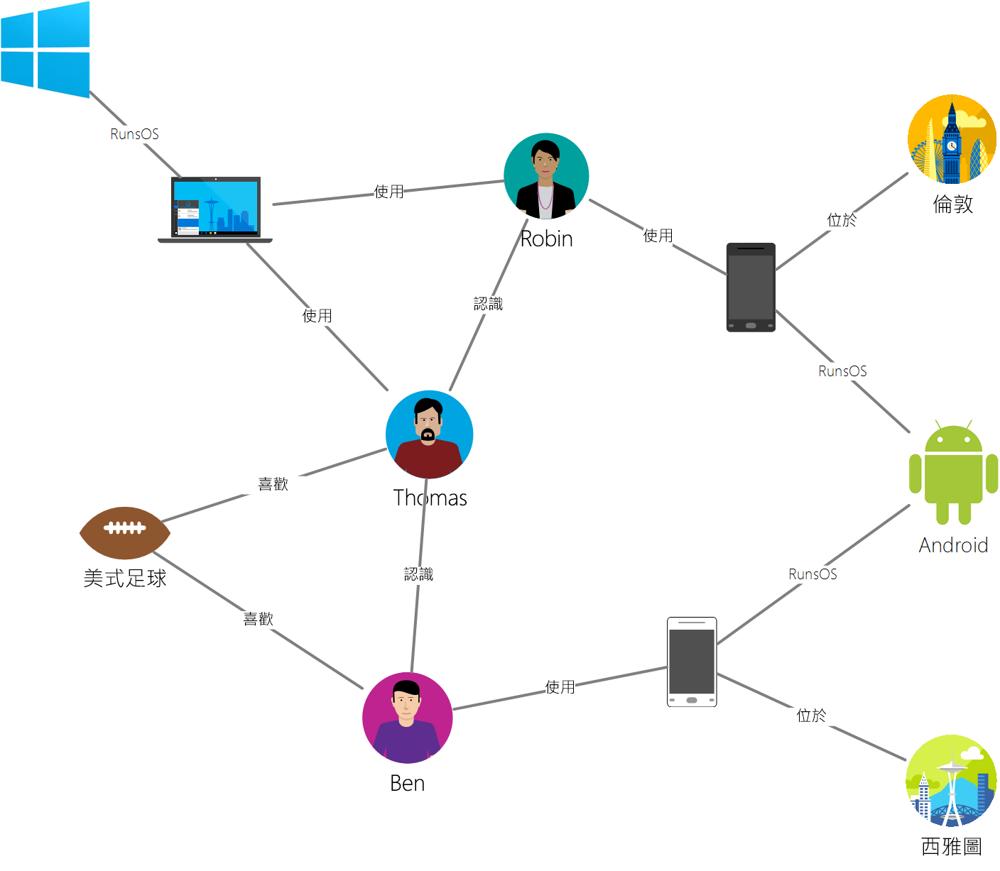

# <a name="azure-cosmos-db-gremlin-graph-support"></a>Azure Cosmos DB Gremlin graph 支援
Azure Cosmos DB 支援 [Gremlin](http://tinkerpop.apache.org/docs/current/reference/#graph-traversal-steps) \(英文\)，該圖形 API 是 [Apache Tinkerpop](http://tinkerpop.apache.org) \(英文\) 的圖形周遊語言，可用於建立圖表實體和執行圖表查詢作業。 您可以使用 Gremlin 語言建立圖表實體 (頂點和邊緣)、修改這些實體內的屬性、執行查詢和周遊，以及刪除實體。 

Azure Cosmos DB 在圖表資料庫中提供符合企業需求的功能。 包括跨越兩個以上 Azure 區域之資料庫的全域散發、獨立調整儲存體和輸送量、可預測的個位數毫秒延遲、自動編製索引、SLA、讀取可用性。 由於 Azure Cosmos DB 支援 TinkerPop/Gremlin，您可以輕鬆地移轉使用另一個圖表資料庫撰寫的應用程式，而不必變更程式碼。 此外，憑藉 Gremlin 支援，Azure Cosmos DB 與啟用 TinkerPop 的分析架構緊密整合，例如 [Apache Spark GraphX](http://spark.apache.org/graphx/)。 

在本文中，我們提供 Gremlin 的快速逐步解說，並列舉圖形 API 所支援的 Gremlin 功能和步驟。

## <a name="gremlin-by-example"></a>Gremlin 範例
讓我們利用一個範例圖表了解如何以 Gremlin 表達查詢。 下圖顯示的商務應用程式以圖表形式管理使用者、興趣和裝置的相關資料。  

 

此圖表有下列頂點類型 (在 Gremlin 中稱為「標籤」)︰

- 人員：圖表中有三個人：Robin、Thomas 和 Ben
- 興趣︰在此範例中他們的興趣是足球比賽
- 裝置：人員使用的裝置
- 作業系統︰執行裝置的作業系統

我們透過下列邊緣類型/標籤，表達這些實體之間的關聯性︰

- 認識︰例如，「Thomas 認識 Robin」
- 有興趣︰在圖表中表示人員的興趣，例如「Ben 對足球有興趣」
- 執行 OS︰膝上型電腦執行 Windows OS
- 使用︰代表某個人使用的裝置。 例如，Robin 使用序號 77 的 Motorola 手機

讓我們使用 [Gremlin 主控台](http://tinkerpop.apache.org/docs/current/reference/#gremlin-console) (英文) 對此圖表執行一些作業。 也可以在您選擇的平台 (Java、Node.js、Python 或 .NET) 使用 Gremlin 驅動程式執行這些作業。  在了解 Azure Cosmos DB 中支援什麼功能之前，讓我們先看看幾個範例，以熟悉語法。

首先，讓我們看看 CRUD。 下列 Gremlin 陳述式會將 "Thomas" 頂點插入圖表中︰

```
:> g.addV('person').property('id', 'thomas.1').property('firstName', 'Thomas').property('lastName', 'Andersen').property('age', 44)
```

接著，下列 Gremlin 陳述式會在 Thomas 和 Robin 之間插入 "knows" 邊緣。

```
:> g.V('thomas.1').addE('knows').to(g.V('robin.1'))
```

下列查詢會依名字的遞減順序傳回 "person" 頂點：
```
:> g.V().hasLabel('person').order().by('firstName', decr)
```

圖表的威力在於當您需要回答「Thomas 的朋友使用什麼作業系統？」這種問題時。 您可以執行這個簡單的 Gremlin 周遊，從圖表中取得這項資訊︰

```
:> g.V('thomas.1').out('knows').out('uses').out('runsos').group().by('name').by(count())
```
現在，讓我們看看 Azure Cosmos DB 為 Gremlin 開發人員提供什麼功能。

## <a name="gremlin-features"></a>Gremlin 功能
TinkerPop 是一套涵蓋各種圖表技術的標準。 因此，它採用標準術語來描述圖表提供者所提供的功能。 Azure Cosmos DB 提供持續、高度並行、可寫入的圖表資料庫，可分割至多個伺服器或叢集。 

下表列出 Azure Cosmos DB 所實作的 TinkerPop 功能︰ 

| 類別 | Azure Cosmos DB 實作 |  注意 | 
| --- | --- | --- |
| Graph 功能 | 提供 Persistence 和 ConcurrentAccess。 設計為支援交易 | 可以透過 Spark 連接器實作電腦方法。 |
| 變數功能 | 支援布林值、整數、位元組、Double、Float、整數、Long、字串 | 支援基本類型、透過資料模型而與複雜類型相容 |
| 頂點功能 | 支援 RemoveVertices、MetaProperties、AddVertices、MultiProperties、StringIds、UserSuppliedIds、AddProperty、RemoveProperty  | 支援建立、修改和刪除端點 |
| 頂點屬性功能 | StringIds、UserSuppliedIds、AddProperty、RemoveProperty、BooleanValues、ByteValues、DoubleValues、FloatValues、IntegerValues、LongValues、StringValues | 支援建立、修改和刪除頂點屬性 |
| 邊緣功能 | AddEdges、RemoveEdges、StringIds、UserSuppliedIds、AddProperty、RemoveProperty | 支援建立、修改和刪除邊緣 |
| 邊緣屬性功能 | Properties、BooleanValues、ByteValues、DoubleValues、FloatValues、IntegerValues、LongValues、StringValues | 支援建立、修改和刪除邊緣屬性 |

## <a name="gremlin-wire-format-graphson"></a>Gremlin 電傳格式︰GraphSON

從 Gremlin 作業傳回結果時，Azure Cosmos DB 會使用 [GraphSON 格式](https://github.com/thinkaurelius/faunus/wiki/GraphSON-Format)。 GraphSON 是 Gremlin 使用 JSON 表示頂點、邊緣和屬性 (單一值和多重值屬性) 的標準格式。 

例如，下列程式碼片段顯示從 Azure Cosmos DB 傳回用戶端之頂點的 GraphSON 表示法。 

```json
  {
    "id": "a7111ba7-0ea1-43c9-b6b2-efc5e3aea4c0",
    "label": "person",
    "type": "vertex",
    "outE": {
      "knows": [
        {
          "id": "3ee53a60-c561-4c5e-9a9f-9c7924bc9aef",
          "inV": "04779300-1c8e-489d-9493-50fd1325a658"
        },
        {
          "id": "21984248-ee9e-43a8-a7f6-30642bc14609",
          "inV": "a8e3e741-2ef7-4c01-b7c8-199f8e43e3bc"
        }
      ]
    },
    "properties": {
      "firstName": [
        {
          "value": "Thomas"
        }
      ],
      "lastName": [
        {
          "value": "Andersen"
        }
      ],
      "age": [
        {
          "value": 45
        }
      ]
    }
  }
```

GraphSON 用於頂點的屬性如下︰

| 屬性 | 說明 |
| --- | --- |
| id | 頂點的識別碼。 必須是唯一的 (適合的話，與 _partition 的值結合) |
| 標籤 | 頂點的標籤。 這是選擇性，用來描述實體類型。 |
| type | 用來區別頂端和非圖表文件 |
| properties | 與頂點相關聯的使用者定義屬性包。 每個屬性可以有多個值。 |
| _partition (可設定) | 頂點的資料分割索引鍵。 可用來將圖表相應放大至多部伺服器 |
| outE | 這包含頂點的外邊緣清單。 儲存頂點的相鄰資訊可以加速周遊。 邊緣會根據標籤而分組。 |

邊緣還包含下列資訊，有助於瀏覽至圖表的其他部分。

| 屬性 | 說明 |
| --- | --- |
| id | 邊緣的識別碼。 必須是唯一的 (適合的話，與 _partition 的值結合) |
| 標籤 | 邊緣的標籤。 這是選擇性屬性，用來描述關聯性類型。 |
| inV | 這包含特定邊緣的頂點清單。 儲存邊緣的相鄰資訊可以加速周遊的執行。 頂點會根據標籤而分組。 |
| properties | 與邊緣相關聯的使用者定義屬性包。 每個屬性可以有多個值。 |

每個屬性可以將多個值儲存在陣列中。 

| 屬性 | 說明 |
| --- | --- |
| value | 屬性的值

## <a name="gremlin-partitioning"></a>Gremlin 分割

在 Azure Cosmos DB 中，圖表儲存在容器內，而容器可根據儲存體和輸送量 (以一般化每秒要求數表示) 而獨立調整。 每個容器必須定義一個選擇性但建議的資料分割索引鍵屬性，以決定相關資料的邏輯資料分割界限。 每個頂點/邊緣都必須有一個 `id` 屬性，此屬性在該資料分割索引鍵值內的實體之間是唯一的。 [Azure Cosmos DB 中的資料分割](partition-data.md)涵蓋詳細資料。

對於 Azure Cosmos DB 中跨越多個資料分割的圖形資料，Gremlin 作業可以順暢地運作。 不過，建議您為圖表選擇的資料分割索引鍵，最好是常用作查詢中的篩選條件、有許多不同的值，而且以類似的頻率存取這些值。 

## <a name="gremlin-steps"></a>Gremlin 步驟
現在，讓我們看看 Azure Cosmos DB 支援的 Gremlin 步驟。 如需 Gremlin 的完整參考，請參閱 [TinkerPop 參考](http://tinkerpop.apache.org/docs/current/reference)。

| 步驟 | 說明 | TinkerPop 3.2 文件 |
| --- | --- | --- |
| `addE` | 在兩個頂點之間新增邊緣 | [addE 步驟](http://tinkerpop.apache.org/docs/current/reference/#addedge-step) |
| `addV` | 將頂點新增至圖表 | [addV 步驟](http://tinkerpop.apache.org/docs/current/reference/#addvertex-step) |
| `and` | 確保所有周遊都會傳回值 | [and 步驟](http://tinkerpop.apache.org/docs/current/reference/#and-step) |
| `as` | 將變數指派給步驟輸出的步驟調變器 | [as 步驟](http://tinkerpop.apache.org/docs/current/reference/#as-step) |
| `by` | 搭配 `group` 和 `order` 一起使用的步驟調變器 | [by 步驟](http://tinkerpop.apache.org/docs/current/reference/#by-step) |
| `coalesce` | 傳回第一次有傳回結果的周遊 | [coalesce 步驟](http://tinkerpop.apache.org/docs/current/reference/#coalesce-step) |
| `constant` | 傳回常數值。 搭配 `coalesce` 使用| [constant 步驟](http://tinkerpop.apache.org/docs/current/reference/#constant-step) |
| `count` | 從周遊傳回計數 | [count 步驟](http://tinkerpop.apache.org/docs/current/reference/#count-step) |
| `dedup` | 傳回已移除重複項的值 | [dedup 步驟](http://tinkerpop.apache.org/docs/current/reference/#dedup-step) |
| `drop` | 捨棄值 (頂點/邊緣) | [drop 步驟](http://tinkerpop.apache.org/docs/current/reference/#drop-step) |
| `fold` | 作為屏障來計算結果的彙總| [fold 步驟](http://tinkerpop.apache.org/docs/current/reference/#fold-step) |
| `group` | 根據指定的標籤將值分組| [group 步驟](http://tinkerpop.apache.org/docs/current/reference/#group-step) |
| `has` | 用於篩選屬性、頂點和邊緣。 支援 `hasLabel`、`hasId`、`hasNot` 和 `has` 變體。 | [has 步驟](http://tinkerpop.apache.org/docs/current/reference/#has-step) |
| `inject` | 將值插入資料流| [inject 步驟](http://tinkerpop.apache.org/docs/current/reference/#inject-step) |
| `is` | 用來執行使用布林運算式的篩選條件 | [is 步驟](http://tinkerpop.apache.org/docs/current/reference/#is-step) |
| `limit` | 用來限制周遊中的項目數| [limit 步驟](http://tinkerpop.apache.org/docs/current/reference/#limit-step) |
| `local` | 局部包裝周遊的一個區段，類似於子查詢 | [local 步驟](http://tinkerpop.apache.org/docs/current/reference/#local-step) |
| `not` | 用來否定篩選條件 | [not 步驟](http://tinkerpop.apache.org/docs/current/reference/#not-step) |
| `optional` | 如果指定的周遊產生結果，則傳回結果，否則傳回呼叫端元素 | [optional 步驟](http://tinkerpop.apache.org/docs/current/reference/#optional-step) |
| `or` | 確保至少一個周遊會傳回值 | [or 步驟](http://tinkerpop.apache.org/docs/current/reference/#or-step) |
| `order` | 依指定的排序次序傳回結果 | [order 步驟](http://tinkerpop.apache.org/docs/current/reference/#order-step) |
| `path` | 傳回周遊的完整路徑 | [path 步驟](http://tinkerpop.apache.org/docs/current/reference/#path-step) |
| `project` | 將屬性投射為 Map | [project 步驟](http://tinkerpop.apache.org/docs/current/reference/#project-step) |
| `properties` | 傳回指定之標籤的屬性 | [properties 步驟](http://tinkerpop.apache.org/docs/current/reference/#properties-step) |
| `range` | 篩選為指定的值範圍| [range 步驟](http://tinkerpop.apache.org/docs/current/reference/#range-step) |
| `repeat` | 將步驟重複執行指定的次數。 用於迴圈處理 | [repeat 步驟](http://tinkerpop.apache.org/docs/current/reference/#repeat-step) |
| `sample` | 用於取樣周遊的結果 | [sample 步驟](http://tinkerpop.apache.org/docs/current/reference/#sample-step) |
| `select` | 用於投射周遊的結果 |  [select 步驟](http://tinkerpop.apache.org/docs/current/reference/#select-step) | |
| `store` | 用於來自周遊的非封鎖彙總 | [store 步驟](http://tinkerpop.apache.org/docs/current/reference/#store-step) |
| `tree` | 將頂點的路徑彙總至樹狀目錄 | [tree 步驟](http://tinkerpop.apache.org/docs/current/reference/#tree-step) |
| `unfold` | 將迭代器展開為步驟| [unfold 步驟](http://tinkerpop.apache.org/docs/current/reference/#unfold-step) |
| `union` | 合併來自多個周遊的結果| [unfold 步驟](http://tinkerpop.apache.org/docs/current/reference/#union-step) |
| `V` | 包含頂點和邊緣之間周遊的必要步驟 `V`、`E`、`out`、`in`、`both`、`outE`、`inE`、`bothE`、`outV`、`inV`、`bothV` 和 `otherV` | [vertex 步驟](http://tinkerpop.apache.org/docs/current/reference/#vertex-steps) |
| `where` | 用於篩選周遊的結果。 支援 `eq`、`neq`、`lt`、`lte`、`gt`、`gte` 和 `between` 運算子  | [where 步驟](http://tinkerpop.apache.org/docs/current/reference/#where-step) |

根據預設，Azure Cosmos DB 提供的寫入最佳化引擎支援自動編製頂點和邊緣內所有屬性的索引。 因此，在任何屬性上執行附有篩選條件的查詢、範圍查詢、排序或彙總時，都是從索引來處理，而且有效率地提供。 如需 Azure Cosmos DB 中索引運作方式的詳細資訊，請參閱[無從驗證結構描述的索引編製](http://www.vldb.org/pvldb/vol8/p1668-shukla.pdf)一文。

## <a name="next-steps"></a>後續步驟
* [使用我們的 SDK](create-graph-dotnet.md) 開始建置圖表應用程式 
* 深入了解 Azure Cosmos DB 中的[圖表支援](graph-introduction.md)
