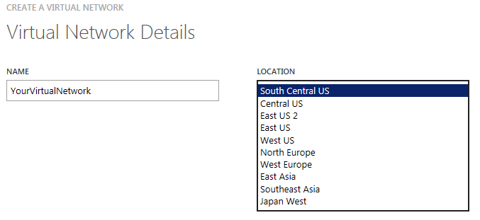

<properties  linkid="manage-services-create-a-virtual-network" urlDisplayName="Create a virtual network" pageTitle="Create a virtual network - Azure service management" metaKeywords="" description="Learn how to create an Azure Virtual Network." metaCanonical="" services="virtual-machines,virtual-network" documentationCenter="" title="Create a Virtual Network in Azure" authors="" solutions="" manager="" editor="" />

<h1>在 Azure 中建立虛擬網路</h1> 

本教學課程將逐步引導您使用 Azure 管理入口網站建立基本的 Azure 虛擬網路。如需 Azure 虛擬網路的詳細資訊，請參閱[虛擬網路][1]。

本教學課程假設您先前沒有使用 Azure 的經驗。這有助於您熟悉建立虛擬網路所需的步驟。如果您需要虛擬網路的設計案例和進階資訊，請參閱[虛擬網路][1]。

完成本教學課程後，您將有虛擬網路可部署 Azure 服務和虛擬機器。

 
<b>注意</b> 

本教學課程不會逐步引導您建立跨部署組態。如需逐步引導您使用網站對網站跨部署連線 (亦即連線到位在公司內部的 Active Directory 或 SharePoint) 建立虛擬網路的教學課程，請參閱<a  href="/en-us/manage/services/networking/cross-premises-connectivity/">建立跨部署連線的虛擬網路</a> (英文)。
 

 如需其他虛擬網路組態程序和設定，請參閱 [Azure 虛擬網路組態工作][2]。

如需在 Azure 虛擬機器上部署 AD DS 的指導方針，請參閱[在 Azure 虛擬機器中部署 Windows Server Active Directory 的指導方針][3]。

## 目標

在本教學課程中，您將了解：

* 如何設定您可以新增 Azure 雲端服務和虛擬機器的基本 Azure 虛擬網路。

## 必要條件

* 至少有一個有效作用中訂閱的 Windows Live 帳戶。

## 建立虛擬網路

**若要建立僅限雲端虛擬網路：**

1.  登入 [Azure 管理入口網站][4]。

2.  按一下螢幕左下角的 **新增**。在導覽窗格中依序按一下 **網路** 和 **虛擬網路**。按一下 **Custom Create** 開始組態精靈。
    
    

3.  在 **虛擬網路詳細資料** 頁面上，輸入下列資訊，然後按一下右下角的下一步箭頭。如需詳細資料頁面設定的詳細資訊，請參閱[關於在管理入口網站中設定虛擬網路][5]的**虛擬網路詳細資料頁面**區段。

* **名稱 -** 為虛擬網路命名。輸入 *YourVirtualNetwork*。

* **同質群組 -** 從下拉式清單中，選取 **建立新的同質群組**。同質群組可用來將 Azure 服務實際群組至同一個資料中心，以提升效能。您只能將一個虛擬網路指派到一個同質群組。

* **區域 -** 從下拉式清單中，選取想要的區域。將在指定區域中的資料中心內建立虛擬網路。

* **同質群組名稱 -** 為新的同質群組命名。輸入 *YourAffinityGroup*。
  
  	

1.  在 **DNS Servers and VPN Connectivity** 頁面上，輸入下列資訊，然後按一下右下角的下一步箭頭。如需此頁面設定的詳細資訊，請參閱[關於在管理入口網站中設定虛擬網路][5]的**DNS 伺服器和 VPN 連線能力頁面**。
    
    * **DNS 伺服器-選用 -** 輸入要使用的 DNS 伺服器名稱及 IP 位址。此設定不會建立 DNS 伺服器，而會參照現有的 DNS 伺服器。
		

		<b>注意</b>
		
如果您要使用公用 DNS 服務，可以在這個畫面輸入該資訊。否則，名稱解析將預設為 Azure
		服務。如需詳細資訊，請參閱[名稱解析][6]。

		

    
    * **不選取點對網站或網站對網站連線的核取方塊**。我們在這個教學課程中建立的虛擬網路不適用於跨部署連線。
    
    

2.  在 **Virtual Network Address Spaces** 頁面上，輸入下列資訊，然後按一下右下角的核取記號來設定您的網路。位址空間必須是以 CIDR 表示法指定的私人位址範圍 10.0.0.0/8、172.16.0.0/12 或 192.168.0.0/16 (如 RFC 1918 所指定)。如需此頁面設定的詳細資訊，請參閱[關於在管理入口網站中設定虛擬網路][5]的**虛擬網路位址空間頁面**。
    
    * **位址空間：**按一下右上角的 [CIDR]，然後輸入下列內容：
      
      * **起始 IP：** 10.4.0.0
      
      * **CIDR：** /16
    
      * **新增子網路：**輸入以下資訊：
      
      * 將 **Subnet-1** 重新命名為 *FrontEndSubnet* 並指派起始 IP *10.4.2.0/24*，然後按一下 **add subnet**。
      
      * **建立子網路**，名稱為 *BackEndSubnet*，起始 IP 為 *10.4.3.0/24*。
      
      * 確認您現在建立兩個子網路，然後按一下右下角的核取記號，建立您的虛擬網路。
    
    

3.  按一下核取記號後，隨即會開始建立虛擬網路。建立虛擬網路時，您將在管理入口網站的網路頁面上看見 **狀態** 下列出 **已建立**。
    
    

4.  建立虛擬網路後，您可以繼續進行下列教學課程：
    
    * [將虛擬機器新增至虛擬網路](/en-us/manage/services/networking/add-a-vm-to-a-virtual-network/) - 使用這個基本教學課程將虛擬機器安裝到虛擬網路。
    
    * 如需虛擬機器和安裝選項的詳細資訊，請參閱[如何建立自訂虛擬機器](/en-us/manage/windows/how-to-guides/custom-create-a-vm/) (英文) 及[Azure 虛擬機器](/en-us/manage/windows/) (英文)。
    
    * [在 Azure 中安裝新的 Active Directory 樹系](/en-us/manage/services/networking/active-directory-forest/) - 使用這個教學課程安裝新的 Active Directory 樹系，而完全不連線到其他任何網路。教學課程將說明對於新的樹系安裝建立虛擬機器 (VM) 所需的特定步驟。如果您計劃使用這個教學課程，請勿使用管理入口網站建立任何 VM。

## 另請參閱

* [虛擬網路][1]

* [Azure 虛擬網路常見問題集][7]

* [Azure 虛擬網路組態工作][2]

* [使用網路組態檔設定虛擬網路][8]

* [名稱解析][9]

[1]: http://msdn.microsoft.com/zh-tw/library/windowsazure/jj156007.aspx
[2]: http://go.microsoft.com/fwlink/?LinkId=296652
[3]: http://msdn.microsoft.com/zh-tw/library/windowsazure/jj156090.aspx
[4]: http://manage.windowsazure.com/
[5]: http://go.microsoft.com/fwlink/?LinkID=248092
[6]: http://go.microsoft.com/fwlink/?linkid=248097
[7]: http://go.microsoft.com/fwlink/?LinkId=296650
[8]: http://msdn.microsoft.com/zh-tw/library/windowsazure/jj156097.aspx
[9]: http://go.microsoft.com/fwlink/?LinkId=248097