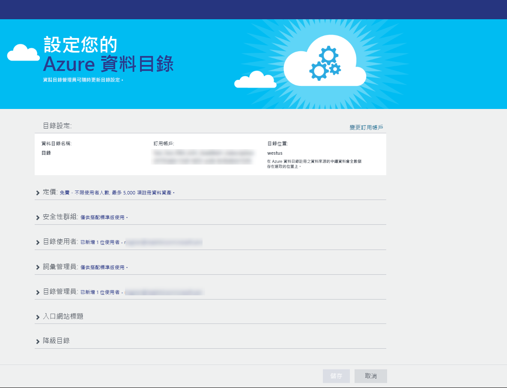
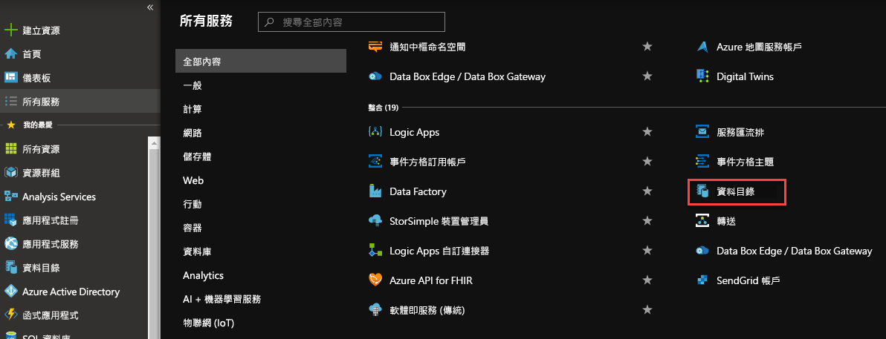
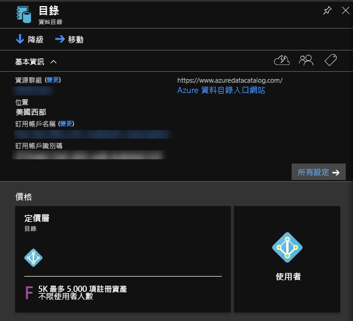
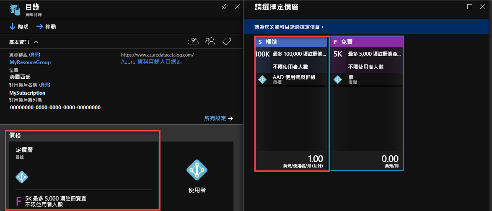

# 開始使用 Azure 資料目錄
Azure 資料目錄是受到完整管理的雲端服務，可作為企業資料資產的註冊系統和探索系統。 如需詳細的概觀，請參閱 [什麼是 Azure 資料目錄](data-catalog-what-is-data-catalog.md)。

本教學課程可協助您開始使用 Azure 資料目錄。 您會在本教學課程中執行下列程序：

| 程序 | 說明 |
|:--- |:--- |
| [佈建資料目錄](#provision-data-catalog) |在此程序中，您會佈建或設定 Azure 資料目錄。 若之前還未設定目錄，才需要執行此步驟。 即使您有多個與 Azure 帳戶相關聯的訂用帳戶，每個組織仍只能有一個資料目錄 (Microsoft Azure Active Directory 網域)。 |
| [註冊資料資產](#register-data-assets) |在此程序中，您會使用資料目錄註冊 AdventureWorks2014 範例資料庫中的資料資產。 註冊的過程會從資料來源中擷取重要的結構化中繼資料 (例如名稱、類型和位置)，並將該中繼資料複製到目錄。 資料來源及資料資產會留在原地，但目錄會利用中繼資料，讓您更輕鬆探索和了解資料來源及其資料。 |
| [探索資料資產](#discover-data-assets) |在此程序中，您會使用 Azure 資料目錄入口網站，探索上一個步驟所註冊的資料資產。 只要在 Azure 資料目錄註冊資料來源之後，其中繼資料會由此服務編製索引，讓使用者可以輕鬆地搜尋所需的資料。 |
| [註解資料資產](#annotate-data-assets) |在此程序中，您會提供資料資產的註解 (例如描述、標籤、文件或專家等資訊)。 這項資訊可補充從資料來源擷取的中繼資料，並可讓更多人更容易了解資料來源。 |
| [連線到資料資產](#connect-to-data-assets) |在此程序中，您會在整合式用戶端工具 (例如 Excel 和 SQL Server Data Tools) 和非整合式工具 (SQL Server Management Studio) 中開啟資料資產。 |
| [管理資料資產](#manage-data-assets) |在此程序中，您會設定資料資產的安全性。 資料目錄並不會讓使用者存取資料本身。 資料來源的擁有者會控制資料存取權。    資料目錄，您可以探索資料來源，以及檢視與目錄中註冊的來源相關的 **中繼資料** 。 不過，有時候只有特定使用者或特定群組的成員才能看到資料來源。 若是這樣的情況，您可以使用資料目錄來取得目錄中已註冊資料資產的擁有權，以及控制您擁有之資產的可見性。 |
| [移除資料資產](#remove-data-assets) |在此程序中，您會了解如何移除資料目錄中的資料資產。 |

## 教學課程的必要條件
### Azure 訂閱
若要設定 Azure 資料目錄，您必須是 Azure 訂用帳戶的擁有者或共同擁有者。

Azure 訂用帳戶可協助您組織雲端服務資源的存取權，例如 Azure 資料目錄。 它們也可協助您控制如何根據資源使用量產生報告、計費及付費。 每一個訂用帳戶可以有不同的計費和付款設定，因此，依照部門、專案、區域辦事處等，您可以有不同的訂用帳戶和不同的計劃。 每一個雲端服務都屬於某個訂用帳戶，在設定 Azure 資料目錄之前，您必須先有訂用帳戶。 若要深入了解，請參閱 [管理帳戶、訂用帳戶及管理角色](../active-directory/active-directory-how-subscriptions-associated-directory.md)。

如果您沒有訂用帳戶，則只需要幾分鐘的時間就可以建立免費試用帳戶。 請參閱 [免費試用](https://azure.microsoft.com/pricing/free-trial/) 以取得詳細資訊。

### Azure Active Directory
若要設定 Azure 資料目錄，您必須使用 Azure Active Directory (Azure AD) 使用者帳戶登入。 您必須是 Azure 訂用帳戶的擁有者或共同擁有者。  

Azure AD 提供了簡單的方法，讓您的企業無論能輕鬆地管理雲端和內部部署中的身分識別與存取權。 您可以使用單一公司帳戶或學校帳戶，登入任何雲端或內部部署 Web 應用程式。 Azure 資料目錄採用 Azure AD 來驗證登入。 若要深入了解，請參閱 [什麼是 Azure Active Directory](../active-directory/active-directory-whatis.md)。

### Azure Active Directory 原則組態
您可能會遇到一種情況，您可以登入 Azure 資料目錄入口網站，但在您嘗試登入資料來源註冊工具時，您會遇到錯誤訊息，導致您無法登入。 當您在公司網路，或從公司網路外部連線時，可能會發生此錯誤。

註冊工具會使用「表單驗證」  ，根據 Azure Active Directory 驗證使用者登入。 Azure Active Directory 系統管理員必須在「全域驗證原則」 中啟用表單驗證，才會成功登入。

利用全域驗證原則，您可以分別為內部網路和外部網路連線啟用驗證方法，如下圖所示。 如果您連線的網路未啟用表單驗證，可能會發生登入錯誤。

 

如需詳細資訊，請參閱 [設定驗證原則](https://technet.microsoft.com/library/dn486781.aspx)。

## 佈建資料目錄
每個組織只能佈建一個資料目錄 (Azure Active Directory 網域)。 因此，如果隸屬於這個 Azure Active Directory 網域的 Azure 訂用帳戶擁有者或共同擁有者已建立目錄，即使您有多個 Azure 訂用帳戶，仍無法再次建立目錄。 若要測試 Azure Active Directory 網域中的使用者是否已建立資料目錄，請移至 [Azure 資料目錄首頁](http://azuredatacatalog.com) 並確認您是否看到目錄。 如果您的目錄已建立，請略過下列程序並前往下一節。    

1. 移至[資料目錄服務頁面](https://azure.microsoft.com/services/data-catalog)並按一下 [開始使用]。
   
    
2. 使用屬於 Azure 訂用帳戶擁有者或共同擁有者的使用者帳戶進行登入。 您會在登入後看到下列頁面。
   
    
3. 指定 [資料目錄名稱]、想要使用的 [訂用帳戶] 和 [目錄位置]。
4. 展開 [價格]，並選取 Azure 資料目錄的**版本** (免費或標準)。
    
5. 展開 [目錄使用者]，然後按一下 [新增] 以新增資料目錄的使用者。 系統會自動將您新增至此群組。
    
6. 展開 [目錄管理員]，然後按一下 [新增] 以新增資料目錄的其他管理員。 系統會自動將您新增至此群組。
    
7. 按一下 [建立目錄]  以建立組織的資料目錄。 建立資料目錄後，您就會看到其首頁。
        

### 在 Azure 入口網站中尋找資料目錄
1. 在網頁瀏覽器的另一個索引標籤中或在不同的網頁瀏覽器視窗中，移至 [Azure 入口網站](https://portal.azure.com) ，然後使用您在上一個步驟中用來建立資料目錄的相同帳戶進行登入。
2. 依序選取 [瀏覽]，然後按一下 [資料目錄]。
   
     您會看到您所建立的資料目錄。
   
    
3. 按一下您建立的目錄。 您會在入口網站中看到 [資料目錄]  刀鋒視窗。
   
   
4. 您可以檢視資料目錄的屬性並加以更新。 例如，按一下 [定價層]  並變更版本。
   
    

### Adventure Works 範例資料庫
在本教學課程中，您會註冊 AdventureWorks2014 範例資料庫中用於 SQL Server Database Engine 的資料資產 (資料表)，但如果您想使用熟悉且與角色相關的資料，也可以使用任何支援的資料來源。 如需支援的資料來源清單，請參閱 [支援的資料來源](data-catalog-dsr.md)。

### 安裝 Adventure Works 2014 OLTP 資料庫
Adventure Works 資料庫支援一家虛構自行車製造商 (Adventure Works Cycles) 的標準線上交易處理案例，包括產品、銷售和採購。 在本教學課程中，您會在 Azure 資料目錄中註冊產品資訊。

若要安裝 Adventure Works 範例資料庫：

1. 下載 CodePlex 上的 [Adventure Works 2014 Full Database Backup.zip](https://msftdbprodsamples.codeplex.com/downloads/get/880661) 。
2. 若要在機器上還原資料庫，請依照 [SQL Server Management Studio 還原資料庫備份](http://msdn.microsoft.com/library/ms177429.aspx)中的指示，或依照下列步驟進行：
   1. 開啟 SQL Server Management Studio，然後連線到 SQL Server Database Engine。
   2. 以滑鼠右鍵按一下 [資料庫]，然後按一下 [還原資料庫]。
   3. 在 [還原資料庫] 之下，按一下 [來源]的 [裝置] 選項，然後按一下 [瀏覽]。
   4. 在 [選取備份裝置] 之下，按一下 [新增]。
   5. 移至具有 **AdventureWorks2014.bak** 檔案的資料夾、選取檔案，然後按一下 [確定] 以關閉 [尋找備份檔案] 對話方塊。
   6. 按一下 [確定] 以關閉 [選取備份裝置] 對話方塊。    
   7. 按一下 [確定] 以關閉 [還原資料庫] 對話方塊。

您現在可以使用 Azure 資料目錄註冊 Adventure Works 範例資料庫中的資料資產。

## 註冊資料資產
在本練習中，您可以透過註冊工具，使用目錄註冊 Adventure Works 資料庫中的資料資產。 註冊的過程會從資料來源及其包含的資產中，擷取重要的結構化中繼資料 (例如名稱、類型和位置)，並將該中繼資料複製到目錄。 資料來源及資料資產會留在原地，但目錄會利用中繼資料，讓您更輕鬆探索和了解資料來源及其資料。

### 註冊資料來源
1. 移至 [Azure 資料目錄首頁](http://azuredatacatalog.com)，然後按一下 [發佈資料]。
   
   
2. 按一下 [啟動應用程式]  以在電腦上下載、安裝及執行註冊工具。
   
   
3. 在 [歡迎使用] 頁面上，按一下 [登入]，並輸入您的認證。     
   
    
4. 在 [Microsoft Azure 資料目錄] 頁面上，按一下 [SQL Server] 和 [下一步]。
   
    
5. 輸入適用於 **AdventureWorks2014** 的 SQL Server 連線屬性 (請參閱下列範例)，再按一下 [連線]。
   
   
6. 為您的資料資產註冊中繼資料。 在此範例中，您將註冊 AdventureWorks Production 命名空間中的 **Production/Product** 物件：
   
   1. 在 [伺服器階層] 樹狀結構中展開 [AdventureWorks2014]，然後按一下 [Production]。
   2. 按住 CTRL 鍵並按一下滑鼠，選取 [Product]、[ProductCategory]、[ProductDescription] 和 [ProductPhoto]。
   3. 按一下**移動選取項目箭號** (**>**)。 此動作會將所有選取的物件移至 [準備註冊的物件]  清單。
      
      
   4. 選取 [包含預覽]  以包含資料的快照預覽。 快照中會包含最多 20 筆來自各個資料表的記錄，並且會複製到目錄。
   5. 選取 [包含資料設定檔]  以包含資料設定檔的物件統計資料快照 (例如︰資料行的最小值、最大值和平均值以及資料列數目)。
   6. 在 [新增標籤] 欄位中輸入 **adventure works, cycles**。 此動作會新增這些資料資產的搜尋標籤。 標記可協助使用者尋找已註冊的資料來源，非常有用。
   7. 指定此資料之 **專家** 的名稱 (選擇性)。
      
      
   8. 按一下 [註冊] 。 Azure 資料目錄會註冊您選取的物件。 本練習中會註冊從 Adventure Works 選取的物件。 註冊工具會從資料資產擷取中繼資料，並將該資料複製到 Azure 資料目錄服務。 資料會保留在它目前的位置，並且仍然在目前系統的系統管理員及原則的控制之下。
      
      
   9. 若要查看您註冊的資料來源物件，請按一下 [檢視入口網站] 。 在 Azure 資料目錄入口網站中，確認您有在資料格檢視中看到全部這四個資料表和資料庫。
      
      

在本練習中，您註冊 Adventure Works 範例資料庫中的物件，讓整個組織裡的使用者可以輕鬆找到它們。 在下一個練習中，您將學習如何探索已註冊的資料資產。

## 探索資料資產
在 Azure 資料目錄探索資料會使用兩種主要機制：搜尋和篩選。

搜尋的設計兼具直覺與強大的功能。 根據預設，搜尋字詞會比對目錄中的所有內容，包括使用者提供的註解。

篩選的設計則與搜尋互補。 您可以選取特定特性，例如專家、資料來源類型、物件類型和標記，來檢視相符的資料資產並將搜尋結果限制為相符的資產。

透過結合使用搜尋和篩選，您可以快速瀏覽已經向 Azure 資料目錄註冊的資料來源，以探索所需的資料資產。

在本練習中，您會使用 Azure 資料目錄入口網站，探索您在上一個練習中註冊的資料資產。 如需搜尋語法的詳細資料，請參閱 [資料目錄搜尋語法參考](https://msdn.microsoft.com/library/azure/mt267594.aspx) 。

以下是幾個探索目錄中資料資產的範例。  

### 利用基本搜尋探索資料資產
基本搜尋可協助您使用一或多個搜尋字詞搜尋目錄。 結果包含了任何與一或多個指定字詞的內容相符的資產。

1. 按一下 Azure 資料目錄入口網站中的 [首頁]  。 如果您已關閉網頁瀏覽器，請移至 [Azure 資料目錄首頁](https://www.azuredatacatalog.com)。
2. 在搜尋方塊中輸入 `cycles` ，然後按 **ENTER**鍵。
   
    
3. 確認您有在結果中看到全部四個資料表和資料庫 (AdventureWorks2014)。 您可以按一下工具列上的按鈕切換**資料格檢視**和**清單檢視**，如下圖所示。 請注意，[醒目提示] 選項為 [開啟] 狀態，因此搜尋結果中會醒目提示搜尋關鍵字。 您也可以指定搜尋結果的 [每頁顯示的結果]  數目。
   
    
   
    [搜尋] 面板位於左邊，而 [屬性] 面板位於右邊。 在 [搜尋]  面板上，您可以變更搜尋條件和篩選結果。 [屬性]  面板會顯示資料格或清單中所選物件的屬性。
4. 按一下搜尋結果中的 [Product]  。 按一下 [預覽]、[資料行]、[資料設定檔] 和 [文件] 索引標籤，或按一下箭號以展開底部窗格。  
   
    
   
    在 [預覽] 索引標籤上，您會看到 **Product** 資料表資料的預覽。  
5. 按一下 [資料行] 索引標籤，可尋找有關資料資產資料行的詳細資料 (例如**名稱**和**資料類型**)。
6. 按一下 [資料設定檔]  索引標籤，可查看資料資產中資料的分析 (例如︰資料列數目、資料大小或資料行中的最小值)。
7. 使用左邊的 [篩選]  篩選結果。 例如，針對 [物件類型] 按一下 [資料表]，您只會看到四個資料表，而不會看到資料庫。
   
    

### 利用屬性範圍探索資料資產
屬性範圍可協助您探索搜尋字詞符合指定屬性的資料資產。

1. 清除 [篩選]中 [物件類型] 底下的 [資料表] 篩選。  
2. 在搜尋方塊中輸入 `tags:cycles` ，然後按 **ENTER**鍵。 請參閱 [資料目錄搜尋語法參考](https://msdn.microsoft.com/library/azure/mt267594.aspx) ，以取得用來搜尋資料目錄的所有屬性。
3. 確認您有在結果中看到全部四個資料表和資料庫 (AdventureWorks2014)。  
   
    

### 儲存搜尋
1. 在 [目前搜尋] 區段的 [搜尋] 窗格中，輸入搜尋的名稱並按一下 [儲存]。
   
    
2. 確認已儲存的搜尋顯示在 [已儲存的搜尋] 底下。
   
    
3. 選取您可以對已儲存的搜尋採取的動作 ([重新命名]、[刪除]、[設定為預設值] 搜尋)。
   
    

### 布林運算子
您可以使用布林運算子來擴大或縮小搜尋範圍。

1. 在搜尋方塊中輸入 `tags:cycles AND objectType:table`，然後按 **ENTER**鍵。
2. 確認您在結果中只看到資料表，而未看到資料庫。  
   
    

### 使用括號分組
使用括號進行分組，您即可將一部分的查詢分組以達到邏輯隔離 (尤其是搭配布林運算子)。

1. 在搜尋方塊中輸入 `name:product AND (tags:cycles AND objectType:table)` ，然後按 **ENTER**鍵。
2. 確認您只在搜尋結果中看到 **Product** 資料表。
   
       

### 比較運算子
使用比較運算子，您可以針對具有數值和日期資料類型的屬性使用比較而非相等。

1. 在搜尋方塊中，輸入 `lastRegisteredTime:>"06/09/2016"`。
2. 清除 [物件類型] 底下的 [資料表] 篩選。
3. 按 **ENTER**鍵。
4. 確認您在搜尋結果中有看到已註冊的 **Product**、**ProductCategory**、**ProductDescription** 和 **ProductPhoto** 資料表以及 AdventureWorks2014 資料庫。
   
    

如需關於探索資料資產的詳細資訊，請參閱[如何探索資料資產](data-catalog-how-to-discover.md)，搜尋語法則請參閱[資料目錄搜尋語法參考](https://msdn.microsoft.com/library/azure/mt267594.aspx)。

## 註解資料資產
在本練習中，您將使用 Azure 資料目錄入口網站，註解先前在目錄中註冊的資料資產 (新增描述、標記或專家等資訊)。 註解可補充並增強在註冊期間擷取自資料來源的結構化中繼資料，而更容易探索和了解資料資產。

在此練習中，您會註解單一資料資產 (ProductPhoto)。 您會對 ProductPhoto 資料資產新增易記名稱和描述。  

1. 移至 [Azure 資料目錄首頁](https://www.azuredatacatalog.com)，並使用 `tags:cycles` 進行搜尋，以尋找您已註冊的資料資產。  
2. 按一下搜尋結果中的 **ProductPhoto** 。  
3. 在 [易記名稱] 中輸入 **Product images**，並在 [描述] 中輸入 **Product photos for marketing materials**。
   
    
   
    [描述]  可幫助其他人探索並了解為何及如何使用選取的資料資產。 您也可以新增更多的標記，並檢視資料行。 現在您可以使用已新增至目錄的描述性中繼資料，嘗試搜尋和篩選來探索資料資產。

您也可以在此頁面上執行下列作業︰

* 新增資料資產的專家。 按一下 [建立目錄]  in the  。
* 新增資料集層級的標記。 按一下 [建立目錄]  in the  。 標記可以是使用者標記或詞彙標記。 標準版的資料目錄包含有助於目錄管理員定義中央商務分類的商務詞彙。 目錄使用者接著可以為資料資產加上詞彙註解。 如需詳細資訊，請參閱 [如何設定控管標籤的商務詞彙](data-catalog-how-to-business-glossary.md)
* 新增資料行層級的標記。 按一下 [建立目錄]  under  。
* 新增資料行層級的描述。 輸入資料行的 [描述]  。 您也可以檢視擷取自資料來源的描述中繼資料。
* 新增 [要求存取]  資訊，以對使用者顯示如何要求資料資產的存取權。
  
    
* 選擇 [文件]  索引標籤並提供資料資產的文件。 透過 Azure 資料目錄文件，您可以使用資料目錄做為內容儲存機制，以建立完整的資料資產敘述。
  
    

您也可以對多個資料資產新增一個註解。 例如，您可以選取您已註冊的所有資料資產，並指定這些資產的專家。

Azure 資料目錄支援支援群眾外包 (crowd-sourcing) 的註解作法。 Azure 資料目錄使用者可以新增標記 (使用者或詞彙)、描述和其他中繼資料，任何對資料資產及其用法有所見解的使用者，都能將此見解記錄下來分享給其他使用者。

如需關於註解資料資產的詳細資訊，請參閱 [如何註解資料資產](data-catalog-how-to-annotate.md) 。

## 連線到資料資產
在本練習中，您會使用連線資訊，在整合式用戶端工具 (Excel) 和非整合式工具 (SQL Server Management Studio) 中開啟資料資產。

> [!NOTE]
> 請務必記得，Azure 資料目錄不會讓您存取實際的資料來源，它只是讓您更容易探索和了解資料來源。 當您連接到資料來源時，所選擇的用戶端應用程式會使用您的 Windows 認證，或在必要時提示您提供認證。 如果先前未授權您存取資料來源，您必須先獲得授權才能連線。
> 
> 

### 從 Excel 連線到資料資產
1. 選取搜尋結果中的 **Product** 。 按一下工具列上的 [開啟於]，然後按一下 [Excel]。
   
    
2. 按一下下載快顯視窗中的 [開啟]  。 這種經驗會視瀏覽器而有所不同。
   
    
3. 在 [Microsoft Excel 安全性注意事項] 視窗中，按一下 [啟用]。
   
    
4. 保留 [匯入資料] 對話方塊中的預設值，然後按一下 [確定]。
   
    
5. 在 Excel 中檢視資料來源。
   
    

在本練習中，您連接到使用 Azure 資料目錄找到的資料資產。 在 Azure 資料目錄入口網站中，您可以使用整合到 [開啟於]  功能表中的用戶端應用程式來直接連接。 您也可以使用資產中繼資料中包含的連接位置資訊，與您所選的任何應用程式連接。 例如︰您可以使用 SQL Server Management Studio 連線到 AdventureWorks2014 資料庫，存取本教學課程中所註冊的資料資產中的資料。

1. 開啟 **SQL Server Management Studio**。
2. 在 [連線到伺服器] 對話方塊中，輸入 Azure 資料目錄入口網站 [屬性] 窗格中的伺服器名稱。
3. 使用適當的驗證和認證來存取資料資產。 如果您沒有存取權，使用 [要求存取]  欄位中的資訊來取得它。
   
    

按一下 [檢視連接字串]  來檢視 ADF.NET、ODBC 和 OLEDB 連接字串，並將這些字串複製到剪貼簿以在應用程式中使用。

## 管理資料資產
在此步驟中，您會了解如何設定資料資產的安全性。 資料目錄並不會讓使用者存取資料本身。 資料來源的擁有者會控制資料存取權。

您可以使用資料目錄探索資料來源，以及檢視與目錄中註冊的來源相關的中繼資料。 不過，有時候只有特定使用者或特定群組的成員才能看到資料來源。 若是這樣的情況，您可以使用資料目錄來取得目錄中已註冊資料資產的擁有權，以及控制您擁有之資產的可見性。

> [!NOTE]
> 本練習所述的管理功能只在標準版 Azure 資料目錄中提供，免費版本沒有提供。
> 在 Azure 資料目錄中，您可以取得資料資產的擁有權、新增資料資產的共同擁有者，以及設定資料資產的可見性。
> 
> 

### 取得資料資產的擁有權及限制可見性
1. 移至 [Azure 資料目錄首頁](https://www.azuredatacatalog.com)。 在 [搜尋] 文字方塊中輸入 `tags:cycles`，然後按 **ENTER** 鍵。
2. 按一下結果清單中的項目，然後按一下工具列上的 [取得擁有權]  。
3. 在 [屬性] 面板的 [管理] 區段中，按一下 [取得擁有權]。
   
    
4. 若要限制可見性，請選擇 [可見性] 區段的 [擁有者與這些使用者]，然後按一下 [新增]。 在文字方塊中輸入使用者的電子郵件地址，然後按 **ENTER** 鍵。
   
    

## 移除資料資產
在本練習中，您會使用 Azure 資料目錄入口網站，從已註冊的資料資產中移除預覽資料，並從目錄中刪除資料資產。

在 Azure 資料目錄中，您可以刪除個別資產或多個資產。

1. 移至 [Azure 資料目錄首頁](https://www.azuredatacatalog.com)。
2. 在 [搜尋] 文字方塊中輸入 `tags:cycles`，然後按一下 **ENTER** 鍵。
3. 選取結果清單中的項目，然後按一下工具列上的 [刪除]  ，如下圖所示：
   
    
   
    如果您使用清單檢視，此核取方塊位於項目的左邊，如下圖所示：
   
    
   
    您也可以選取多個資料資產來加以刪除，如下圖所示︰
   
    

> [!NOTE]
> 目錄的預設行為是允許任何使用者註冊任何資料來源，並允許任何使用者刪除任何已註冊的資料資產。 標準版 Azure 資料目錄中包含的管理功能提供其他選項，可用來取得資產的所有權、限制誰可以探索資產，以及限制誰可以刪除資產。
> 
> 

## 摘要
在本教學課程中，您已瀏覽 Azure 資料目錄的基本功能，包括註冊、註解、探索和管理企業資料資產。 既然您已經完成本教學課程，現在可以開始使用。 您可以立即開始註冊您和小組所依賴的資料來源，並邀請同事使用目錄。

## 參考
* [如何註冊資料資產](data-catalog-how-to-register.md)
* [如何探索資料資產](data-catalog-how-to-discover.md)
* [如何註解資料資產](data-catalog-how-to-annotate.md)
* [如何記載資料資產](data-catalog-how-to-documentation.md)
* [如何連線到資料資產](data-catalog-how-to-connect.md)
* [如何管理資料資產](data-catalog-how-to-manage.md)

<!--HONumber=Jan17_HO3-->

