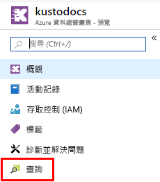
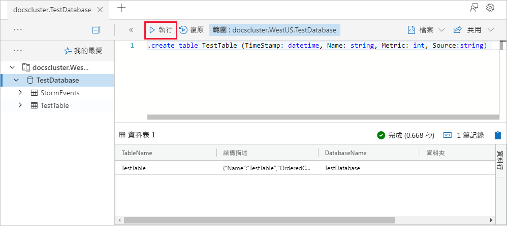
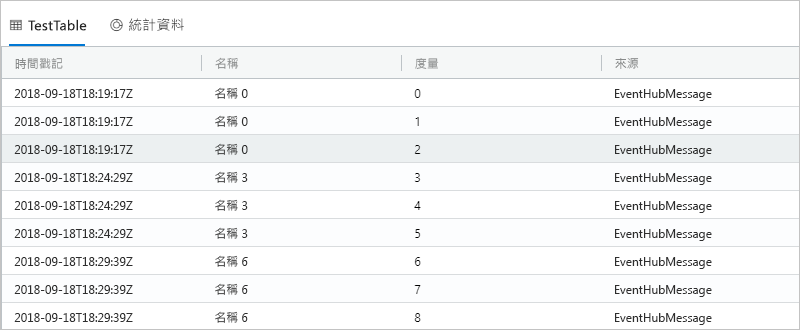

# <a name="quickstart-ingest-data-from-kafka-into-azure-data-explorer"></a>快速入門：將資料從 Kafka 內嵌至 Azure 資料總管
 
Azure 資料總管是一項快速又可高度調整的資料探索服務，可用於處理記錄和遙測資料。 Azure 資料總管會提供從 Kafka 擷取資料 (資料載入) 的功能。 Kafka 是分散式串流平台，可用於建置即時串流資料管線，可靠地在系統或應用程式之間移動資料。 
 
## <a name="prerequisites"></a>必要條件
 
* 如果您沒有 Azure 訂用帳戶，請在開始前建立[免費 Azure 帳戶](https://azure.microsoft.com/free/)。 
 
* [測試叢集和資料庫](create-cluster-database-portal.md)
 
* 產生資料並將其傳送至 Kafka 的[範例應用程式](https://github.com/Azure/azure-kusto-samples-dotnet/tree/master/kafka)

* [Visual studio 2017 15.3.2 版或更新版本](https://www.visualstudio.com/vs/)，以執行範例應用程式
 
## <a name="kafka-connector-setup"></a>Kafka 連接器設定
Kafka Connect 工具能夠彈性且可靠地在 Apache Kafka 和其他系統之間串流資料。 此工具可讓您輕鬆且快速地定義連接器，以移動傳入和傳出 Kafka 的大型資料集合。 ADX Kafka 接收器可作為 Kafka 中的連接器。
 
### <a name="bundle"></a>組合 
Kafka 可將 `.jar` 載入為外掛程式，以作為自訂連接器使用。 若要產生這類 `.jar`，我們會在本機複製程式碼，並使用 Maven 建置。 

#### <a name="clone"></a>複製

```bash
git clone git://github.com:Azure/kafka-sink-azure-kusto.git
cd ./kafka-sink-azure-kusto/kafka/
```
 
#### <a name="build"></a>建置

使用 Maven 在本機建置，以產生附帶相依性的 `.jar`。

* JDK >= 1.8 [下載](https://www.oracle.com/technetwork/java/javase/downloads/index.html)
* Maven [下載](https://maven.apache.org/install.html)
 

在根目錄 kafka-sink-azure-kusto 內執行：

```bash
mvn clean compile assembly:single
```
 
### <a name="deploy"></a>部署 
 
將外掛程式載入 Kafka。 [kafka-sink-azure-kusto](https://github.com/Azure/kafka-sink-azure-kusto#deploy) 中有使用 Docker 的部署範本
 

[Kafka Connect](https://kafka.apache.org/documentation/#connect) 中有詳細的 Kafka 連接器文件和部署方式 

### <a name="example-configuration"></a>設定範例 
 
```config
name=KustoSinkConnector 
connector.class=com.microsoft.azure.kusto.kafka.connect.sink.KustoSinkConnector 
kusto.sink.flush_interval_ms=300000 
key.converter=org.apache.kafka.connect.storage.StringConverter 
value.converter=org.apache.kafka.connect.storage.StringConverter 
tasks.max=1 
topics=testing1 
kusto.tables.topics_mapping=[{'topic': 'testing1','db': 'daniel', 'table': 'TestTable','format': 'json', 'mapping':'TestMapping'}] 
kusto.auth.authority=XXX 
kusto.url=https://ingest-{mycluster}.kusto.windows.net/ 
kusto.auth.appid=XXX 
kusto.auth.appkey=XXX 
kusto.sink.tempdir=/var/tmp/ 
kusto.sink.flush_size=1000
```
 
## <a name="create-a-target-table-in-adx"></a>在 ADX 中建立目標資料表
 
在 ADX 中建立資料表，讓 Kafka 可將資料傳送至此。 在於**必要條件**中佈建的叢集與資料庫中建立該資料表。
 
1. 在 Azure 入口網站中瀏覽至您的叢集，然後選取 [查詢]。
 
    
 
1. 將下列命令複製到視窗，然後選取 [執行]。
 
    ```Kusto
    .create table TestTable (TimeStamp: datetime, Name: string, Metric: int, Source:string)
    ```
 
    
 
1. 將下列命令複製到視窗，然後選取 [執行]。
 
    ```Kusto
    .create table TestTable ingestion json mapping 'TestMapping' '[{"column":"TimeStamp","path":"$.timeStamp","datatype":"datetime"},{"column":"Name","path":"$.name","datatype":"string"},{"column":"Metric","path":"$.metric","datatype":"int"},{"column":"Source","path":"$.source","datatype":"string"}]'
    ```

    此命令會將傳入的 JSON 資料對應至資料表 (TestTable) 的資料行名稱與資料類型。


## <a name="generate-sample-data"></a>產生範例資料

現在 Kafka 叢集已連線到 ADX，請使用下載的[範例應用程式](https://github.com/Azure-Samples/event-hubs-dotnet-ingest)來產生資料。

### <a name="clone"></a>複製
在本機複製範例應用程式：

```cmd
git clone git://github.com:Azure/azure-kusto-samples-dotnet.git
cd ./azure-kusto-samples-dotnet/kafka/
```
### <a name="run-the-app"></a>執行應用程式
1. 請在 Visual Studio 中開啟範例應用程式解決方案。

1. 在 `Program.cs` 檔案中，將 `connectionString` 常數更新為您的 Kafka 連接字串。

    ```csharp    
    const string connectionString = @"<YourConnectionString>";
    ```

1. 建置並執行應用程式。 應用程式會將訊息傳送至 Kafka 叢集，並每隔 10 秒列印出狀態。

1. 在應用程式送出一些訊息之後，請移至下一個步驟。
 
## <a name="query-and-review-the-data"></a>查詢及檢視資料 

1. 若要確定擷取期間未發生任何錯誤：

    ```Kusto
    .show ingestion failures
    ```

1. 若要查看新擷取的資料：

    ```Kusto
    TestTable 
    | count
    ```

1. 若要查看訊息內容：
 
    ```Kusto
    TestTable
    ```
 
    結果集應會如下所示：
 
    
 
## <a name="next-steps"></a>後續步驟
 
> [!div class="nextstepaction"]
> [快速入門：在 Azure 資料總管中查詢資料](web-query-data.md)
