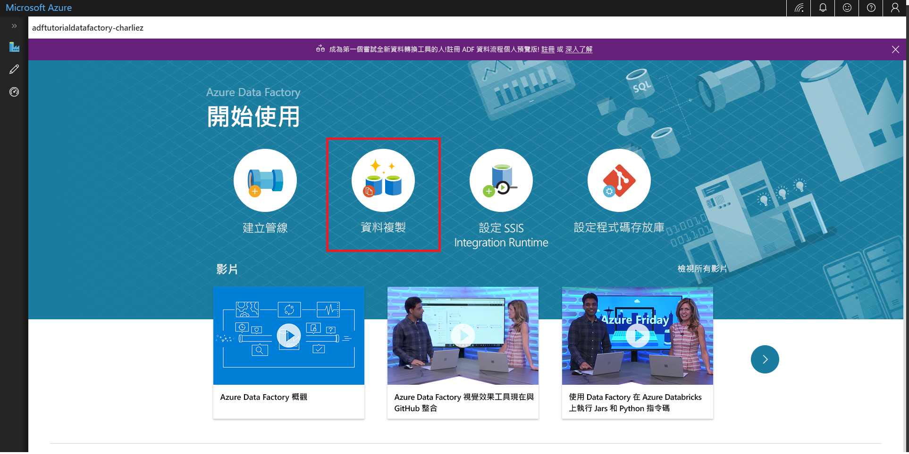

# 使用複製資料工具複製資料 
> [!div class="op_single_selector" title1="Select the version of Data Factory service you are using:"]
> * [第 1 版 - 正式推出](v1/data-factory-copy-data-from-azure-blob-storage-to-sql-database.md)
> * [第 2 版 - 預覽](quickstart-create-data-factory-copy-data-tool.md)

在這個快速入門中，您會使用 Azure 入口網站來建立資料處理站。 接著，您會使用「複製資料」工具來建立管線，該管線會將資料從 Azure Blob 儲存體的一個資料夾複製到另一個資料夾。 

> [!NOTE]
> 如果您不熟悉 Azure Data Factory，在執行此快速入門之前，請先參閱 [Azure Data Factory 簡介](data-factory-introduction.md)。 
>
> 本文適用於第 2 版的 Data Fatory (目前為預覽版)。 如果您使用第 1 版的 Data Factory 服務 (也就是正式推出版 (GA))，請參閱 [開始使用 Data Factory 第 1 版](v1/data-factory-copy-data-from-azure-blob-storage-to-sql-database.md)。

[!INCLUDE [data-factory-quickstart-prerequisites](../../includes/data-factory-quickstart-prerequisites.md)] 

## 建立 Data Factory

1. 按一下左邊功能表上的 [新增]、[資料 + 分析]，再按一下 [Data Factory]。 
   
   
2. 在 [新增資料處理站] 頁面中，輸入 **ADFTutorialDataFactory** 作為 [名稱]。 
      
     
 
   Azure Data Factory 的名稱必須是 **全域唯一的**。 如果您在名稱欄位看到下列錯誤，請變更資料處理站的名稱 (例如 yournameADFTutorialDataFactory)，然後試著重新建立。 請參閱 [Data Factory - 命名規則](naming-rules.md)一文，以了解 Data Factory 成品的命名規則。
  
     
3. 選取您要在其中建立資料處理站的 Azure **訂用帳戶**。 
4. 針對 [資源群組]，請執行下列其中一個步驟︰
     
      - 選取 [使用現有的] ，然後從下拉式清單選取現有的資源群組。 
      - 選取 [建立新的] ，然後輸入資源群組的名稱。   
         
      若要了解資源群組，請參閱 [使用資源群組管理您的 Azure 資源](../azure-resource-manager/resource-group-overview.md)。  
4. 對 [版本] 選取 [V2 (預覽)]。
5. 選取 Data Factory 的 [位置]  。 在下拉式清單中只會顯示受到支援的位置。 資料處理站所使用的資料存放區 (Azure 儲存體、Azure SQL Database 等) 和計算 (HDInsight 等) 可位於其他區域。
6. 選取 [釘選到儀表板]。     
7. 按一下頁面底部的 [新增] 。
8. 在儀表板上，您會看到狀態如下的下列圖格︰**正在部署資料處理站**。 

    
9. 建立完成之後，您會看到如圖中所示的 [Data Factory] 頁面。
   
   
10. 按一下 [編寫與監視] 圖格，以在另一個索引標籤中啟動 Azure Data Factory 使用者介面 (UI)。 

## 啟動複製資料工具

1. 在 [開始使用] 頁面中，按一下 [複製資料] 圖格以啟動複製資料工具。 

   
2. 在 [複製資料] 工具的 [屬性] 頁面中，按一下 [下一步]。 您可以在這個頁面中指定管線名稱及其描述。 

    
3. 在 [來源資料存放區] 頁面上，選取 [Azure Blob 儲存體]，然後按一下 [下一步]。

    
4. 在 [指定 Azure Blob 儲存體帳戶] 頁面中，從下拉式清單中選取您的 [儲存體帳戶名稱]，然後按一下 [下一步]。 

    
5. 在 [選擇輸入檔案或資料夾] 頁面上，執行下列步驟︰

    1. 瀏覽至 **adftutorial/input** 資料夾。 
    2. 選取 **emp.txt** 檔案。
    3. 按一下 [選擇]。 您可以按兩下 **emp.txt** 略過此步驟。 
    4. 按 [下一步] 。 

    
6. 在 [檔案格式設定] 頁面中，請注意，此工具會自動偵測資料行和資料列分隔符號，按一下 [下一步]。 您也可以在這個頁面中預覽資料，並檢視輸入資料的結構描述。 

    
7. 在 [目的地資料存放區] 頁面中，選取 [Azure Blob 儲存體]，然後按一下 [下一步]。 

        
8. 在 [指定 Azure Blob 儲存體帳戶] 頁面中，選取您的 Azure 儲存體帳戶，然後按一下 [下一步]。 

    
9. 在 [選擇輸出檔案或資料夾] 頁面中，執行下列步驟︰ 

    1. 在 [資料夾路徑] 輸入 **adftutorial/output**。
    2. 在 [檔案名稱] 輸入 **emp.txt**。 
    3. 按 [下一步] 。 

     
10. 在 [檔案格式設定] 頁面中，按一下 [下一步]。 

    
11. 按一下 [設定] 頁面上的 [下一步]。 

    
12. 檢閱 [摘要] 頁面中的所有設定，然後按一下 [下一步]。 

    
13. 在 [部署完成] 頁面上，按一下 [監視] 來監視您建立的管線。 

    
14. 應用程式會切換至 [監視] 索引標籤。您會在此頁面中看到管線的狀態。 按一下 [重新整理] 可重新整理清單。 
    
    
15. 按一下 [動作] 資料行中的 [檢視活動執行] 連結。 管線只有一個 [複製] 類型的活動。 

    
16. 若要檢視關於複製作業的詳細資訊，請按一下 [動作] 資料行中的 [詳細資料] (眼鏡圖片) 連結。 如需屬性的詳細資訊，請參閱[複製活動概觀](copy-activity-overview.md)。 

    
17. 確認已在 **adftutorial** 容器的 **output** 資料夾中建立 **emp.txt** 檔案。 如果 output 資料夾不存在，Data Factory 服務會自動加以建立。 
18. 切換至能夠編輯連結服務、資料集和管線的 [編輯] 索引標籤。 若要深入了解如何在 Data Factory 使用者介面中進行編輯，請參閱[使用 Azure 入口網站建立資料處理站](quickstart-create-data-factory-portal.md)。

    

## 後續步驟
在此範例中的管線會將資料從 Azure Blob 儲存體中的一個位置複製到其他位置。 瀏覽[教學課程](tutorial-copy-data-portal.md)以了解使用 Data Factory 的更多案例。 