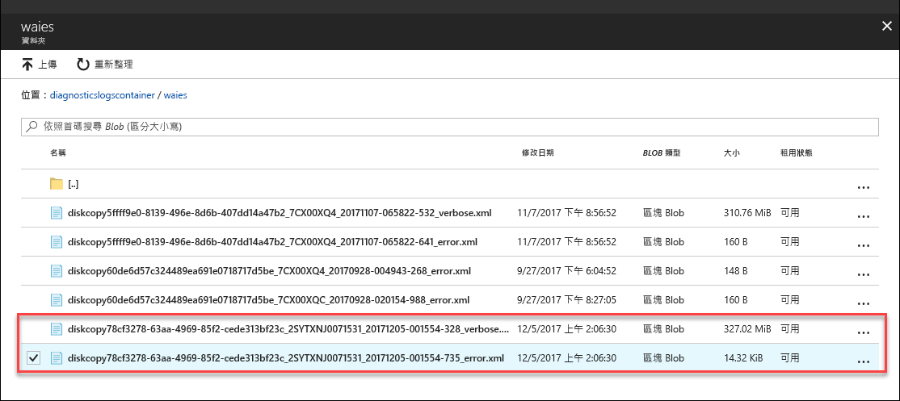

# 針對 Azure 資料箱磁碟 (預覽) 中的問題進行疑難排解

本文適用於執行預覽版本的 Microsoft Azure 資料箱。 本文說明一些可以在資料箱和資料箱磁碟上執行的複雜工作流程和管理工作。 

您可以使用資料箱服務 UI (又稱為入口網站 UI) 和裝置的本機 Web UI 來管理資料箱。 資料箱磁碟只能透過 Azure 入口網站進行管理。 本文著重於可使用 Azure 入口網站執行的工作。 使用 Azure 入口網站來管理訂單、管理裝置，並且在進行到終端機階段時追蹤訂單狀態。

本文包含下列教學課程：

- 下載診斷記錄
- 查詢活動記錄

> [!IMPORTANT]
> 資料箱處於預覽狀態。 部署這個解決方案之前，請檢閱 [Azure 預覽版使用條款](https://azure.microsoft.com/support/legal/preview-supplemental-terms/)。

## 下載診斷記錄

如果在資料複製程序期間有任何錯誤，則入口網站會顯示前往資料夾 (診斷記錄位於該資料夾) 的路徑。 

診斷記錄可以是：
- 錯誤記錄
- 詳細資訊記錄  

若要瀏覽至複製記錄的路徑，請移至與資料箱訂單相關聯的儲存體帳戶。 

1.  移至 [一般 > 訂單詳細資料]，並記下與訂單相關聯的儲存體帳戶。
 

2.  移至 [所有資源] 並搜尋在上一個步驟中所識別出的儲存體帳戶。 選取並按一下儲存體帳戶。

    

3.  移至 [Blob 服務 > 瀏覽 Blob] 並尋找對應到儲存體帳戶的 Blob。 移至 [diagnosticslogcontainer > waies]。 

    

    您應該會看到資料複製的錯誤記錄和詳細資訊記錄。 選取並按一下每個檔案，然後下載本機複本。

## 查詢活動記錄

使用活動記錄可在進行疑難排解時發現錯誤，或監視貴組織使用者修改資源的方式。 透過活動記錄檔，您可以判斷︰

- 在訂用帳戶的資源上進行了哪些作業。
- 起始作業的人員。 
- 發生作業的時間。
- 作業狀態。
- 其他可能協助您研究作業的屬性值。

活動記錄包含在您的資源上執行的所有寫入作業 (例如 PUT、POST、DELETE)，但不包含讀取作業 (例如 GET)。 

活動記錄檔會保留 90 天。 您可以查詢任何的日期範圍，只要開始日期不是在過去 90 天以前。 您也可以依據 Insights 中其中一個內建查詢來進行篩選。 例如，按一下錯誤然後選取並按一下特定錯誤，以了解根本原因。

## 資料箱磁碟解除鎖定工具錯誤

| 錯誤訊息/工具行為      | 建議                                                                                               |
|-------------------------------------------------------------------------------------------------------------------------------------|------------------------------------------------------------------------------------------------------|
| None  資料箱磁碟解除鎖定工具損毀。                                                                            | 未安裝 Bitlocker。 請確定執行資料箱磁碟解除鎖定工具的主機電腦已安裝 BitLocker。                                                                            |
| 不支援最新版本的 .NET Framework。 支援的版本是 4.5 版和更新版本。  工具結束並且有訊息。  | 未安裝 .NET 4.5。 請在執行資料箱磁碟解除鎖定工具的主機電腦上，安裝 .NET 4.5 或更新版本。                                                                            |
| 無法解除鎖定或驗證任何磁碟區。 連絡 Microsoft 支援服務。    此工具無法解除鎖定或驗證任何已鎖定的磁碟機。 | 此工具無法使用提供的通行金鑰，解除鎖定任何已解除鎖定的磁碟機。 連絡 Microsoft 支援服務以進行後續步驟。                                                |
| 下列磁碟區已解除鎖定並經過驗證。  磁碟區磁碟機代號：E: 無法使用下列通行金鑰解除鎖定任何磁碟區：werwerqomnf、qwerwerqwdfda   此工具會解除鎖定部分磁碟機，並列出成功和失敗的磁碟機代號。| 部分成功。 無法使用提供的通行金鑰解除鎖定部分磁碟機。 連絡 Microsoft 支援服務以進行後續步驟。 |
| 找不到鎖定的磁碟區。 請確認從 Microsoft 處接收的磁碟已正確連線且處於鎖定狀態。          | 此工具找不到任何鎖定的磁碟機。 可能磁碟機已解除鎖定，或未偵測到磁碟機。 請確定磁碟機已連線且已鎖定。                                                           |
| 嚴重錯誤：參數無效 參數名稱：invalid_arg 使用方式： DataBoxDiskUnlock /PassKeys:<passkey_list_separated_by_semicolon>  範例：DataBoxDiskUnlock /PassKeys:passkey1;passkey2;passkey3 範例：DataBoxDiskUnlock /SystemCheck 範例：DataBoxDiskUnlock /Help  /PassKeys:       從 Azure 資料箱磁碟訂單取得此通行金鑰。 通行金鑰會將您的磁碟解除鎖定。 /Help:           這個選項提供 Cmdlet 使用方式和範例的說明。 /SystemCheck:    這個選項會檢查您的系統是否符合執行工具的需求。  按任意鍵以結束。 | 輸入的參數無效。 允許的參數只有 /SystemCheck、/PassKey 和 /Help。                                                                            |
## 後續步驟

- 深入了解如何[透過 Azure 入口網站管理資料箱磁碟](data-box-portal-ui-admin.md)。
