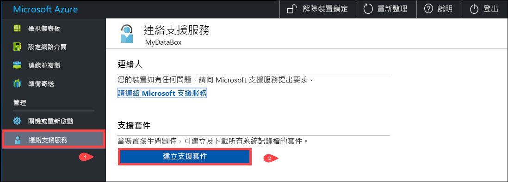
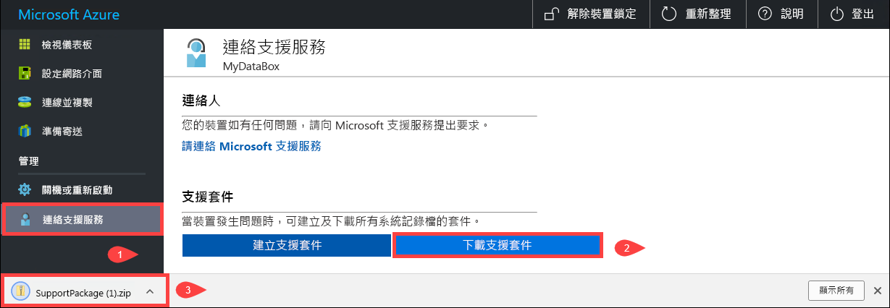
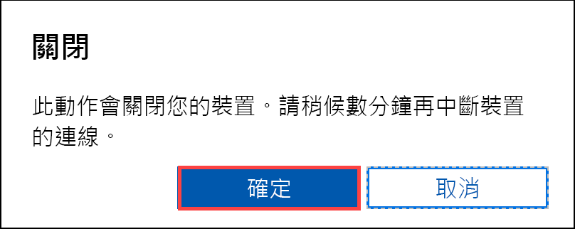
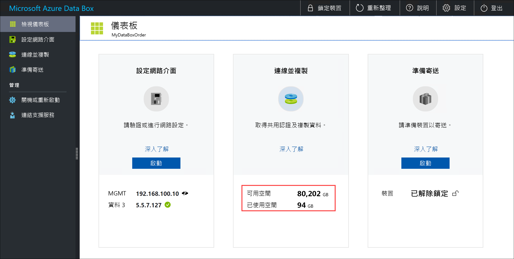
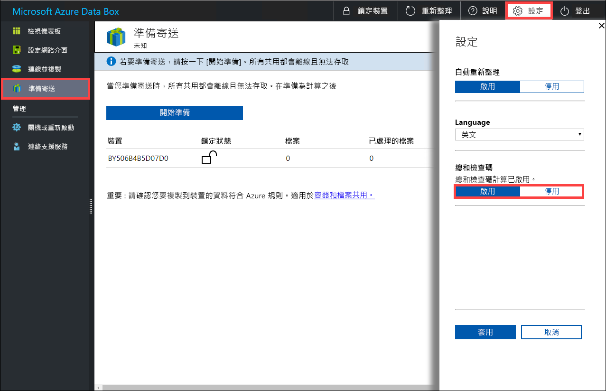

# 使用本機 Web UI 來管理您的資料箱

此文章說明一些可以在資料箱上執行的設定與管理工作。 您可以透過 Azure 入口網站 UI 與資料箱的本機 Web UI 來管理該裝置。 此文章著重在可以使用本機 Web UI 執行的工作。

您必須使用資料箱的本機 Web UI 來進行裝置的初始設定。 您也可以使用本機 Web UI 來將資料箱關機或重新啟動、執行診斷測試、更新軟體、檢視複製記錄，以及為 Microsoft 支援服務產生記錄套件。

此文章包含下列教學課程：

- 產生支援套件
- 關閉或重新啟動您的裝置
- 安全地抹除裝置中的資料
- 監視裝置的可用容量
- 跳過總和檢查碼驗證 

## 產生支援套件

如果您遇到任何裝置問題，您可以從系統記錄檔建立支援套件。 Microsoft 支援服務會使用此套件來針對問題進行疑難排解。 若要產生支援套件，請執行下列步驟：

1. 在本機 Web UI 中，移至 [連絡支援服務]，然後按一下 [建立支援套件]。

    

2. 已收集支援套件。 此作業需要幾分鐘的時間。

    

3. 建立支援套件之後，按一下 [下載支援套件]。 

    

4. 瀏覽並選擇下載位置。 開啟資料夾以檢視內容。

    

## 關閉或重新啟動您的裝置

您可以使用本機 Web UI 來將資料箱關機或重新啟動。 我們建議在重新開機之前，先讓主機上的共用離線，然後再讓裝置離線。 這樣可以讓資料損毀的可能性降到最低。 將裝置關機時，請確保並未執行資料複製。

若要將資料箱關機，請執行下列步驟。

1. 在本機 Web UI 中，移至 [關機或重新啟動]。
2. 按一下 [關機]。

    

3. 系統提示您進行確認時，按一下 [確定] 以繼續。

    

裝置關機之後，請使用前端面板上的電源按鈕來開啟裝置電源。

若要將資料箱重新啟動，請執行下列步驟。

1. 在本機 Web UI 中，移至 [關機或重新啟動]。
2. 按一下 [重新啟動]。

    

3. 系統提示您進行確認時，按一下 [確定] 以繼續。

   裝置將會關機並重新啟動。

## 檢視裝置的可用容量

您可以使用裝置儀表板來檢視裝置的可用與已使用容量。 

1. 在本機 Web UI 中，移至 [檢視儀表板]。
2. 在 [連線並複製] 下，將會顯示裝置上的可用與已使用空間。

    

## 跳過總和檢查碼驗證

在您準備寄送時，系統預設會針對您的資料產生總和檢查碼。 在某些罕見的情況下，根據資料類型的不同 (小型檔案)，效能可能會非常緩慢。 在這種情況下，您可以跳過總和檢查碼。 

我們強烈建議您不要停用總和檢查碼，除非效能已嚴重受到影響。

1. 在裝置本機 Web UI 的右上角，移至 [設定]。

    

2. [停用] 總和檢查碼驗證
3. 按一下 [套用]。

## 後續步驟

- 了解如何[透過 Azure 入口網站管理資料箱](data-box-portal-admin.md)。

