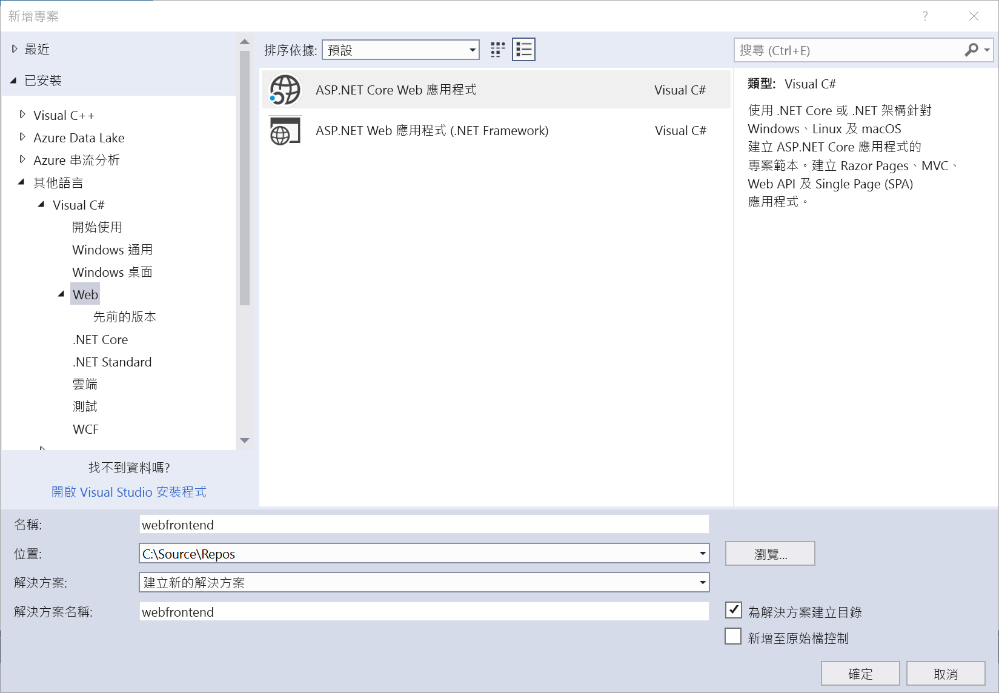
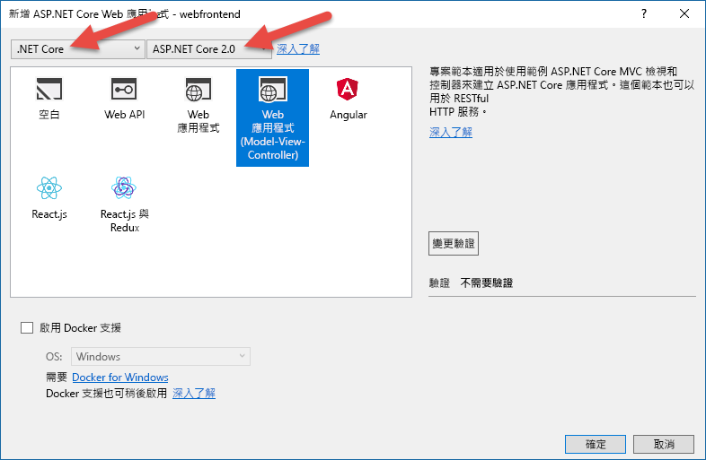
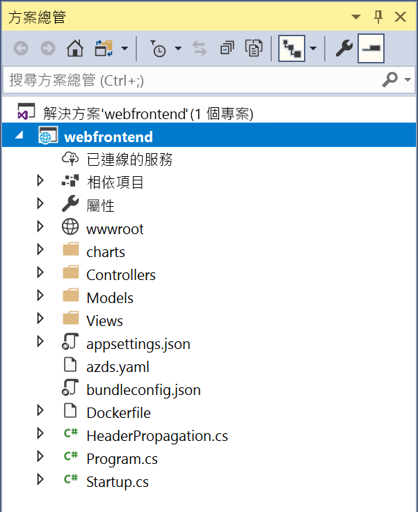

# <a name="get-started-on-azure-dev-spaces-with-net-core-and-visual-studio"></a>在使用 .NET Core 和 Visual Studio 的 Azure 開發人員空間上開始使用

在本指南中，您將了解如何：

- 在 Azure 中建立以 Kubernetes 為基礎、最適合用於開發的環境。
- 使用 Visual Studio 在容器中反覆開發程式碼。
- 獨立開發兩個不同的服務，並且使用 Kubernetes 的 DNS 服務探索來呼叫另一個服務。
- 在小組環境中有效率地開發及測試您的程式碼。

[!INCLUDE[](includes/see-troubleshooting.md)]

[!INCLUDE[](includes/portal-aks-cluster.md)]

## <a name="get-the-visual-studio-tools"></a>取得 Visual Studio 工具
1. 安裝最新版的 [Visual Studio 2017](https://www.visualstudio.com/vs/)
1. 在 Visual Studio 安裝程式中，確定已選取以下的工作負載：
    * ASP.NET 和 Web 開發
1. 安裝[適用於 Azure 開發人員空間的 Visual Studio 擴充功能](https://aka.ms/get-azds-visualstudio)。

您現在可以使用 Visual Studio 建立 ASP.NET Web 應用程式。

## <a name="create-an-aspnet-web-app"></a>建立 ASP.NET Web 應用程式

在 Visual Studio 2017 中，建立新的專案。 目前，此專案必須是 **ASP.NET Core Web 應用程式**。 將專案命名為 '**webfrontend**'。



選取 [Web 應用程式 (Model-View-Controller)] 範本，並確定您的目標是對話方塊頂端的兩個下拉式清單中的 **.NET Core** 和 **ASP.NET Core 2.0**。 按一下 [確定]  以建立專案。




## <a name="create-a-dev-environment-in-azure"></a>在 Azure 中建立開發環境

使用 Azure 開發人員空間，您可以建立以 Kubernetes 為基礎的開發環境，該開發環境完全受 Azure 控管並已針對開發最佳化。 開啟您剛建立的專案，然後從啟動設定下拉式清單中選取 [Azure 開發人員空間]，如下所示。


在接下來顯示的對話方塊中，請確定您以適當的帳戶登入，然後選取現有的 Kubernetes 叢集。


現在讓 [空間] 下拉式清單預設為 `default`。 稍後，您將深入了解這個選項。 請核取 [可公開存取] 核取方塊，以便透過公用端點存取 Web 應用程式。 這不是必要的設定，但是對於稍後在本逐步解說中示範一些概念很有幫助。 請別擔心，在任一情況下，您都能夠使用 Visual Studio 進行您的網站偵錯。


按一下 [確定] 以選取或建立叢集。

如果您選擇尚無法與 Azure 開發人員空間搭配使用的叢集，您會看到訊息詢問您是否要加以設定。


選擇 [確定]。

 將啟動背景工作，以完成這項作業。 這需要幾分鐘才能完成。 若要查看它是否仍在建立中，請將指標停留在狀態列左下角的 [背景工作] 圖示上，如下圖所示。


> [!Note]
> 在成功建立開發環境前，您無法進行應用程式偵錯。

## <a name="look-at-the-files-added-to-project"></a>查看已新增至專案的檔案
等待建立開發環境時，查看當您選擇使用開發環境時新增至專案的檔案。

首先，您可以看到已新增名為 `charts` 的資料夾，而此資料夾內已建構適用於您的應用程式的 [Helm 圖表](https://docs.helm.sh)。 這些檔案用於將您的應用程式部署到開發環境中。

您會看到已新增名為 `Dockerfile` 的檔案。 此檔案包含以標準 Docker 格式封裝應用程式所需的資訊。 此外，也會建立 `HeaderPropagation.cs` 檔案，我們稍後會在本逐步解說中討論這個檔案。 

最後，您會看到名為 `azds.yaml` 的檔案，其中包含開發環境所需的組態資訊，例如應用程式是否可透過公用端點存取。



## <a name="debug-a-container-in-kubernetes"></a>在 Kubernetes 中進行容器偵錯
在成功建立開發環境後，您即可進行應用程式偵錯。 在程式碼中設定中斷點，例如在 `Message` 變數設定所在 `HomeController.cs` 檔案中的第 20 行上。 按一下 **F5** 開始偵錯。 

Visual Studio 會與開發環境通訊，以建置和部署應用程式，然後以執行中的 Web 應用程式開啟瀏覽器。 容器可能看起來像在本機執行，但實際是在 Azure 的開發環境中執行。 localhost 位址的原因是因為 Azure 開發人員空間會對在 Azure 中執行的容器建立暫存 SSH 通道。

按一下頁面頂端的 [關於] 連結，以觸發中斷點。 就如同已在本機執行程式碼一樣，您擁有偵錯資訊的完整存取權，例如呼叫堆疊、區域變數、例外狀況資訊等等。

## <a name="call-another-container"></a>呼叫另一個容器
在本節中，您會建立第二個服務 `mywebapi`，並由 `webfrontend` 加以呼叫。 每個服務都會在個別的容器中執行。 然後，您將在這兩個容器間進行偵錯。


## <a name="download-sample-code-for-mywebapi"></a>下載 *mywebapi* 的範例程式碼
為了節省時間，我們將從 GitHub 存放庫下載範例程式碼。 請移至 https://github.com/Azure/dev-spaces，然後選取 [複製或下載]，從 GitHub 存放庫進行下載。 本節的程式碼位於 `samples/dotnetcore/getting-started/mywebapi`。

## <a name="run-mywebapi"></a>執行 *mywebapi*
1. 在個別的 Visual Studio 視窗中開啟專案 `mywebapi`。
1. 從啟動設定下拉式清單中選取 [Azure 開發人員空間]，如同您先前對 `webfrontend` 專案所做的。 這是請不要建立新的開發環境，而應選取您已建立的同一個開發環境。 與之前相同，將 [空間] 保留為預設的 `default`，然後按一下 [確定]。 在 [輸出] 視窗中，您可能會發現 Visual Studio 開始在開發環境中「準備」這項新服務，以在您開始偵錯時加速作業。
1. 按 F5，並等候服務進行建置和部署。 當 Visual Studio 的狀態列變成橙色時，即表示已就緒
1. 記下 [輸出] 視窗的 [適用於 AKS 的 Azure 開發人員空間] 窗格中所顯示的 URL 端點。 輸出應該會類似於 http://localhost:\<portnumber\>。 容器可能看起來像在本機執行，但實際是在 Azure 的開發環境中執行。
2. 當 `mywebapi` 就緒時，請開啟瀏覽器並進入 localhost 位址，然後將 `/api/values` 附加至 URL，以叫用 `ValuesController` 的預設 GET API。 
3. 如果所有步驟都已成功，您應該會看到 `mywebapi` 服務產生如下的回應。

    

## <a name="make-a-request-from-webfrontend-to-mywebapi"></a>從 webfrontend 發出對 mywebapi 的要求
我們現在要在 `webfrontend` 中撰寫對 `mywebapi` 發出要求的程式碼。 切換至含有 `webfrontend` 專案的 Visual Studio 視窗。 在 `HomeController.cs` 檔案中，將 About 方法的程式碼取代為下列程式碼：

   ```csharp
   public async Task<IActionResult> About()
   {
      ViewData["Message"] = "Hello from webfrontend";

      // Use HeaderPropagatingHttpClient instead of HttpClient so we can propagate
      // headers in the incoming request to any outgoing requests
      using (var client = new HeaderPropagatingHttpClient(this.Request))
      {
          // Call *mywebapi*, and display its response in the page
          var response = await client.GetAsync("http://mywebapi/api/values/1");
          ViewData["Message"] += " and " + await response.Content.ReadAsStringAsync();
      }

      return View();
   }
   ```

請留意系統如何使用 Kubernetes 的 DNS 服務探索將服務參照為 `http://mywebapi`。 **開發環境中的程式碼會以後續在生產環境中執行的相同方式執行**。

上述程式碼範例也會使用 `HeaderPropagatingHttpClient` 類別。 此協助程式類別是您在將其設定為使用 Azure 開發人員空間時新增至專案的檔案 `HeaderPropagation.cs`。 `HeaderPropagatingHttpClient` 衍生自已知的 `HttpClient` 類別，且會新增功能，將特定標頭從現有的 ASP .NET HttpRequest 物件傳播到傳出的 HttpRequestMessage 物件中。 您稍後將會了解此類別如何促進小組案例中的生產力開發體驗。

## <a name="debug-across-multiple-services"></a>在多個服務間進行偵錯
1. 此時，`mywebapi` 仍應使用附加的偵錯工具執行中。 如果不是，在 `mywebapi` 專案中按 F5。
1. 在 `ValuesController.cs` 檔案中負責處理 `api/values/{id}` GET 要求的 `Get(int id)` 方法內設定中斷點。
1. 在您已貼上前述程式碼的 `webfrontend` 專案中，請將中斷點設定在傳送 GET 要求給 `mywebapi/api/values` 的前一刻。
1. 在 `webfrontend` 專案中按 F5。 Visual Studio 會重新開啟瀏覽器並進入適當 localhost 連接埠，且會顯示 Web 應用程式。
1. 按一下頁面頂端的 [關於] 連結，以觸發 `webfrontend` 專案中的中斷點。 
1. 按 F10 繼續作業。 此時會觸發 `mywebapi` 專案中的中斷點。
1. 按 f5 繼續作業，且您會返回 `webfrontend` 專案中的程式碼。
1. 再按一次 F5 將會完成要求，並在瀏覽器中傳回頁面。 在 Web 應用程式中，[關於] 頁面會顯示由兩項服務串連的訊息：「來自 webfrontend 的 Hello 和來自 mywebapi 的 Hello」。

做得好！ 現在，您已有每個容器可以個別開發和部署的多容器應用程式。

## <a name="learn-about-team-development"></a>了解小組開發

目前為止，您已如同您是應用程式唯一的開發人員一般，執行您的應用程式程式碼。 在本節中，您將了解 Azure 開發人員空間如何簡化小組開發：
* 讓一組開發人員在相同的開發環境中工作。
* 支援每位開發人員獨立在其程式碼中反覆執行，而不需要擔心會中斷其他開發人員。
* 在程式碼認可之前端對端測試程式碼，不需要建立模擬或模擬相依性。

### <a name="challenges-with-developing-microservices"></a>開發微服務的挑戰
您的範例應用程式目前並不複雜。 但是在實務開發中，隨著您新增更多服務以及開發小組成長，很快就會出現挑戰。

請想像處理與其他數十個服務互動的服務。

- 在本機執行所有項目來進行開發，變得不切實際。 您的開發機器可能沒有足夠的資源可以執行整個應用程式。 或者，也許您的應用程式具有必須可公開存取的端點 (例如，您的應用程式會回應來自 SaaS 應用程式的 Webhook)。
- 您可以嘗試只執行您依賴的服務，但是這表示您需要知道完整的相依性 (例如，相依性的相依性)。 否則，因為您不是在處理它們，無法輕易得知如何建置及執行您的相依性就會是問題。
- 某些開發人員會針對他們的許多服務相依性進行模擬或製作模型。 此方法有時會有幫助，但是管理這些模型很快會佔用開發的投入時間。 再者，此方法會導致您的開發環境與生產環境出現差異，讓微小的 Bug 有機可趁。
- 其後果就是，執行任何類型的端對端測試都變得非常困難。 整合測試實際上只能在認可後發生，這表示您稍後會在開發週期中發現問題。

    

### <a name="work-in-a-shared-development-environment"></a>在共用開發環境中工作
使用 Azure 開發人員空間，您可以在 Azure 中設定共用開發環境。 每位開發人員可以專注於他們自己的應用程式部分，並且可以在環境 (已經包含其他所有服務和他們的案例依賴的雲端資源) 中反覆地開發認可前程式碼。 相依性永遠保持最新狀態，而且開發人員會以鏡像生產環境的方式工作。

### <a name="work-in-your-own-space"></a>在您自己的空間工作
當您為服務開發程式碼時，且在您準備將其簽入之前，程式碼通常不會處於良好狀態。 您仍反覆地讓它成形、加以測試，並且實驗解決方案。 Azure 開發人員空間提供**空間**的概念，可讓您獨立作業，而不需要擔心中斷您的小組成員。

請執行下列工作，以確保您的 `webfrontend` 和 `mywebapi` 都在開發環境中執行，**並且在 `default` 空間中執行**。
1. 關閉這兩項服務的任何 F5/偵錯工作階段，但讓專案在 Visual Studio 視窗中保持開啟。
2. 切換至含有 `mywebapi` 專案的 Visual Studio 視窗，然後按 Ctrl+F5 以執行服務，而不使用附加的偵錯工具
3. 切換至含有 `webfrontend` 專案的 Visual Studio 視窗，同時按 Ctrl+F5 加以執行。

> [!Note]
> 按 Ctrl + F5 顯示初始的網頁之後，有時候需要重新整理瀏覽器。

開啟公用 URL 並瀏覽至 Web 應用程式的任何人，都會叫用您先前撰寫、會透過兩項服務使用預設 `default` 空間執行的程式碼路徑。 現在，假設您想要繼續開發 `mywebapi` - 當您這麼做的時候，要如何才能不影響到其他使用開發環境的開發人員？ 為此，您應設定自己的空間。

### <a name="create-a-new-space"></a>建立新的空間
在 Visual Studio 中，您可以建立對服務執行 F5 或 Ctrl+F5 時所將使用的額外空間。 您可以任意為空間命名，並且可靈活地賦予其意義 (例如  `sprint4` 或 `demo`)。

若要建立新的空間，請執行下列動作：
1. 切換至含有 `mywebapi` 專案的 Visual Studio 視窗。
2. 以滑鼠右鍵按一下 [方案總管] 中的專案，然後選取 [屬性]。
3. 選取位於左側的 [偵錯] 索引標籤，以顯示 [Azure 開發人員空間] 設定。
4. 從此處，您可以變更或建立您按 F5 或 Ctrl+F5 時所將使用的叢集和/或空間。 *請確定已選取您稍早建立的 Azure 開發人員空間*。
5. 在 [空間] 下拉式清單中，選取 [<建立新的空間...>]。

    

6. 在 [新增空間] 對話方塊中輸入空間的名稱，然後按一下 [確定]。 您可以為新空間使用您的名稱 (例如 "scott")，讓您的同事知道您正在使用哪個空間。

    

7. 您現在應該會看到專案屬性頁面上選取了您的開發環境和新的空間。

    

### <a name="update-code-for-mywebapi"></a>更新 *mywebapi* 的程式碼

1. 在 `mywebapi` 專案中，對檔案 `ValuesController.cs` 中的 `string Get(int id)` 方法進行程式碼變更，如下所示：
 
    ```csharp
    [HttpGet("{id}")]
    public string Get(int id)
    {
        return "mywebapi now says something new";
    }
    ```

2. 在這個更新的程式碼區塊中設定中斷點 (您可能已有先前設定的中斷點)。
3. 按 F5 以啟動 `mywebapi` 服務。 此時將會在開發環境中使用選取的空間啟動服務，在此案例中為 `scott`。

下圖有助於您了解不同空間的運作方式。 藍色路徑顯示透過 `default` 空間的要求，這是未將空間附加至 URL 時所使用的預設路徑。 綠色路徑顯示透過 `scott` 空間的要求。


Azure 開發人員空間的這個內建功能，可讓您在共用環境中端對端測試程式碼，而不需要每位開發人員在其空間中重新建立服務的完整堆疊。 使用此路由時，您必須在應用程式的程式碼中轉送傳播標頭，如本指南的上一個步驟所說明。

### <a name="test-code-running-in-the-scott-space"></a>測試在 `scott` 空間中執行的程式碼
若要測試新版的 `webfrontend` 與 `mywebapi` 的搭配運作情形，請開啟瀏覽器並進入 `webfrontend` 的公用存取點 URL (例如 http://webfrontend-teamenv.123456abcdef.eastus.aksapp.io))，然後移至 [關於] 頁面。 您應該會看到原始訊息「來自 webfrontend 的 Hello 和來自 mywebapi 的 Hello」。

現在，請將 "scott.s."  部分新增至 URL，使其類似於 http://scott.s.webfrontend-teamenv.123456abcdef.eastus.aksapp.io，然後重新整理瀏覽器。 系統應會叫用您在 `mywebapi` 專案中設定的中斷點。 請按 f5 繼續作業，而您此時應會在瀏覽器中看到新的訊息「來自 webfrontend 和 mywebapi 的 Hello 現在顯示了新的內容。」 這是因為您已更新的程式碼在 `mywebapi` 中的路徑執行於 `scott` 空間中。

[!INCLUDE[](includes/well-done.md)]

[!INCLUDE[](includes/clean-up.md)]
