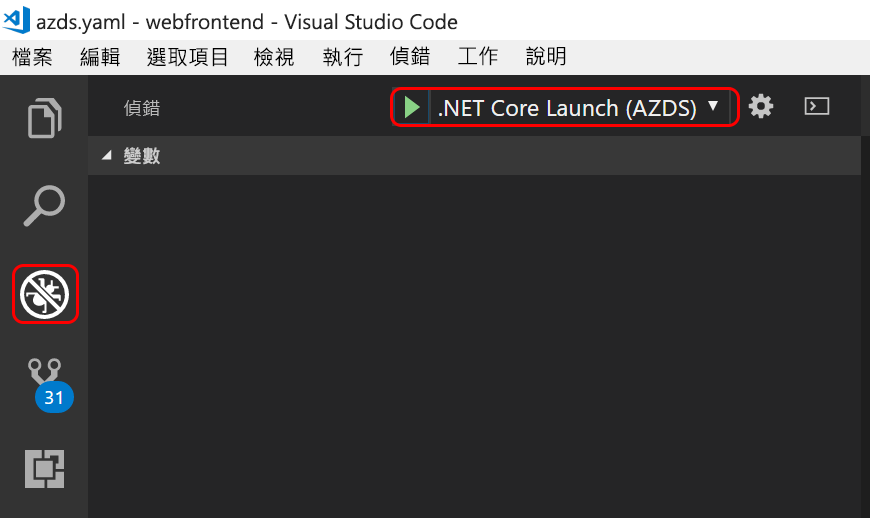

---
title: 使用 .NET Core 和 VS Code 在雲端建立 Kubernetes 開發人員空間 | Microsoft Docs
titleSuffix: Azure Dev Spaces
services: azure-dev-spaces
ms.service: azure-dev-spaces
ms.component: azds-kubernetes
author: ghogen
ms.author: ghogen
ms.date: 07/09/2018
ms.topic: tutorial
description: 在 Azure 上使用容器和微服務快速進行 Kubernetes 開發
keywords: Docker, Kubernetes, Azure, AKS, Azure Kubernetes Service, 容器
manager: douge
ms.openlocfilehash: 4da5b42ddd235fa26834e582a911140116692d34
ms.sourcegitcommit: 0a84b090d4c2fb57af3876c26a1f97aac12015c5
ms.translationtype: HT
ms.contentlocale: zh-TW
ms.lasthandoff: 07/11/2018
ms.locfileid: "38299554"
---
# <a name="get-started-on-azure-dev-spaces-with-net-core"></a>在使用 .NET Core 的 Azure 開發人員空間上開始使用

[!INCLUDE[](includes/learning-objectives.md)]

[!INCLUDE[](includes/see-troubleshooting.md)]

您現在可以在 Azure 中建立以 Kubernetes 為基礎的開發人員空間。

[!INCLUDE[](includes/portal-aks-cluster.md)]

## <a name="install-the-azure-cli"></a>安裝 Azure CLI
Azure 開發人員空間需要基本的本機電腦設定。 大部分開發人員空間的組態都會儲存在雲端，而且可與其他使用者共用。 從下載和執行 [Azure CLI](/cli/azure/install-azure-cli?view=azure-cli-latest) 著手。 

> [!IMPORTANT]
> 如果您已安裝 Azure CLI，請確定您使用的是 2.0.38 版或更高版本。

[!INCLUDE[](includes/sign-into-azure.md)]

[!INCLUDE[](includes/use-dev-spaces.md)]

[!INCLUDE[](includes/install-vscode-extension.md)]

在您等候建立叢集時，您可以開始開發程式碼。

## <a name="create-a-web-app-running-in-a-container"></a>建立在容器中執行的 Web 應用程式

在本節中，您會建立 ASP.NET Core Web 應用程式，並使其在 Kubernetes 的容器中執行。

### <a name="create-an-aspnet-core-web-app"></a>建立 ASP.NET Core Web 應用程式
如果您已安裝 [.NET Core](https://www.microsoft.com/net)，您可以在名為 `webfrontend` 的資料夾中快速建立 ASP.NET Core Web 應用程式。
    
```cmd
dotnet new mvc --name webfrontend
```

或者，瀏覽至 https://github.com/Azure/dev-spaces 以**從 GitHub 下載範例程式碼**，然後選取 [複製或下載]，將 GitHub 存放庫下載到您的本機環境。 本指南的程式碼位於 `samples/dotnetcore/getting-started/webfrontend`。

[!INCLUDE[](includes/azds-prep.md)]

[!INCLUDE[](includes/build-run-k8s-cli.md)]

### <a name="update-a-content-file"></a>更新內容檔案
Azure 開發人員空間不只讓程式碼中在 Kubernetes 中執行 - 還可讓您快速地反覆查看您的程式碼變更是否在雲端 Kubernetes 環境中生效。

1. 找出檔案 `./Views/Home/Index.cshtml` 並進行 HTML 編輯。 例如，將第 70 行 `<h2>Application uses</h2>` 變更如下：`<h2>Hello k8s in Azure!</h2>`
1. 儲存檔案。 稍後，您會在終端機視窗中看到一則訊息，指出執行中容器中的檔案已更新。
1. 移至您的瀏覽器並重新整理頁面。 您應該會看到網頁顯示更新後的 HTML。

發生什麼情形？ 編輯內容檔案 (例如 HTML 和 CSS) 時，不需要在 .NET Core Web 應用程式中重新編譯，所以作用中 `azds up` 命令會自動將任何修改過的內容檔案，直接同步處理到 Azure 中的執行中容器，您即可立即查看內容編輯。

### <a name="update-a-code-file"></a>更新程式碼檔案
更新程式碼檔案需要更多的工作，因為.NET Core 應用程式需要重建及產生更新後的應用程式二進位檔。

1. 在終端機視窗中，按 `Ctrl+C` (以停止 `azds up`)。
1. 開啟名為 `Controllers/HomeController.cs` 的程式碼檔案，然後編輯 [關於] 頁面將顯示的訊息：`ViewData["Message"] = "Your application description page.";`
1. 儲存檔案。
1. 在終端機視窗中執行 `azds up`。 

此命令會重建容器映像，並重新部署 Helm 圖表。 若要查看程式碼變更是否在執行中應用程式中生效，請移至 Web 應用程式中的 [關於] 功能表。


但是還有「更加快速的方法」可開發程式碼，您將在下一節中加以探索。 

## <a name="debug-a-container-in-kubernetes"></a>在 Kubernetes 中進行容器偵錯

[!INCLUDE[](includes/debug-intro.md)]

[!INCLUDE[](includes/init-debug-assets-vscode.md)]


### <a name="select-the-azds-debug-configuration"></a>選取 AZDS 偵錯組態
1. 若要開啟 [偵錯] 檢視，請按一下 VS Code 側邊的 [活動列] 中的 [偵錯] 圖示。
1. 選取 [.NET Core Launch (AZDS)] 作為作用中偵錯組態。



> [!Note]
> 如果您未在 [命令選擇區] 中看到任何 Azure 開發人員空間命令，請確定您已安裝適用於 Azure 開發人員空間的 VS Code 擴充功能。 請確定您在 VS Code 中開啟的工作區是包含 azds.yaml 的資料夾。


### <a name="debug-the-container-in-kubernetes"></a>在 Kubernetes 中進行容器偵錯
按 **F5** 可在 Kubernetes 中進行程式碼偵錯。

與 `up` 命令相同，程式碼也會同步到開發人員空間，且容器會建置並部署到 Kubernetes。 此時，偵錯工具當然會連結至遠端容器。

[!INCLUDE[](includes/tip-vscode-status-bar-url.md)]

在伺服器端程式碼檔案中設定中斷點，例如在 `Controllers/HomeController.cs` 來源檔案的 `Index()` 函式內。 重新整理瀏覽器頁面會導致叫用中斷點。

就如同已在本機執行程式碼一樣，您擁有偵錯資訊的完整存取權，例如呼叫堆疊、區域變數、例外狀況資訊等等。

### <a name="edit-code-and-refresh"></a>編輯程式碼並重新整理
使用有效的偵錯工具，進行程式碼編輯。 例如，在 `Controllers/HomeController.cs` 中修改 [關於] 頁面的訊息。 

```csharp
public IActionResult About()
{
    ViewData["Message"] = "My custom message in the About page.";
    return View();
}
```

儲存檔案，然後在 [偵錯動作] 窗格中，按一下 [重新整理] 按鈕。 


Azure 開發人員空間會以累加方式重新編譯現有容器中的程式碼，以提供更快的編輯/偵錯迴圈，而不是在每次進行程式碼編輯時重新建置及重新部署新的容器映像 (這通常要花費相當長的時間)。

請在瀏覽器中重新整理 Web 應用程式，並移至 [關於] 頁面。 您應會看到自訂訊息出現在 UI 中。

**您現在有辦法在 Kubernetes 中快速逐一查看程式碼及直接進行偵錯！** 接下來，您將了解如何建立和呼叫第二個容器。

## <a name="next-steps"></a>後續步驟

> [!div class="nextstepaction"]
> [了解小組開發](team-development-netcore.md)