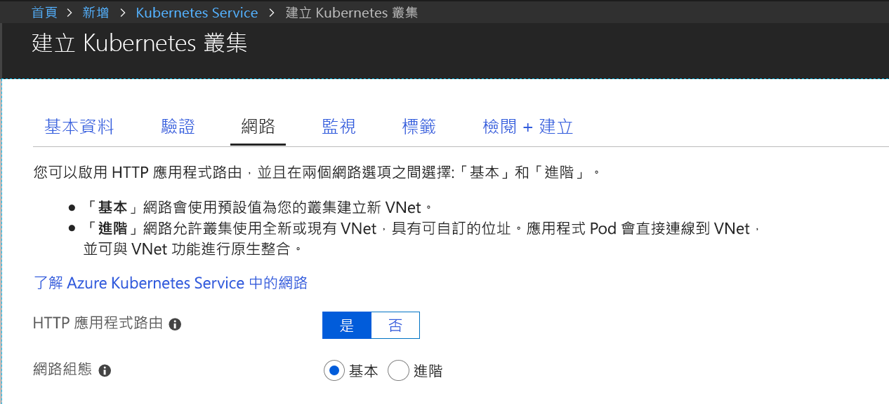
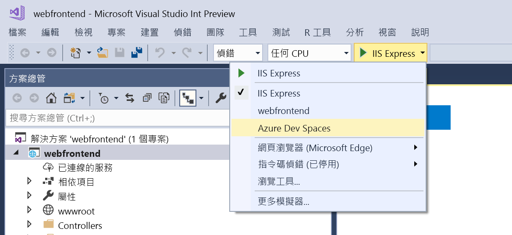
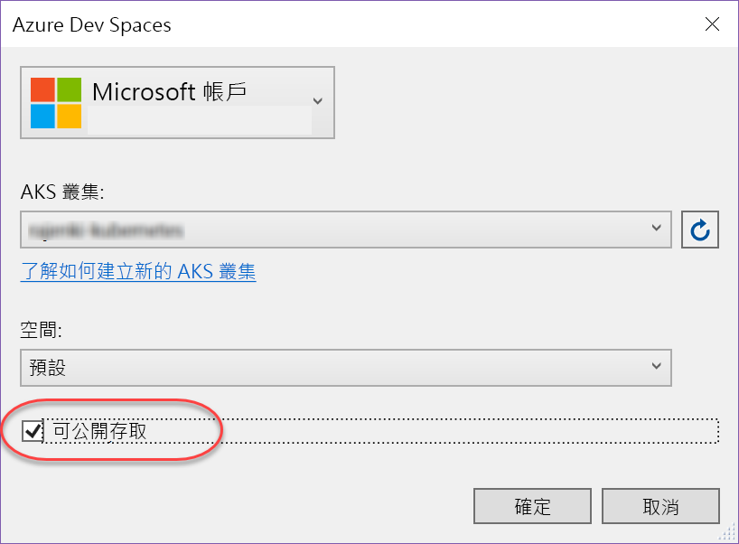

# 快速入門：使用 Azure Dev Spaces 建立 Kubernetes 開發人員空間 (.NET Core 和 Visual Studio)

在本指南中，您將了解如何：

- 使用 Azure 中受管理的 Kubernetes 叢集，設定 Azure Dev Spaces。
- 使用 Visual Studio 在容器中反覆開發程式碼。
- 對您的叢集中執行的程式碼進行偵錯。

> [!Note]
> **如果作業出現停滯的情況**，請參閱[疑難排解](troubleshooting.md)一節，或在此頁面上張貼留言。 您也可以嘗試進行更詳細的[教學課程](get-started-netcore-visualstudio.md)。

## 先決條件

- 在 EastUS、WestEurope 或 CanadaEast 區域中執行 Kubernetes 1.9.6、並且已啟用 HTTP 應用程式路由的 Kubernetes 叢集。

  

- 已安裝網頁程式開發工作負載的 Visual Studio 2017。 如果您尚未安裝，請在[這裡](https://aka.ms/vsdownload?utm_source=mscom&utm_campaign=msdocs)下載。

## 設定 Azure Dev Spaces

安裝[適用於 Kubernetes 的 Visual Studio Tools](https://aka.ms/get-azds-visualstudio)。

## 連接到叢集

接下來，您將建立和設定 Azure Dev Spaces 的專案。

### 建立 ASP.NET Web 應用程式

在 Visual Studio 2017 中，建立新的專案。 目前，此專案必須是 **ASP.NET Core Web 應用程式**。 將專案命名為 **webfrontend**。

選取 [Web 應用程式 (Model-View-Controller)] 範本，並確定您的目標是 **.NET Core** 和 **ASP.NET Core 2.0**。

### 針對 AKS 叢集啟用 Dev Spaces

使用您剛建立的專案，然後從啟動設定下拉式清單中選取 [Azure Dev Spaces]，如下所示。

在接下來顯示的對話方塊中，請確定您以適當的帳戶登入，然後選取現有的叢集。

暫時讓 [空間] 下拉式清單設定為 `default`。 請核取 [可公開存取] 核取方塊，以便透過公用端點存取 Web 應用程式。

按一下 [確定] 以選取或建立叢集。

如果您選擇尚未設定要搭配 Azure Dev Spaces 使用的叢集，您會看到訊息詢問您是否要設定它。

選擇 [確定]。 

### 查看已新增至專案的檔案
等待建立開發人員空間時，查看當您在選擇使用 Azure Dev Spaces 時新增至專案的檔案。

- 已新增名為 `charts` 的資料夾，而此資料夾內已建構適用於您的應用程式的 [Helm 圖表](https://docs.helm.sh)。 這些檔案可用來將您的應用程式部署到開發人員空間中。
- `Dockerfile` 包含以標準 Docker 格式封裝應用程式所需的資訊。
- `azds.yaml` 包含開發人員空間所需的開發階段組態。

## 在 Kubernetes 中進行容器偵錯
在成功建立開發人員空間後，您即可進行應用程式偵錯。 在程式碼中設定中斷點，例如在 `Message` 變數設定所在 `HomeController.cs` 檔案中的第 20 行上。 按一下 **F5** 開始偵錯。 

Visual Studio 會與開發人員空間通訊，以建置和部署應用程式，然後以執行中的 Web 應用程式開啟瀏覽器。 容器可能看起來像在本機執行，但實際是在 Azure 的開發人員空間中執行。 localhost 位址的原因是因為 Azure 開發人員空間會對在 AKS 中執行的容器建立暫存 SSH 通道。

按一下頁面頂端的 [關於] 連結，以觸發中斷點。 就如同已在本機執行程式碼一樣，您擁有偵錯資訊的完整存取權，例如呼叫堆疊、區域變數、例外狀況資訊等等。

## 反覆開發程式碼

Azure 開發人員空間不只讓程式碼中在 Kubernetes 中執行 - 還可讓您快速地反覆查看您的程式碼變更是否在雲端 Kubernetes 環境中生效。

### 更新內容檔案
1. 找出檔案 `./Views/Home/Index.cshtml` 並進行 HTML 編輯。 例如，將第 70 行 `<h2>Application uses</h2>` 變更如下：`<h2>Hello k8s in Azure!</h2>`
1. 儲存檔案。
1. 移至您的瀏覽器並重新整理頁面。 您應該會看到網頁顯示更新後的 HTML。

發生什麼情形？ 編輯內容檔案 (例如 HTML 和 CSS) 時，不需要在 .NET Core Web 應用程式中重新編譯，所以作用中 F5 工作階段會自動將任何修改過的內容檔案，直接同步處理到 AKS 中的執行中容器，您即可立即查看內容編輯。

### 更新程式碼檔案
更新程式碼檔案需要更多的工作，因為.NET Core 應用程式需要重建及產生更新後的應用程式二進位檔。

1. 在 Visual Studio 中停止偵錯工具。
1. 開啟名為 `Controllers/HomeController.cs` 的程式碼檔案，然後編輯 [關於] 頁面將顯示的訊息：`ViewData["Message"] = "Your application description page.";`
1. 儲存檔案。
1. 按 **F5** 再次開始偵錯。 

Azure 開發人員空間會以累加方式重新編譯現有容器中的程式碼，以提供更快的編輯/偵錯迴圈，而不是在每次進行程式碼編輯時重新建置及重新部署新的容器映像 (這通常要花費相當長的時間)。

請在瀏覽器中重新整理 Web 應用程式，並移至 [關於] 頁面。 您應會看到自訂訊息出現在 UI 中。

## 後續步驟

> [!div class="nextstepaction"]
> [使用多個容器和小組開發](get-started-netcore-visualstudio.md#call-another-container)