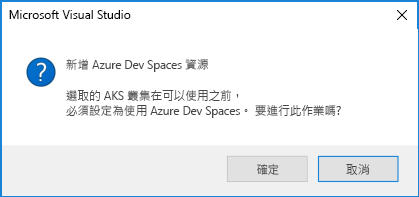

# 快速入門：使用 Azure Dev Spaces 建立 Kubernetes 開發環境 (.NET Core 和 Visual Studio)

在本指南中，您將了解如何：

- 在 Azure 中建立最適合用於開發的以 Kubernetes 為基礎的環境。
- 使用 Visual Studio 在容器中反覆開發程式碼。

[!INCLUDE]

[!INCLUDE]

## 取得 Visual Studio 工具 
1. 安裝最新版的 [Visual Studio 2017](https://www.visualstudio.com/vs/)
1. 在 Visual Studio 安裝程式中，確定已選取以下的工作負載：
    * ASP.NET 和 Web 開發
1. 安裝[適用於 Azure Dev Spaces 的 Visual Studio 擴充](https://aka.ms/get-azds-visualstudio)。

您現在可以使用 Visual Studio 建立 ASP.NET Web 應用程式。

## 建立 ASP.NET Web 應用程式

在 Visual Studio 2017 中，建立新的專案。 目前，此專案必須是 **ASP.NET Core Web 應用程式**。 將專案命名為 '**webfrontend**'。

選取 [Web 應用程式 (Model-View-Controller)] 範本，並確定您的目標是對話方塊頂端的兩個下拉式清單中的 **.NET Core** 和 **ASP.NET Core 2.0**。 按一下 [確定]  以建立專案。

## 在 Azure 中建立開發環境

使用 Azure Dev Spaces，您可以建立以 Kubernetes 為基礎開發環境，該開發環境完全受 Azure 控管並已針對開發最佳化。 開啟您剛建立的專案，然後從啟動設定下拉式清單中選取 [Azure Dev Spaces]，如下所示。

在接下來顯示的對話方塊中，請確定您以適當的帳戶登入，然後選取現有的叢集。

現在讓 [空間] 下拉式清單預設為 `default`。 稍後，您將深入了解這個選項。 請核取 [可公開存取] 核取方塊，以便透過公用端點存取 Web 應用程式。 這不是必要的設定，但是對於稍後在本逐步解說中示範一些概念很有幫助。 請別擔心，在任一情況下，您都能夠使用 Visual Studio 進行您的網站偵錯。

按一下 [確定] 以選取或建立叢集。

如果您選擇尚未設定要搭配 Azure Dev Spaces 使用的叢集，您會看到訊息詢問您是否要設定它。

選擇 [確定]。 

將啟動背景工作，以完成這項作業。 這需要幾分鐘才能完成。 若要查看它是否仍在建立中，請將指標停留在狀態列左下角的 [背景工作] 圖示上，如下圖所示。

> [!Note]
在成功建立開發環境前，您無法進行應用程式偵錯。

## 查看已新增至專案的檔案
等待建立開發環境時，查看當您選擇使用開發環境時新增至專案的檔案。

首先，您可以看到已新增名為 `charts` 的資料夾，而此資料夾內已建構適用於您的應用程式的 [Helm 圖表](https://docs.helm.sh)。 這些檔案用於將您的應用程式部署到開發環境中。

您會看到已新增名為 `Dockerfile` 的檔案。 此檔案包含以標準 Docker 格式封裝應用程式所需的資訊。 此外，也會建立 `HeaderPropagation.cs` 檔案，我們稍後會在本逐步解說中討論這個檔案。 

最後，您會看到名為 `azds.yaml` 的檔案，其中包含開發環境所需的組態資訊，例如應用程式是否可透過公用端點存取。

## 在 Kubernetes 中進行容器偵錯
在成功建立開發環境後，您即可進行應用程式偵錯。 在程式碼中設定中斷點，例如在 `Message` 變數設定所在 `HomeController.cs` 檔案中的第 20 行上。 按一下 **F5** 開始偵錯。 

Visual Studio 會與開發環境通訊，以建置和部署應用程式，然後以執行中的 Web 應用程式開啟瀏覽器。 容器可能看起來像在本機執行，但實際是在 Azure 的開發環境中執行。 localhost 位址的原因是因為 Azure Dev Spaces 會對在 Azure 中執行的容器建立暫存 SSH 通道。

按一下頁面頂端的 [關於] 連結，以觸發中斷點。 就如同已在本機執行程式碼一樣，您擁有偵錯資訊的完整存取權，例如呼叫堆疊、區域變數、例外狀況資訊等等。

## 後續步驟

> [!div class="nextstepaction"]
> [使用多個容器和小組開發](get-started-netcore-visualstudio.md#call-another-container)