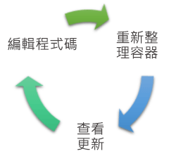
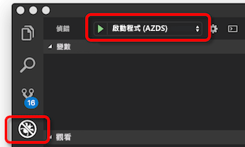

# <a name="quickstart-create-a-kubernetes-dev-space-with-azure-dev-spaces-nodejs"></a>快速入門：使用 Azure Dev Spaces 建立 Kubernetes 開發人員空間 (Node.js)

在本指南中，您將了解如何：

- 使用 Azure 中受管理的 Kubernetes 叢集，設定 Azure Dev Spaces。
- 使用 VS Code 和命令列在容器中反覆開發程式碼。
- 對您的叢集中執行的程式碼進行偵錯。

> [!Note]
> **如果作業出現停滯的情況**，請參閱[疑難排解](troubleshooting.md)一節，或在此頁面上張貼留言。 您也可以嘗試進行更詳細的[教學課程](get-started-nodejs.md)。

## <a name="prerequisites"></a>先決條件

- Azure 訂用帳戶。 如果您沒有 Azure 訂用帳戶，您可以建立[免費帳戶](https://azure.microsoft.com/free)。
- 在 EastUS、WestEurope 或 CanadaEast 區域中執行 Kubernetes 1.9.6、並且已啟用 **HTTP 應用程式路由**的 [Kubernetes 叢集](https://ms.portal.azure.com/#create/microsoft.aks)。

  

- Visual Studio Code，您可以從[這裡](https://code.visualstudio.com/download)下載。

## <a name="set-up-azure-dev-spaces"></a>設定 Azure Dev Spaces

1. 安裝 [Azure CLI](/cli/azure/install-azure-cli?view=azure-cli-latest) (2.0.38 版或更新版本)。
1. 在您的 AKS 叢集上設定 Dev Spaces：`az aks use-dev-spaces -g MyResourceGroup -n MyAKS`
1. 下載 VS Code 的 [Azure Dev Spaces 擴充功能](https://aka.ms/get-azds-code)。
1. 安裝擴充功能：`code --install-extension path-to-downloaded-extension/azds-0.1.1.vsix`

## <a name="build-and-run-code-in-kubernetes"></a>在 Kubernetes 中建置及執行程式碼

1. 從 GitHub 下載範例程式碼：[https://github.com/Azure/dev-spaces](https://github.com/Azure/dev-spaces) 
1. 將目錄切換至 webfrontend 資料夾：`cd dev-spaces/samples/nodejs/getting-started/webfrontend`
1. 產生 Docker 和 Helm 圖表資產：`azds prep --public`
1. 在 AKS 中建置和執行程式碼。 在終端機視窗中，從 **webfrontend 資料夾**執行此命令：`azds up`
1. 掃描主控台輸出，以取得 `up` 命令所建立之 URL 的相關資訊。 它會在表單中： 

   `Service 'webfrontend' port 'http' is available at <url>` 

   在瀏覽器視窗中開啟此 URL，您應該會看到 Web 應用程式載入。 當容器執行時，`stdout` 和 `stderr` 輸出會串流至終端機視窗。
   
   > [!Note]
   > 第一次執行時，可能需要數分鐘的時間才能備妥公用 DNS。 如果無法解析公用 URL，您可以使用主控台輸出中顯示的替代 http://localhost:<portnumber> URL。 如果您使用 localhost URL，容器可能看起來像在本機執行，但實際是在 AKS 中執行。 為了方便您操作以及與本機電腦上的服務互動，Azure 開發人員空間會建立暫存的 SSH 通道，連到在 Azure 中執行的容器。 當 DNS 記錄備妥時，您可以返回且稍後嘗試公用 URL。

### <a name="update-a-content-file"></a>更新內容檔案
Azure 開發人員空間不只讓程式碼中在 Kubernetes 中執行 - 還可讓您快速地反覆查看您的程式碼變更是否在雲端 Kubernetes 環境中生效。

1. 找出檔案 `./public/index.html` 並進行 HTML 編輯。 例如，將網頁的背景色彩變更為藍色陰影：

    ```html
    <body style="background-color: #95B9C7; margin-left:10px; margin-right:10px;">
    ```

1. 儲存檔案。 稍後，您會在終端機視窗中看到一則訊息，指出執行中容器中的檔案已更新。
1. 移至您的瀏覽器並重新整理頁面。 您應會看到您的色彩更新。

發生什麼情形？ 編輯內容檔案 (例如 HTML 和 CSS) 時，不需要重新啟動 Node.js 程序，所以作用中 `azds up` 命令會自動將任何修改過的內容檔案，直接同步處理到 Azure 中的執行中容器，進而提供查看內容編輯的快速方法。

### <a name="test-from-a-mobile-device"></a>從行動裝置測試
在行動裝置上，使用 webfrontend 的公用 URL 開啟 Web 應用程式。 您可能想要從您的桌面複製 URL 並將它傳送到您的裝置，讓您免於輸入冗長的位址。 您在行動裝置中載入 Web 應用程式時，您會發現 UI 無法正確顯示在小型裝置上。

為了修正此問題，您會新增 `viewport` 中繼標記：
1. 開啟 `./public/index.html` 檔案
1. 在現有的 `head` 元素中，新增 `viewport` 中繼標記：

    ```html
    <head>
        <!-- Add this line -->
        <meta name="viewport" content="width=device-width, initial-scale=1">
    </head>
    ```

1. 儲存檔案。
1. 重新整理您裝置的瀏覽器。 您現在應會看到正確呈現的 Web 應用程式。 

這是一個範例：您在打算使用應用程式的裝置上進行測試前，為何就是找不到某些問題。 使用 Azure 開發人員空間，您可以快速地逐一查看您的程式碼，並且在目標裝置上驗證任何變更。

### <a name="update-a-code-file"></a>更新程式碼檔案
更新伺服器端程式碼檔案時，需要執行更一點的工作，因為必須重新啟動 Node.js 應用程式。

1. 在終端機視窗中，按 `Ctrl+C` (以停止 `azds up`)。
1. 開啟名為 `server.js` 的程式碼檔案，然後編輯服務的 hello 訊息： 

    ```javascript
    res.send('Hello from webfrontend running in Azure!');
    ```

3. 儲存檔案。
1. 在終端機視窗中執行 `azds up`。 

這會重建容器映像，並重新部署 Helm 圖表。 重新載入瀏覽器頁面，以查看您的程式碼變更是否生效。

但是還有「更加快速的方法」可開發程式碼，您將在下一節中加以探索。 

## <a name="debug-a-container-in-kubernetes"></a>在 Kubernetes 中進行容器偵錯

在本節中，您將使用 VS Code 直接對我們在 Azure 中執行的容器進行偵錯。 您也將了解如何取得更快速的編輯-執行-測試迴圈。



### <a name="initialize-debug-assets-with-the-vs-code-extension"></a>使用 VS Code 擴充功能初始化偵錯資產
首先您必須設定您的程式碼專案，讓 VS Code 與我們在 Azure 中的開發人員空間通訊。 適用於 Azure Dev Spaces 的 VS Code 擴充功能提供協助程式命令，可以設定偵錯組態。 

開啟 [命令選擇區] (使用 [檢視 | 命令選擇區] 功能表)，然後使用自動完成功能以輸入及選取以下命令：`Azure Dev Spaces: Prepare configuration files for Azure Dev Spaces`。

這樣會為 `.vscode` 資料夾底下的 Azure Dev Spaces 新增偵錯組態。


### <a name="select-the-azds-debug-configuration"></a>選取 AZDS 偵錯組態
1. 若要開啟 [偵錯] 檢視，請按一下 VS Code 側邊的 [活動列] 中的 [偵錯] 圖示。
1. 選取 [啟動程式 (AZDS)] 作為作用中偵錯組態。



> [!Note]
> 如果您未在 [命令選擇區] 中看到任何 Azure Dev Spaces 命令，請確定您已安裝適用於 Azure Dev Spaces 的 VS Code 擴充功能。

### <a name="debug-the-container-in-kubernetes"></a>在 Kubernetes 中進行容器偵錯
按 **F5** 可在 Kubernetes 中進行程式碼偵錯！

類似於 `up` 命令，程式碼會在您開始偵錯時同步處理到開發人員空間，而且容器會建置並部署到 Kubernetes。 此時，偵錯工具會連結至遠端容器。

> [!Tip]
> VS Code 狀態列會顯示可點按的 URL。

在伺服器端程式碼檔案中設定中斷點，例如在 `server.js` 中的 `app.get('/api'...` 內。 重新整理瀏覽器頁面，或按 [再說一次] 按鈕，而且您應叫用中斷點，才能逐步執行程式碼。

就如同已在本機執行程式碼一樣，您擁有偵錯資訊的完整存取權，例如呼叫堆疊、區域變數、例外狀況資訊等等。

### <a name="edit-code-and-refresh-the-debug-session"></a>編輯程式碼並重新整理偵錯工作階段
當偵錯工具作用中時，進行程式碼編輯；例如，再次修改 hello 訊息：

```javascript
app.get('/api', function (req, res) {
    res.send('**** Hello from webfrontend running in Azure! ****');
});
```

儲存檔案，然後在 [偵錯動作] 窗格中，按一下 [重新整理] 按鈕。 


Azure 開發人員空間會在偵錯工作階段之間重新啟動 Node.js 程序，以提供更快的編輯/偵錯迴圈，而不是在每次進行程式碼編輯時重新建置及重新部署新的容器映像 (這通常要花費相當長的時間)。

在瀏覽器中重新整理 Web 應用程式，或按 [再說一次] 按鈕。 您應會看到自訂訊息出現在 UI 中。

### <a name="use-nodemon-to-develop-even-faster"></a>使用 NodeMon 更快速地開發

此範例 `webfrontend` 專案已設定為使用 [nodemon](https://nodemon.io/)，這是一項廣受使用、並且與 Azure Dev Spaces 完全相容的工具，可加快 Node.js 開發速度。

請嘗試下列步驟：
1. 停止 VS Code 偵錯工具。
1. 按一下 VS Code 側邊的 [活動列] 中的 [偵錯] 圖示。 
1. 選取 [連結 (AZDS)] 作為作用中偵錯組態。
1. 按 F5。

在此組態中，容器已設定為要啟動 nodemon。 進行伺服器程式碼編輯時，nodemon 會自動重新啟動 Node 程序，就如同您在本機開發時一樣。 
1. 在 `server.js` 中再次編輯 hello 訊息，然後儲存檔案。
1. 重新整理瀏覽器，或按一下 [再說一次] 按鈕，以查看您的變更是否生效！

**您現在有辦法在 Kubernetes 中快速逐一查看程式碼及直接進行偵錯！**

## <a name="next-steps"></a>後續步驟

> [!div class="nextstepaction"]
> [使用多個容器和小組開發](get-started-nodejs.md#call-a-service-running-in-a-separate-container)