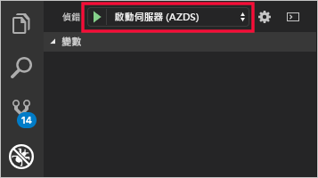

# <a name="quickstart-create-a-kubernetes-development-environment-with-azure-dev-spaces-nodejs"></a>快速入門：使用 Azure Dev Spaces 建立 Kubernetes 開發環境 (Node.js)


[!INCLUDE[](includes/learning-objectives.md)]

[!INCLUDE[](includes/see-troubleshooting.md)]

您現在可以在 Azure 中建立以 Kubernetes 為基礎的開發環境。

[!INCLUDE[](includes/portal-aks-cluster.md)]

## <a name="install-the-azure-cli"></a>安裝 Azure CLI
Azure Dev Spaces 需要最少的本機電腦設定。 大部分開發環境的組態都會儲存在雲端，而且可與其他使用者共用。 從下載和執行 [Azure CLI](/cli/azure/install-azure-cli?view=azure-cli-latest) 著手。 

> [!IMPORTANT]
> 如果您已經安裝 Azure CLI，請確定使用 2.0.32 版或更高版本。

[!INCLUDE[](includes/sign-into-azure.md)]

[!INCLUDE[](includes/use-dev-spaces.md)]

[!INCLUDE[](includes/install-vscode-extension.md)]

在您等候建立環境時，您可以開始撰寫程式碼。

## <a name="create-a-nodejs-container-in-kubernetes"></a>在 Kubernetes 中建立 Node.js 容器

在這一節中，您會建立 Node.js Web 應用程式，並使其在 Kubernetes 的容器中執行。

### <a name="create-a-nodejs-web-app"></a>建立 Node.js Web 應用程式
瀏覽至 https://github.com/Azure/dev-spaces 以從 GitHub 下載程式碼，然後選取 [複製或下載]，將 GitHub 存放庫下載到您的本機環境。 本指南的程式碼位於 `samples/nodejs/getting-started/webfrontend`。

[!INCLUDE[](includes/azds-prep.md)]

[!INCLUDE[](includes/build-run-k8s-cli.md)]

### <a name="update-a-content-file"></a>更新內容檔案
Azure Dev Spaces 不只讓程式碼中在 Kubernetes 中執行 - 還可讓您快速地反覆查看您的程式碼變更是否在雲端 Kubernetes 環境中生效。

1. 找出檔案 `./public/index.html` 並進行 HTML 編輯。 例如，將網頁的背景色彩變更為藍色陰影：

    ```html
    <body style="background-color: #95B9C7; margin-left:10px; margin-right:10px;">
    ```

2. 儲存檔案。 稍後，您會在終端機視窗中看到一則訊息，指出執行中容器中的檔案已更新。
1. 移至您的瀏覽器並重新整理網頁。 您應會看到您的色彩更新。

發生什麼情形？ 編輯內容檔案 (例如 HTML 和 CSS) 時，不需要重新啟動 Node.js 程序，所以作用中 `azds up` 命令會自動將任何修改過的內容檔案，直接同步處理到 Azure 中的執行中容器，進而提供查看內容編輯的快速方法。

### <a name="test-from-a-mobile-device"></a>從行動裝置測試
如果您在行動裝置上開啟 Web 應用程式，您會發現 UI 無法正確顯示在小型裝置上。

為了修正此問題，您會新增 `viewport` 中繼標記：
1. 開啟 `./public/index.html` 檔案
1. 在現有的 `head` 元素中，新增 `viewport` 中繼標記：

    ```html
    <head>
        <!-- Add this line -->
        <meta name="viewport" content="width=device-width, initial-scale=1">
    </head>
    ```

1. 儲存檔案。
1. 重新整理您裝置的瀏覽器。 您現在應會看到正確呈現的 Web 應用程式。 

這是一個範例：您在打算使用應用程式的裝置上進行測試前，為何就是找不到有些問題。 使用 VS Azure Dev Spaces，您可以快速地逐一查看您的程式碼，並且在目標裝置上驗證任何變更。

### <a name="update-a-code-file"></a>更新程式碼檔案
更新伺服器端程式碼檔案時，需要執行更一點的工作，因為必須重新啟動 Node.js 應用程式。

1. 在終端機視窗中，按 `Ctrl+C` (停止 `azds up`)。
1. 開啟名為 `server.js` 的程式碼檔案，然後編輯服務的 hello 訊息： 

    ```javascript
    res.send('Hello from webfrontend running in Azure!');
    ```

3. 儲存檔案。
1. 在終端機視窗中執行 `azds up`。 

這會重建容器映像，並重新部署 Helm 圖表。 重新載入瀏覽器頁面，以查看您的程式碼變更是否生效。

但是有「更加快速的方法」可開發程式碼，您將在下一節中加以探索。 

## <a name="debug-a-container-in-kubernetes"></a>在 Kubernetes 中進行容器偵錯

[!INCLUDE[](includes/debug-intro.md)]

[!INCLUDE[](includes/init-debug-assets-vscode.md)]

### <a name="select-the-azds-debug-configuration"></a>選取 AZDS 偵錯組態
1. 若要開啟 [偵錯] 檢視，請按一下 VS Code 側邊的 [活動列] 中的 [偵錯] 圖示。
1. 選取 [啟動程式 (AZDS)] 作為作用中偵錯組態。



> [!Note]
> 如果您未在 [命令選擇區] 中看到任何 Azure Dev Spaces 命令，請確定您已安裝適用於 Azure Dev Spaces 的 VS Code 擴充功能。

### <a name="debug-the-container-in-kubernetes"></a>在 Kubernetes 中進行容器偵錯
按 **F5** 可在 Kubernetes 中進行程式碼偵錯！

類似於 `up` 命令，程式碼會在您開始偵錯時同步處理到開發環境，而且容器會建置並部署到 Kubernetes。 此時，偵錯工具會連結至遠端容器。

[!INCLUDE[](includes/tip-vscode-status-bar-url.md)]

在伺服器端程式碼檔案中設定中斷點，例如在 `server.js` 中的 `app.get('/api'...` 內。 重新整理瀏覽器頁面，或按 [再說一次] 按鈕，而且您應叫用中斷點，才能逐步執行程式碼。

就如同已在本機執行程式碼一樣，您擁有偵錯資訊的完整存取權，例如呼叫堆疊、區域變數、例外狀況資訊等等。

### <a name="edit-code-and-refresh-the-debug-session"></a>編輯程式碼並重新整理偵錯工作階段
當偵錯工具作用中時，進行程式碼編輯；例如，再次修改 hello 訊息：

```javascript
app.get('/api', function (req, res) {
    res.send('**** Hello from webfrontend running in Azure! ****');
});
```

儲存檔案，然後在 [偵錯動作] 窗格中，按一下 [重新整理] 按鈕。 


Azure Dev Spaces 會在偵錯工作階段之間重新啟動 Node.js 程序，以提供更快的編輯/偵錯迴圈，而不是在每次進行程式碼編輯時重新建置及重新部署新的容器映像 (這通常要花費相當長的時間)。

在瀏覽器中重新整理 Web 應用程式，或按 [再說一次] 按鈕。 您應會看到自訂訊息出現在 UI 中。

### <a name="use-nodemon-to-develop-even-faster"></a>使用 NodeMon 更快速地開發
Nodemon 是 Node.js 開發人員用來快速開發的工具。 開發人員通常會將其 Node 專案設定為讓 nodemon 監視檔案變更並自動重新啟動伺服器程序，而不是在每次進行伺服器端程式碼編輯時，以手動方式重新啟動 Node 程序。 以此方式運作，開發人員只會在進行程式碼編輯之後重新整理其瀏覽器。

透過 Azure Dev Spaces，您可以在本機開發時使用許多相同的開發工作流程。 為了說明這點，已將範例 `webfrontend` 專案設定為使用 nodemon (它已在 `package.json` 中設定為開發相依性)。

請嘗試下列步驟：
1. 停止 VS Code 偵錯工具。
1. 按一下 VS Code 側邊的 [活動列] 中的 [偵錯] 圖示。 
1. 選取 [連結 (AZDS)] 作為作用中偵錯組態。
1. 按 F5。

在此組態中，容器已設定為要啟動 nodemon。 進行伺服器程式碼編輯時，nodemon 會自動重新啟動 Node 程序，就如同您在本機開發時一樣。 
1. 在 `server.js` 中再次編輯 hello 訊息，然後儲存檔案。
1. 重新整理瀏覽器，或按一下 [再說一次] 按鈕，以查看您的變更是否生效！

**您現在有辦法在 Kubernetes 中快速逐一查看程式碼及直接進行偵錯！**

## <a name="next-steps"></a>後續步驟

> [!div class="nextstepaction"]
> [使用多個容器和小組開發](get-started-nodejs.md#call-a-service-running-in-a-separate-container)