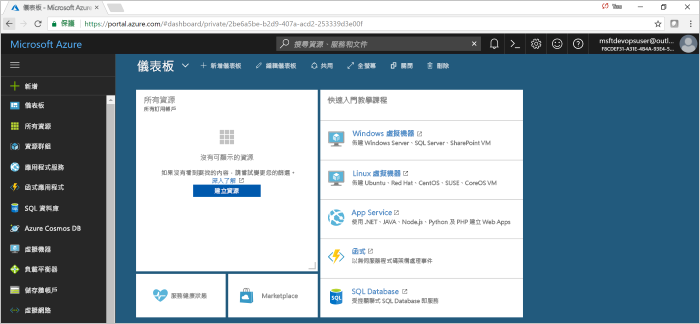
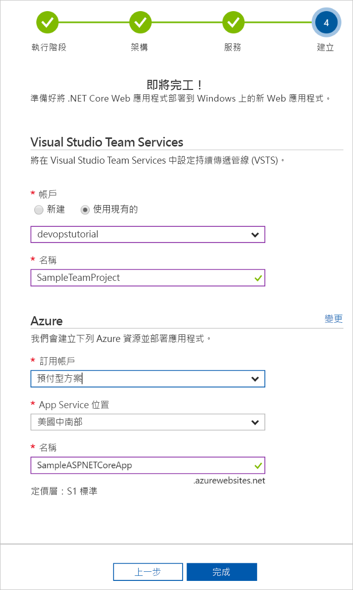
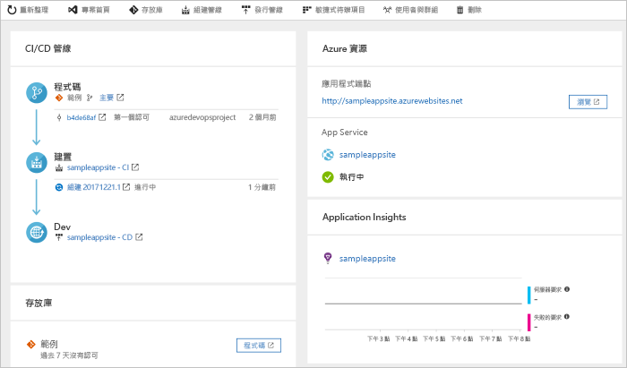

# 使用 Azure DevOps Project 建立適用於 Ruby on Rails 的 CI/CD 管線

使用 **Azure DevOps Project**為您的 Ruby on Rails 應用程式設定持續整合 (CI) 與持續傳遞 (CD)。  Azure DevOps 專案可簡化初始設定 VSTS 組建與發行管線。

如果您沒有 Azure 訂用帳戶，可以透過 [Visual Studio Dev Essentials](https://visualstudio.microsoft.com/dev-essentials/) 取得一個免費的訂用帳戶。

## 登入 Azure 入口網站

Azure DevOps Project 會在 VSTS 中建立 CI/CD 管線。  您可以建立**新的 VSTS** 帳戶，或使用**現有的帳戶**。  Azure DevOps Project 也會在您選擇的 **Azure 訂用帳戶**中建立 **Azure 資源**。

1. 登入 [Microsoft Azure 入口網站](https://portal.azure.com)。

1. 在左側導覽列中選擇 [建立資源] 圖示，然後搜尋 [DevOps 專案]。  選擇 [建立] 。

    

## 選取應用程式範例和 Azure 服務

1. 選取 **Ruby** 範例應用程式。

1. 選取 [Ruby on Rails] 應用程式架構。  完成時，選擇 [下一步]。

1. **Linux 上的 Web 應用程式**是預設的部署目標。  您可以選擇性地選擇用於容器的 Web App。  您在上一個步驟中選擇的應用程式架構，會指出這裡可用的 Azure 服務部署目標類型。  選取您選擇的 [目標服務]。  完成時，選擇 [下一步]。

## 設定 VSTS 和 Azure 訂用帳戶 

1. 免費建立**新的** VSTS 帳戶，或選擇**現有的**帳戶。  為 VSTS 專案選擇 [名稱]。  選取您應用程式的 [Azure 訂用帳戶]、[位置]，然後選擇 [名稱]。  完成時，選擇 [完成]。

    

1. 在幾分鐘內，系統會在 Azure 入口網站中載入 [專案儀表板]。  系統會在您 VSTS 帳戶中的存放庫中設定範例應用程式、執行組建，然後將您的應用程式部署至 Azure。  此儀表板可顯示您的**程式碼存放庫**、**VSTS CI/CD 管線**，和您**在 Azure 中的應用程式**。  若要檢視執行中的應用程式，請在儀表板右側選取 [瀏覽]。

     

## 認可程式碼變更並執行 CI/CD

Azure DevOps 專案已在您的 VSTS 或 GitHub 帳戶中建立 Git 存放庫。  請遵循下列步驟來檢視存放庫，並變更您應用程式的程式碼。

1. 在 DevOps 專案儀表板的左側，選取您 [主要] 分支的連結。  此連結會開啟新建立 Git 存放庫的檢視。

1. 若要檢視存放庫複製 URL，請從瀏覽器右上方選取 [複製]。 您可以在最愛的 IDE 中複製 Git 存放庫。  在接下來的幾個步驟中，您可以使用網頁瀏覽器，直接進行和認可主要分支的程式碼變更。

1. 在瀏覽器的左側，巡覽至 **app/views/pages/home.html.erb** 檔案。

1. 選取 [編輯]，來進行部分文字的變更。  例如，修改其中一個 div 標籤內的文字。

1. 選擇 [認可]，然後儲存您的變更。

1. 在瀏覽器中，巡覽至 [Azure DevOps 專案儀表板]。  您現在應該會看到正在進行中的組建。  您剛才所做的變更會透過 VSTS CI/CD 管線自動建置及部署。

## 檢查 VSTS CI/CD 管線

Azure DevOps 專案會在您的 VSTS 帳戶中自動設定完整的 VSTS CI/CD 管線。  瀏覽管線，並視需要進行自訂。  請遵循下列步驟來熟悉 VSTS 組建和發行定義。

1. 從 Azure DevOps 專案儀表板**頂端**選取 [建置管線]。  此連結會開啟瀏覽器索引標籤，並開啟新專案的 VSTS 組建定義。

1. 選取 [省略符號]。  這個動作會開啟功能表，您可以用它來啟動數個活動，例如將新的組建排入佇列、暫停組建，以及編輯組建定義。

1. 選取 [編輯]。

1. 在這個檢視中，**檢查組建定義的各種工作**。  組建會執行各種工作，例如從 Git 存放庫擷取來源、還原相依性，以及發佈用來進行部署的輸出。

1. 在組建定義的頂端，選取**組建定義名稱**。

1. 將您組建定義的**名稱**變得更具有描述性。  選取 [儲存並排入佇列]，然後選取 [儲存]。

1. 在您的組建定義名稱下，選取 [記錄]。  您會看到組建最近變更的稽核線索。  VSTS 會追蹤對組建定義進行的任何變更，並可讓您比較版本。

1. 選取 [觸發程序]。  Azure DevOps 專案已自動建立 CI 觸發程序，且每次對存放庫的認可都會啟動新的組建。  您可以選擇性地選擇要在 CI 程序中包含還是排除分支。

1. 選取 [保留期]。  根據您的案例，您可以指定原則來保留或移除特定數目的組建。

1. 選取 [建置及發行]，然後選擇 [版本]。  Azure DevOps 專案已建立 VSTS 發行定義，來管理 Azure 的部署。

1. 在瀏覽器的左側，選取您發行定義旁的 [省略符號]，然後選擇 [編輯]。

1. 發行定義中包含 [管線]，會定義發行程序。  在 [成品] 下，選取 [置放]。  您在先前步驟中檢查的組建定義會產生用於成品的輸出。 

1. 在 [置放] 圖示右側，選取 [持續部署觸發程序]。  這個發行定義已啟用 CD 觸發程序，每次有新的組建成品可用時，它就會執行部署。  您可以選擇性地停用觸發程序，因此您的部署需要手動執行。 

1. 在瀏覽器左側，選取 [工作]。  工作是您部署程序所執行的活動。  在此範例中，會建立一個工作來部署到 **Azure App 服務**。

1. 在瀏覽器右側，選取 [檢視版本]。  此檢視會顯示版本的歷程記錄。

1. 選取您其中一個版本旁的 [省略符號]，然後選擇 [開啟]。  您可從這個檢視中瀏覽數個功能表，例如版本摘要、相關聯的工作項目及測試。

1. 選取 [認可]。  此檢視會顯示與特定部署相關聯的程式碼認可。 

1. 選取 [記錄]。  記錄包含關於部署程序的實用資訊。  您可以在部署期間和部署之後加以檢視。

## 清除資源

當您不再需要時，可以使用 Azure DevOps 專案儀表板中的 [刪除] 功能，將 Azure App 服務和在本快速入門中建立的相關資源刪除。

## 後續步驟

若要深入了解如何修改組建和發行定義以符合小組的需求，請參閱本教學課程：

> [!div class="nextstepaction"]
> [自訂 CD 程序](https://docs.microsoft.com/vsts/pipelines/release/define-multistage-release-process?view=vsts)
