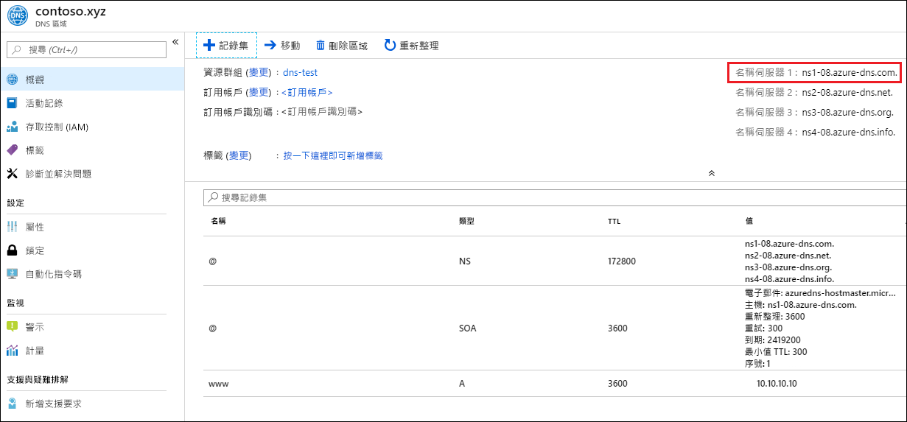

# 利用 Azure 入口網站開始使用 Azure DNS

> [!div class="op_single_selector"]
> * [Azure 入口網站](dns-getstarted-portal.md)
> * [PowerShell](dns-getstarted-powershell.md)
> * [Azure CLI 1.0](dns-getstarted-cli-nodejs.md)
> * [Azure CLI 2.0](dns-getstarted-cli.md)

本文將逐步引導您使用 Azure 入口網站建立第一個 DNS 區域和記錄。 您也可以使用 Azure PowerShell 或跨平台 Azure CLI 執行這些步驟。

DNS 區域用來裝載特定網域的 DNS 記錄。 若要開始將網域裝載到 Azure DNS 中，您必須建立該網域名稱的 DNS 區域。 接著在此 DNS 區域內，建立網域的每筆 DNS 記錄。 最後，若要將 DNS 區域發佈至網際網路，您需要設定網域的名稱伺服器。 以下說明上述各步驟。

## 建立 DNS 區域

1. 登入 Azure 入口網站
2. 在 [中樞] 功能表上，按一下 [新增] > [網路] > [DNS 區域] 以開啟 [建立 DNS 區域] 刀鋒視窗。

    

4. 在 [建立 DNS 區域]  刀鋒視窗中，提供 DNS 區域的 [名稱]。 例如 *contoso.com*。
 
    

5. 接下來，指定您想要使用的資源群組。 您可以建立新的資源群組，或選取已經存在的資源群組。 如果您選擇建立新的資源群組，請使用 [位置] 下拉式清單來指定資源群組的位置。 請注意，這項設定是指資源群組的位置，不會對 DNS 區域有任何影響。 DNS 區域一定是「全域」位置，並不會顯示出來。

6. 如果您想要輕鬆地在儀表板上找到您的新區域，您可以讓 [釘選到儀表板] 核取方塊保持選取狀態。 然後按一下 [ **建立**]。

    

7. 按一下 [建立] 之後，您會看到您的新區域已設定到儀表板上。

    

8. 建立新區域之後，新區域的刀鋒視窗就會在儀表板上開啟。

## 建立 DNS 記錄

下列範例將逐步引導您完成建立新的 'A' 記錄的程序。 關於其他記錄類型和修改現有的記錄，請參閱[使用 Azure 入口網站管理 DNS 記錄和記錄集](dns-operations-recordsets-portal.md)。 

1. 在 [DNS 區域] 刀鋒視窗頂端，選取 [+ 記錄集] 以開啟 [新增記錄集] 刀鋒視窗。

    

4. 在 [新增記錄集] 刀鋒視窗中，為您的記錄集命名。 例如，您可以將記錄集命名為 "**www**"。

    

5. 選取您想要建立的記錄類型。 在此範例中，請選取 [A]。
6. 設定 **TTL**。 預設的存留時間是一小時。
7. 新增錄的 IP 位址。
8. 選取刀鋒視窗底部的 [確定]，建立 DNS 記錄。

## 檢視記錄

在 [DNS 區域] 刀鋒視窗的下半部，您可以看到 DNS 區域的記錄。 您應該會看到預設 DNS 和 SOA 記錄 (在每個區域中建立)，還有您已建立的任何新記錄。

## 更新名稱伺服器

當您滿意 DNS 區域且已正確設定記錄之後，您必須設定網域名稱來使用 Azure DNS 名稱伺服器。 這可讓網際網路上的其他使用者找到您的 DNS 記錄。

Azure 入口網站中會提供您區域的名稱伺服器：

這些名稱伺服器應該向網域名稱註冊機構 (您購買網域名稱的來源) 設定。 您的註冊機構會提供選項來設定網域的名稱伺服器。 如需詳細資訊，請參閱[將網域委派給 Azure DNS](dns-domain-delegation.md)。

## 後續步驟

若要深入了解 Azure DNS，請參閱 [Azure DNS 概觀](dns-overview.md)。

若要深入了解在 Azure DNS 中管理 DNS 記錄，請參閱[使用 Azure 入口網站管理 DNS 記錄和記錄集](dns-operations-recordsets-portal.md)。

