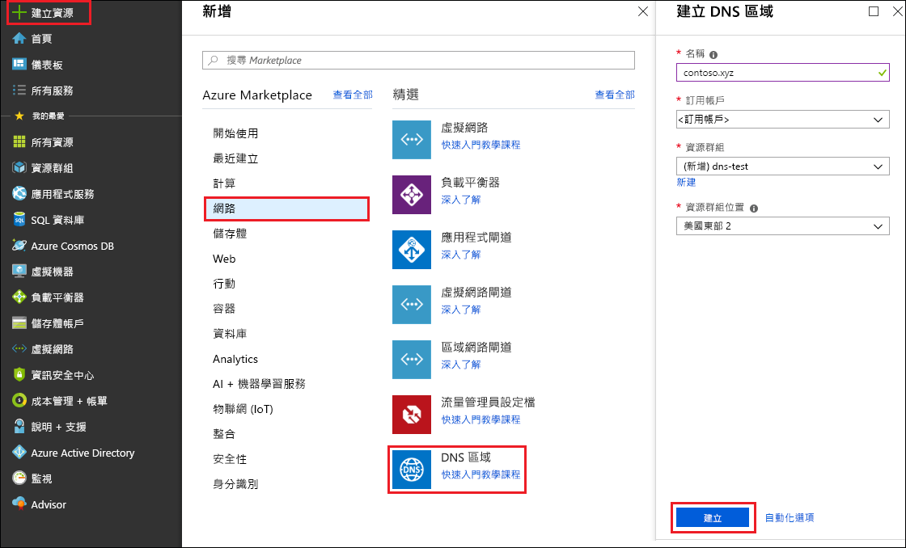

# <a name="quickstart-configure-azure-dns-for-name-resolution-using-the-azure-portal"></a>快速入門：使用 Azure 入口網站設定 Azure DNS 以進行名稱解析

 您可以設定 Azure DNS 以解析您公用網域中的主機名稱。 例如，如果您向網域名稱註冊機構購買了 contoso.com 網域名稱，您可以設定 Azure DNS 以裝載 contoso.com 網域，並將 www.contoso.com 解析為您的 Web 伺服器或 Web 應用程式的 IP 位址。

在本快速入門中，您會建立一個測試網域，然後建立名為 'www'、而要解析為 IP 位址 10.10.10.10 的位址記錄。

請務必了解本快速入門中使用的所有名稱和 IP 位址都只是範例，而不代表實際案例。 不過，在適當情況下也會說明實際案例。

<!---
You can also perform these steps using [Azure PowerShell](dns-getstarted-powershell.md) or the cross-platform [Azure CLI](dns-getstarted-cli.md).
--->

DNS 區域用來包含特定網域的 DNS 項目。 若要開始將網域裝載到 Azure DNS 中，您必須建立該網域名稱的 DNS 區域。 網域的每個 DNS 項目 (或記錄) 隨後會建立在此 DNS 區域內。 下列步驟說明如何執行這項操作。

如果您沒有 Azure 訂用帳戶，請在開始前建立 [免費帳戶](https://azure.microsoft.com/free/?WT.mc_id=A261C142F) 。

## <a name="create-a-dns-zone"></a>建立 DNS 區域

1. 登入 Azure 入口網站。
2. 在左上方按一下 [+ 建立資源] 和 [網路]，然後按一下 [DNS 區域] 以開啟 [建立 DNS 區域] 頁面。

    

4. 在 [建立 DNS 區域] 頁面中輸入下列的值，然後按一下 [建立]：


   | **設定** | **值** | **詳細資料** |
   |---|---|---|
   |**名稱**|contoso.xyz|此範例中的 DNS 區域名稱。 在本快速入門中您可以使用任何值，只要尚未設定在 Azure DNS 伺服器中即可。 實際值將是您向網域名稱註冊機構購買的網域。|
   |**訂用帳戶**|[您的訂用帳戶]|選取要建立 DNS 區域的訂用帳戶。|
   |**資源群組**|**建立新的：** dns-test|建立資源群組。 資源群組名稱在您選取的訂用帳戶中必須是唯一的。 |
   |**位置**|美國東部||

建立區域可能需要幾分鐘的時間。

## <a name="create-a-dns-record"></a>建立 DNS 記錄

現在，請建立新的位址記錄 ('A' 記錄)。 'A' 記錄可用來將主機名稱解析為 IPv4 位址。

1. 在 Azure 入口網站的 [我的最愛] 窗格中，按一下 [所有資源]。 在 [所有資源] 頁面中，按一下 **contoso.xyz** DNS 區域。 如果您選取的訂用帳戶已有幾個資源，您可以在 [依名稱篩選...] 方塊中輸入 **contoso.xyz**， 輕鬆地存取 DNS 區域。

1. 在 [DNS 區域] 頁面頂端，選取 [+ 記錄集] 以開啟 [新增記錄集] 刀鋒視窗。

1. 在 [新增記錄集] 頁面上，輸入下列值，然後按一下 [確定]。 在此範例中，您會建立 'A' 記錄。

   |**設定** | **值** | **詳細資料** |
   |---|---|---|
   |**名稱**|www|記錄的名稱。 這是要解析為 IP 位址的主機所要使用的名稱。|
   |**類型**|具有使用 | 要建立的 DNS 記錄類型。 'A' 記錄是最常見的類型，但還有其他適用於郵件伺服器 (MX)、IPv6 位址 (AAAA) 等項目的記錄類型。 |
   |**TTL**|1|DNS 要求的存留時間。 指定 DNS 伺服器和用戶端可快取回應的時間長度。|
   |**TTL 單位**|hours|TTL 值的時間測量。|
   |**IP 位址**|10.10.10.10| 此值是從 'A' 記錄解析出來的 IP 位址。 這只是本快速入門中的測試值。 如需實際值的範例，您可以輸入您 Web 伺服器的公用 IP 位址。|


在本快速入門中您實際上並未購買真正的網域名稱，因此不需要以網域名稱註冊機構將 Azure DNS 設定為名稱伺服器。 但在實際案例中，您會想要讓網際網路上的某些人能夠解析您的主機名稱，以連線至您的 Web 伺服器或應用程式。 如需實際案例的詳細資訊，請參閱[將網域委派給 Azure DNS](dns-delegate-domain-azure-dns.md)。


## <a name="test-the-name-resolution"></a>測試名稱解析

現在您已有測試區域，內含測試 'A' 記錄，接下來您可以使用名為 nslookup 工具來測試名稱解析。 

1. 首先，您必須留意要用於 nslookup 的 Azure DNS 名稱伺服器。 

   您所屬區域的名稱伺服器會列在 DNS 區域的 [概觀] 頁面上。 請複製其中一個名稱伺服器的名稱：

   

2. 現在，請開啟命令提示字元，並執行下列命令：

   ```
   nslookup <host name> <name server>
   
   For example:

   nslookup www.contoso.xyz ns1-08.azure-dns.com
   ```

您應該會看到類似於下列螢幕擷取畫面的內容：


這會確認名稱解析正常運作。 www.contoso.xyz 解析為 10.10.10.10，正如您所設定！

## <a name="clean-up-resources"></a>清除資源

當不再需要時，請刪除 **dns-test** 資源群組，以刪除在本快速入門中建立的資源。 若要這麼做，請按一下 **dns-test** 資源群組，然後按一下 [刪除資源群組]。


## <a name="next-steps"></a>後續步驟

> [!div class="nextstepaction"]
> [在自訂網域中建立 Web 應用程式的 DNS 記錄](./dns-web-sites-custom-domain.md)