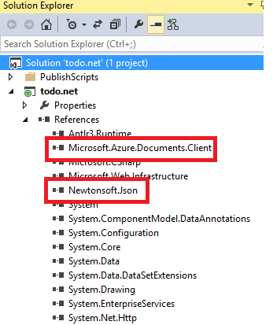
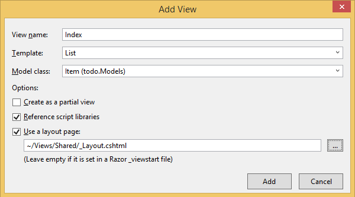

<properties 
	pageTitle="使用 DocumentDB 建置具有 ASP.NET MVC 的 Web 應用程式 | Azure" 
	description="了解如何使用 .NET 的 DocumentDB 建立待辦事項清單 Web 應用程式。您將從託管於 Azure 網站的 ASP.NET MVC Web 應用程式儲存和存取資料。" 
	services="documentdb" 
	documentationCenter="" 
	authors="ryancrawcour" 
	manager="jhubbard" 
	editor="cgronlun"/>

<tags 
	ms.service="documentdb" 
	ms.workload="data-services" 
	ms.tgt_pltfrm="na" 
	ms.devlang="dotnet" 
	ms.topic="hero-article" 
	ms.date="02/26/2015" 
	ms.author="ryancraw"/>

#使用 DocumentDB 建置具有 ASP.NET MVC 的 Web 應用程式

為了特別說明您要如何有效率地利用 Azure DocumentDB 來儲存和查詢 JSON 文件，本文章提供如何使用 Azure DocumentDB 建置待辦事項清單 Web 應用程式的完整逐步解說。在 Azure DocumentDB 中，這些工作將會儲存為 JSON 文件。

本逐步解說示範如何使用 Azure 所提供的 DocumentDB 服務，從託管於 Azure 的 ASP.NET MVC Web 應用程式儲存及存取資料。

> [AZURE.TIP] 本教學課程假設您有使用 ASP.NET MVC 和 Azure 網站的經驗。如果您不熟悉 ASP.NET 或[必備工具](#_Toc395637760)，我們建議您從 [GitHub](https://github.com/Azure/azure-documentdb-net) 下載完整的 [todo](https://github.com/Azure/azure-documentdb-net/tree/master/tutorials/todo) 教學課程專案，並使用[在本文結尾的指示]加以建置(#GetProject)。一旦建置，您可以檢閱文章，以深入了解專案內容中的程式碼。

## 必要條件

在依照本文中的指示進行之前，您應先確定備妥下列項目：

- 使用中的 Azure 帳戶。如果您沒有帳戶，只需要幾分鐘的時間就可以建立免費試用帳戶。如需詳細資訊，請參閱 [Azure 免費試用](../../pricing/free-trial/)。
- [Visual Studio 2013](http://www.visualstudio.com/) 或更高版本，或免費版本的 [Visual Studio Express]。
- Azure SDK for .NET 2.3 版或更高版本，可透過 [Microsoft Web Platform Installer][] (英文) 取得。

本文章中的所有螢幕擷取畫面都是使用已套用 Update 3 的 Visual Studio 2013 以及 Azure SDK for .NET 2.4 版所取得。如果您的系統是設定使用不同的版本，則您的畫面和選項可能不會完全相符，但只要您符合上述必要條件，本方案應該還是有效。

## 步驟 1：建立 DocumentDB 資料庫帳戶

讓我們從建立 DocumentDB 帳戶開始。如果您已經有帳戶，則可以跳到[建立新的 ASP.NET MVC 應用程式](#_Toc395637762)。

[AZURE.INCLUDE [documentdb-create-dbaccount](../includes/documentdb-create-dbaccount.md)]

[AZURE.INCLUDE [documentdb-keys](../includes/documentdb-keys.md)]

 
我們現在將從頭開始逐步解說如何建立新的 ASP.NET MVC 應用程式。 

## 步驟 2：建立新的 ASP.NET MVC 應用程式

現在讓我們建立我們的新 ASP.NET 專案。

1. 在 Visual Studio 的 [**檔案**] 功能表上，指向 [**新增**]，然後按一下 [**專案**]。

   	[**新增專案**] 對話方塊隨即出現。
2. 在 [**專案類型**] 窗格中，依序展開 [**範本**]、[**Visual C#**]、[**Web**]，然後選取 [**ASP.NET Web 應用程式**]。

  	

3. 在 [**名稱**] 方塊中，輸入專案的名稱。本教學課程會使用名稱 "todo"。 
4. 按一下 [**瀏覽**] 導覽至您要建立專案的資料夾，然後按一下 [**確定**]。

  	[**新增 ASP.NET 專案**] 對話方塊隨即出現。

  	

5. 在範本窗格中，選取 [**MVC**]。
6. 如果您打算在 Azure 中託管應用程式，則請選取右下角的 [**在雲端託管**]，讓 Azure 託管應用程式。我們已選擇託管於雲端，並執行 Azure 網站中所託管的應用程式。選取此選項將會預先佈建 Azure 網站，讓您在需要部署最終的運作應用程式時更為容易。如果您希望在各處都能託管，或不想預先設定 Azure 預付，請清除 [**在雲端託管**]。
7. 按一下 [**確定**]，並讓 Visual Studio 執行有關 Scaffolding 空的 ASP.NET MVC 範本的作業。 
8. 如果您選擇在雲端託管，則至少會有一個其他畫面出現，要求您登入 Azure 帳戶並提供新網站的部分值。提供所有其他值並繼續。 

  	在這裡我並沒有選擇 [資料庫伺服器]，因為我們並未使用 Azure SQL Database Server，稍後我們會在 Azure 預覽入口網站中建立新的 Azure DocumentDB 帳戶。 

  	

9. Visual Studio 建立好未定案 MVC 應用程式之後，您便擁有可以在本機執行的空白 ASP.NET 應用程式。

我們會跳過在本機執行專案的步驟，因為我確定我們都已看過 ASP.NET "Hello World" 應用程式。讓我們直接跳到將 DocumentDB 新增至此專案並建置應用程式的步驟。

## 步驟 3：將 DocumentDB 新增至專案

前面的步驟可處理
此方案所需的大部分 ASP.NET MVC 配管作業。現在，讓我們進入本教學課程的真正目的：將 Azure DocumentDB 新增至 Web 應用程式。

1. DocumentDB .NET SDK 會隨 NuGet 封裝而分散。若要在 Visual Studio 中取得 NuGet 封裝，請在 Visual Studio 中使用 NuGet 封裝管理員，方法是在專案上按一下滑鼠右鍵 [**方案總管**]，然後按一下 [**管理 NuGet 封裝**]。

  	[**管理 NuGet 封裝**] 對話方塊隨即出現。

  	

2. 在 [**線上搜尋**] 方塊中，輸入"Azure DocumentDB"。從結果中，安裝 **Microsoft Azure DocumentDB 用戶端程式庫**封裝。這會下載和安裝 DocumentDB 封裝，以及所有依存項目 (例如 Newtonsoft.Json)。

  	> [AZURE.NOTE] 服務在預覽狀態時，NuGet 封裝會標記為「預先發行」，因此您需要包含 [包括預先發行] 選項，否則您會找不到封裝。 

  	或者，您也可以使用「封裝命令主控台] 輸入以下資料以安裝封裝。

    	Install-Package Microsoft.Azure.Documents.Client -Pre

3. 安裝封裝之後，您的 Visual Studio 方案應該類似下列已新增兩個新參考的方案：Microsoft.Azure.Documents.Client 和 Newtonsoft.Json。

  	

##步驟 4：設定 ASP.NET MVC 應用程式
 
現在讓我們新增模型、檢視和控制器到此 MVC 應用程式：

- [新增模型](#_Toc395637764)。
- [新增控制器](#_Toc395637765)。
- [新增檢視](#_Toc395637766)。

### 新增模型

首先，讓我們在 MVC 中建立 **M** (模型)。 

1. 在 [方案總管] 中，於 **Models** 資料夾上按一下滑鼠右鍵，按一下 [**新增**]，然後按一下 [**類別**]。

  	[**加入新項目**] 對話方塊隨即出現。

2. 將新的類別命名為 **Item**，然後將下列程式碼新增至新的 Item.cs 檔案。

        public class Item
        {
        	[JsonProperty(PropertyName="id")]
        	public string Id { get; set; }
		
        	[JsonProperty(PropertyName="name")]
        	public string Name { get; set; }
		
        	[JsonProperty(PropertyName = "desc")]
        	public string Description { get; set; }
		
       		[JsonProperty(PropertyName="isComplete")]
        	public bool Completed { get; set; }    
		}

	DocumentDB 中的所有資料都會透過線路傳遞，並儲存為 JSON。如需透過 JSON.NET 控管物件序列化/取消序列化，您可以使用剛才在 [**項目**] 類別中建立的示範 **JsonProperty** 屬性。您**無需**這樣做，但我想確定所有屬性都依 JSON camelCase 命名慣例命名。 

	使用 JSON 時，您不但可以控管屬性名稱格式，也可以跟我命名 **Description** 屬性一樣重新命名您的 .NET 屬性。 

	如果希望，您在這裡也可以使用 **JsonConverter** 物件以便完整控管序列化方式。  

3. 為了取得 Visual Studio 以解決這裡使用的 **JsonProperty** 屬性，您需要在類別檔案區段中使用以下陳述式：

    	using Newtonsoft.Json;

### 新增控制器

之前都是談論 **M**，現在讓我們在 MVC 中建立 **C** (控制器類別)。

1. 在 [**方案總管**] 中，於 **Controllers** 資料夾上按一下滑鼠右鍵並按一下 [**新增**]，然後按一下 [**控制器**]。

    [**新增端點**] 對話方塊隨即出現。

2. 選取 [**MVC 5 控制器 - 空的**]，然後按一下 [**新增**]。

	

3. 將新的控制器命名為 **ItemController**。

	

檔案建立之後，您的 Visual Studio 方案應該類似下列，**[方案總管]** 中具有新增的 ItemController.cs 檔案。

### 新增檢視

最後，讓我們在 MVC 中建立 **V** 檢視：

- [新增項目索引檢視](#AddItemIndexView)。
- [新增項目檢視](#AddNewIndexView)。
- [新增編輯項目檢視](#_Toc395888515)。

#### 新增項目索引檢視

1. 在 [**方案總管**] 中，展開 [***檢視***] 資料夾，以滑鼠右鍵按一下稍早新增 **ItemController** 時 Visual Studio 為您建立的空白 **Item** 資料夾，按一下 [**新增**]，然後按一下 [**檢視**]。

2. 在 [**新增檢視**] 對話方塊中，執行下列動作：
	- 在 [**檢視名稱**] 方塊中，輸入 ***Index***。
	- 在 [**範本**] 方塊中，選取 ***List***。
	- 在 [**模型類別**] 方塊中，選取 ***Item (todo.Models)***。
	- 在版面配置頁面方塊中，輸入 ***~/Views/Shared/_Layout.cshtml***。
	- 按一下 [新增]****。
	

3. 設定所有這些值之後，按一下 [**新增**]，並讓 Visual Studio 為您建立檢視。Visual Studio 將會建立範本檢視。完成之後，將會開啟建立的 cshtml 檔案。我們之後才會回頭使用該檔案，因此可以先在 Visual Studio 中將其關閉。

#### 新增項目檢視

類似於建立 [**項目索引**] 檢視的方式，現在我們將為建立新**項目**建立新的檢視。

在 [**新增檢視**] 對話方塊中，執行下列動作：

- 在 [**檢視名稱**] 方塊中，輸入 ***Create***。
- 在 [**範本**] 方塊中，選取 ***Create***。
- 在 [**模型類別**] 方塊中，選取 ***Item (todo.Models)***。
- 在版面配置頁面方塊中，輸入 ***~/Views/Shared/_Layout.cshtml***。
- 按一下 [新增]****。

#### 新增編輯項目檢視

最後，使用與之前相同的方式新增最後一個檢視來編輯**項目**。

在 [**新增檢視**] 對話方塊中，執行下列動作：

- 在 [**檢視名稱**] 方塊中，輸入 ***Edit***。
- 在 [**範本**] 方塊中，選取 ***Edit***。
- 在 [**模型類別**] 方塊中，選取 ***Item (todo.Models)***。
- 選取 [**建立成部分檢視**]。
- 按一下 [新增]****。

完成這項作業之後，先將 Visual Studio 中的 cshtml 文件關閉，因為我們稍後才會回頭使用這些檢視。

## 步驟 5：組建 DocumentDB

在本節中，我們將新增程式碼來處理下列：

- [列出未完成項目](#_Toc395637770)。
- [新增項目](#_Toc395637771)。
- [編輯項目](#_Toc395637772)。

### 列出未完成項目

1. 開啟 **ItemController**，並移除 Visual Studio 所新增類別內的所有程式碼 (但保留該類別)。我們將使用 DocumentDB 重新拼湊各個部分。

2. 在目前已是空白的 **ItemController** 類別內，新增下列程式碼片段。

    	public ActionResult Index()
    	{
			var items = DocumentDBRepository<Item>.GetItems(d => !d.Completed);
			return View(items);
    	}

	此程式碼也會使用名為 **DocumentDBRepository** 的 "pseudo repository" 類別，我們尚未建立這個類別。實際上這只是一個 Helper 類別，包含所有 DocumentDB 指定程式碼。在本逐步解說中，我們不會像您在建置實際應用程式時的可能作法一樣，使用儲存機制模式來實作有插入依存項目、factory 及保存庫模式的完整資料存取層。 
	在本逐步解說中，我們只會將所有資料存取邏輯直接放入一個專案，簡化所有程序並著重在 DocumentDB 指定項目。

3. 在專案中新增類別，並命名為 **DocumentDBRepository**。 
4. 使用下列程式碼取代 **DocumentDBRepository** 類別中的程式碼。

    	public static class DocumentDBRepository<T>
    	{
	       using Microsoft.Azure.Documents; 
	       using Microsoft.Azure.Documents.Client; 
	       using Microsoft.Azure.Documents.Linq; 
		
     	   private static string databaseId;
     	   private static String DatabaseId
     	   {
				get
				{
					if (string.IsNullOrEmpty(databaseId))
					{
						databaseId = ConfigurationManager.AppSettings["database"];
					}
				
					return databaseId;
				}
       	 	}
			  
    	    private static string collectionId;
    	    private static String CollectionId
    	    {
				get
				{
					if (string.IsNullOrEmpty(collectionId))
					{
						collectionId = ConfigurationManager.AppSettings["collection"];
					}
				
					return collectionId;
				}
    	    }
					
    	    private static Database database;
    	    private static Database Database
    	    {
				get
				{
					if (database == null)
					{
						database = ReadOrCreateDatabase();
					}
					
					return database;
				}
    	    }
			
    	    private static DocumentCollection collection;
    	    private static DocumentCollection Collection
    	    {
				get
				{
					if (collection == null)
					{
						collection = ReadOrCreateCollection(Database.SelfLink);
					}
					
					return collection;
				}
    	    }
			
    	    private static DocumentClient client;
    	    private static DocumentClient Client
    	    {
    	        get
    	        {
    	            if (client == null)
    	            {
						string endpoint = ConfigurationManager.AppSettings["endpoint"];
						string authKey = ConfigurationManager.AppSettings["authKey"];
						Uri endpointUri = new Uri(endpoint);
						client = new DocumentClient(endpointUri, authKey);
    	            }
    	            
    	            return client;
    	        }
    	    }
    	}

5. 在 Visual Studio 中花點時間解決所有命名空間，應包括將下列 using 指示詞新增至 DocumentDBRepository.cs 檔案。

		using Microsoft.Azure.Documents;
		using Microsoft.Azure.Documents.Client;
		using Microsoft.Azure.Documents.Linq;
		using System.Configuration;

 	只要已順利安裝 NuGet 封裝，就能輕鬆地在 Visual Studio 中解析所有命名空間。**ReadOrCreateDatabase** 和 **ReadOrCreateCollection** 方法的參考仍處於未解析狀態，待新增之後才會解析，我們稍後會進行到這部分。
 
6. 曾經在這裡使用兩種方法呼叫，以讀取或建立 DocumentDB 資料庫及 document 集合。因此，請將下列兩種方法加入至 **DocumentDBRepository** 類別。

    	private static DocumentCollection ReadOrCreateCollection(string databaseLink)
   		{
    	    var col = Client.CreateDocumentCollectionQuery(databaseLink)
        	                  .Where(c => c.Id == CollectionId)
        	                  .AsEnumerable()
        	                  .FirstOrDefault();
	
        	if (col == null)
        	{
        	    col = Client.CreateDocumentCollectionAsync(databaseLink, new DocumentCollection { Id = CollectionId }).Result;
        	}
			
        	return col;
    	}
	
    	private static Database ReadOrCreateDatabase()
    	{
        	var db = Client.CreateDatabaseQuery()
        	                .Where(d => d.Id == DatabaseId)
        	                .AsEnumerable()
        	                .FirstOrDefault();
			
        	if (db == null)
        	{
        	    db = Client.CreateDatabaseAsync(new Database { Id = DatabaseId }).Result;
        	}
			
        	return db;
    	}

	此程式碼可以設定資料庫、一個 [**DocumentCollection**](http://msdn.microsoft.com/library/azure/microsoft.azure.documents.documentcollection.aspx)，並建立相同的程式碼以透過 [**DocumentClient**](http://msdn.microsoft.com/library/azure/microsoft.azure.documents.client.documentclient.aspx) 連線到 DocumentDB。 

7. 我們正在從組態中讀取部分值，因此請開啟 **Web.config** 檔案並在 `<AppSettings>` 區段下新增下列程式行。
	
    	<add key="endpoint" value="enter you endpoint url from the Azure Management Portal"/>
    	<add key="authKey" value="enter one of the keys from the Azure Management Portal"/>
    	<add key="database" value="ToDoList"/>
    	<add key="collection" value="Items"/>
	
8. 現在，使用 Azure 管理入口網站的 [金鑰] 分頁更新這些值。使用 [金鑰] 分頁的 **URI** 做為 endpoint 金鑰的值，並使用 [金鑰] 分頁的 [**主要金鑰**] 值做為 authKey 金鑰的值。
	
	現在讓我們加入一些程式碼來執行工作。 	

9. 我們想要對 todo 清單應用程式進行的第一件事就是顯示未完成的項目。下列方法會為您進行此動作，因此請複製並在 **DocumentDBRepository** 類別的任意位置內貼上。

	    public static IEnumerable<T> GetItems(Expression<Func<T, bool>> predicate) 
	    {
			return Client.CreateDocumentQuery<T>(Collection.DocumentsLink) 
				.Where(predicate) 
				.AsEnumerable(); 
		} 
	    
	此時，應該已經可以建置方案，而不會發生任何錯誤。

	如果您現在執行應用程式，將會前往 **HomeController** 及該控制器的 [**索引**] 檢視。這是我們在一開始時所選擇的 MVC 範本專案預設行為，但是我們不想要這樣的行為！讓我們變更此 MVC 應用程式上的路由以改變此行為。

11. 開啟 ***App\_Start\RouteConfig.cs*** 並尋找以 "defaults:" 開頭的程式碼行並加以變更如下。

    	defaults: new { controller = "Item", action = "Index", id = UrlParameter.Optional }

	如果您未在 URL 中指定控制路由行為的值，這會讓 ASP.NET MVC 知道改用 **Item** (而非 **Home**) 作為控制器，並使用使用者 **Index** 作為檢視。
	現在如果您執行應用程式，它會呼叫至您的 **ItemController**，並將 **GetIncompleteItems** 方法的結果傳回 **Views**\\**Item**\\**Index** 檢視。 

12. 如果您建置並立即執行此專案，您現在應該會看到如下的外觀。    

	

### 新增項目

讓我們將一些項目放入資料庫中，而不再只是看到空白方格。

我們已經有用於**建立**的檢視，並且在**索引**檢視上有將使用者帶到**建立**檢視的按鈕。讓我們將一些程式碼新增至控制器和儲存機制，以在 DocumentDB 中保留記錄。

1. 開啟 ItemController.cs 檔案並新增下列程式碼片段，這是 ASP.NET MVC 如何知道該對**建立**動作執行的來源。在此情況下，只需轉譯先前建立的關聯 Create.cshtml 檢視。

    	public ActionResult Create()
    	{ 
			return View(); 
   		}

	現在此控制器需要更多程式碼，以接受 [**建立**] 檢視所提交的資料。

2. 新增下一個程式碼區塊，讓 ASP.NET MVC 知道如何處理此控制器的表單 POST。
	
    	[HttpPost]
    	[ValidateAntiForgeryToken]
   	 	public async Task<ActionResult> Create([Bind(Include = 	"Id,Name,Description,Completed")] Item item)  
  	  	{
			if (ModelState.IsValid)  
			{  
			    await DocumentDBRepository<Item>.CreateItemAsync(item);
			    return RedirectToAction("Index");  
			}   
			return View(item);   
		}

	**安全性注意事項**：此處所使用的 **ValidateAntiForgeryToken** 屬性可協助應用程式防止跨網站偽造要求攻擊。這不光只是新增此屬性，您的檢視也必須使用這個防偽權杖。如需此主題的詳細資訊以及如何正確實作此作業的範例，請參閱[防止跨網站偽造要求][]。[Github][] 上提供的原始程式碼已有完整實作。

	**安全性注意事項**：我們也會在方法參數上使用 **Bind** 屬性，以協助防範 over-posting 攻擊。如需詳細資訊，請參閱 [ASP.NET MVC 中的基本 CRUD 作業][]。

3. 既然**建立**方法已經就定位，**ItemController** 會從表單傳遞 **Item** 物件至 **CreateDocument** 方法。因此，現在新增下列方法到您的 **DocumentDBRepository** 類別。

    	public static async Task<Document> CreateItemAsync(T item)
   	 	{
   	   		return await Client.CreateDocumentAsync(Collection.SelfLink, item);
   		}

	此方法只會接受傳遞給它的物件，並將它保留在DocumentDB 中。

這包括將新項目新增至資料庫所需的程式碼。

### 編輯項目

我們最後還要做一件事，那就是能夠編輯資料庫中的**項目**，並能夠將項目標示為已完成。用於編輯的檢視已加入至專案，因此我們只需要再次加入一些程式碼至我們的控制器和 **DocumentDBRepository** 類別。

1. 將下列程式碼新增至 **ItemController** 類別。

    	[HttpPost]
   		[ValidateAntiForgeryToken]
    	public async Task<ActionResult> Edit([Bind(Include = "Id,Name,Description,Completed")] Item item)
    	{
     	   if (ModelState.IsValid)
    	    {
    	        await DocumentDBRepository<Item>.UpdateItemAsync(item.Id, item);
    	        return RedirectToAction("Index");
    	    }

  	      return View(item);
 	   	}
		
		public ActionResult Edit(string id)
		{
		    if (string.IsNullOrEmpty(id))
		    {
		        return new HttpStatusCodeResult(HttpStatusCode.BadRequest);
		    }
					 
		    Item item = (Item)DocumentDBRepository<Item>.GetItem(d => d.Id == id);
		 	
		    if (item == null)
		    {
		        return HttpNotFound();
		    }
		 	
		    return View(item);
		}
		
	
	第一個方法會處理當使用者按一下 [**索引**] 檢視中的 [**編輯**] 連結時所發生的Http GET。此方法會從 DocumentDB 中提取 [**Document**](http://msdn.microsoft.com/library/azure/microsoft.azure.documents.document.aspx)，並將它傳遞給 [**編輯**] 檢視。

	[**編輯**] 檢視會接著對 **IndexController** 執行 Http POST。 
	
	新增的第二個方法會處理此作業，將更新物件傳遞至 DocumentDB 並保留在資料庫中。

2. 將下列 using 指示詞新增至 ItemController.cs 檔案。

		using todo.Models;
		using System.Threading.Tasks;
		using System.Net;

3. 將下列程式碼新增至 **DocumentDBRepository** 類別；

    	public static T GetItem(Expression<Func<T, bool>> predicate)
    	{
        	return Client.CreateDocumentQuery<T>(Collection.DocumentsLink)
                    	.Where(predicate)
                    	.AsEnumerable()
                    	.FirstOrDefault();
    	}	
		
		public static Document GetDocument(string id) 
		{ 
			return Client.CreateDocumentQuery(Collection.DocumentsLink) 
				.Where(d => d.Id == id) 
				.AsEnumerable() 
				.FirstOrDefault(); 
		} 

    	public static async Task<Document> UpdateItemAsync(string id, T item)
    	{
        	Document doc = GetDocument(id);	
        	return await Client.ReplaceDocumentAsync(doc.SelfLink, item);
    	}

	這兩個方法中的第一個方法會從 DocumentDB 提取 **Item**，這會傳遞回 **ItemController**，接著傳遞給 [**編輯**] 檢視。
	
	我們剛剛新增的這兩個方法中的第二個方法會將 DocumentDB 中的 **Document** 取代為從 **ItemController** 傳入的 **Document**版本。

4. 將下列 using 指示詞新增至 DocumentDBRepository.cs 檔案。

		using System.Threading.Tasks;

	這樣便大功告成了，這些就是我們執行應用程式所需的所有作業：列出未完成**項目**、新增**項目**以及編輯**項目**。

## 步驟 6：在本機執行應用程式

若要在本機電腦測試應用程式，請執行下列：

1. 在 Visual Studio 中按 F5 以在偵錯模式中建置應用程式。它應該會建置應用程式，並使用我們之前看到的空白方格頁面啟動瀏覽器：

	

	如果您在此時遇到錯誤，您可以將您的程式碼與 [GitHub][] 上的 todo 教學課程相比較。

2. 按一下 [**建立新項目**] 連結並新增值至 [**名稱**] 和 [**描述**] 欄位。將 [**已完成**] 核取方塊保持為未選取狀態，否則，新 **Item** 會以已完成的狀態新增，且不會出現在初始清單中。

	

3. 按一下 [**建立**]，便會將您重新導向回**索引**檢視，而您的**項目**會出現在清單中。

	

	依需要新增一些 **Items** 至 [待辦事項] 清單。

3. 按一下清單上 **Item** 旁邊的 [**編輯**]，您便會被帶到 [**編輯**] 檢視，您可在此更新任何物件的屬性 (包括 [**已完成**] 旗標)。如果您標示 [**完成**] 旗標，然後按一下 [**儲存**]，則會從未完成的工作清單中移除**項目**。

	

4. 測試應用程式之後，按 Ctrl+F5 停止偵錯應用程式。您已經準備好部署！

##步驟 7：將應用程式部署到 Azure 網站

您已經擁有可與 DocumentDB 正常運作的完整應用程式，我們現在要將此 Web 應用程式部署至 Azure 網站。如果您在建立空白 ASP.NET MVC 專案時選取了 [**在雲端託管**]，Visual Studio 可讓這項作業變得十分簡單，且為您完成大部分的工作。 

若要發行此應用程式，您只需在 [**方案總管**] 中以滑鼠右鍵按一下專案，再選取 [**發佈**]。

系統應該已根據您的認證設定好所有項目；實際上，系統已在 Azure 中建立位於所顯示 [**目的地 URL**] 的網站，您只需要按一下 [**發佈**] 即可。

幾秒後，Visual Studio 便會發佈 Web 應用程式並啟動瀏覽器，您可以在瀏覽器中看到您方便好用的應用程式已在 Azure 中執行！

##後續步驟

恭喜！您剛剛已經使用 Azure DocumentDB 建置您的第一個 ASP.NET MVC 應用程式，並將它發佈至 Azure 網站。完整應用程式的原始程式碼，包括在本教學課程未包含的詳細資料和刪除功能，可以自 [Github][] 下載或複製。因此，如果您有興趣將它加入您的應用程式，請取得程式碼，並將它加入至此應用程式。

若要加入其他功能至您的應用程式，請檢閱 [DocumentDB .NET 程式庫](http://msdn.microsoft.com/library/azure/dn783362.aspx)中提供的 API，然後隨意參與 [GitHub][] 上的 DocumentDB .NET 程式庫。 

##從 GitHub 取得方案

如果您想要節省時間，只是要建置完成的 todo 方案，而不自行加入程式碼，您很幸運。完整的方案可在 GitHub 上取得，而且您可以使用下列指示，在幾分鐘的時間建置並將它部署。

1. 請確定您已安裝[先決條件軟體](#_Toc395637760) ，其中包括 Visual Studio 和 Azure SDK for .NET 2.3 版或更新版本。

2. 使用 Git for Windows ([http://www.git-scm.com/](http://www.git-scm.com/)) 複製 azure-documentdb-net 儲存機制，或從 [GitHub](https://github.com/Azure/azure-documentdb-net/) 下載 zip 檔。

2. 從 Visual Studio 中，從 azure-documentdb-net/tutorials/todo 目錄開啟 todo.sln 檔案。

3. 若要在 Visual Studio 2013 中還原對 DocumentDB.NET SDK 的參考，請在 [**方案總管**] 中的 todo 方案上按一下滑鼠右鍵，然後按一下 [**啟用 NuGet 封裝還原**]，便會還原參考。 

4. 從 [Azure 預覽入口網站](https://portal.azure.com/) 您的 DocumentDB 帳戶的 [**金鑰**] 分頁擷取 **URI** 和**主要金鑰**或**次要金鑰**值。 

	
	如果您沒有帳戶，請參閱[建立資料庫帳戶](/documentation/articles/documentdb-create-account/) 來設定一個帳戶。

	

5. 在 Web.config 檔案中，更新 **endpoint** 和 **authKey** 金鑰的預設值。

    	<add key="endpoint" value="~enter URI for your DocumentDB Account, from Azure Management Portal~" /> 
		<add key="authKey" value="~enter either Primary or Secondary key for your DocumentDB Account, from Azure Management Portal~" /> 

	- 從 [金鑰] 分頁複製 **URI** 值，並將它貼到 **endpoint** 屬性值。 
	- 從 [**金鑰**] 分頁複製**主要金鑰**或**次要金鑰**值，並將它貼到 **authKey** 屬性值。
	

7. 現在您可以[在本機執行應用程式](#_Toc395637773) 然後[將它部署到 Azure 網站](#_Toc395637774)。

[\*]: https://microsoft.sharepoint.com/teams/DocDB/Shared%20Documents/Documentation/Docs.LatestVersions/PicExportError
[Visual Studio Express]: http://www.visualstudio.com/products/visual-studio-express-vs.aspx
[Microsoft Web Platform Installer]: http://www.microsoft.com/web/downloads/platform.aspx
[Github]: http://go.microsoft.com/fwlink/?LinkID=509838&clcid=0x409
[防止跨網站偽造要求]: http://go.microsoft.com/fwlink/?LinkID=517254
[ASP.NET MVC 中的基本 CRUD 作業]: http://go.microsoft.com/fwlink/?LinkId=317598

<!--HONumber=47-->
