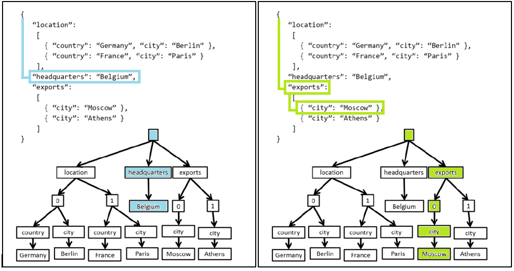

<properties 
	pageTitle="DocumentDB 索引編製原則 | Azure" 
	description="了解 DocumentDB 中索引的運作方式，以及了解如何設定索引原則。" 
	services="documentdb" 
	documentationCenter="" 
	authors="mimig1" 
	manager="jhubbard" 
	editor="monicar"/>

<tags 
	ms.service="documentdb" 
	ms.devlang="na" 
	ms.topic="article" 
	ms.tgt_pltfrm="na" 
	ms.workload="data-services" 
	ms.date="03/13/2015" 
	ms.author="mimig"/>

DocumentDB 索引編製原則
============================

DocumentDB 是真正無結構描述的資料庫。它不會假設或不需要 JSON 文件的任何結構描述。這可讓您快速地定義並逐一查看應用程式資料模型。將文件新增至集合時，DocumentDB 會自動為所有文件屬性編製索引，讓它們可供您查詢。自動索引編制功能可讓您儲存不同類型的文件。

自動編製文件索引功能是由將寫入最佳化、無鎖定且將記錄結構化的索引維護技術所啟用。DocumentDB 既支援大量的快速寫入，同時又能提供一致的查詢。

DocumentDB 索引編製子系統是設計來支援：

·         在沒有任何結構描述或索引定義的情況下，進行有效率、豐富階層式及關聯式查詢

·         在處理持續性的大量寫入時，維持查詢結果一致性。為了透過一致的查詢來取得高寫入產出工作量，將會逐漸、有效率並連線，同時持續處理後續的寫入量。

·         儲存體效率。基於成本效益，索引的磁碟儲存體額外負荷有所限制且可預測。

·         多租用戶。執行索引更新時，會在為每個 DocumentDB 集合配置的系統資源預算內執行。

針對大部分應用程式，您可以使用預設的自動索引編製原則，因為它能提供最大的彈性並在效能與儲存效率之間做出最佳取捨。而另一方面，指定自訂的索引編製原則，則是可讓您在查詢效能、寫入效能及索引儲存額外負荷之間進行細微的取捨。

例如，您可藉由將特定文件或文件內的路徑自索引編製作業中排除，既減少用於編製索引的儲存空間，也降低用於維護索引的插入時間成本。您可以變更索引的類型，使其更適用於範圍查詢，或是提高索引精確度 (以位元組為單位)，以改善查詢效能。本文說明 DocumentDB 中提供的各種索引編製組態選項，以及如何針對您的工作負載自訂索引編製原則。

DocumentDB 索引的運作方式
-----------------------------

DocumentDB 中的索引利用 JSON 文法允許**以樹狀結構表示**文件的事實。若要以樹狀結構表示 JSON 文件，必須建立一個虛擬根節點，做為其下文件中其餘實際節點的父系。每個包括 JSON 文件中陣列索引的標籤都會成為樹狀結構的節點。下圖說明範例 JSON 文件及其對應的樹狀結構表示法。

例如，上述範例中的 JSON 屬性 {"headquarters":"Belgium"} 會對應至路徑 /"headquarters"/"Belgium"。JSON 陣列 {"exports":[{"city":"Moscow"}, {"city":Athens"}]} 會對應至路徑 /"exports"/0/"city"/"Moscow" 和 /"exports"/1/"city"/"Athens"。

**注意**：路徑表示法模糊了文件中結構/結構描述與執行個體值之間的界線，讓 DocumentDB 真正變成沒有結構描述。

在 DocumentDB 中，文件會組織成可使用 SQL 來查詢或在單一交易的範圍內處理的集合。每個集合都可透過設定擁有自己的索引編製原則 (以路徑的方式表示)。在下一節中，我們將探討如何設定 DocumentDB 集合的索引編製行為。

設定集合的索引原則
-------------------------------------------

下列範例示範如何在建立集合期間設定自訂索引原則， 方法是使用 DocumentDB REST API。此範例示範 以路徑、索引類型和精確度表示的索引編製原則。

	POST https://<REST URI>/colls HTTP/1.1                                                  
 	...                                                             
 	Accept: application/json 
                                                                                                                         
 	{                                                                     
	 "id":"customIndexCollection",                                     
	 "indexingPolicy":{                                                 
     "automatic":true,                                            
	 "indexingMode":"Consistent",                                     
	 "IncludedPaths":[                                       
	           {                                                             
	              "IndexType":"Hash",                                        
	              "Path":"/"                                                 
	           }                                                  
	        ],                                                               
	        "ExcludedPaths":[                                                
	           "/\"nonIndexedContent\"/*"                                 
	        ]                                                               
	     }                                                                 
	 }                                                                                                                                                
 	...                                                                      
                  
                                                        
	 HTTP/1.1 201 Created                                                     

**注意**：集合的索引編製原則必須在建立時指定。不允許在建立集合之後修改索引編製原則，但未來的 DocumentDB 版本中將會支援。

**注意**：根據預設，DocumentDB 會使用雜湊索引為文件內的所有路徑一致地編製索引。內部時間戳記 (\_ts) 路徑會與範圍索引儲存在一起。

### 自動編製索引

您可以選擇是否要讓集合自動編製所有文件的索引。根據預設，會自動索引所有文件，但您可以選擇將它關閉。關閉索引編製功能時，便只能透過文件自己的連結或使用識別碼透過查詢來存取文件。

在關閉自動索引編製功能的情況下，您仍然可以選擇性地只將特定的文件新增到索引中。相反地，您也可以讓自動索引編製功能保持開啟，並選擇性地只排除特定的文件。當您只需要查詢文件的子集時，索引編製功能開/關組態相當有用。

您可以將 automatic 屬性的值設定為 true 或 false 來設定預設原則。若要針對單一文件進行覆寫，您可以在插入或取代文件時，設定 x-ms-indexingdirective 要求標頭。

例如，下列範例示範如何包含明確使用 [DocumentDB .NET SDK](https://github.com/Azure/azure-documentdb-java) 和 [RequestOptions.IndexingDirective](http://msdn.microsoft.com/library/microsoft.azure.documents.client.requestoptions.indexingdirective.aspx) 屬性的文件。

	// If you want to override the default collection behavior to either     
	// exclude (or include) a Document from indexing,                                                                                           
	// use the RequestOptions.IndexingDirective property.                                  
	                                                                         
	client.CreateDocumentAsync(defaultCollection.SelfLink,  
	    new { Id = "AndersenFamily", isRegistered = true },                            
		new RequestOptions                               
		    {                                                                    
			    IndexingDirective = IndexingDirective.Include                                                                                      
			}
		);                                                                  

### 索引模式

您可以選擇同步 (一致 (**Consistent**)) 和非同步 (延遲 (**Lazy**)) 索引更新。每次在集合中的文件上發生插入、取代或刪除文件時，預設會同步更新索引。這可讓查詢遵守與文件讀取操作相同的一致性層級，而不會有任何需要索引趕上的延遲。

雖然 DocumentDB 的寫入已經過最佳化處理，並支援持續的大量文件寫入以及同步索引維護，但是您還是可以設定讓特定集合以延遲方式更新其索引。當發生資料寫入暴增，而您想要拉長時間來分攤編製內容索引所需的工作時，延遲索引編製會相當有用。這可讓您有效地使用您佈建的輸送量，並在尖峰時間，以最少的延遲為寫入要求提供服務。不過，在開啟延遲索引編製功能的情況下，不論為資料庫帳戶設定的一致性層級為何，查詢結果最終仍是會保持一致。

下列範例示範如何搭配使用 .NET SDK 與一致自動編製索引，以在插入所有文件時建立 DocumentDB 集合。

	 // Default collection creates a hash index for all string and numeric    
	 // fields. Hash indexes are compact and offer efficient                                                                                           
	 // performance for equality queries.                                     
	                                                                          
	 var defaultCollection = new DocumentCollection { Id ="defaultCollection" };                                                   
	                                                                          
	 // Optional. Override Automatic to false for opt-in indexing of documents.                                                                
	                                                                          
	 defaultCollection.IndexingPolicy.Automatic = true;                       
	                                                                          
	 // Optional. Set IndexingMode to Lazy for bulk import/read heavy        
	 // collections. Queries might return stale results with Lazy indexing.       
	                                                                          
	 defaultCollection.IndexingPolicy.IndexingMode = IndexingMode.Consistent; 
	                                                                          
	 defaultCollection = await client.CreateDocumentCollectionAsync(database.SelfLink,defaultCollection);                                                      

### 索引類型和精確度

用於索引項目的類型或配置會直接影響索引的儲存和效能。以使用較高精確度的配置來說，查詢通常較快。不過，索引的儲存額外負荷也較高。選擇較低的精確度代表在查詢執行期間可能需要處理較多的文件，但是儲存額外負荷將會比較低。

任何路徑中之值的索引精確度皆可以是 3 到 7 個位元組之間。
由於相同的路徑可能在不同的文件中會有數字和字串值，因此可以個別控制這些值。在 .NET SDK 中，這些值對應到 [NumericPrecision](http://msdn.microsoft.com/library/microsoft.azure.documents.indexingpath.numericprecision.aspx) 和 [StringPrecision](http://msdn.microsoft.com/library/azure/microsoft.azure.documents.indexingpath.stringprecision.aspx) 屬性。

有兩種支援的索引類型：雜湊和範圍。選擇「雜湊」索引類型可進行有效率的高品質查詢。針對大多數使用案例，雜湊索引並不需要比預設值 (3 個位元組) 更高的精確度。

選擇「範圍」索引類型可進行範圍查詢 (使用 >、<、>=、<=、!=)。如果路徑有大範圍的值，建議使用較高的精確度，例如 6 個位元組。其中一個需要較高精確度範圍索引的常見使用案例，就是儲存為 Epoch 時間的時間戳記。

如果您的使用案例並不需要有效率的範圍查詢，則預設的雜湊索引可提供最佳的儲存與效能取捨。請注意，若要支援範圍查詢，您必須指定自訂的索引原則。

> [AZURE.NOTE] 只有針對數值才支援範圍索引。
  
下列範例示範如何使用 .NET SDK 提高集合中範圍索引的精確度。請注意，這裡會使用特殊的路徑 "/" (將在下一節中說明)。

	 // If your collection has numeric fields that need to be queried    
	 // against ranges (>,>=,<=,<), then you can configure the collection to 
	 // use range queries for all numeric values.                                                                                                      
 
	var rangeDefault = new DocumentCollection { Id = "rangeCollection" };                                                              
	rangeDefault.IndexingPolicy.IncludedPaths.Add(                                                             
												 new IndexingPath {   
													IndexType = IndexType.Range, Path = "/", 
													NumericPrecision = 7 }
												 ); 
	 rangeDefault = await client.CreateDocumentCollectionAsync(database.SelfLink, rangeDefault);   

### 索引路徑

您可以選擇編製索引時必須包含或排除文件內的哪些路徑。針對事先知道查詢模式的情況，這將可改善寫入效能並降低索引儲存。

索引路徑的開頭為根 (/)，且通常結尾為 ? 萬用字元運算子，代表有多個可能的首碼值。例如，若要為 SELECT * FROM Families F WHERE F.familyName = "Andersen" 提供服務，您必須在集合的索引原則中包含 /"familyName"/? 的索引路徑。

索引路徑也可以使用 * 萬用字元運算子來指定路徑首碼底下的遞迴行為。例如，使用 /"payload"/* 可將 payload 屬性下的所有項目自索引編製作業中排除。

以下是指定索引路徑的常見模式：

<table border="0" cellspacing="0" cellpadding="0">
    <tbody>
        <tr>
            <td valign="top">
                

                    <strong>路徑</strong>
                

            </td>
            <td valign="top">
                

                    <strong>描述/使用案例</strong>
                

            </td>
        </tr>
        <tr>
            <td valign="top">
                

                    /
                

            </td>
            <td valign="top">
                

                    集合的預設路徑。遞迴並套用至整個文件樹狀結構。
                

            </td>
        </tr>
        <tr>
            <td valign="top">
                

                    /"prop"/?
                

            </td>
            <td valign="top">
                

                    為類似下列的查詢 (類型分別為雜湊或範圍) 提供服務而必要的索引路徑：
                

                

                    SELECT * FROM collection c WHERE c.prop = "value"
                

                

                    SELECT * FROM collection c WHERE c.prop &gt; 5
                

            </td>
        </tr>
        <tr>
            <td valign="top">
                

                    /"prop"/*
                

            </td>
            <td valign="top">
                

                    指定之標籤底下所有路徑的索引路徑。只對要從索引編製作業中排除時才指定。
                

            </td>
        </tr>
        <tr>
            <td valign="top">
                

                    /"prop"/"subprop"/
                

            </td>
            <td valign="top">
                

                    在查詢執行期間使用的索引路徑，用來剪除不具有指定路徑的文件。
                

            </td>
        </tr>
        <tr>
            <td valign="top">
                

                    /"prop"/"subprop"/?
                

            </td>
            <td valign="top">
                

                    為查詢 (類型分別為雜湊或範圍) 提供服務而必要的索引路徑：
                

                

                    SELECT * FROM collection c WHERE c.prop.subprop = "value"
                

                

                    SELECT * FROM collection c WHERE c.prop.subprop &gt; 5
                

            </td>
        </tr>
    </tbody>
</table>

> [AZURE.NOTE] 設定自訂的索引路徑時，您必須為由特殊路徑 "/" 所表示的整份文件樹狀目錄指定預設的索引規則。

下列範例會設定一個採用範圍索引編製且自訂的有效位數值為 7 個位元組：

 	// If you only want to specify range queries against a specific field,   
 	// then use a range index against that field. Doing so reduces the   
	// amount of storage required for indexes for the collection. In this    
 	// case, the query creates an index against the JSON path                   
 	// /"CreatedTimestamp"/?    
 	// allowing queries of the form WHERE CreatedTimestamp [>] X            
	
	var pathRange = new DocumentCollection { Id = "rangeSinglePathCollection" };    
	
	pathRange.IndexingPolicy.IncludedPaths.Add(
								new IndexingPath { 
										IndexType = IndexType.Range, 
										Path = "/\"CreatedTimestamp\"/?",   
										NumericPrecision = 7   
							 			}
									);   
	
	pathRange.IndexingPolicy.IncludedPaths.Add(   
											 new IndexingPath {  
											  	 Path = "/"  
											 });                                                                      
                                                   
	 pathRange = await client.CreateDocumentCollectionAsync(database.SelfLink, pathRange);      

當查詢使用範圍運算子，但卻沒有針對所查詢之路徑的範圍索引，也沒有任何其他可從索引提供的篩選時，DocumentDB 就會傳回錯誤。但是，只要在 REST API 中使用 x-ms-documentdb-allow-scans 標頭，或使用 .NET SDK 利用 AllowScanInQueryrequest 選項，仍然可以在沒有範圍索引的情況下執行這些查詢。

下一個範例會使用
"*" 萬用字元，將路徑樹狀子目錄自索引編製作業中排除。

	var excluded = new DocumentCollection { Id = "excludedPathCollection" };                                                                       
  	excluded.IndexingPolicy.IncludedPaths.Add(
	newIndexingPath {  Path = "/" });  

	excluded.IndexingPolicy.ExcludedPaths.Add("/\" nonIndexedContent\"/*");    
	excluded = await client.CreateDocumentCollectionAsync(database.SelfLink,excluded);                                                               

效能微調
------------------

評估不同的索引原則組態時，您應該測量 DocumentDB API 的原則的儲存體和輸送量含意。

若要檢查集合的儲存體配額和使用量，請對集合資源執行 HEAD 或 GET 要求，並檢查 x-ms-request-quota 和 x-ms-request-usage 標頭。在 .NET SDK 中，[ResourceResponse<T\>](http://msdn.microsoft.com/library/dn799209.aspx) 中的 [DocumentSizeQuota](http://msdn.microsoft.com/library/dn850325.aspx) 和 [DocumentSizeUsage](http://msdn.microsoft.com/library/azure/dn850324.aspx) 屬性包含這些對應的值。

 	// Measure the document size usage (which includes the index size) against   
 	// different policies.        
	 ResourceResponse<DocumentCollection> collectionInfo = await client.ReadDocumentCollectionAsync(collectionSelfLink);  
	 Console.WriteLine("Document size quota: {0}, usage: {1}", collectionInfo.DocumentSizeQuota, collectionInfo.DocumentSizeUsage);                                       

若要測量每一個寫入作業 (建立、更新或刪除) 的索引編製負荷，請檢查 x-ms-request-charge 標頭 (或 .NET SDK 的 [ResourceResponse<T\>](http://msdn.microsoft.com/library/dn799209.aspx) 中同等的 [RequestCharge](http://msdn.microsoft.com/library/dn799099.aspx) 屬性) 來測量這些作業所耗用的要求單位數量。

 	// Measure the performance (request units) of writes.     
 	ResourceResponse<Document> response = await client.CreateDocumentAsync(collectionSelfLink, myDocument);              
                                                                    
 	Console.WriteLine("Insert of document consumed {0} request units", response.RequestCharge);                                                 
                                                                          
 	// Measure the performance (request units) of queries.    
	 IDocumentQuery<dynamic> queryable =  client.CreateDocumentQuery(collectionSelfLink, queryString).AsDocumentQuery();                                          
                                                                          
 	while (queryable.HasMoreResults)                                                                            
 	{                                                                         
 	   FeedResponse<dynamic> queryResponse = await queryable.ExecuteNextAsync<dynamic>(); 
	   Console.WriteLine("Query batch consumed {0} request units",queryResponse.RequestCharge);
	}                                                                        

<!--HONumber=49-->