# <a name="quickstart-route-blob-storage-events-to-web-endpoint-with-the-azure-portal"></a>快速入門：使用 Azure 入口網站將 Blob 儲存體事件路由傳送至 Web 端點

Azure Event Grid 是一項雲端事件服務。 在本文中，您會使用 Azure 入口網站建立 Blob 儲存體帳戶、訂閱該 Blob 儲存體的事件，以及觸發事件以檢視結果。 通常，您會將事件傳送至可處理事件資料及採取行動的端點。 不過，若要簡化這篇文章，您可將事件傳送至可收集及顯示訊息的 Web 應用程式。

[!INCLUDE [quickstarts-free-trial-note.md](../../includes/quickstarts-free-trial-note.md)]

當您完成時，您會看到事件資料已傳送至 Web 應用程式。

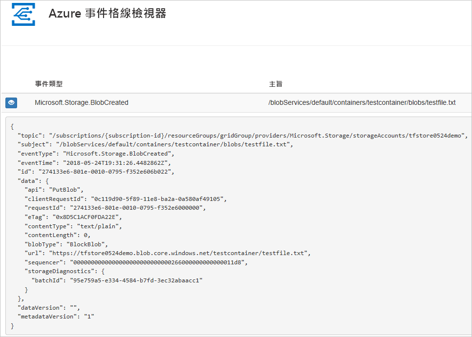

## <a name="create-a-storage-account"></a>建立儲存體帳戶

1. 登入 [Azure 入口網站](https://portal.azure.com/)。

1. 若要建立 Blob 儲存體，請選取 [建立資源]。 

   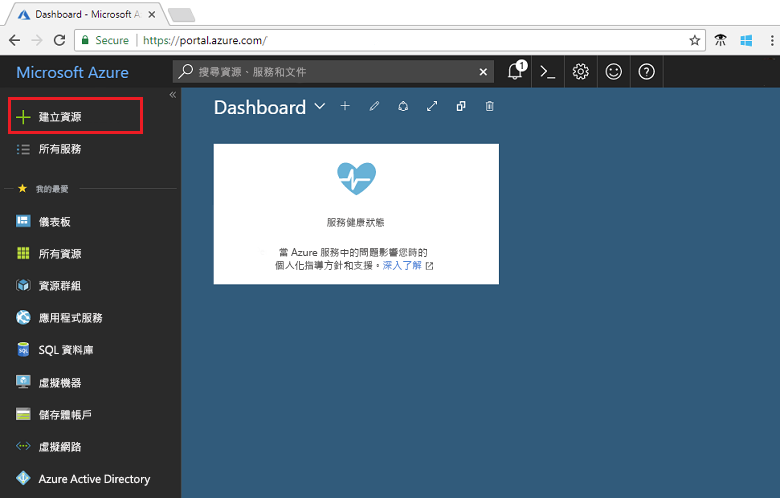

1. 選取要篩選可用選項的 [儲存體]，然後選取 [儲存體帳戶 - Blob、檔案、資料表、佇列]。

   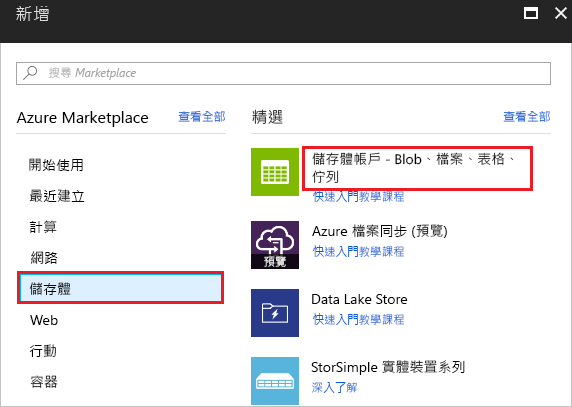

1. 若要訂閱事件，請建立一般用途 v2 儲存體帳戶或 Blob 儲存體帳戶。 如需詳細資訊，請參閱[建立儲存體帳戶](../storage/common/storage-quickstart-create-account.md)。

   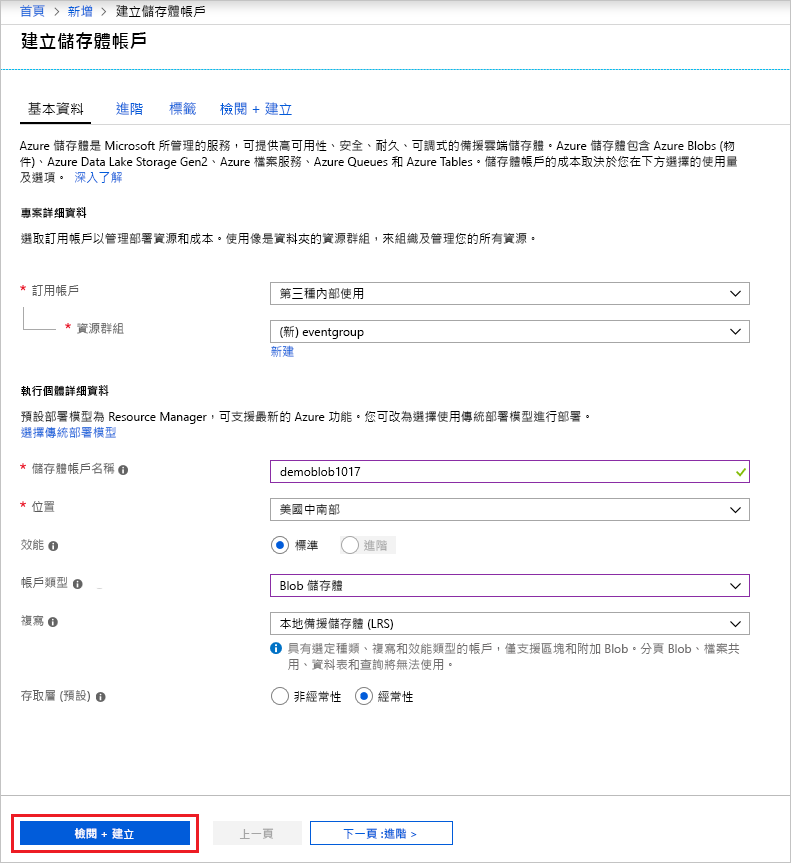

## <a name="create-a-message-endpoint"></a>建立訊息端點

在訂閱 Blob 儲存體的事件之前，我們要先建立事件訊息的端點。 通常，端點會根據事件資料採取動作。 若要簡化此快速入門，請部署[預先建置的 Web 應用程式](https://github.com/Azure-Samples/azure-event-grid-viewer)以顯示事件訊息。 已部署的解決方案包含 App Service 方案、App Service Web 應用程式，以及 GitHub 中的原始程式碼。

1. 選取 [部署至 Azure]，將解決方案部署至您的訂用帳戶。 在 Azure 入口網站中，提供參數的值。

   <a href="https://portal.azure.com/#create/Microsoft.Template/uri/https%3A%2F%2Fraw.githubusercontent.com%2FAzure-Samples%2Fazure-event-grid-viewer%2Fmaster%2Fazuredeploy.json" target="_blank"></a>

1. 部署需要幾分鐘的時間才能完成。 成功部署之後，檢視 Web 應用程式，確定它正在執行。 在網頁瀏覽器中，瀏覽至：`https://<your-site-name>.azurewebsites.net`

1. 您看到網站，但其中尚未發佈任何事件。

   

[!INCLUDE [event-grid-register-provider-portal.md](../../includes/event-grid-register-provider-portal.md)]

## <a name="subscribe-to-the-blob-storage"></a>訂閱 Blob 儲存體

您可訂閱主題，告知 Event Grid 您想要追蹤的事件，以及要將事件傳送至何處。

1. 在入口網站中選取您的 Blob 儲存體，並選取 [事件]。

   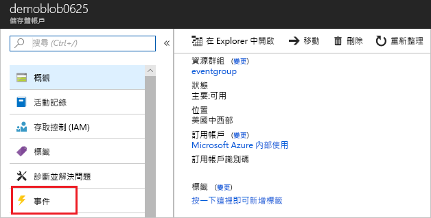

1. 若要將事件傳送至您的檢視器應用程式，請使用端點的 Web Hook。 選取 [更多選項]，再選取 [Web Hook]。

   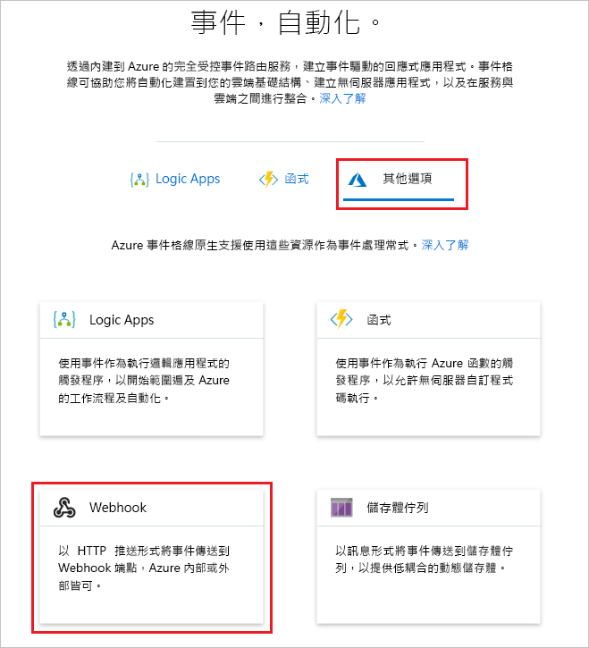

1. 事件訂用帳戶中會預先填入您 Blob 儲存體的值。 針對 Web Hook 端點，提供您的 Web 應用程式 URL，並將 `api/updates` 新增至首頁 URL。 請為您的訂用帳戶指定名稱。 完成後，請選取 [建立]。

   

1. 再次檢視 Web 應用程式，並注意訂用帳戶的驗證事件已傳送給它。 選取眼睛圖示來展開事件資料。 Event Grid 會傳送驗證事件，以便端點確認它要接收事件資料。 Web 應用程式包含用來驗證訂用帳戶的程式碼。

   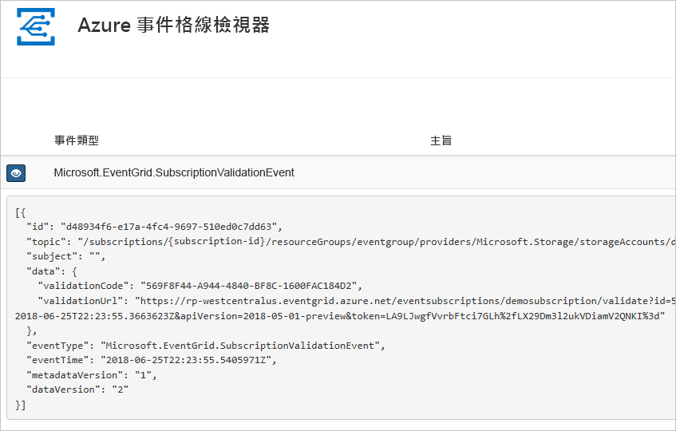

現在，讓我們觸發事件以了解 Event Grid 如何將訊息散發至您的端點。

## <a name="send-an-event-to-your-endpoint"></a>將事件傳送至端點

您可以藉由上傳檔案來觸發 Blob 儲存體的事件。 此檔案不需要任何特定內容。 相關文章假設您具有名為 testfile.txt 的檔案，但是您可以使用任何檔案。

1. 針對您的 Blob 儲存體，選取 [Blob]。

   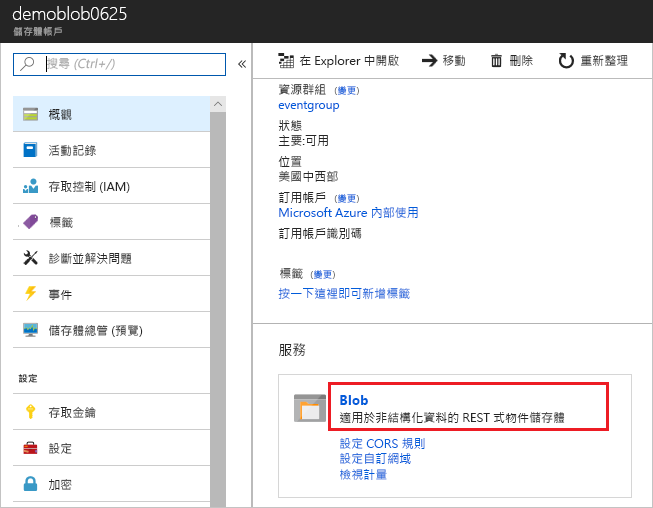

1. 選取 [+ 容器]。 請為您的容器指定名稱，並使用任何存取層級。

   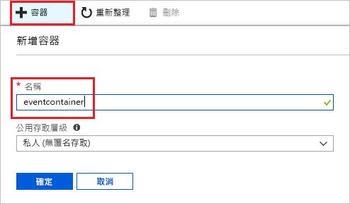

1. 選取您的新容器。

   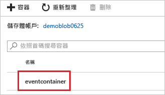

1. 若要上傳檔案，請選取 [上傳]。

   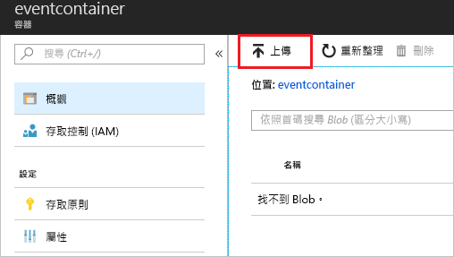

1. 瀏覽至您的測試檔案，並加以上傳。

1. 您已觸發此事件，而 Event Grid 會將訊息傳送至您在訂閱時設定的端點。 檢視您的 Web 應用程式，並留意已接收到 Blob 所建立的事件。 

   ```json
   {
    "topic": "/subscriptions/{subscription-id}/resourceGroups/eventgroup/providers/Microsoft.Storage/storageAccounts/demoblob0625",
    "subject": "/blobServices/default/containers/eventcontainer/blobs/testfile.txt",
    "eventType": "Microsoft.Storage.BlobCreated",
    "eventTime": "2018-06-25T22:50:41.1823131Z",
    "id": "89a2f9da-c01e-00bb-13d6-0c599506e4e3",
    "data": {
      "api": "PutBlockList",
      "clientRequestId": "41341a9b-e977-4a91-9000-c64125039047",
      "requestId": "89a2f9da-c01e-00bb-13d6-0c5995000000",
      "eTag": "0x8D5DAEE13C8F9ED",
      "contentType": "text/plain",
      "contentLength": 4,
      "blobType": "BlockBlob",
      "url": "https://demoblob0625.blob.core.windows.net/eventcontainer/testfile.txt",
      "sequencer": "00000000000000000000000000001C24000000000004712b",
      "storageDiagnostics": {
        "batchId": "ef633252-32fd-464b-8f5a-0d10d68885e6"
      }
    },
    "dataVersion": "",
    "metadataVersion": "1"
   }
   ```

## <a name="clean-up-resources"></a>清除資源

如果您打算繼續使用此事件，請勿清除在本文中建立的資源。 否則，請刪除您在本文建立的資源。

選取資源群組，然後選取 [刪除資源群組]。

## <a name="next-steps"></a>後續步驟

您現在知道如何建立自訂主題和事件訂閱，深入了解 Event Grid 可協助您：

- [關於 Event Grid](overview.md)
- [將 Blob 儲存體事件路由至自訂的 Web 端點](../storage/blobs/storage-blob-event-quickstart.md?toc=%2fazure%2fevent-grid%2ftoc.json)
- [使用 Azure Event Grid 和 Logic Apps 監視虛擬機器變更](monitor-virtual-machine-changes-event-grid-logic-app.md)
- [將巨量資料串流處理至資料倉儲](event-grid-event-hubs-integration.md)
