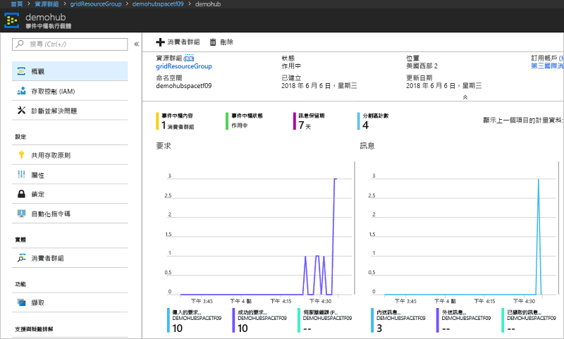

# <a name="route-custom-events-to-azure-event-hubs-with-azure-cli-and-event-grid"></a>使用 Azure CLI 和事件方格將自訂事件路由至 Azure 事件中樞

Azure Event Grid 是一項雲端事件服務。 Azure 事件中樞是其中一個支援的事件處理常式。 在本文中，您可使用 Azure CLI 建立自訂主題、訂閱主題，以及觸發事件來檢視結果。 您會將事件傳送到事件中樞。

[!INCLUDE [quickstarts-free-trial-note.md](../../includes/quickstarts-free-trial-note.md)]

## <a name="create-a-resource-group"></a>建立資源群組

Event Grid 為 Azure 資源，必須放入 Azure 資源群組中。 資源群組是在其中部署與管理 Azure 資源的邏輯集合。

使用 [az group create](/cli/azure/group#az_group_create) 命令來建立資源群組。 

下列範例會在 westus2 位置建立名為 gridResourceGroup 的資源群組。

```azurecli-interactive
az group create --name gridResourceGroup --location westus2
```

[!INCLUDE [event-grid-register-provider-cli.md](../../includes/event-grid-register-provider-cli.md)]

## <a name="create-a-custom-topic"></a>建立自訂主題

Event Grid 主題會提供使用者定義的端點，作為您發佈事件的目的地。 下列範例可在您的資源群組中建立自訂主題。 以主題的唯一名稱取代 `<your-topic-name>`。 主題名稱必須是唯一的，因為它由 DNS 項目表示。

```azurecli-interactive
topicname=<your-topic-name>
az eventgrid topic create --name $topicname -l westus2 -g gridResourceGroup
```

## <a name="create-event-hub"></a>建立事件中樞

訂閱主題之前，讓我們建立事件訊息的端點。 您將建立用來收集事件的事件中樞。

```azurecli-interactive
namespace=<unique-namespace-name>
hubname=demohub

az eventhubs namespace create --name $namespace --resource-group gridResourceGroup
az eventhubs eventhub create --name $hubname --namespace-name $namespace --resource-group gridResourceGroup
```

## <a name="subscribe-to-a-topic"></a>訂閱主題

您可訂閱主題，告知 Event Grid 您想要追蹤的事件。下列範例可訂閱您所建立的主題，以及傳遞端點的事件中樞資源識別碼。 端點的格式如下：

`/subscriptions/<subscription-id>/resourceGroups/<resource-group-name>/providers/Microsoft.EventHub/namespaces/<namespace-name>/eventhubs/<hub-name>`

下列指令碼會取得事件中樞的資源識別碼，並訂閱事件方格主題。 它會將端點類型設為 `eventhub`，然後使用端點的事件中樞識別碼。

```azurecli-interactive
hubid=$(az eventhubs eventhub show --name $hubname --namespace-name $namespace --resource-group gridResourceGroup --query id --output tsv)

az eventgrid event-subscription create \
  --topic-name $topicname \
  -g gridResourceGroup \
  --name subtoeventhub \
  --endpoint-type eventhub \
  --endpoint $hubid
```

## <a name="send-an-event-to-your-topic"></a>將事件傳送至主題

讓我們觸發事件以了解 Event Grid 如何將訊息散發至您的端點。 首先，讓我們取得自訂主題的 URL 和金鑰。

```azurecli-interactive
endpoint=$(az eventgrid topic show --name $topicname -g gridResourceGroup --query "endpoint" --output tsv)
key=$(az eventgrid topic key list --name $topicname -g gridResourceGroup --query "key1" --output tsv)
```

若要簡化這篇文章，您可使用要傳送至主題的範例事件資料。 一般而言，應用程式或 Azure 服務就會傳送事件資料。 CURL 是可傳送 HTTP 要求的公用程式。 本文使用 CURL 將事件傳送到主題。  下列範例會將三個事件傳送至事件方格主題：

```azurecli-interactive
for i in 1 2 3
do
   body=$(eval echo "'$(curl https://raw.githubusercontent.com/Azure/azure-docs-json-samples/master/event-grid/customevent.json)'")
   curl -X POST -H "aeg-sas-key: $key" -d "$body" $endpoint
done
```

請在入口網站中瀏覽至事件中樞，並注意事件方格會傳送這三個事件至事件中樞。



一般而言，您會建立從事件中樞擷取事件的應用程式。 若要建立從事件中樞取得訊息的應用程式，請參閱：

* [開始使用 .NET Standard 中的事件處理器主機來接收訊息](../event-hubs/event-hubs-dotnet-standard-getstarted-receive-eph.md)
* [使用 Java 從 Azure 事件中樞接收事件](../event-hubs/event-hubs-java-get-started-receive-eph.md)
* [使用 Apache Storm 從事件中樞接收事件](../event-hubs/event-hubs-storm-getstarted-receive.md)

## <a name="clean-up-resources"></a>清除資源
如果您打算繼續使用此事件，請勿清除在本文中建立的資源。 否則，請使用下列命令來刪除您在本文建立的資源。

```azurecli-interactive
az group delete --name gridResourceGroup
```

## <a name="next-steps"></a>後續步驟

您現在知道如何建立主題和事件訂閱，深入了解 Event Grid 可協助您：

- [關於 Event Grid](overview.md)
- [將 Blob 儲存體事件路由至自訂的 Web 端點](../storage/blobs/storage-blob-event-quickstart.md?toc=%2fazure%2fevent-grid%2ftoc.json)
- [使用 Azure Event Grid 和 Logic Apps 監視虛擬機器變更](monitor-virtual-machine-changes-event-grid-logic-app.md)
- [將巨量資料串流處理至資料倉儲](event-grid-event-hubs-integration.md)
