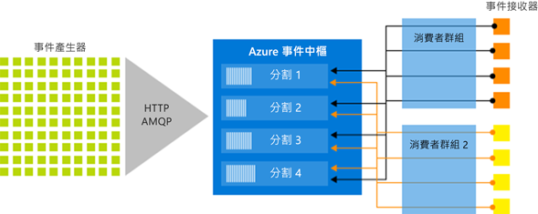

# Azure 事件中樞 — 巨量資料串流平台和事件擷取服務
Azure 事件中樞是巨量資料串流平台和事件擷取服務。 其每秒可接收和處理數百萬個事件。 傳送至事件中樞的資料可以透過任何即時分析提供者或批次/儲存體配接器來轉換和儲存。

下面是一些可以使用事件中樞的案例：

- 異常偵測 (詐騙/極端值)
- 應用程式記錄檔
- 分析管線 (例如點選流)
- 即時儀表板
- 封存資料
- 交易處理
- 使用者遙測處理
- 裝置遙測串流 

## 為何使用事件中樞？

只有在能輕鬆地處理資料並從資料來源中獲得即時見解時，資料才顯得有價值。 事件中樞提供低延遲的分散式串流處理平台，並與 Azure 內部或外部的資料及分析服務完美整合，藉以建置完整的巨量資料管線。

事件中樞代表事件管線的「大門」，在方案架構中通常稱為「事件擷取器」。 事件擷取器是介於事件發佈者和事件取用者之間的元件或服務，它能將事件串流的生產與這些事件的取用彼此脫鉤。 事件中樞提供具有時間保留緩衝的統一串流平台，可分開處理事件產生者和事件取用者。 

下列各節會說明 Azure 事件中樞服務的主要功能： 

## 完全受控 PaaS 

事件中樞是僅需一點設定或管理成本的完全受控平台即服務 (PaaS)，因此您可將重心放在商務解決方案上。 [Apache Kafka 生態系統的事件中樞](event-hubs-for-kafka-ecosystem-overview.md)提供您無須管理、設定或執行叢集的 PaaS Kafka 體驗。

## 支援即時和批次處理

即時內嵌、緩衝、儲存及處理您的資料流，以取得可採取動作的見解。 事件中樞會使用[分割的取用者模型](event-hubs-features.md#partitions)，可讓多個應用程式同時處理資料流，並讓您控制處理的速度。

近乎即時地[擷取 ](event-hubs-capture-overview.md)[Azure Blob 儲存體](https://azure.microsoft.com/services/storage/blobs/)或 [Azure Data Lake Storage](https://azure.microsoft.com/services/data-lake-store/)  中的資料，以用於長期保留或微批次處理。 您可以在用來取得即時分析的相同資料流上實現此行為。 擷取事件資料的作業很快就能設定完成。 執行作業時不需要系統管理成本，而且它可以針對事件中樞的 [輸送量單位](event-hubs-features.md#throughput-units)自動進行調整。 事件中樞可讓您專注於資料處理，而不是資料擷取。

Azure 事件中樞也整合了 [Azure Functions](/azure/azure-functions/) 來達到無伺服器架構。

## 可調整 

透過事件中樞，您可以先使用以 MB 為單位的資料流，然後成長到 GB 或 TB。 [自動擴充](event-hubs-auto-inflate.md)功能是用來調整輸送量單位數目以符合使用量需求的多個選項之一。 

## 豐富的生態系統

[Apache Kafka 生態系統的事件中樞](event-hubs-for-kafka-ecosystem-overview.md)可讓 [Apache Kafka (1.0 版和更新版本)](https://kafka.apache.org/) 用戶端和應用程式與事件中樞通訊。 您不需要設定、配置及管理您自己的 Kafka 叢集。
 
透過適用於各種[語言 (.NET、Java、Python、Go、Node.js)](https://github.com/Azure/azure-event-hubs) 的廣大生態系統，您可以輕鬆地開始處理來自事件中樞的串流。 所有支援的用戶端語言皆提供低階整合。 生態系統也可讓您緊密整合 Azure 串流分析和 Azure Functions 等 Azure 服務，進而讓您建置無伺服器的架構。

## 重要架構元件
事件中樞包含下列[重要元件](event-hubs-features.md)：

- **事件產生者**：將資料傳送至事件中樞的任何實體。 事件發佈者可以使用 HTTPS、AMQP 1.0 或 Apache Kafka (1.0 版或更新版本) 發佈事件
- **分割區**：每一個取用者只會讀取訊息資料流的特定子集或分割區。
- **取用者群組**：檢視整個事件中樞 (狀態、位置或位移) 的窗口。 取用者群組能讓取用應用程式各自擁有獨立的事件串流檢視。 取用應用程式會依自己的步調以及自己的位移獨立讀取串流。
- **輸送量單位**：預先購買的容量單位，可控制事件中樞的輸送量容量。
- **事件接收者**：從事件中樞讀取事件資料的任何實體。 所有事件中樞取用者均透過 AMQP 1.0 工作階段來連線。 事件中樞服務會透過工作階段傳遞可用的事件。 所有 Kafka 取用者都是透過 Kafka 通訊協定 1.0 和更新版本連線。

下圖顯示事件中樞串流處理架構︰

## 後續步驟

若要開始使用事件中樞，請參閱**傳送及接收事件**教學課程： 

- [.NET Core](event-hubs-dotnet-standard-getstarted-send.md)
- [.NET Framework](event-hubs-dotnet-framework-getstarted-send.md)
- [Java](event-hubs-java-get-started-send.md)
- [Python](event-hubs-python-get-started-send.md)
- [Node.js](event-hubs-node-get-started-send.md)
- [Go](event-hubs-go-get-started-send.md)
- [C (僅傳送)](event-hubs-c-getstarted-send.md)
- [Apache Storm (僅接收)](event-hubs-storm-getstarted-receive.md)

若要深入了解事件中樞，請參閱下列文章：

- [事件中樞功能概觀](event-hubs-features.md)
- [常見問題集](event-hubs-faq.md)。

