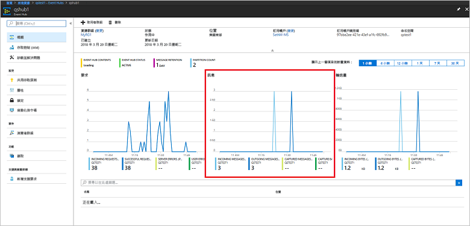

# <a name="quickstart-process-event-streams-using-azure-cli-and-java"></a>快速入門：使用 Azure CLI 和 Java 處理事件串流

Azure 事件中樞是可高度調整的資料串流平台和擷取服務，每秒可接收和處理數百萬個事件。 本快速入門會示範如何使用 Azure CLI 建立事件中樞資源，然後使用 Java 程式碼傳送及接收來自事件中樞的事件串流。

若要完成本快速入門，您需要 Azure 訂用帳戶。 如果您沒有 Azure 訂用帳戶，請在開始前[建立免費帳戶][]。

## <a name="prerequisites"></a>必要條件

[!INCLUDE [cloud-shell-try-it.md](../../includes/cloud-shell-try-it.md)]

如果您選擇在本機安裝和使用 Azure CLI，本教學課程會要求您執行 Azure CLI 2.0.4 版或更新版本。 執行 `az --version` 來檢查您的版本。 如果您需要安裝或升級，請參閱[安裝 Azure CLI 2.0]( /cli/azure/install-azure-cli)。

## <a name="log-on-to-azure"></a>登入 Azure

如果您在 Cloud Shell 中執行命令，則不需要執行下列步驟。 如果您在本機執行 CLI，請執行下列步驟來登入 Azure 並設定您目前的訂用帳戶：

執行下列命令以登入 Azure：

```azurecli-interactive
az login
```

設定目前的訂用帳戶環境。 以您要使用的 Azure 訂用帳戶名稱取代 `MyAzureSub`：

```azurecli-interactive
az account set --subscription MyAzureSub
``` 

## <a name="provision-resources"></a>佈建資源

發出下列命令以佈建事件中樞資源。 請務必以適當的值取代預留位置：`myResourceGroup`、`namespaceName``eventHubName` 和 `storageAccountName`：

```azurecli-interactive
# Create a resource group
az group create --name myResourceGroup --location eastus

# Create an Event Hubs namespace
az eventhubs namespace create --name namespaceName --resource-group myResourceGroup -l eastus2

# Create an event hub
az eventhubs eventhub create --name eventHubName --resource-group myResourceGroup --namespace-name namespaceName

# Create a general purpose standard storage account
az storage account create --name storageAccountName --resource-group myResourceGroup --location eastus2 --sku Standard_RAGRS --encryption blob

# List the storage account access keys
az storage account keys list --resource-group myResourceGroup --account-name storageAccountName

# Get namespace connection string
az eventhubs namespace authorization-rule keys list --resource-group myResourceGroup --namespace-name namespaceName --name RootManageSharedAccessKey
```

將複製連接字串並貼到暫存位置，例如 [記事本]，以供日後使用。

## <a name="stream-into-event-hubs"></a>串流至事件中樞

下一個步驟是下載範例程式碼，以將事件串流至事件中樞，並使用事件處理器主機接收這些事件。 首先，傳送訊息：

發出下列命令，以複製[事件中樞 GitHub 存放庫](https://github.com/Azure/azure-event-hubs)︰

```bash
git clone https://github.com/Azure/azure-event-hubs.git
```

瀏覽至 **SimpleSend** 資料夾：`\azure-event-hubs\samples\Java\Basic\SimpleSend\src\main\java\com\microsoft\azure\eventhubs\samples\SimpleSend`。 開啟 SimpleSend.java 檔案，並以在本文＜建立事件中樞命名空間＞一節中取得的事件中樞命名空間取代 `"Your Event Hubs namaspace name"` 字串。

以您在該命名空間內建立的事件中樞名稱取代 `"Your event hub"`，並以命名空間的共用存取原則名稱取代 `"Your policy name"`。 除非您已建立新的原則，否則預設值是 **RootManageSharedAccessKey**。 

最後，以上一個步驟中的原則 SAS 金鑰值取代 `"Your primary SAS key"`。

### <a name="build-the-application"></a>建置應用程式 

往回瀏覽到 `\azure-event-hubs\samples\Java\Basic\SimpleSend` 資料夾，並發出下列建置命令：

```shell
mvn clean package -DskipTests
```

### <a name="receive"></a>接收

現在，下載事件處理器主機範例來接收您剛傳送的訊息。 瀏覽至 **EventProcessorSample** 資料夾：`\azure-event-hubs\samples\Java\Basic\EventProcessorSample\src\main\java\com\microsoft\azure\eventhubs\samples\eventprocessorsample`。

在 EventProcessorSample.java 檔案中，以在本文＜建立事件中樞命名空間＞一節中取得的事件中樞命名空間取代 `----EventHubsNamespaceName-----` 值。 

取代此檔案中的其他字串：以您在該命名空間內建立的事件中樞名稱取代 `----EventHubName-----`，並以命名空間的共用存取原則名稱取代 `-----SharedAccessSignatureKeyName-----`。 除非您已建立新的原則，否則預設值是 **RootManageSharedAccessKey**。

以上一個步驟中的原則 SAS 金鑰值取代 `---SharedAccessSignatureKey----`、以您建立的儲存體帳戶連接字串取代 `----AzureStorageConnectionString----`，並以所建儲存體帳戶下的容器名稱取代 `----StorageContainerName----`。 

最後，使用儲存體帳戶名稱取代 `----HostNamePrefix----`。

### <a name="build-the-receiver"></a>建置接收器 

若要建置接收應用程式，請瀏覽至 `\azure-event-hubs\samples\Java\Basic\EventProcessorSample` 資料夾，然後發出下列命令：

```shell
mvn clean package -DskipTests
```

### <a name="run-the-apps"></a>執行應用程式

如果建置順利完成，即可準備傳送與接收事件。 首先，執行 **SimpleSend** 應用程式，並觀察正在傳送的事件。 若要執行程式，請瀏覽至 `\azure-event-hubs\samples\Java\Basic\SimpleSend` 資料夾，並發出下列命令：

```shell
java -jar ./target/simplesend-1.0.0-jar-with-dependencies.jar
```

接下來，執行 **EventProcessorSample** 應用程式，並觀察正在接收的事件。 若要執行程式，請瀏覽至 `\azure-event-hubs\samples\Java\Basic\EventProcessorSample` 資料夾，並發出下列命令：
   
```shell
java -jar ./target/eventprocessorsample-1.0.0-jar-with-dependencies.jar
```

執行這兩個程式之後，您可以從 Azure 入口網站概觀頁面檢查事件中樞，以查看傳入和傳出的訊息計數：



## <a name="clean-up-resources"></a>清除資源

執行下列命令來移除資源群組、命名空間、儲存體帳戶和所有相關資源。 以您建立的資源群組名稱取代 `myResourceGroup`：

```azurecli
az group delete --resource-group myResourceGroup
```

## <a name="understand-the-sample-code"></a>了解範例程式碼

本節將詳細說明範例程式碼的功能。

### <a name="send"></a>傳送

在 SimpleSend.java 檔案中，大部分工作是以 main() 方法完成。 首先，程式碼會使用 `ConnectionStringBuilder` 執行個體，以利用命名空間名稱、事件中樞名稱、SAS 金鑰名稱和 SAS 金鑰本身的使用者定義值建構連接字串：

```java
final ConnectionStringBuilder connStr = new ConnectionStringBuilder()
        .setNamespaceName("Your Event Hubs namespace name")
        .setEventHubName("Your event hub")
        .setSasKeyName("Your policy name")
        .setSasKey("Your primary SAS key");
```

包含事件裝載的 Java 物件會接著轉換為 Json：

```java
final Gson gson = new GsonBuilder().create();

final PayloadEvent payload = new PayloadEvent(1);
byte[] payloadBytes = gson.toJson(payload).getBytes(Charset.defaultCharset());
EventData sendEvent = EventData.create(payloadBytes);  
```

這行程式碼會建立事件中樞用戶端：

```java
final EventHubClient ehClient = EventHubClient.createSync(connStr.toString(), executorService);
```

try/finally 區塊會傳送一個事件循環配置資源到非指定的分割區：

```java
try {
    for (int i = 0; i < 100; i++) {

        String payload = "Message " + Integer.toString(i);
        //PayloadEvent payload = new PayloadEvent(i);
        byte[] payloadBytes = gson.toJson(payload).getBytes(Charset.defaultCharset());
        EventData sendEvent = EventData.create(payloadBytes);

        // Send - not tied to any partition
        // Event Hubs service will round-robin the events across all EventHubs partitions.
        // This is the recommended & most reliable way to send to EventHubs.
        ehClient.sendSync(sendEvent);
    }

    System.out.println(Instant.now() + ": Send Complete...");
    System.in.read();
} finally {
    ehClient.closeSync();
    executorService.shutdown();
}
```

### <a name="receive"></a>接收 

接收作業會發生在 EventProcessorSample.java 檔案中。 首先，它會宣告常數來保存事件中樞命名空間名稱和其他認證：

```java
String consumerGroupName = "$Default";
String namespaceName = "----NamespaceName----";
String eventHubName = "----EventHubName----";
String sasKeyName = "----SharedAccessSignatureKeyName----";
String sasKey = "----SharedAccessSignatureKey----";
String storageConnectionString = "----AzureStorageConnectionString----";
String storageContainerName = "----StorageContainerName----";
String hostNamePrefix = "----HostNamePrefix----";
```

類似於 SimpleSend 程式，程式碼會接著建立 ConnectionStringBuilder 執行個體來建構連接字串：

```java
ConnectionStringBuilder eventHubConnectionString = new ConnectionStringBuilder()
    .setNamespaceName(namespaceName)
    .setEventHubName(eventHubName)
    .setSasKeyName(sasKeyName)
    .setSasKey(sasKey);
```

「事件處理器主機」是一個類別，透過管理持續檢查點以及來自事件中樞的平行接收，簡化來自事件中樞事件的接收作業。 程式碼現在會建立 `EventProcessorHost` 的執行個體：

```java
EventProcessorHost host = new EventProcessorHost(
    EventProcessorHost.createHostName(hostNamePrefix),
    eventHubName,
    consumerGroupName,
    eventHubConnectionString.toString(),
    storageConnectionString,
    storageContainerName);
```

宣告一些錯誤處理程式碼之後，應用程式接著會定義 `EventProcessor` 類別，也就是 `IEventProcessor` 介面的實作。 此類別會處理已接收的事件：

```java
public static class EventProcessor implements IEventProcessor
{
    private int checkpointBatchingCount = 0;
    ...
```

當事件中樞的此分割區上收到事件時，便會呼叫`onEvents()` 方法：

```java
@Override
public void onEvents(PartitionContext context, Iterable<EventData> events) throws Exception
{
    System.out.println("SAMPLE: Partition " + context.getPartitionId() + " got event batch");
    int eventCount = 0;
    for (EventData data : events)
    {
        try
        {
         System.out.println("SAMPLE (" + context.getPartitionId() + "," + data.getSystemProperties().getOffset() + "," +
                data.getSystemProperties().getSequenceNumber() + "): " + new String(data.getBytes(), "UTF8"));
             eventCount++;
                
         // Checkpointing persists the current position in the event stream for this partition and means that the next
         // time any host opens an event processor on this event hub+consumer group+partition combination, it will start
         // receiving at the event after this one. Checkpointing is usually not a fast operation, so there is a tradeoff
         // between checkpointing frequently (to minimize the number of events that will be reprocessed after a crash, or
         // if the partition lease is stolen) and checkpointing infrequently (to reduce the impact on event processing
         // performance). Checkpointing every five events is an arbitrary choice for this sample.
         this.checkpointBatchingCount++;
         if ((checkpointBatchingCount % 5) == 0)
         {
            System.out.println("SAMPLE: Partition " + context.getPartitionId() + " checkpointing at " +
                    data.getSystemProperties().getOffset() + "," + data.getSystemProperties().getSequenceNumber());
            // Checkpoints are created asynchronously. It is important to wait for the result of checkpointing
            // before exiting onEvents or before creating the next checkpoint, to detect errors and to ensure proper ordering.
            context.checkpoint(data).get();
         }
    }
        catch (Exception e)
        {
            System.out.println("Processing failed for an event: " + e.toString());
        }
    }
    System.out.println("SAMPLE: Partition " + context.getPartitionId() + " batch size was " + eventCount + " for host " + context.getOwner());
}
```

## <a name="next-steps"></a>後續步驟

在本文中，您已建立從事件中樞傳送和接收事件所需的事件中樞命名空間和其他資源。 若要深入了解，請繼續下列教學課程：

> [!div class="nextstepaction"]
> [在事件中樞資料流上將資料異常視覺化](event-hubs-tutorial-visualize-anomalies.md)

[建立免費帳戶]: https://azure.microsoft.com/free/?ref=microsoft.com&utm_source=microsoft.com&utm_medium=docs&utm_campaign=visualstudio
[Install Azure CLI 2.0]: /cli/azure/install-azure-cli
[az group create]: /cli/azure/group#az-group-create
[fully qualified domain name]: https://wikipedia.org/wiki/Fully_qualified_domain_name
