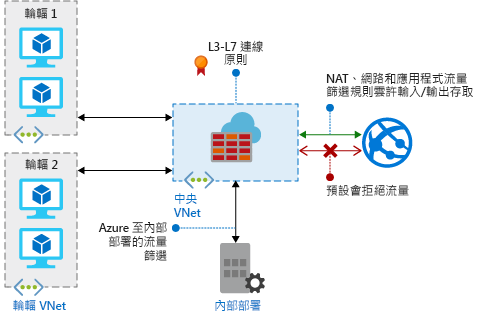

# 何謂 Azure 防火牆？

Azure 防火牆是受控、雲端式網路安全性服務，可以保護您的 Azure 虛擬網路資源。 它是完全具狀態防火牆即服務，具有內建的高可用性和不受限制的雲端延展性。 

您可以橫跨訂用帳戶和虛擬網路集中建立、強制執行以及記錄應用程式和網路連線原則。 Azure 防火牆會針對您的虛擬網路資源使用靜態公用 IP 位址，允許外部防火牆識別源自您虛擬網路的流量。  此服務與 Azure 監視器會完全整合，以進行記錄和分析。

## 特性

Azure 防火牆提供下列功能：

### 內建高可用性
高可用性是內建的，因此不需要額外的負載平衡器，您也不需要進行任何設定。

### 不受限制的雲端延展性 
Azure 防火牆可以隨著您的需求相應增加，以容納多變的網路流量，因此您不需要為尖峰流量編列預算。

### 應用程式 FQDN 篩選規則

您可以將輸出 HTTP/S 流量限制為包含萬用字元的特殊完整網域名稱 (FQDN) 清單。 這項功能不需要 SSL 終止。

### 網路流量篩選規則

您可以依據來源和目的地 IP 位址、連接埠及通訊協定，集中建立「允許」或「拒絕」網路篩選規則。 Azure 防火牆是完全具狀態的，因此能夠分辨不同連線類型的合法封包。 規則會橫跨多個訂用帳戶和虛擬網路強制執行及記錄。

### FQDN 標記

FQDN 標籤讓您輕鬆就能允許已知的 Azure 服務網路流量通過您的防火牆。 例如，假設您想要允許 Windows Update 網路流量通過您的防火牆。 您可以建立應用程式規則並包含 Windows Update 標籤。 來自 Windows Update 的網路流量現在就能通過您的防火牆。

### 輸出 SNAT 支援

所有輸出虛擬網路流量 IP 位址都會轉譯成 Azure 防火牆公用 IP (來源網路位址轉譯)。 您可以識別源自您虛擬網路的流量，並且允許其流向遠端網際網路目的地。

### 輸入 DNAT 支援

傳送到您防火牆公用 IP 位址的輸入網路流量會轉譯 (目的地網路位址轉譯)，並篩選至您虛擬網路上的私人 IP 位址。 

### Azure 監視器記錄

所有事件都會與 Azure 監視器整合，讓您可以將記錄封存至儲存體帳戶、將事件串流至事件中樞，或者將它們傳送到 Log Analytics。

## 已知問題

Azure 防火牆有下列已知問題：

|問題  |說明  |緩和  |
|---------|---------|---------|
|與 Azure 資訊安全中心 (ASC) Just-in-Time (JIT) 功能的衝突|如果使用 JIT 存取虛擬機器，且虛擬機器位於子網路中，且該子網路具有指向 Azure 防火牆作為預設閘道的使用者定義路由，則 ASC JIT 無法運作。 這是非對稱式路由的結果 - 封包透過虛擬機器公用 IP (JIT 已開啟存取權) 傳入，但是傳回路徑會透過防火牆，這樣會因為在防火牆上未建立任何工作階段，而捨棄封包。|若要解決此問題，請將 JIT 虛擬機器放置於不同的子網路，其中沒有防火牆的使用者定義路由。|
|不支援具有全域對等互連的中樞和輪輻|使用中樞和輪輻模型，其中，中樞和防火牆是部署在某個 Azure 區域，而輪輻則部署在另一個 Azure 區域。 不支援透過全域 VNet 對等互連連線至中樞。|原先的設計就是如此。 如需詳細資訊，請參閱 [Azure 訂用帳戶和服務限制、配額與條件約束](../azure-subscription-service-limits.md#azure-firewall-limits)|
非 TCP/UDP 通訊協定 (例如 ICMP) 的網路篩選規則，不適用於流向網際網路的流量|非 TCP/UDP 通訊協定的網路篩選規則，無法與 SNAT 搭配用於您的公用 IP 位址。 在輪輻子網路與 VNet 之間支援非 TCP/UDP 通訊協定。|Azure 防火牆會使用 Standard Load Balancer，[目前針對 IP 通訊協定不支援 SNAT](https://docs.microsoft.com/azure/load-balancer/load-balancer-standard-overview#limitations)。 我們正在探索選項，以在未來的版本中支援這種案例。|
|對於 ICMP 缺少 PowerShell 和 CLI 支援|Azure PowerShell 和 CLI 不支援在網路規則中將 ICMP 作為有效的通訊協定。|您仍可透過入口網站和 REST API 來使用 ICMP 作為通訊協定。 我們正努力盡快在 PowerShell 和 CLI 中新增 ICMP。|
|FQDN 標籤需要設定「通訊協定:連接埠」|具有 FQDN 標籤的應用程式規則需要「連接埠:通訊協定」定義。|您可以使用 **https** 作為「連接埠:通訊協定」值。 我們正努力讓此欄位在使用 FQDN 標籤時可作為選擇性欄位。|
|不支援將防火牆移動到不同的資源群組或訂用帳戶|不支援將防火牆移動到不同的資源群組或訂用帳戶。|在我們的規劃中，未來會支援這項功能。 若要將防火牆移動到不同的資源群組或訂用帳戶，您必須刪除目前的執行個體，並將其重新建立在新的資源群組或訂用帳戶中。|
|網路和應用程式規則中的連接埠範圍|連接埠限制為 64,000 個，因為高連接埠保留給管理與健康情況探查。 |我們正努力放寬這項限制。|
|

## 後續步驟

- [教學課程：使用 Azure 入口網站部署和設定 Azure 防火牆](tutorial-firewall-deploy-portal.md)
- [使用範本來部署 Azure 防火牆](deploy-template.md)
- [建立 Azure 防火牆測試環境](scripts/sample-create-firewall-test.md)

