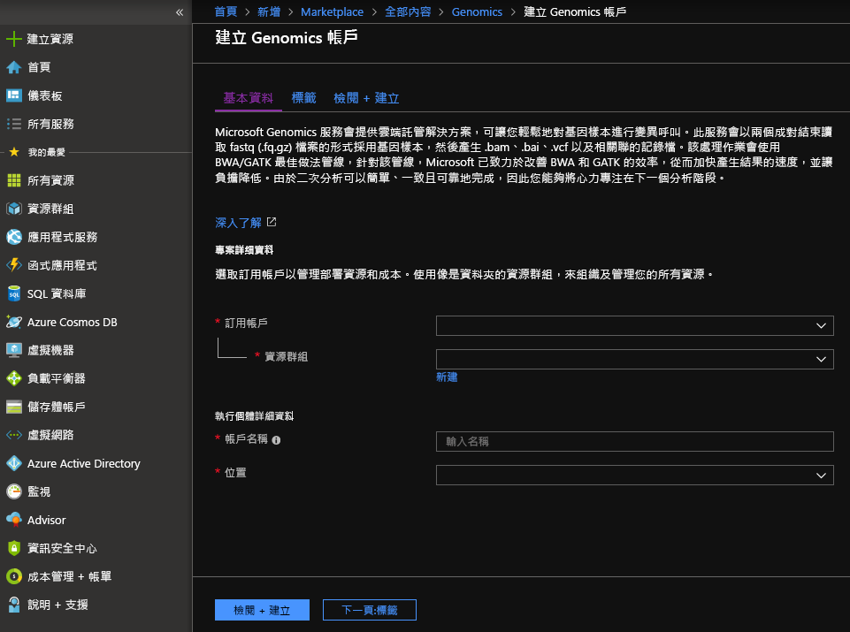
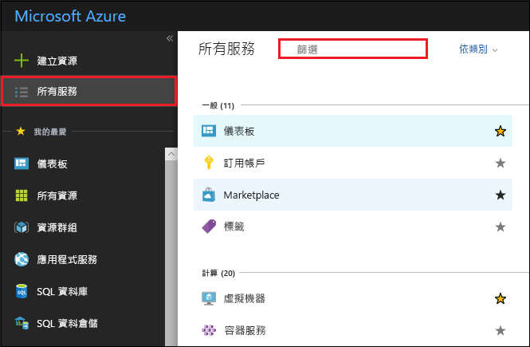
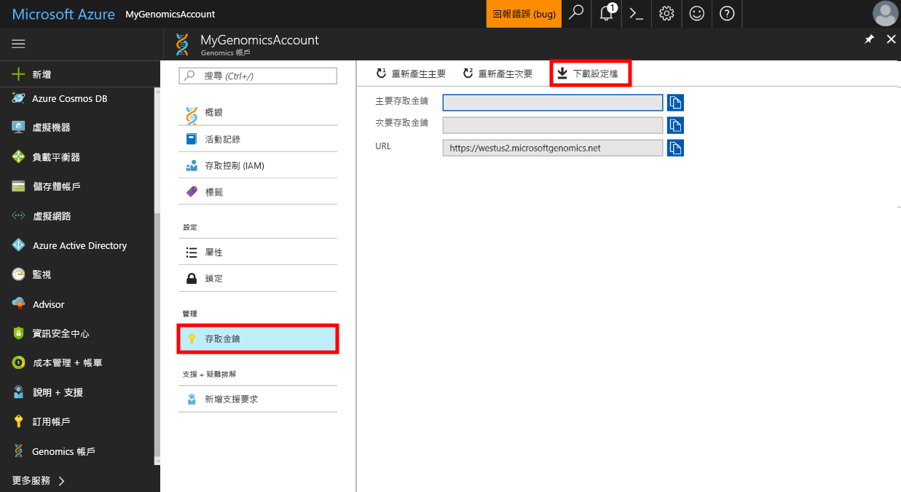

# <a name="quickstart-run-a-workflow-through-the-microsoft-genomics-service"></a>快速入門：透過 Microsoft Genomics 服務執行工作流程

Microsoft Genomics 是用於基因組次級分析的可調式安全服務，可快速處理基因組，從原始讀取開始，並產生對齊的讀取和變數呼叫。 只需幾個步驟就可開始使用： 
1.  設定：透過 Azure 入口網站建立 Microsoft Genomics 帳戶，並在本機環境中安裝 Microsoft Genomics Python 用戶端。 
2.  上傳輸入資料：透過 Azure 入口網站建立 Microsoft Azure 儲存體帳戶，並上傳輸入檔案。 必須配對並讀取輸入檔案 (fastq 或 bam 檔案)。
3.  執行：使用 Microsoft Genomics 命令列介面，透過 Microsoft Genomics 服務執行工作流程。 

如需有關 Microsoft Genomics 的詳細資訊，請參閱[什麼是 Microsoft Genomics？](overview-what-is-genomics.md)

## <a name="set-up-create-a-microsoft-genomics-account-in-the-azure-portal"></a>設定：在 Azure 入口網站中建立 Microsoft Genomics 帳戶

若要建立 Microsoft Genomics 帳戶，請瀏覽至 [Azure 入口網站](https://portal.azure.com/#create/Microsoft.Genomics)。 如果您還沒有 Azure 訂用帳戶，請在建立 Microsoft Genomics 帳戶之前先建立一個。 




使用下列資訊設定 Genomics 帳戶，如上圖所示。 

 |**設定**          |  **建議的值**  | **欄位描述** |
 |:-------------       |:-------------         |:----------            |
 |帳戶名稱         | MyGenomicsAccount     |請選擇唯一的帳戶識別碼。 如需有效的名稱，請參閱[命名規則](https://docs.microsoft.com/azure/architecture/best-practices/naming-conventions) |
 |訂用帳戶         | 您的訂用帳戶名稱|這是您 Azure 服務的計費單位 - 如需關於您訂用帳戶的詳細資訊，請參閱[訂用帳戶](https://account.azure.com/Subscriptions) |      
 |資源群組       | MyResourceGroup       |  資源群組可讓您將多個 Azure 資源 (儲存體帳戶、Genomics 帳戶等) 群組為單一群組來簡化管理。 如需詳細資訊，請參閱 [資源群組] (https://docs.microsoft.com/azure/azure-resource-manager/resource-group-overview#resource-groups)。 如需有效的資源群組名稱，請參閱[命名規則](https://docs.microsoft.com/azure/architecture/best-practices/naming-conventions) |
 |位置                   | 美國西部 2                    |    可在美國西部 2、西歐和東南亞提供服務 |


您可以按一下頂端功能表列中的 [通知] 來監視部署程序。


## <a name="set-up-install-the-microsoft-genomics-python-client"></a>設定：安裝 Microsoft Genomics Python 用戶端

使用者必須在其本機環境中安裝 Python 和 Microsoft Genomics Python 用戶端。 

### <a name="install-python"></a>安裝 Python

Microsoft Genomics Python 用戶端與 Python 2.7 相容。 建議您使用 2.7.12 版或更新版本；2.7.14 是建議版本。 您可以在[這裡](https://www.python.org/downloads/)找到下載。 


### <a name="install-the-microsoft-genomics-client"></a>安裝 Microsoft Genomics 用戶端

使用 Python pip 來安裝 Microsoft Genomics 用戶端 `msgen`。 下列指示假設 Python 已在您的系統路徑中。 如果您遇到 pip 安裝無法辨識的問題，必須將 Python 和指令碼子資料夾新增至您的系統路徑。


```
pip install --upgrade --no-deps msgen
pip install msgen
```


如果您不需要安裝 `msgen` 作為全系統的二進位及修改全系統的 Python 套件，請使用 `–-user` 旗標與 `pip`。
如果您使用的是以套件為基礎的安裝或 setup.py，就已安裝所有必要套件。 否則，msgen 的基本必要套件為 

 * [Azure-storage](https://pypi.python.org/pypi/azure-storage)。 
 * [要求](https://pypi.python.org/pypi/requests)。 


您可以使用 `pip`、`easy_install` 或透過標準 `setup.py` 程序來安裝這些套件。 


### <a name="test-the-microsoft-genomics-client"></a>測試 Microsoft Genomics 用戶端
若要測試 Microsoft Genomics 用戶端，請從 Genomics 帳戶下載設定檔。 按一下左上方的 [所有服務]、進行篩選，然後選取 Genomics 帳戶，即可瀏覽至 Genomics 帳戶。





選取您剛建立的 Genomics 帳戶，瀏覽至 [存取金鑰]，並下載設定檔。




測試 Microsoft Genomics Python 用戶端可使用下列命令


```
msgen list -f “<full path where you saved the config file>”
```

## <a name="create-a-microsoft-azure-storage-account"></a>建立 Microsoft Azure 儲存體帳戶 
Microsoft Genomics 服務預期會輸入儲存為 Azure 儲存體帳戶中的區塊 blob。 它也會將輸出檔案作為區塊 Blob 寫入 Azure 儲存體帳戶中的使用者指定容器。 輸入和輸出可以位於不同的儲存體帳戶中。
如果您在 Azure 儲存體帳戶中已擁有您的資料，就只需要確定資料與 Genomics 帳戶在相同的位置。 否則，執行 Genomics 服務時，就會產生輸出費用。 如果您還沒有 Microsoft Azure 儲存體帳戶，就需要加以建立並上傳您的資料。 您可以在[這裡](https://docs.microsoft.com/azure/storage/common/storage-create-storage-account)找到更多 Azure 儲存體帳戶的相關資訊，包括儲存體帳戶的說明，以及它所提供的服務。 若要建立 Microsoft Azure 儲存體帳戶，請瀏覽至 [Azure 入口網站](https://portal.azure.com/#create/Microsoft.StorageAccount-ARM )。  


使用下列資訊設定儲存體帳戶，如上圖所示。 使用儲存體帳戶的大部分標準選項，僅將帳戶指定為 blob 儲存體，而非一般用途。 Blob 儲存體的下載及上傳速度可能快 2-5 倍。 


 |**設定**          |  **建議的值**  | **欄位描述** |
 |:-------------------------       |:-------------         |:----------            |
 |Name         | MyStorageAccount     |請選擇唯一的帳戶識別碼。 如需有效的名稱，請參閱[命名規則](https://docs.microsoft.com/azure/architecture/best-practices/naming-conventions) |
 |部署模型         | Resource Manager| Resource Manager 是建議的部署模型。 如需詳細資訊，請參閱[了解資源管理員部署](https://docs.microsoft.com/azure/azure-resource-manager/resource-manager-deployment-model) |      
 |帳戶類型       | Blob 儲存體       |  Blob 儲存體的下載及上傳速度可能比一般用途的快 2-5 倍。 |
 |效能                  | 標準                   | 預設值是 [標準]。 如需標準和進階儲存體帳戶的詳細資訊，請參閱 [Microsoft Azure 儲存體簡介](https://docs.microsoft.com/azure/storage/common/storage-introduction)    |
 |複寫                  | 本地備援儲存體                  | 本地備援儲存體會在您建立儲存體帳戶的區域資料中心內複寫資料。 如需詳細資訊，請參閱 [Azure 儲存體複寫](https://docs.microsoft.com/azure/storage/common/storage-redundancy)    |
 |需要安全傳輸                  | 已停用                 | 預設值為停用。 如需有關資料傳輸安全性的詳細資訊，請參閱[需要安全傳輸](https://docs.microsoft.com/azure/storage/common/storage-require-secure-transfer)    |
 |存取層                  | 經常性存取                   | 經常性存取表示會更頻繁地存取儲存體帳戶中的物件。    |
 |訂用帳戶         | 您的 Azure 訂用帳戶 |如需訂用帳戶的詳細資訊，請參閱[訂用帳戶](https://account.azure.com/Subscriptions) |      
 |資源群組       | MyResourceGroup       |  您可以選取相同的資源群組作為 Genomics 帳戶。 如需有效的資源群組名稱，請參閱[命名規則](https://docs.microsoft.com/azure/architecture/best-practices/naming-conventions) |
 |位置                  | 美國西部 2                  | 使用相同位置作為 Genomics 帳戶的位置，可減少輸出費用並降低延遲。 可在美國西部2、美國西部 2、西歐和東南亞提供 Genomics 服務    |
 |虛擬網路                | 已停用                   | 預設值為停用。 如需詳細資訊，請參閱 [Azure 虛擬網路](https://docs.microsoft.com/azure/storage/common/storage-network-security)    |


然後，按一下 [建立] 來建立儲存體帳戶。 如同建立 Genomics 帳戶，您可以按一下最上層功能表列中的 [通知] 來監視部署程序。 


## <a name="upload-input-data-to-your-storage-account"></a>將輸入資料上傳至儲存體帳戶

Microsoft Genomics 服務預期會使用配對的結束讀取作為輸入檔案。 您可以選擇要上傳自己的資料，或是使用提供給您的公開可用範例資料進行瀏覽。 如果您要使用公開可用的範例資料，它會裝載在這裡：


[https://msgensampledata.blob.core.windows.net/small/chr21_1.fq.gz](https://msgensampledata.blob.core.windows.net/small/chr21_1.fq.gz)
[https://msgensampledata.blob.core.windows.net/small/chr21_2.fq.gz](https://msgensampledata.blob.core.windows.net/small/chr21_2.fq.gz)


在儲存體帳戶內，您必須建立一個輸入資料的 blob 容器，和輸出資料的第二個 blob 容器。  將輸入資料上傳到您的輸入 blob 容器。 您可使用各種工具來執行，包括 [Microsoft Azure 儲存體總管](https://azure.microsoft.com/features/storage-explorer/)、[blobporter](https://github.com/Azure/blobporter) 或 [AzCopy](https://docs.microsoft.com/azure/storage/common/storage-use-azcopy?toc=%2fazure%2fstorage%2fblobs%2ftoc.json)。 


## <a name="run-a-workflow-through-the-microsoft-genomics-service-using-the-python-client"></a>使用 Python 用戶端透過 Microsoft Genomics 服務執行工作流程 

若要透過 Microsoft Genomics 服務來執行工作流程，可編輯 config.txt 檔案來指定您資料的輸入和輸出儲存體容器。
開啟您從 Genomics 帳戶下載的 config.txt 檔案。 您必須指定的小節包括您的訂用帳戶金鑰，以及底部的六個項目、儲存體帳戶名稱、輸入和輸出的金鑰與容器名稱。 您可以在入口網站中瀏覽至儲存體帳戶的 [存取金鑰]，或直接從 Azure 儲存體總管找到這項資訊。  


### <a name="submit-your-workflow-to-the-microsoft-genomics-service-the-microsoft-genomics-client"></a>將工作流程提交至 Microsoft Genomics 用戶端 Microsoft Genomics 服務

使用 Microsoft Genomics Python 用戶端搭配下列命令來提交工作流程：


```python
msgen submit -f [full path to your config file] -b1 [name of your first paired end read] -b2 [name of your second paired end read]
```


您可以使用下列命令來檢視工作流程的狀態： 
```python
msgen list -f c:\temp\config.txt 
```


一旦工作流程完成後，您可以在所設定的輸出容器中檢視 Azure 儲存體帳戶的輸出檔案。 


## <a name="next-steps"></a>後續步驟
在本文中，您已將範例輸入資料上傳到 Azure 儲存體，並已透過 `msgen` Python 用戶端將工作流程提交至 Microsoft Genomics 服務。 若要了解有關可與 Microsoft Genomics 服務搭配使用的其他輸入檔案類型詳細資訊，請參閱下列頁面：[配對的 FASTQ](quickstart-input-pair-FASTQ.md) | [BAM](quickstart-input-BAM.md) | [多個 FASTQ 或 BAM](quickstart-input-multiple.md)。 您也可以使用我們的 [Azure Notebook 教學課程](http://aka.ms/genomicsnotebook)來探索此教學課程。