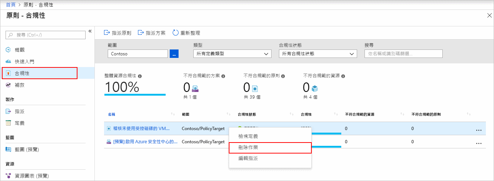

# 使用 Resource Manager 建立原則指派以識別不相容資源

了解 Azure 中合規性的第一個步驟是識別您資源的狀態。
本快速入門會逐步引導您完成程序來建立原則指派，以識別出未使用受控磁碟的虛擬機器。

在此程序結束時，您將會成功識別出未使用受控磁碟的虛擬機器。 它們「不符合」原則指派的規範。

如果您沒有 Azure 訂用帳戶，請在開始前建立[免費帳戶](https://azure.microsoft.com/free/)。

## 建立原則指派

在本快速入門中，您會建立一個原則指派，並且指派名為「稽核未使用受控磁碟的 VM」的內建原則定義。 如需可用內建原則的部分清單，請參閱[原則範例](./samples/index.md)。

有數種方法可建立原則指派。 在本快速入門中，您可以使用[快速入門範本](https://azure.microsoft.com/resources/templates/101-azurepolicy-assign-builtinpolicy-resourcegroup/)。
以下是範本的複本：

[!code-json[policy-assignment](~/quickstart-templates/101-azurepolicy-assign-builtinpolicy-resourcegroup/azuredeploy.json)]

> [!NOTE]
> Azure 原則服務是免費的。  如需詳細資訊，請參閱 [Azure 原則概觀](./overview.md)。

1. 選取以下影像來登入 Azure 入口網站並開啟範本：

   

1. 選取或輸入下列值：

   | Name | 值 |
   |------|-------|
   | 訂用帳戶 | 選取 Azure 訂用帳戶。 |
   | 資源群組 | 選取 [新建]指定名稱，然後選取 [確定]。 在螢幕擷取畫面中，資源群組名稱為 *mypolicyquickstart\<MMDD 格式的日期>rg*。 |
   | 位置 | 選取區域。 例如，**美國中部**。 |
   | 原則指派名稱 | 指定原則指派名稱。 若有需要，您可以使用原則定義顯示。 例如，「稽核未使用受控磁碟的 VM」。 |
   | Rg 名稱 | 指定您要指派原則的資源群組名稱。 在本快速入門中，使用預設值 [resourceGroup().name]。 **[resourceGroup()](../../azure-resource-manager/resource-group-template-functions-resource.md#resourcegroup)** 是擷取資源群組的範本函式。 |
   | 原則定義識別碼 | 指定 **/providers/Microsoft.Authorization/policyDefinitions/0a914e76-4921-4c19-b460-a2d36003525a**。 |
   | 我同意上方所述的條款及條件 | (選取) |

1. 選取 [購買]。

一些其他資源：

- 若要尋找更多範例範本，請參閱 [Azure 快速入門範本](https://azure.microsoft.com/resources/templates/?resourceType=Microsoft.Authorization&pageNumber=1&sort=Popular)。
- 若要查看範本參考，請前往 [Azure 範本參考](/azure/templates/microsoft.authorization/allversions)。
- 若要了解如何開發 Resource Manager 範本，請參閱 [Azure Resource Manager 文件](/azure/azure-resource-manager/)。
- 若要了解訂用帳戶層級的部署，請參閱[在訂用帳戶層級建立資源群組和資源](../../azure-resource-manager/deploy-to-subscription.md)。

## 識別不相容的資源

選取頁面左側的 [合規性]。 接著，找出您所建立的 [稽核未使用受控磁碟的虛擬機器] 原則指派。

如果有任何現有資源不符合這個新指派的規範，它們會顯示在 [不符合規範的資源] 下。

如需詳細資訊，請參閱[合規性的運作方式](./how-to/get-compliance-data.md#how-compliance-works)。

## 清除資源

若要移除所建立的指派，請遵循下列步驟：

1. 選取 Azure 原則分頁左半部的 [合規性] (或 [指派])，並找出您所建立的 [稽核不是使用受控磁碟的 VM] 原則指派。

1. 以滑鼠右鍵按一下 [稽核不是使用受控磁碟的 VM] 原則指派，並選取 [刪除指派]。

   

## 後續步驟

在本快速入門中，您會將內建的原則定義指派至範圍，並評估其更新狀態報告。 原則定義可驗證範圍中的所有資源都符合規範，並且識別哪些資源不符合。

若要深入了解指派原則，以驗證新資源是相容的，請繼續進行以下的教學課程：

> [!div class="nextstepaction"]
> [建立及管理原則](./tutorials/create-and-manage.md)