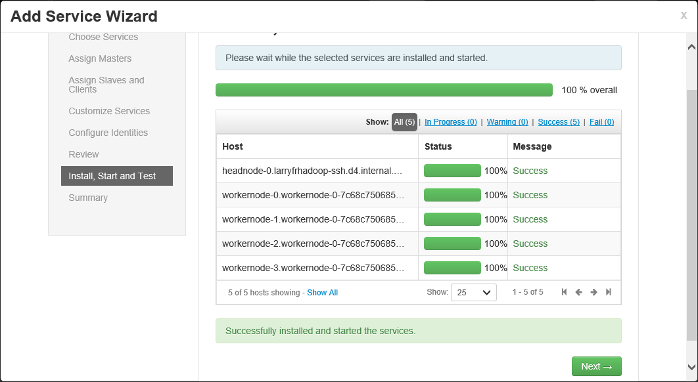

<properties
   pageTitle="使用 Ambari 管理 HDInsight 叢集 | Aure"
   description="了解如何使用 Ambari 來監視和管理以 Linux 為基礎的 HDInsight 叢集。"
   services="hdinsight"
   documentationCenter=""
   authors="Blackmist"
   manager="paulettm"
   editor="cgronlun"/>

<tags
   ms.service="hdinsight"
   ms.devlang=""
   ms.topic="article"
   ms.tgt_pltfrm="na"
   ms.workload="big-data"
   ms.date="02/18/2015"
   ms.author="larryfr"/>

#使用 Ambari 管理 HDInsight 叢集 (預覽)

了解如何使用 Ambari 管理和監視以 Linux 為基礎的 HDInsight 叢集。

> [AZURE.NOTE] 本文的多數資訊僅適用於以 Linux 為基礎的 HDInsight 叢集。若為以 Windows 為基礎的 HDInsight 叢集，則只能透過 Ambari REST API 進行監視。請參閱 [在 HDInsight 使用 Ambari API 監視以 Windows 為基礎的 Hadoop]。(../hdinsight-monitor-use-ambari-api/)。

##什麼是 Ambari？

<a href="http://ambari.apache.org" target="_blank">Apache Ambari</a> 提供簡單易用的 Web UI，以供用來佈建、管理及監視 Hadoop 叢集，讓 Hadoop 管理起來更為簡單。開發人員可以使用 <a href="https://github.com/apache/ambari/blob/trunk/ambari-server/docs/api/v1/index.md" target="_blank">Ambari REST API</a> 將這些功能整合到應用程式。 

以 Linux 為基礎的 HDInsight 叢集預設會提供 Ambari。以 Windows 為基礎的 HDInsight 叢集則透過 Ambari REST API 提供監視功能。

##SSH Proxy

> [AZURE.NOTE] 雖然可以直接透過網際網路存取叢集的 Ambari，但要使用某些功能則要靠存取叢集所使用之內部網域名稱的節點來達成。由於這是內部網域名稱且並未公開，因此在嘗試透過網際網路存取某些功能時會收到找不到伺服器的錯誤。

若要解決這個問題，請使用 SSH 通道以 Proxy 將 Web 流量傳送到叢集前端節點，以便能夠成功解析內部網域名稱。使用下列文章從本機電腦上的連接埠建立連往叢集的 SSH 通道。

* <a href="../hdinsight-hadoop-linux-use-ssh-unix/#tunnel" target="_blank">從 Linux、Unix 或 OS X 在 HDInsight 上搭配使用 SSH 與以 Linux 為基礎的 Hadoop</a> - 使用 `ssh` 命令建立 SSH 通道的步驟。

* <a href="../hdinsight-hadoop-linux-use-ssh-windows/#tunnel" target="_blank">從 Windows 在 HDInsight 上搭配使用 SSH 與以 Linux 為基礎的 Hadoop</a> - 使用 PuTTY 建立 SSH 通道的步驟。

##Ambari Web UI

您可以在建立於 **https://&lt;clustername>.azurehdinsight.net** 的每一個以 Linux 為基礎的 HDInsight 叢集上找到 Ambari Web UI。您也可以透過 Azure 入口網站的叢集儀表板底部的 [**Ambari Web**] 按鈕來抵達此頁面。

系統會提示您驗證頁面兩次；第一個提示是驗證 HDInsight 叢集，第二個則是驗證 Ambari。

* **叢集驗證** - 使用叢集系統管理員使用者名稱 (預設值是 **admin**) 和密碼

* **Ambari 驗證** - 使用者名稱和密碼的預設值都是 **admin**

	> [AZURE.NOTE] 如果您已變更 **admin** 使用者的密碼，則必須輸入新密碼。

當頁面開啟時，請注意頂端列 - 此列包含下列資訊和控制項：

* **Ambari 標誌** - 開啟 [**儀表板**]

* **叢集名稱 # 項作業** - 顯示進行中的 Ambari 作業數目。選取叢集名稱或 [**# 項作業**] 會顯示背景作業清單

* **# 個警示** - 叢集的警告或重要警示 (如果有的話)。選取這個選項會顯示警示清單

* **儀表板** - 顯示儀表板，以供用來監視叢集

* **服務** - 叢集上之服務的資訊和組態設定

* **主機** - 叢集中之節點的資訊和組態設定

* **警示** - 冗長的資訊、警告和重要警示

* **系統管理員** - 已安裝或可加入至叢集、服務帳戶資訊及 Kerberos 安全性的軟體堆疊/服務

* **系統管理員按鈕** - Ambari 管理、使用者設定和登出

###監控

####Alerts

Ambari 提供許多警示，其可能狀態如下：

* **確定**

* **警告**

* **重要**

* **未知**

[**確定**] 以外的警示會導致頁面頂端的 [**# 個警示**] 項目，以顯示警示數目。選取此項目將會顯示警示及其狀態。

警示分成數個預設群組，您可以從 [**警示**] 頁面進行檢視。 

您可以使用 [**動作**] 功能表並選取 [**管理警示群組**] 來管理這些群組。這可讓您修改現有群組，或建立新的群組。

您也可以從 [**動作**] 功能表建立 [**警示通知**]。這可讓您建立觸發程序，以在發生特定組合的警示/嚴重性時透過**電子郵件**或 **SNMP** 傳送通知。例如，您可以在 [**YARN 預設**] 群組中的任何警示設為 [**重要**] 時傳送警示。

####叢集

[**儀表板**] 的 [**度量**] 索引標籤包含一系列的 Widget，可讓您一目了然地輕鬆監視叢集的狀態。[**CPU 使用量**] 等數個 Widget 可在點按後提供其他資訊。

[**熱圖**] 索引標籤會以綠色到紅色的彩色熱圖顯示度量。

如需叢集中節點的詳細資訊，請選取 [**主機**]，然後選取您感興趣的特定節點。

####服務

儀表板上的 [**服務**] 提要欄位可讓您快速了解叢集上執行之服務的狀態。其中使用各種圖示來指出狀態或應採取的動作，例如需要回收服務時便會出現黃色回收符號。

選取服務將會顯示服務的詳細資訊

#####快速連結

某些服務會在頁面頂端顯示 [**快速連結**] 連結。此連結可用來存取服務特定的 Web UI，例如：

* **作業記錄** - MapReduce 作業記錄

* **資源管理員** - YARN 資源管理員 UI

* **NameNode** - HDFS NameNode UI

* **Oozie Web UI** - Oozie UI

選取任何一個連結便會在瀏覽器中開啟新索引標籤以顯示選取的頁面。

> [AZURE.NOTE] 選取任何服務的 [**快速連結**] 連結將會導致找不到伺服器錯誤，除非您是使用 SSL 通道以 Proxy 將 Web 流量傳送到叢集。這是因為 Ambari 會使用這些連結的內部網域名稱。
> 
> 如需搭配 HDInsight 使用 SSL 通道的資訊，請參閱下列其中一項。
> 
> * <a href="../hdinsight-hadoop-linux-use-ssh-unix/#tunnel" target="_blank">從 Linux、Unix 或 OS X 在 HDInsight 上搭配使用 SSH 與以 Linux 為基礎的 Hadoop</a> - 使用 `ssh` 命令建立 SSH 通道的步驟。
>
>* <a href="../hdinsight-hadoop-linux-use-ssh-windows/#tunnel" target="_blank">從 Windows 在 HDInsight 上搭配使用 SSH 與以 Linux 為基礎的 Hadoop</a> - 使用 Putty 建立 SSH 通道的步驟。

###管理

####Ambari 使用者、群組和權限

在以 Linux 為基礎的 HDInsight 預覽期間，請勿使用管理使用者、群組和權限。

####主機

[**主機**] 頁面會列出叢集中的所有主機。若要管理主機，請遵循下列步驟。

> [AZURE.NOTE] 請勿在 HDInsight 叢集使用加入、解除委任或重新委任主機

1. 選取您想要管理的主機。

2. 使用 [**動作**] 功能表，選擇您想要執行的動作。

	* **啟動所有元件** - 啟動主機上的所有元件

	* **停止所有元件** - 停止主機上的所有元件

	* **重新啟動所有元件** - 先停止再啟動主機上的所有元件

	* **開啟維護模式** - 隱藏主機的警示。如果您所執行的動作會產生警示，則應加以啟用。例如，重新啟動執行中的服務所依賴的服務時。

	* **關閉維護模式** - 讓主機恢復正常警示功能

	* **停止** - 停止主機上的 DataNode 或 NodeManagers

	* **啟動** - 啟動主機上的 DataNode 或 NodeManagers

	* **重新啟動** - 先停止再啟動主機上的 DataNode 或 NodeManagers

	* **解除委任** - 從叢集中移除主機。

		> [AZURE.NOTE] 請勿在 HDInsight 叢集上使用此動作

	* **重新委任** - 將先前已解除委任的主機加入到叢集中。

		> [AZURE.NOTE] 請勿在 HDInsight 叢集上使用此動作

####服務

從 [**儀表板**] 或 [**服務**] 頁面使用服務清單底部的 [**動作**] 按鈕來 [**加入**] 新服務，或 [**停止**] 和 [**啟動**] 所有服務。

以下是**新增服務**的一般步驟：

1. 從 [**儀表板**] 或 [**服務**] 頁面使用 [**動作**] 按鈕，然後選取 [**新增服務**]。

2. 從 [**新增服務精靈**]，選取要新增的服務，然後按 [**下一步**]。

	

3. 繼續執行精靈，提供服務的組態資訊。如需組態需求的詳細資訊，請參閱您要新增之特定服務的文件。

4. 您可以從 [**檢閱**] 頁面 [**列印**] 組態資訊，或將服務 [**部署**] 到叢集。

5. 服務部署好後，[**安裝、啟動和測試**] 頁面就會在安裝和測試服務時顯示進度資訊。一旦 [**狀態**] 變為綠色，請選取 [**下一步**]。

	

6. [**摘要**] 頁面會顯示安裝程序摘要以及任何可能需要採取的動作。例如，重新啟動其他服務。選取 [**完成**] 結束精靈。

雖然 [**動作**] 按鈕可以重新啟動所有服務，但您想要啟動、停止或重新啟動的往往是特定服務。使用下列步驟可**對個別服務執行動作**：

1. 從 [**儀表板**] 或 [**服務**] 頁面選取服務。

2. 從 [**摘要**] 索引標籤頂端，使用 [**服務動作**] 按鈕，然後選取要採取的動作。這會重新啟動所有節點上的服務。

	

	> [AZURE.NOTE] 在叢集執行時重新啟動某些服務可能會產生警示。若要避免這個問題，您可以使用 [**服務動作**] 按鈕來啟用服務的 [**維護模式**]，然後再執行重新啟動。

3. 一旦選取某個動作，頁面頂端的 [**# 項作業**] 項目便會遞增數字，指出正在進行背景作業。如果設定為顯示，則會顯示背景作業的清單。

	> [AZURE.NOTE] 如果您已啟用服務的 [**維護模式**]，請記得在作業完成後使用 [**服務動作**] 按鈕來將它停用。

若要**設定服務**，請使用下列步驟：

1. 從 [**儀表板**] 或 [**服務**] 頁面選取服務。

2. 選取 [**設定**] 索引標籤。隨即會顯示目前的組態。同時也會顯示先前組態的清單。

	

3. 使用顯示的欄位修改組態，然後選取 [**儲存**]。或選取先前的組態，然後選取 [**設為現用**] 以回復到先前的設定。

##REST API

Ambari Web 依賴基礎 REST API，供您運用於建立自己的管理和監視工具。雖然 API 相對簡單易用，但仍有一些要注意的 Azure 特殊事項。

* **驗證** - 請使用叢集系統管理員使用者名稱 (預設 **admin**) 
*  和密碼來驗證服務。

* **安全性** - Ambari 使用基本驗證，因此在使用 API 進行通訊時，請一律使用 HTTPS。

* **IP 位址** - 您無法從叢集之外存取叢集內主機所傳回的位址，除非叢集是 Azure 虛擬網路的成員。即便是這樣，也只能由虛擬網路的其他成員存取 IP 位址，而不是從網路外部來存取。

* **某些功能未啟用** - 某些 Ambari 功能已停用，因為這些功能是由 HDInsight 雲端服務所管理。例如，在叢集中新增或移除主機。其他功能則有可能未在以 Linux 為基礎的 HDInsight 預覽期間完整實作。

如需 REST API 的完整參考，請參閱 [Ambari API 參考 V1](https://github.com/apache/ambari/blob/trunk/ambari-server/docs/api/v1/index.md)。

<!--HONumber=47-->
