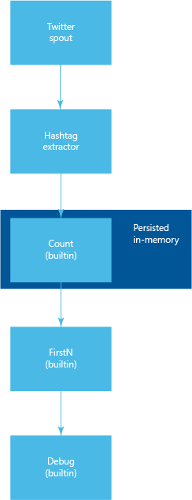

<properties
   pageTitle="含 Apache Storm on HDInsight 的 Twitter 趨勢主題 | Azure"
   description="了解如何使用 Trident 建立 Storm 拓撲，以根據雜湊標記來判斷趨勢主題。"
   services="hdinsight"
   documentationCenter=""
   authors="Blackmist"
   manager="paulettm"
   editor="cgronlun"/>

<tags
   ms.service="hdinsight"
   ms.devlang=""
   ms.topic="article"
   ms.tgt_pltfrm="na"
   ms.workload="big-data"
   ms.date="02/18/2015"
   ms.author="larryfr"/>

#含 Apache Storm on HDInsight 的 Twitter 趨勢主題

了解如何使用 Trident 建立 Storm 拓撲，以判斷 Twitter 上的趨勢主題 (雜湊標記)。 

Trident 是提供聯結、彙總、分組、函數和篩選這類工具的高階抽象概念。此外，Trident 還會新增原型，以執行可設定狀態的增量處理。此範例會示範如何使用自訂 Spout、函數和 Trident 所提供的數個內建函數來建置拓撲。

> [AZURE.NOTE] 這在很大的程度上是根據 Juan Alonso 的 [trident-storm](https://github.com/jalonsoramos/trident-storm) 範例。

##需求

* <a href="http://www.oracle.com/technetwork/java/javase/downloads/index.html" target="_blank">Java 和 JDK 1.7</a>

* <a href="http://maven.apache.org/what-is-maven.html" target="_blank">Maven</a>

* <a href="http://git-scm.com/" target="_blank">Git</a>

* Twitter 開發人員帳戶

##下載專案

使用下列命令以在本機複製專案。

	git clone https://github.com/Blackmist/TwitterTrending

##拓撲

此範例的拓撲如下：

> [AZURE.NOTE] 這是拓撲的簡化檢視 - 元件的多個執行個體會分散到叢集中的節點。

實作拓撲的 Trident 程式碼如下：

	topology.newStream("spout", spout)
	    .each(new Fields("tweet"), new HashtagExtractor(), new Fields("hashtag"))
	    .groupBy(new Fields("hashtag"))
	    .persistentAggregate(new MemoryMapState.Factory(), new Count(), new Fields("count"))
	    .newValuesStream()
	    .applyAssembly(new FirstN(10, "count"))
		.each(new Fields("hashtag", "count"), new Debug());

這會執行下列動作：

1. 從 Spout 建立新的資料流。Spout 會針對特定關鍵字 (在此範例中，為 love、music 和 coffee) 進行篩選，來擷取 Twitter 中的推文。

2. HashtagExtractor (自訂函數) 用來擷取每則推文中的雜湊標記。這些會發出至資料流。

3. 資料流接著會依據雜湊標記進行分組，並傳遞給彙總工具。此彙總工具會建立每個雜湊標記發生次數的計數，而這會保存在記憶體中。最後，會發出含有雜湊標記和計數的新資料流。

4. 因為我只對給定一批推文的最受歡迎雜湊標記感興趣，所以會套用 FirstN 組件，根據計數欄位，僅傳回前 10 個值。

> [AZURE.NOTE] 我們會使用內建 Trident 功能，而非 Spout 和 HashtagExtractor。
> 
> F如需內建作業的詳細資訊，請參閱 <a href="https://storm.apache.org/apidocs/storm/trident/operation/builtin/package-summary.html" target="_blank">storm.trident.operation.builtin</a>。
> 
> 如需非 MemoryMapState 的 Trident-state 實作，請參閱下列各項：
> 
> * <a href="https://github.com/fhussonnois/storm-trident-elasticsearch" target="_blank">https://github.com/fhussonnois/storm-trident-elasticsearch</a>
> 
> * <a href="https://github.com/kstyrc/trident-redis" target="_blank">https://github.com/kstyrc/trident-redis</a>

###Spout

Spout (**TwitterSpout**) 會使用 <a href="http://twitter4j.org/en/" target="_blank">Twitter4j</a> 來從 Twitter 擷取推文。接著會建立篩選 (love、music 和 coffee)，並將符合篩選的內送推文 (status) 儲存至 <a href="http://docs.oracle.com/javase/7/docs/api/java/util/concurrent/LinkedBlockingQueue.html" target="_blank">LinkedBlockingQueue</a>。最後，會將項目拉出佇列，並將其發出至拓撲。

###HashtagExtractor

若要擷取雜湊標記，您可以使用 <a href="http://twitter4j.org/javadoc/twitter4j/EntitySupport.html#getHashtagEntities--" target="_blank">getHashtagEntities</a> 來擷取推文中包含的所有雜湊標記。之後，會將這些發出至資料流。

##啟用 Twitter

使用下列步驟註冊新的 Twitter 應用程式，並取得從 Twitter 讀取所需的消費者和存取權杖資訊。

1. 移至 <a href="" target="_blank">https://apps.twitter.com/</a>，並使用 [**建立新的應用程式**] 按鈕。填寫表單時，請將 [**回呼 URL**] 空白。

2. 建立應用程式之後，請選取 [**金鑰及存取權杖**] 索引標籤。

3. 複製 [**消費者金鑰**] 和 [**消費者密碼**] 資訊。

4. 如果沒有存取權杖，請在頁面底部選取 [**建立我的存取權杖**]。建立權杖之後，請複製 [**存取權杖**] 和 [**存取權杖密碼**] 資訊。

5. 在先前複製的 **TwitterSpoutTopology** 專案中，開啟 **resources/twitter4j.properties** 檔案，並新增先前步驟中所收集的資訊，然後儲存檔案。

##建置拓撲

請使用下列命令建置專案。

		cd [directoryname]
		mvn compile

##測試拓撲

請使用下列命令，以在本機測試拓撲。

	mvn compile exec:java -Dstorm.topology=com.microsoft.example.TwitterTrendingTopology

啟動拓撲之後，您應該會看到含有拓撲所發出雜湊標記和計數的偵錯資訊。輸出應該如下所示：

	DEBUG:[Quicktellervalentine, 7]
	DEBUG:[GRAMMYs, 7]
	DEBUG:[AskSam, 7]
	DEBUG:[poppunk, 1]
	DEBUG:[rock, 1]
	DEBUG:[punkrock, 1]
	DEBUG:[band, 1]
	DEBUG:[punk, 1]
	DEBUG:[indonesiapunkrock, 1]

##後續步驟

現在，您已經在本機測試拓撲、探索如何 [將此拓撲部署至 Storm on HDInsight](../hdinsight-storm-deploy-monitor-topology/)。

您也可能會對下列 Storm 主題感興趣：

* [使用 Maven 開發 Storm on HDInsight 的 Java 拓撲](../hdinsight-storm-develop-java-topology/)

* [使用 Visual Studio 開發 Storm on HDInsight 的 C# 拓撲](../hdinsight-storm-develop-csharp-visual-studio-topology/)

如需 HDinsight 的 Storm 範例：

* [Storm on HDInsight 範例](https://github.com/hdinsight/hdinsight-storm-examples)

* [使用 Storm on HDInsight 分析 EventHub 感應器資料](../hdinsight-storm-sensor-data-analysis/)
<!--HONumber=47-->
