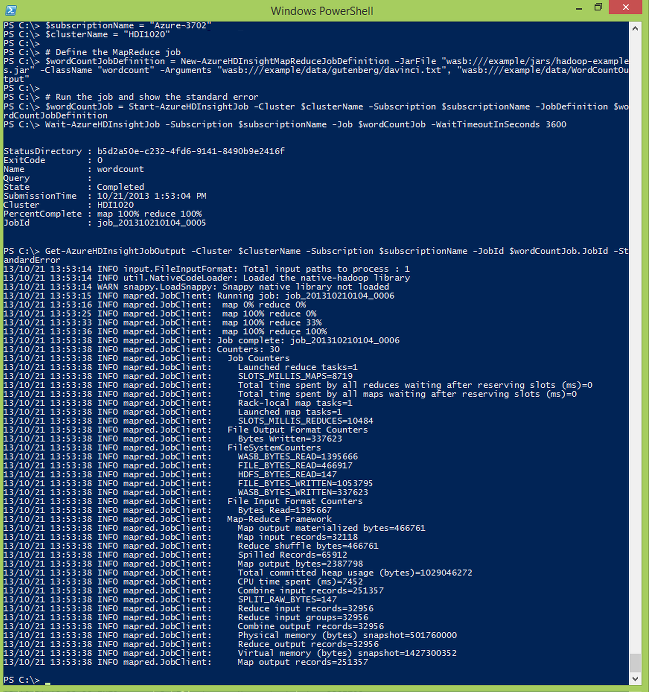
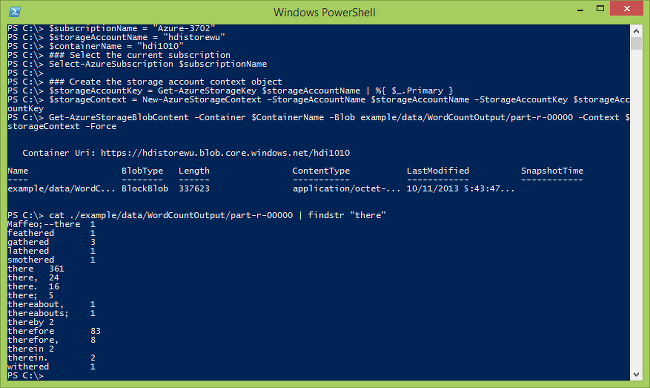

<properties  linkid="manage-services-hdinsight-submit-hadoop-jobs-programmatically" urlDisplayName="HDInsight Administration" pageTitle="Submit Hadoop jobs programmatically | Azure" metaKeywords="hdinsight, hdinsight administration, hdinsight administration azure, hive, mapreduce, HDInsight .NET SDK, powershell, submit mapreduce jobs, submit hive jobs, development, hadoop, apache" description="Learn how to programmatically submit Hadoop jobs to Azure HDInsight." umbracoNaviHide="0" disqusComments="1" editor="cgronlun" manager="paulettm" services="hdinsight" documentationCenter="" title="Submit Hadoop jobs programmatically" authors="jgao" />

# 以程式設計方式提交 Hadoop 工作

本文中，您將了解如何使用 PowerShell 和 HDInsight .NET SDK 來提交 MapReduce 和 Hive 工作。

**必要條件：**

開始閱讀本文之前，您必須符合下列必要條件：

* 有 Azure HDInsight 叢集。相關指示請參閱[開始使用
  HDInsight](/en-us/manage/services/hdinsight/get-started-hdinsight/)
  或[佈建 HDInsight
  叢集](/en-us/manage/services/hdinsight/provision-hdinsight-clusters/)。
* 安裝和設定 Azure PowerShell。相關指示請參閱[安裝和設定 Azure
  PowerShell](/en-us/documentation/articles/install-configure-powershell/)。

## 本文內容

* [使用 PowerShell 提交 MapReduce 工作](#mapreduce-powershell)
* [使用 PowerShell 提交 Hive 工作](#hive-powershell)
* [使用 PowerShell 提交 Sqoop 工作](#sqoop-powershell)
* [使用 HDInsight .NET SDK 提交 MapReduce 工作](#mapreduce-sdk)
* [使用 HDInsight .NET SDK 提交 Hive 工作](#hive-sdk)
* [後續步驟](#nextsteps)

##  使用 PowerShell 提交 MapReduce 工作

Azure PowerShell 是功能強大的指令碼環境，可讓您在 Azure 中控制和自動化工作量的部署與管理。如需有關在 HDInsight
上使用 PowerShell 的詳細資訊，請參閱[使用 PowerShell 來管理
HDInsight](/en-us/manage/services/hdinsight/administer-hdinsight-using-powershell/)。

Hadoop MapReduce 是一種可撰寫應用程式來處理大量資料的軟體架構。HDInsight 叢集隨附一個 jar 檔案，位於
*\example\jars\hadoop-examples.jar*，內有數個 MapReduce 範例。HDInsight 3.0
版叢集已將此檔案重新命名為
hadoop-mapreduce-examples.jar。其中一個範例是計算來源檔案中的文字出現率。在這堂課，您將了解如何從工作站使用 PowerShell 來執行字數統計範例。如需有關開發和執行 MapReduce 工作的詳細資訊，請參閱[在 HDInsight 上使用 MapReduce](/en-us/manage/services/hdinsight/using-mapreduce-with-hdinsight/)。

**使用 PowerShell 來執行字數統計 MapReduce 程式**

1.  開啟 **Azure PowerShell**。如需有關開啟 Azure PowerShell 主控台視窗的指示，請參閱[安裝和設定
    Azure
    PowerShell](/en-us/documentation/articles/install-configure-powershell/)。

2.  執行下列 PowerShell 命令來設定這兩個變數：
    
        $subscriptionName = "<SubscriptionName>"   
        $clusterName = "<HDInsightClusterName>"    
    
    訂閱是您用來建立 HDInsight 叢集的訂閱。HDInsight 叢集是您想要用來執行 MapReduce 工作的叢集。

3.  執行下列命令來建立 MapReduce 工作定義：

        # Define the word count MapReduce job
        $wordCountJobDefinition = New-AzureHDInsightMapReduceJobDefinition -JarFile "wasb:///example/jars/hadoop-examples.jar" -ClassName "wordcount" -Arguments "wasb:///example/data/gutenberg/davinci.txt", "wasb:///example/data/WordCountOutput"
    
    有兩個引數。第一個是來源檔案名稱，第二個是輸出檔案路徑。如需 wasb 首碼的詳細資訊，請參閱[在 HDInsight 上使用
    Azure Blob 儲存體](/en-us/manage/services/hdinsight/howto-blob-store/)。

4.  執行下列命令來執行 MapReduce 工作：

        # Submit the MapReduce job
        Select-AzureSubscription $subscriptionName
        $wordCountJob = Start-AzureHDInsightJob -Cluster $clusterName -JobDefinition $wordCountJobDefinition 
    
    除了 MapReduce 工作定義，您也提供想要用來執行 MapReduce 工作的 HDInsight 叢集名稱。

5.  執行下列命令來檢查 MapReduce 工作是否完成：

        # Wait for the job to complete
        Wait-AzureHDInsightJob -Job $wordCountJob -WaitTimeoutInSeconds 3600 

6.  執行下列命令來檢查 MapReduce 工作執行時有無任何錯誤：

        # Get the job standard error output
        Get-AzureHDInsightJobOutput -Cluster $clusterName -JobId $wordCountJob.JobId -StandardError 
    
    下列螢幕擷取畫面顯示執行成功的輸出。不然您會看到一些錯誤訊息。
    
    

**擷取 MapReduce 工作的結果**

1.  開啟 **Azure PowerShell**。 2.  執行下列 PowerShell 命令來設定這三個變數：
    
        $subscriptionName = "<SubscriptionName>"       
        $storageAccountName = "<StorageAccountName>"
        $containerName = "<ContainerName>"			
    
    Azure 儲存體帳戶是您在 HDInsight 叢集佈建期間指定的帳戶。儲存體帳戶用來代管當做預設 HDInsight 叢集檔案系統的
    Blob 容器。Blob 儲存容器名稱通常與 HDInsight 叢集同名，除非您在佈建叢集時指定不同的名稱。

3.  執行下列命令來建立 Azure 儲存體內容物件：

        # Create the storage account context object
        Select-AzureSubscription $subscriptionName
        $storageAccountKey = Get-AzureStorageKey $storageAccountName | %{ $_.Primary }
        $storageContext = New-AzureStorageContext -StorageAccountName $storageAccountName -StorageAccountKey $storageAccountKey  
    
    如果您有多個訂閱，且預設訂閱不是您要使用的訂閱，則 Select-AzureSubscription 用來設定目前的訂閱。

4.  執行下列命令將 Blob 容器的 MapReduce 工作輸出下載至工作站：

        # Get the blob content
        Get-AzureStorageBlobContent -Container $ContainerName -Blob example/data/WordCountOutput/part-r-00000 -Context $storageContext -Force
    
    *example/data/WordCountOutput* 資料夾是您執行 MapReduce
    工作時指定的輸出資料夾。*part-r-00000* 是 MapReduce
    工作輸出的預設檔案名稱。檔案會以相同資料夾結構下載至本機資料夾。例如，在下列螢幕擷取畫面中，目前資料夾是 C 根資料夾。檔案會下載至
    *C:\example\data\WordCountOutput* 資料夾。

5.  執行下列命令來列印 MapReduce 工作輸出檔案：
    
         cat ./example/data/WordCountOutput/part-r-00000 | findstr "there"
    
    
    
    MapReduce 工作會產生一個名為 *part-r-00000* 的檔案，內有文字和字數。此指令碼使用 findstr
    命令來列出含有 "there" 所有文字。

> [WACOM.NOTE] 如果您在記事本中開啟 ./example/data/WordCountOutput/part-r-00000
> (MapReduce 工作的多行輸出)，您會發現換行不正確。這是預期行為。

##  使用 PowerShell 提交 Hive 工作

Apache [Hive][1] 提供一種透過 SQL 式指令碼語言執行 MapReduce 工作的工具，稱為
*HiveQL*，可用來總結、查詢和分析大量資料。

HDInsight 叢集隨附一個範例 Hive 資料表，稱為 *hivesampletable*。在這堂課，您將使用 PowerShell 執行 Hive 工作，從 Hive 資料表中列出一些資料。

**使用 PowerShell 執行 Hive 工作**

1.  開啟 **Azure PowerShell**。如需有關開啟 Azure PowerShell 主控台視窗的指示，請參閱[安裝和設定
    Azure
    PowerShell](/en-us/documentation/articles/install-configure-powershell/)。

2.  在下列命令中設定前兩個變數，然後執行命令：
    
        $subscriptionName = "<SubscriptionName>"   
        $clusterName = "<HDInsightClusterName>"             
        $querystring = "SELECT * FROM hivesampletable WHERE Country='United Kingdom';"
    
    $querystring 是 HiveQL 查詢。

3.  執行下列命令來選取 Azure 訂閱，以及用來執行 Hive 工作的叢集：
    
         Select-AzureSubscription -SubscriptionName $subscriptionName

4.  提交 Hive 工作：
    
        Use-AzureHDInsightCluster $clusterName
        Invoke-Hive -Query $queryString
    
    您可以使用 -File 參數來指定 HDFS 上的 HiveQL 指令碼檔案。

如需 Hive 的詳細資訊，請參閱[在 HDInsight 上使用
Hive](/en-us/manage/services/hdinsight/using-hive-with-hdinsight/)。

## 使用 PowerShell 提交 Sqoop 工作

請參閱[在 HDInsight 上使用 Sqoop](../hdinsight-use-sqoop/)。

##  使用 HDInsight .NET SDK 提交 MapReduce 工作

HDInsight .NET SDK 提供 .NET 用戶端程式庫，讓您輕鬆地從 .NET 使用 HDInsight 叢集。HDInsight
叢集隨附一個 jar 檔案，位於 *\example\jars\hadoop-examples.jar*，內有數個 MapReduce
範例。其中一個範例是計算來源檔案中的文字出現率。在這堂課，您將了解如何建立 .NET 應用程式來執行字數統計範例。如需有關開發和執行
MapReduce 工作的詳細資訊，請參閱[在 HDInsight 上使用 MapReduce](/en-us/manage/services/hdinsight/using-mapreduce-with-hdinsight/)。

使用 SDK 佈建 HDInsight 叢集需要執行下列程序：

* 安裝 HDInsight .NET SDK
* 建立主控台應用程式
* 執行應用程式

**安裝 HDInsight .NET SDK** 您可以從 [NuGet][2] 下載最新發行的 SDK 版本。下一個程序會顯示相關指示。

**建立 Visual Studio 主控台應用程式**

1.  開啟 Visual Studio 2012。

2.  從 **檔案] 功能表中，按一下 [新增**，再按 **專案**。

3.  從 [新增專案] 中，輸入或選取下列值：
    
    <table  style="border-color: #c6c6c6; border-width: 2px; border-style: solid; border-collapse: collapse;">
     <tr>
    <th  style="border-color: #c6c6c6; border-width: 2px; border-style: solid; border-collapse: collapse; width:90px; padding-left:5px; padding-right:5px;">屬性</th>
    
    <th  style="border-color: #c6c6c6; border-width: 2px; border-style: solid; border-collapse: collapse; width:90px; padding-left:5px; padding-right:5px;">值</th>
    </tr>
    
     <tr>
    <td  style="border-color: #c6c6c6; border-width: 2px; border-style: solid; border-collapse: collapse; padding-left:5px;">分類</td>
    
    <td  style="border-color: #c6c6c6; border-width: 2px; border-style: solid; border-collapse: collapse; padding-left:5px; padding-right:5px;">範本/Visual C#/Windows</td>
    </tr>
    
     <tr>
    <td  style="border-color: #c6c6c6; border-width: 2px; border-style: solid; border-collapse: collapse; padding-left:5px;">範本</td>
    
    <td  style="border-color: #c6c6c6; border-width: 2px; border-style: solid; border-collapse: collapse; padding-left:5px;">主控台應用程式</td>
    </tr>
    
     <tr>
    <td  style="border-color: #c6c6c6; border-width: 2px; border-style: solid; border-collapse: collapse; padding-left:5px;">名稱</td>
    
    <td  style="border-color: #c6c6c6; border-width: 2px; border-style: solid; border-collapse: collapse; padding-left:5px;">SubmitMapReduceJob</td>
    </tr>
    
     </table>

4.  按一下 **確定** 建立專案。

5.  從 **工具** 功能表中，按一下 **程式庫套件管理員**，再按一下 **Package Manager Console**。

6.  在主控台執行下列命令來安裝套件。
    
         Install-Package Microsoft.WindowsAzure.Management.HDInsight
    
    此命令會將 .NET 程式庫及其參考加入至目前的 Visual Studio 專案。版本應該為 0.11.0.1 或更新版本。

7.  從 **方案總管] 中，按兩下 [Program.cs** 將它開啟。

8.  將下列 using 陳述式加入至檔案頂端：
    
        using System.IO;
        using System.Threading;
        using System.Security.Cryptography.X509Certificates;
        	
        using Microsoft.WindowsAzure.Storage;
        using Microsoft.WindowsAzure.Storage.Blob;
        	
        using Microsoft.WindowsAzure.Management.HDInsight;
        using Microsoft.Hadoop.Client;

9.  將下列函數定義加入至類別。此函數用來等待 Hadoop 工作完成。
    
         private static void WaitForJobCompletion(JobCreationResults jobResults, IJobSubmissionClient client)
         {
        JobDetails jobInProgress = client.GetJob(jobResults.JobId);
        while (jobInProgress.StatusCode != JobStatusCode.Completed && jobInProgress.StatusCode != JobStatusCode.Failed)
             {
        jobInProgress = client.GetJob(jobInProgress.JobId);
        Thread.Sleep(TimeSpan.FromSeconds(10));
             }
         }

10. 在 Main() 函數中，貼上下列程式碼：
    
        // Set the variables
        string subscriptionID = "<Azure  subscription ID>";
        string certFriendlyName = "<certificate  friendly name>";
        
        string clusterName = "<HDInsight  cluster name>";
        	
        string storageAccountName = "<Azure  storage account name>";
        string storageAccountKey = "<Azure  storage account key>";
        string containerName = "<Blob  container name>";
    
    以上就是程式需要設定的所有變數。您可以從 [Azure 管理入口網站][3]取得 Azure 訂閱名稱。
    
    如需憑證的詳細資訊，請參閱[建立和上傳 Azure 的管理憑證][4]。設定憑證的一種簡單方法就是執行
    *Get-AzurePublishSettingsFile* 和 *Import-AzurePublishSettingsFile*
    PowerShell Cmdlet。它們會自動建立和上傳管理憑證。執行 PowerShell Cmdlet 之後，您可以從工作站開啟
    *certmgr.msc*，並展開 [個人/憑證]** 來尋找憑證。PowerShell Cmdlet 所建立的憑證在 [發給]** 和
    [簽發者]** 欄位中都是 [Azure Tools]**。
    
    Azure 儲存體帳戶名稱是您佈建 HDInsight 叢集時指定的帳戶。預設容器名稱與 HDInsight 叢集名稱相同。

11. 在 Main() 函數中，附加下列程式碼來定義 MapReduce 工作：
    
        // Define the MapReduce job
        MapReduceJobCreateParameters mrJobDefinition = new MapReduceJobCreateParameters()
        {
        JarFile = "wasb:///example/jars/hadoop-examples.jar",
        ClassName = "wordcount"
        };
        
        mrJobDefinition.Arguments.Add("wasb:///example/data/gutenberg/davinci.txt");
        mrJobDefinition.Arguments.Add("wasb:///example/data/WordCountOutput");
    
    有兩個引數。第一個是來源檔案名稱，第二個是輸出檔案路徑。如需 wasb 首碼的詳細資訊，請參閱[在 HDInsight 上使用
    Azure Blob 儲存體](/en-us/manage/services/hdinsight/howto-blob-store/)。

12. 在 Main() 函數中，附加下列程式碼來建立 JobSubmissionCertificateCredential 物件：
    
         // Get the certificate object from certificate store using the
         friendly name to identify it X509Store store = new X509Store();
         store.Open(OpenFlags.ReadOnly); X509Certificate2 cert =
         store.Certificates.Cast<x509certificate2
         ().First(item => item.FriendlyName ==
         certFriendlyName); JobSubmissionCertificateCredential creds = new
         JobSubmissionCertificateCredential(new Guid(subscriptionID), cert,
         clusterName);</x509certificate2>

13. 在 Main() 函數中，附加下列程式碼來執行工作並等待工作完成：
    
        // Create a hadoop client to connect to HDInsight
        var jobClient = JobSubmissionClientFactory.Connect(creds);
        
        // Run the MapReduce job
        JobCreationResults mrJobResults = jobClient.CreateMapReduceJob(mrJobDefinition);
        
        // Wait for the job to complete
        WaitForJobCompletion(mrJobResults, jobClient);

14. 在 Main() 函數中，附加下列程式碼來列印 MapReduce 工作輸出：
    
        // Print the MapReduce job output
        Stream stream = new MemoryStream();
        	
        CloudStorageAccount storageAccount = CloudStorageAccount.Parse("DefaultEndpointsProtocol=https;AccountName=" + storageAccountName + ";AccountKey=" + storageAccountKey);
        CloudBlobClient blobClient = storageAccount.CreateCloudBlobClient();
        CloudBlobContainer blobContainer = blobClient.GetContainerReference(containerName);
        CloudBlockBlob blockBlob = blobContainer.GetBlockBlobReference("example/data/WordCountOutput/part-r-00000");
        	
        blockBlob.DownloadToStream(stream);
        stream.Position = 0;
        	
        StreamReader reader = new StreamReader(stream);
        Console.WriteLine(reader.ReadToEnd());
        	
        Console.WriteLine("Press ENTER to continue.");
        Console.ReadLine();
    
    輸出資料夾是您定義 MapReduce 工作時指定的資料夾。預設檔案名稱是 *part-r-00000*。

**執行應用程式**

在 Visual Studio 中開啟應用程式，按 **F5** 執行應用程式。主控台視窗會開啟並顯示應用程式的狀態及應用程式輸出。

##  使用 HDInsight .NET SDK 提交 Hive 工作

HDInsight 叢集隨附一個範例 Hive 資料表，稱為 *hivesampletable*。在這堂課，您將建立 .NET 應用程式來執行 Hive 工作，以列出 HDInsight 叢集上建立的 Hive 資料表。如需有關使用 Hive 的詳細資訊，請參閱[在 HDInsight
上使用 Hive](/en-us/manage/services/hdinsight/using-hive-with-hdinsight/)。

使用 SDK 佈建 HDInsight 叢集需要執行下列程序：

* 安裝 HDInsight .NET SDK
* 建立主控台應用程式
* 執行應用程式

**安裝 HDInsight .NET SDK** 您可以從 [NuGet][2] 下載最新發行的 SDK 版本。下一個程序會顯示相關指示。

**建立 Visual Studio 主控台應用程式**

1.  開啟 Visual Studio 2012。

2.  從 **檔案] 功能表中，按一下 [新增**，再按 **專案**。

3.  從 [新增專案] 中，輸入或選取下列值：
    
    <table  style="border-color: #c6c6c6; border-width: 2px; border-style: solid; border-collapse: collapse;">
     <tr>
    <th  style="border-color: #c6c6c6; border-width: 2px; border-style: solid; border-collapse: collapse; width:90px; padding-left:5px; padding-right:5px;">屬性</th>
    
    <th  style="border-color: #c6c6c6; border-width: 2px; border-style: solid; border-collapse: collapse; width:90px; padding-left:5px; padding-right:5px;">值</th>
    </tr>
    
     <tr>
    <td  style="border-color: #c6c6c6; border-width: 2px; border-style: solid; border-collapse: collapse; padding-left:5px;">分類</td>
    
    <td  style="border-color: #c6c6c6; border-width: 2px; border-style: solid; border-collapse: collapse; padding-left:5px; padding-right:5px;">範本/Visual C#/Windows</td>
    </tr>
    
     <tr>
    <td  style="border-color: #c6c6c6; border-width: 2px; border-style: solid; border-collapse: collapse; padding-left:5px;">範本</td>
    
    <td  style="border-color: #c6c6c6; border-width: 2px; border-style: solid; border-collapse: collapse; padding-left:5px;">主控台應用程式</td>
    </tr>
    
     <tr>
    <td  style="border-color: #c6c6c6; border-width: 2px; border-style: solid; border-collapse: collapse; padding-left:5px;">名稱</td>
    
    <td  style="border-color: #c6c6c6; border-width: 2px; border-style: solid; border-collapse: collapse; padding-left:5px;">SubmitHiveJob</td>
    </tr>
    
     </table>

4.  按一下 **確定** 建立專案。

5.  從 **工具** 功能表中，按一下 **程式庫套件管理員**，再按一下 [Package Manager
    Console]****。

6.  在主控台執行下列命令來安裝套件。
    
         Install-Package Microsoft.WindowsAzure.Management.HDInsight
    
    此命令會將 .NET 程式庫及其參考加入至目前的 Visual Studio 專案。

7.  從 **方案總管] 中，按兩下 [Program.cs** 將它開啟。

8.  將下列 using 陳述式加入至檔案頂端：
    
        using System.IO;
        using System.Threading;
        using System.Security.Cryptography.X509Certificates;
        
        using Microsoft.WindowsAzure.Management.HDInsight;
        using Microsoft.Hadoop.Client;

9.  將下列函數定義加入至類別。此函數用來等待 Hadoop 工作完成。
    
         private static void WaitForJobCompletion(JobCreationResults jobResults, IJobSubmissionClient client)
         {
        JobDetails jobInProgress = client.GetJob(jobResults.JobId);
        while (jobInProgress.StatusCode != JobStatusCode.Completed && jobInProgress.StatusCode != JobStatusCode.Failed)
             {
        jobInProgress = client.GetJob(jobInProgress.JobId);
        Thread.Sleep(TimeSpan.FromSeconds(10));
             }
         }

10. 在 Main() 函數中，貼上下列程式碼：
    
        // Set the variables
        string subscriptionID = "<Azure  subscription ID>";
        string clusterName = "<HDInsight  cluster name>";
        string certFriendlyName = "<certificate  friendly name>";		
    
    以上就是程式需要設定的所有變數。您可以向系統管理員查詢 Azure 訂閱識別碼。
    
    如需憑證的詳細資訊，請參閱[建立和上傳 Azure 的管理憑證][4]。設定憑證的一種簡單方法就是執行
    *Get-AzurePublishSettingsFile* 和 *Import-AzurePublishSettingsFile*
    PowerShell Cmdlet。它們會自動建立和上傳管理憑證。執行 PowerShell Cmdlet 之後，您可以從工作站開啟
    *certmgr.msc*，並展開 [個人/憑證]** 來尋找憑證。PowerShell Cmdlet 所建立的憑證在 [發給]** 和
    [簽發者]** 欄位中都是 [Azure Tools]**。

11. 在 Main() 函數中，附加下列程式碼來定義 Hive 工作：
    
        // define the Hive job
        HiveJobCreateParameters hiveJobDefinition = new HiveJobCreateParameters()
        {
        JobName = "show tables job",
        StatusFolder = "/ShowTableStatusFolder",
        Query = "show tables;"
        };
    
    您可以使用 File 參數來指定 HDFS 上的 HiveQL 指令碼檔案。例如
    
        // define the Hive job
        HiveJobCreateParameters hiveJobDefinition = new HiveJobCreateParameters()
        {
        JobName = "show tables job",
        StatusFolder = "/ShowTableStatusFolder",
        File = "/user/admin/showtables.hql"
        };

12. 在 Main() 函數中，附加下列程式碼來建立 JobSubmissionCertificateCredential 物件：
    
         // Get the certificate object from certificate store using the
         friendly name to identify it X509Store store = new X509Store();
         store.Open(OpenFlags.ReadOnly); X509Certificate2 cert =
         store.Certificates.Cast<x509certificate2
         ().First(item => item.FriendlyName ==
         certFriendlyName); JobSubmissionCertificateCredential creds = new
         JobSubmissionCertificateCredential(new Guid(subscriptionID), cert,
         clusterName);</x509certificate2>

13. 在 Main() 函數中，附加下列程式碼來執行工作並等待工作完成：
    
        // Submit the Hive job
        var jobClient = JobSubmissionClientFactory.Connect(creds);
        JobCreationResults jobResults = jobClient.CreateHiveJob(hiveJobDefinition);
        
        // Wait for the job to complete
        WaitForJobCompletion(jobResults, jobClient);

14. 在 Main() 函數中，附加下列程式碼來列印 Hive 工作輸出：
    
        // Print the Hive job output
        System.IO.Stream stream = jobClient.GetJobOutput(jobResults.JobId);
        
        StreamReader reader = new StreamReader(stream);
        Console.WriteLine(reader.ReadToEnd());
        
        Console.WriteLine("Press ENTER to continue.");
        Console.ReadLine();

**執行應用程式**

在 Visual Studio 中開啟應用程式，按 **F5** 執行應用程式。主控台視窗會開啟並顯示應用程式的狀態。輸出如下：

    hivesampletable

##  後續步驟

在本文中，您學到幾種佈建 HDInsight 叢集的方法。若要深入了解，請參閱下列文章：

* [開始使用 Azure
  HDInsight](/en-us/manage/services/hdinsight/get-started-hdinsight/)
* [佈建 HDInsight
  叢集](/en-us/manage/services/hdinsight/provision-hdinsight-clusters/)
* [使用 PowerShell 來管理
  HDInsight](/en-us/manage/services/hdinsight/administer-hdinsight-using-powershell/)
* [HDInsight Cmdlet 參考文件][5]
* [在 HDInsight 上使用
  Hive](/en-us/manage/services/hdinsight/using-hive-with-hdinsight/)
* [在 HDInsight 上使用
  Pig](/en-us/manage/services/hdinsight/using-pig-with-hdinsight/)

[1]: http://hive.apache.org/
[2]: http://nuget.codeplex.com/wikipage?title=Getting%20Started
[3]: http://manage.windowsazure.com/
[4]: http://msdn.microsoft.com/zh-tw/library/windowsazure/gg551722.aspx
[5]: http://msdn.microsoft.com/zh-tw/library/windowsazure/dn479228.aspx