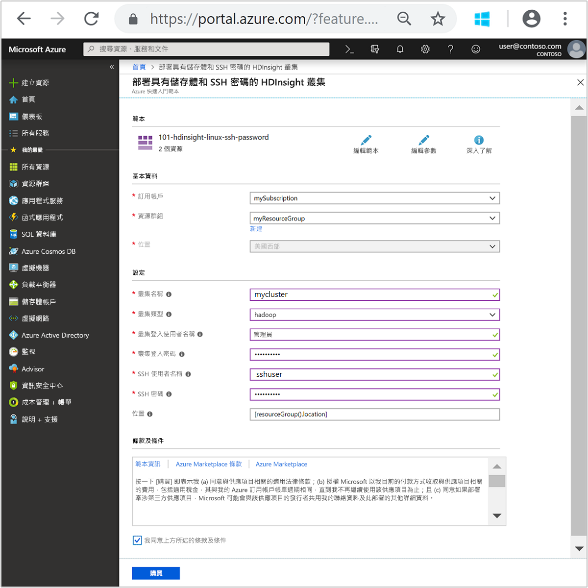
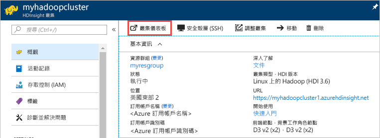
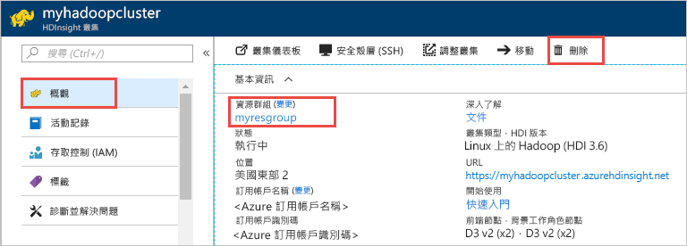

# <a name="quickstart-get-started-with-hadoop-and-hive-in-azure-hdinsight-using-resource-manager-template"></a>快速入門：使用 Resource Manager 範本在 Azure HDInsight 中開始使用 Hadoop 和 Hive

在本文中，您會了解如何使用 Resource Manager 範本在 HDInsight 中建立 [Hadoop](http://hadoop.apache.org/) \(英文\) 叢集，然後在 HDInsight 中執行 Hive 作業。 大部分 Hadoop 作業都是批次作業。 您會建立叢集、執行一些工作，然後刪除叢集。 在本文中，您會執行所有這三個工作。

在本快速入門中，您會使用 Resource Manager 範本來建立 HDInsight Hadoop 叢集。 您也可以使用 [Azure 入口網站](apache-hadoop-linux-create-cluster-get-started-portal.md)建立叢集。

HDInsight 目前隨附 [7 個不同的叢集類型](./apache-hadoop-introduction.md#cluster-types-in-hdinsight)。 每種叢集類型都支援一組不同的元件。 所有叢集類型都支援 Hive。 如需 HDInsight 中支援的元件清單，請參閱 [HDInsight 在 Hadoop 叢集版本中提供的新功能](../hdinsight-component-versioning.md)  

如果您沒有 Azure 訂用帳戶，請在開始之前先[建立免費帳戶](https://azure.microsoft.com/free/)。

<a name="create-cluster"></a>
## <a name="create-a-hadoop-cluster"></a>建立 Hadoop 叢集

在本節中，您會使用 Azure Resource Manager 範本，在 HDInsight 中建立 Hadoop 叢集。 進行本文並不需要具備 Resource Manager 範本體驗。 

1. 按一下以下的 [部署至 Azure] 按鈕，在 Azure 入口網站中登入 Azure 並開啟 Resource Manager 範本。 
   
    <a href="https://portal.azure.com/#create/Microsoft.Template/uri/https%3A%2F%2Fraw.githubusercontent.com%2FAzure%2Fazure-quickstart-templates%2Fmaster%2F101-hdinsight-linux-ssh-password%2Fazuredeploy.json" target="_blank"></a>

2. 輸入或選取如下列螢幕擷取畫面所建議的值：

    > [!NOTE]
    > 您提供的值必須是唯一且應該遵循命名方針。 範本不會執行驗證檢查。 如果您提供的值已在使用中或未遵循方針，則會在提交範本之後收到錯誤。       
    > 
    >
    
    

    輸入或選取下列值：
    
    |屬性  |說明  |
    |---------|---------|
    |**訂用帳戶**     |  選取 Azure 訂用帳戶。 |
    |**資源群組**     | 建立資源群組，或選取現有的資源群組。  資源群組是 Azure 元件的容器。  在此案例中，資源群組包含 HDInsight 叢集和相依的 Azure 儲存體帳戶。 |
    |**位置**     | 選取您要建立叢集的 Azure 位置。  選擇靠近您的位置，以獲得最佳效能。 |
    |**叢集類型**     | 選取 [Hadoop]。 |
    |**叢集名稱**     | 輸入 Hadoop 叢集的名稱。 由於 HDInsight 中的所有叢集共用相同的 DNS 命名空間，因此這個名稱必須是唯一的。 名稱最多可包含 59 個字元，而這些字元可以是字母、數字和連字號。 名稱的第一個和最後一個字元不可以是連字號。 |
    |**叢集登入名稱和密碼**     | 預設登入名稱為 **admin**。密碼長度至少必須為 10 個字元，且必須包含至少一個數字、一個大寫字母及一個小寫字母、一個非英數字元 (除了字元 ' " ` \)。 確定您**不會提供**常見密碼，例如 "Pass@word1"。|
    |**SSH 使用者名稱和密碼**     | 預設的使用者名稱為 **sshuser**。  您可以將 SSH 使用者名稱重新命名。  SSH 使用者密碼與叢集登入密碼具有相同的需求。|
       
    某些屬性已硬式編碼在範本中。  您可以從範本設定這些值。 如需這些屬性的詳細說明，請參閱[在 HDInsight 中建立Hadoop 叢集](../hdinsight-hadoop-provision-linux-clusters.md)。

3. 選取 [我同意上方所述的條款及條件] 和 [釘選到儀表板]，然後選取 [購買]。 您應該會在入口網站儀表板上看到標題為**正在提交部署**的新圖格。 大約需要 20 分鐘的時間來建立叢集。

    

4. 建立叢集後，此圖格的標題會變更為您指定的資源群組名稱。 此圖格也會列出資源群組內所建立的 HDInsight 叢集。 
   
    
    
5. 此圖格也會列出與叢集相關聯的預設儲存體。 每個叢集都具備 [Azure 儲存體帳戶](../hdinsight-hadoop-use-blob-storage.md)或 [Azure Data Lake 帳戶](../hdinsight-hadoop-use-data-lake-store.md)相依性。 也稱為預設儲存體帳戶。 HDInsight 叢集與其預設儲存體帳戶必須並存於相同的 Azure 區域。 刪除叢集並不會刪除儲存體帳戶。
    

> [!NOTE]
> 如需其他叢集建立方法及了解本教學課程中使用的屬性，請參閱 [建立 HDInsight 叢集](../hdinsight-hadoop-provision-linux-clusters.md)。       
> 
>

## <a name="use-vscode-to-run-hive-queries"></a>使用 VSCode 執行 Hive 查詢

如何取得 VSCode 中的 HDInsight 工具，請參閱[使用適用於 Visual Studio Code 的 Azure HDInsight 工具](../hdinsight-for-vscode.md)。

### <a name="submit-interactive-hive-queries"></a>提交互動式 Hive 查詢

使用適用於 VSCode 的 HDInsight 工具，您可以將互動式 Hive 查詢提交到 HDInsight 互動式查詢叢集。

1. 建立新的工作資料夾和新的 Hive 指令碼檔案 (如果您還沒有這兩個項目)。

2. 連線到 Azure 帳戶，然後設定預設叢集 (如果您還未設定)。

3. 複製以下程式碼並貼到 Hive 檔案中，然後儲存該檔案。

    ```hiveql
    SELECT * FROM hivesampletable;
    ```
4. 在指令碼編輯器上按一下滑鼠右鍵，然後選取 [HDInsight: Hive 互動式] 來提交查詢。 工具也可讓您使用快顯功能表來提交程式碼區塊，而非整個指令碼檔案。 不久之後，查詢結果就會顯示在新的索引標籤中。

   

    - [結果] 面板：您可以將整個結果以 CSV、JSON 或 Excel 檔案的形式儲存到本機路徑，或只選取多行。

    - [訊息] 面板：當您選取**行號**時，它就會跳至執行中指令碼的第一行。

相較於[執行 Hive 批次工作](#submit-hive-batch-scripts)，執行互動式查詢所需的時間少很多。

### <a name="submit-hive-batch-scripts"></a>提交 Hive 批次指令碼

1. 建立新的工作資料夾和新的 Hive 指令碼檔案 (如果您還沒有這兩個項目)。

2. 連線到 Azure 帳戶，然後設定預設叢集 (如果您還未設定)。

3. 複製以下程式碼並貼到 Hive 檔案中，然後儲存該檔案。

    ```hiveql
    SELECT * FROM hivesampletable;
    ```
4. 在指令碼編輯器上按一下滑鼠右鍵，然後選取 [HDInsight: Hive 批次] 來提交 Hive 作業。 

5. 選取您要提交至的叢集。  

    在提交 Hive 作業之後，[輸出] 面板就會顯示提交成功資訊和 jobid。 Hive 作業也會開啟**網頁瀏覽器**，其中顯示即時的作業記錄和狀態。

   

相較於提交批次作業，[提交互動式 Hive 查詢](#submit-interactive-hive-queries)所需的時間少很多。

## <a name="use-visualstudio-to-run-hive-queries"></a>使用 VisualStudio 來執行 Hive 查詢

如何在 Visual Studio 中取得 HDInsight 工具，請參閱[使用適用於 Visual Studio 的 Data Lake 工具](./apache-hadoop-visual-studio-tools-get-started.md)。

### <a name="run-hive-queries"></a>執行 Hive 查詢

您有兩個選項可建立和執行 Hive 查詢：

* 建立特定查詢
* 建立 Hive 應用程式

若要建立和執行特定查詢：

1. 在 [伺服器總管] 中，選取 [Azure] > [HDInsight 叢集]。

2. 在您想要執行查詢的叢集上按一下滑鼠右鍵，然後選取 [撰寫 Hive 查詢]。  

3. 輸入 Hive 查詢。 

    Hive 編輯器支援 Intellisense。 Data Lake Tools for Visual Studio 支援在編輯 Hive 指令碼時載入遠端中繼資料。 例如，如果您輸入 **SELECT * FROM**，IntelliSense 會列出所有建議的資料表名稱。 若已指定資料表名稱，IntelliSense 會列出資料行名稱。 此工具支援大部分的 Hive DML 陳述式、子查詢及內建 UDF。
   
    
   
    
   
   > [!NOTE]
   > IntelliSense 只建議 HDInsight 工具列中已選取的叢集中繼資料。
   > 
   
4. 選取 [提交] 或 [提交 (進階)]。 
   
    

   如果您選取進階提交選項，請設定指令碼的 [作業名稱]、[引數]、[其他組態] 和 [狀態目錄]：

    

   執行互動式 Hive 查詢

   * 按一下向下箭頭以選擇 [互動式]。 
   
   * 按一下 [Execute (執行)] 。

   

若要建立和執行 Hive 解決方案：

1. 在 [檔案] 功能表上，選取 [新增]，然後選取 [專案]。
2. 在左窗格中，選取 [HDInsight]。 在中間窗格中，選取 [Hive 應用程式]。 輸入屬性，然後選取 [確定]。
   
    
3. 在 [方案總管] 中，按兩下 **Script.hql** 來開啟指令碼。
4. 輸入 Hive 查詢並提交。 (請參考以上步驟 3 和 4)  


## <a name="run-hive-queries"></a>執行 Hive 查詢

[Apache Hive](hdinsight-use-hive.md) 是 HDInsight 中使用的最受歡迎元件。 有許多方法可在 HDInsight 上執行 Hive 工作。 在本教學課程中，您將從入口網站使用 Ambari Hive 檢視。 如需提交 Hive 工作的其他方法，請參閱 [在 HDInsight 中使用 Hive](hdinsight-use-hive.md)。

1. 若要開啟 Ambari，請從上一個螢幕擷取畫面中，選取 [叢集儀表板]。  您也可以瀏覽至 **https://&lt;ClusterName>.azurehdinsight.net**，其中 &lt;ClusterName> 是您在上一節建立的叢集。

    

2. 輸入您在建立叢集時所指定的 Hadoop 使用者名稱和密碼。 預設的使用者名稱為 **admin**。

3. 開啟 [Hive 檢視]  ，如下列螢幕擷取畫面所示：
   
    

4. 在 [查詢] 索引標籤中，將下列 HiveQL 陳述式貼到工作表中：
   
        SHOW TABLES;

    
   
   > [!NOTE]
   > Hive 需要分號。       
   > 
   > 

5. 選取 [執行] 。 [結果] 索引標籤會出現 [查詢] 索引標籤下方，並顯示作業相關資訊。 
   
    查詢完成之後，[查詢] 索引標籤會顯示作業的結果。 您應該會看到一個名為 hivesampletable 的資料表。 所有 HDInsight 叢集都提供此範例 Hive 資料表。
   
    

6. 重複步驟 4 和 5，以執行下列查詢：
   
        SELECT * FROM hivesampletable;
   
7. 您也可以儲存查詢的結果。 選取右側功能表按鈕，然後指定您是否要以 CSV 檔案格式下載結果，或將其儲存至與叢集相關聯的儲存體帳戶。

    

完成 Hive 工作之後，您可以[將結果匯出至 Azure SQL 資料庫或 SQL Server 資料庫](apache-hadoop-use-sqoop-mac-linux.md)，也可以[使用 Excel 將結果視覺化](apache-hadoop-connect-excel-power-query.md)。 如需在 HDInsight 中使用 Hive 的詳細資訊，請參閱 [搭配 HDInsight 中的 Hadoop 使用 Hive 和 HiveQL 來分析範例 Apache log4j 檔案](hdinsight-use-hive.md)。

## <a name="troubleshoot"></a>疑難排解

如果您在建立 HDInsight 叢集時遇到問題，請參閱[存取控制需求](../hdinsight-administer-use-portal-linux.md#create-clusters)。

## <a name="clean-up-resources"></a>清除資源
完成本文之後，您可能想要刪除叢集。 利用 HDInsight，您的資料會儲存在 Azure 儲存體中，以便您在未使用叢集時安全地進行刪除。 您也需支付 HDInsight 叢集的費用 (即使未使用)。 由於叢集費用是儲存體費用的許多倍，所以刪除未使用的叢集符合經濟效益。 

> [!NOTE]
> 如果您要「立即」繼續下一個教學課程，以了解如何使用 HDInsight 上的 Hadoop 來執行 ETL 作業，則建議讓叢集保持執行狀態。 這是因為在教學課程中，您必須重新建立 Hadoop 叢集。 不過，如果您不會立即開始下一個教學課程，則現在就必須刪除該叢集。
> 
> 

**刪除叢集和/或預設儲存體帳戶**

1. 回到瀏覽器索引標籤，您可在其中存取 Azure 入口網站。 您應該位於叢集的 [概觀] 頁面上。 如果您只想刪除叢集，但保留預設儲存體帳戶，請選取 [刪除]。

    

2. 如果您想要刪除叢集以及預設儲存體帳戶，則選取資源群組名稱 (上一個螢幕擷取畫面中醒目提示的項目) 來開啟資源群組頁面。

3. 選取 [刪除資源群組] 以刪除資源群組，其中包含了叢集和預設儲存體帳戶。 請注意，刪除資源群組會刪除儲存體帳戶。 如果您想要保留儲存體帳戶，請選擇只刪除叢集。

## <a name="next-steps"></a>後續步驟
在本文中，您已了解如何使用 Resource Manager 範本來建立以 Linux 為基礎的 HDInsight 叢集，以及如何執行基本的 Hive 查詢。 在下一篇文章中，您將了解如何使用 HDInsight 上的 Hadoop 來執行擷取、轉換及載入 (ETL) 作業。

> [!div class="nextstepaction"]
>[使用 HDInsight 上的 Apache Hive 來擷取、轉換和載入資料](../hdinsight-analyze-flight-delay-data-linux.md)

如果您準備好開始使用您自己的資料，並需要進一步了解 HDInsight 儲存資料的方式或如何將資料匯入 HDInsight，請參閱下列文章：

* 如需有關 HDInsight 如何使用 Azure 儲存體的資訊，請參閱 [搭配 HDInsight 使用 Azure 儲存體](../hdinsight-hadoop-use-blob-storage.md)。
* 如需有關如何使用 Data Lake Storage 建立 HDInsight 叢集的資訊，請參閱[快速入門：在 HDInsight 中設定叢集](../../storage/data-lake-storage/quickstart-create-connect-hdi-cluster.md)。
* 如需關於如何上傳資料到 HDInsight 的資訊，請參閱[將資料上傳到 HDInsight](../hdinsight-upload-data.md)。

若要深入了解如何使用 HDInsight 分析資料，請參閱下列文章：

* 若要深入了解如何搭配 HDInsight 使用 Hive，包括如何從 Visual Studio 執行 Hive 查詢，請參閱[搭配 HDInsight 使用 Hive](hdinsight-use-hive.md)。
* 若要了解用來轉換資料的 Pig 語言，請參閱[搭配 HDInsight 使用 Pig](hdinsight-use-pig.md)。
* 若要了解 MapReduce (一種撰寫程式以處理 Hadoop 資料的方式)，請參閱[搭配 HDInsight 使用 MapReduce](hdinsight-use-mapreduce.md)。
* 若要了解如何使用適用於 Visual Studio 的 HDInsight 工具來分析 HDInsight 資料，請參閱 [開始使用 Visual Studio Hadoop tools for HDInsight](apache-hadoop-visual-studio-tools-get-started.md)。
* 若要了解如何使用適用於 VSCode 的 HDInsight 工具來分析 HDInsight 資料，請參閱[使用適用於 Visual Studio Code 的 Azure HDInsight 工具](../hdinsight-for-vscode.md)。


如果您想要深入了解如何建立或管理 HDInsight 叢集，請參閱下列文章：

* 若要了解如何管理以 Linux 為基礎的 HDInsight 叢集，請參閱 [使用 Ambari 管理 HDInsight 叢集](../hdinsight-hadoop-manage-ambari.md)。
* 若要深入了解建立 HDInsight 叢集時可選取的選項，請參閱 [使用自訂選項在 Linux 上建立 HDInsight](../hdinsight-hadoop-provision-linux-clusters.md)。


[1]: ../HDInsight/apache-hadoop-visual-studio-tools-get-started.md

[hdinsight-provision]: hdinsight-provision-linux-clusters.md
[hdinsight-upload-data]: hdinsight-upload-data.md
[hdinsight-use-hive]: hdinsight-use-hive.md
[hdinsight-use-pig]: hdinsight-use-pig.md


