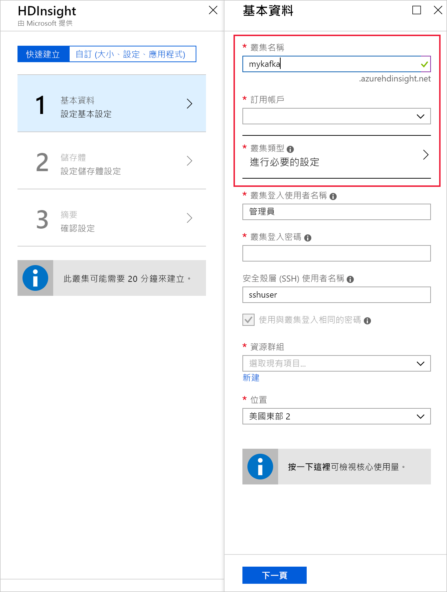
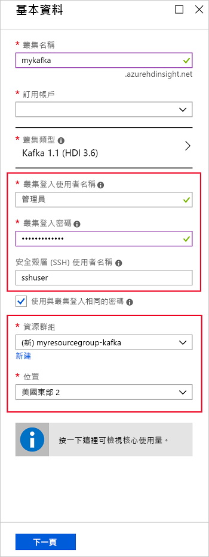
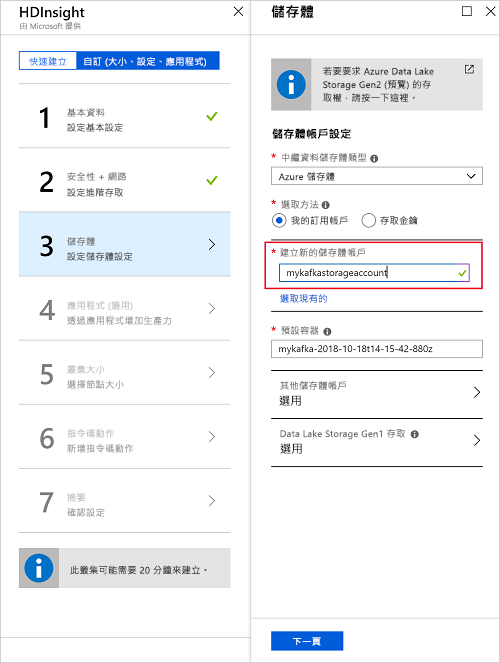
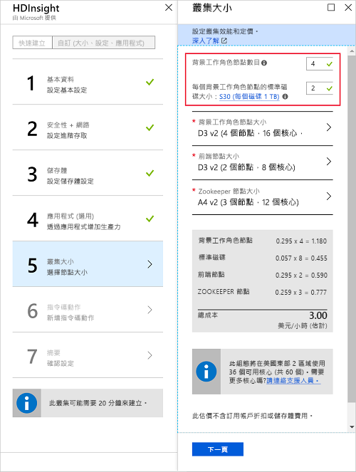

# <a name="quickstart-create-an-apache-kafka-on-hdinsight-cluster"></a>快速入門：在 HDInsight 叢集上建立 Apache Kafka 叢集

Apache Kafka 是一個開放原始碼的分散式串流平台。 它通常會用來作為訊息代理程式，因為可以提供類似「發佈-訂閱」訊息佇列的功能。 

在本快速入門中，您會了解如何使用 Azure 入口網站來建立 [Apache Kafka](https://kafka.apache.org) \(英文\) 叢集。 您也會了解如何使用內含的公用程式，使用 Apache Kafka 來傳送和接收訊息。

[!INCLUDE [delete-cluster-warning](../../../includes/hdinsight-delete-cluster-warning.md)]

> [!IMPORTANT]  
> Apache Kafka API 只能由同一個虛擬網路中的資源來存取。 在本快速入門中，您會使用 SSH 直接存取叢集。 若要將其他服務、網路或虛擬機器連線到 Apache Kafka，您必須先建立虛擬網路，然後建立網路中的資源。
>
> 如需詳細資訊，請參閱[使用虛擬網路連線到 Apache Kafka](apache-kafka-connect-vpn-gateway.md) 文件。

## <a name="prerequisites"></a>必要條件

* Azure 訂用帳戶。 如果您沒有 Azure 訂用帳戶，請在開始前建立[免費帳戶](https://azure.microsoft.com/free/?WT.mc_id=A261C142F) 。

* SSH 用戶端。 本文件中的步驟會使用 SSH 來連線到叢集。

    Linux、Unix 及 macOS 系統上預設會提供 `ssh` 命令。 在 Windows 10 上，使用下列其中一種方法來安裝 `ssh` 命令：

  * 使用 [Azure Cloud Shell](https://docs.microsoft.com/azure/cloud-shell/quickstart)。 Cloud Shell 會提供 `ssh` 命令，並可設定為使用 Bash 或 PowerShell 作為殼層環境。

  * 安裝[適用於 Linux 的 Windows 子系統](https://docs.microsoft.com/windows/wsl/install-win10) \(英文\)。 可透過 Microsoft Store 取得的 Linux 發行版本會提供 `ssh` 命令。

    > [!IMPORTANT]  
    > 本文件中的步驟假設您使用上述其中一個 SSH 用戶端。 如果您使用不同的 SSH 用戶端並遇到問題，請參閱您的 SSH 用戶端文件。
    >
    > 如需詳細資訊，請參閱[搭配 HDInsight 使用 SSH](../hdinsight-hadoop-linux-use-ssh-unix.md) 文件。

## <a name="create-an-apache-kafka-cluster"></a>建立 Apache Kafka 叢集

若要在 HDInsight 叢集上建立 Apache Kafka，請使用下列步驟：

1. 登入 [Azure 入口網站](https://portal.azure.com)。

1. 在左側功能表中，選取 [+ 建立資源]。

1. 在 [Azure Marketplace] 下方，選取 [分析]。

1. 在 [精選] 下方，選取 [HDInsight]。
   
    

2. 從 [基本] 中，輸入或選取以下資訊：

    | 設定 | 值 |
    | --- | --- |
    | 叢集名稱 | HDInsight 叢集的唯一名稱。 |
    | 訂用帳戶 | 選取您的訂用帳戶。 |
    
   選取 [叢集類型] 以顯示**叢集設定**。
   
   

3. 從 [叢集設定] 選取下列值：

    | 設定 | 值 |
    | --- | --- |
    | 叢集類型 | Kafka |
    | 版本 | Kafka 1.1.0 (HDI 3.6) |

    使用 [選取] 按鈕來儲存叢集類型設定，然後返回 [基本]。

    

4. 從 [基本] 中，輸入或選取以下資訊：

    | 設定 | 值 |
    | --- | --- |
    | 叢集登入使用者名稱 | 存取裝載於叢集上 Web 服務或 REST API 時的登入名稱。 請保留預設值 (admin)。 |
    | 叢集登入密碼 | 存取裝載於叢集上 Web 服務或 REST API 時的登入密碼。 |
    | 安全殼層 (SSH) 使用者名稱 | 透過 SSH 存取叢集時使用的登入資訊。 依預設，密碼要與叢集登入密碼相同。 |
    | 資源群組 | 在其中建立叢集的資源群組。 |
    | 位置 | 在其中建立叢集的 Azure 區域。 |

    > [!TIP]  
    > 每個 Azure 區域 (位置) 提供_容錯網域_。 容錯網域是 Azure 資料中心內基礎硬體的邏輯群組。 每個容錯網域會共用通用電源和網路交換器。 實作 HDInsight 叢集內節點的虛擬機器和受控磁碟會分散於這些容錯網域。 此架構會限制實體硬體故障的潛在影響。
    >
    > 若要獲得高度資料可用性，請選取包含「三個容錯網域」的區域 (位置)。 如需區域中的容錯網域數目的資訊，請參閱 [Linux 虛擬機器的可用性](../../virtual-machines/windows/manage-availability.md#use-managed-disks-for-vms-in-an-availability-set)文件。

   

    使用 [下一步] 按鈕來完成基本設定。

5. 針對本快速入門，請保留預設的安全性設定。 若要深入了解企業安全性套件，請造訪[使用 Azure Active Directory Domain Services 設定具有企業安全性套件的 HDInsight 叢集](../domain-joined/apache-domain-joined-configure-using-azure-adds.md)。 若要了解如何在 Apache Kafka 磁碟加密上使用自己的金鑰，請造訪[在 Azure HDInsight 上攜帶您自己的 Apache Kafka 金鑰](apache-kafka-byok.md)

   如果您想要將叢集連線到虛擬網路，請從 [虛擬網路] 下拉式清單中選取虛擬網路。

   

6. 從 [儲存體]，選取或建立儲存體帳戶。 本文件的步驟是將其他欄位保留為預設值。 使用 [下一步] 按鈕以儲存儲存體組態。 如需有關如何使用 Data Lake Storage Gen2 的詳細資訊，請參閱[快速入門：在 HDInsight 中設定叢集](../../storage/data-lake-storage/quickstart-create-connect-hdi-cluster.md)。

   

7. 從 [應用程式 (選擇性)] 中選取 [下一步]，以使用預設設定繼續進行。

8. 從 [叢集大小] 中選取 [下一步]，以使用預設設定繼續進行。

    > [!IMPORTANT]  
    > 若要保證 HDInsight 上的 Apache Kafka 可用性，則必須將 [背景工作節點數] 項目設為 3 或更高。 預設值為 4。
    
    > [!TIP]  
    > [每個背景工作角色節點的磁碟數] 項目會設定 HDInsight 上 Apache Kafka 的延展性。 HDInsight 上的 Apache Kafka 會在叢集中使用虛擬機器的本機磁碟來儲存資料。 Apache Kafka 的 I/O 非常大量，因此會使用 [Azure 受控磁碟](../../virtual-machines/windows/managed-disks-overview.md)來提供高輸送量，並為每個節點提供更多儲存空間。 受控磁碟的類型可以是__標準__ (HDD) 或__進階__ (SSD)。 磁碟類型取決於背景工作節點 (Apache Kafka 代理程式) 所使用的 VM 大小。 進階磁碟會自動與 DS 和 GS 系列的 VM 搭配使用。 所有其他的 VM 類型是使用標準磁碟。

   

9. 從 [進階設定] 中選取 [下一步]，以使用預設設定繼續進行。

10. 從 [摘要] 檢閱叢集組態。 使用 [編輯] 連結來變更所有不正確的設定。 最後，使用 [建立] 按鈕來建立叢集。
   
    
   
    > [!NOTE]
    > 建立叢集可能需要花費 20 分鐘的時間。

## <a name="connect-to-the-cluster"></a>連接到叢集

1. 若要連線到 Apache Kafka 叢集的主要前端節點，請使用下列命令。 將 `sshuser` 取代為 SSH 使用者名稱。 將 `mykafka` 取代為您的 Apache Kafka 叢集名稱。

    ```bash
    ssh sshuser@mykafka-ssh.azurehdinsight.net
    ```

2. 當您初次連線到叢集時，您的 SSH 用戶端可能會顯示警告，指出無法確認主機的真確性。 在系統提示時，輸入 __yes__，然後按 __Enter__ 鍵，以將主機新增至 SSH 用戶端信任的伺服器清單。

3. 出現提示時，請輸入 SSH 使用者的密碼。

連線之後，您會看到類似下列文字的資訊：

```text
Authorized uses only. All activity may be monitored and reported.
Welcome to Ubuntu 16.04.4 LTS (GNU/Linux 4.13.0-1011-azure x86_64)

 * Documentation:  https://help.ubuntu.com
 * Management:     https://landscape.canonical.com
 * Support:        https://ubuntu.com/advantage

  Get cloud support with Ubuntu Advantage Cloud Guest:
    https://www.ubuntu.com/business/services/cloud

83 packages can be updated.
37 updates are security updates.


Welcome to Apache Kafka on HDInsight.

Last login: Thu Mar 29 13:25:27 2018 from 108.252.109.241
ssuhuser@hn0-mykafk:~$
```

## <a id="getkafkainfo"></a>取得 Apache Zookeeper 和訊息代理程式主機資訊

使用 Kafka 時，您必須知道 Apache Zookeeper 主機和「訊息代理程式」主機。 這些主機可搭配 Apache Kafka API 以及 Kafka 隨附的許多公用程式使用。

在本節中，您會從叢集上的 Apache Ambari REST API 取得主機資訊。

1. 從連往叢集的 SSH 連線中，使用下列命令來安裝 `jq` 公用程式。 此公用程式可用來剖析 JSON 文件，而且在擷取主機資訊時很有用：
   
    ```bash
    sudo apt -y install jq
    ```

2. 若要將環境變數設為叢集名稱，請使用下列命令：

    > [!Important]
    > 以全部小寫字母輸入此命令的叢集名稱，即使名稱中是大寫字母也一樣。 大寫名稱無法與 Zookeeper 或訊息代理程式資訊一起使用。

    ```bash
    read -p "Enter the Kafka on HDInsight cluster name: " CLUSTERNAME
    ```

    出現提示時，輸入 Apache Kafka 叢集的名稱。

3. 若要使用 Zookeeper 主機資訊設定環境變數，請使用下列命令：
    
    ```bash
    export KAFKAZKHOSTS=`curl -sS -u admin -G http://headnodehost:8080/api/v1/clusters/$CLUSTERNAME/services/ZOOKEEPER/components/ZOOKEEPER_SERVER | jq -r '["\(.host_components[].HostRoles.host_name):2181"] | join(",")' | cut -d',' -f1,2`
    ```

    > [!TIP]
    > 此命令會直接在叢集前端節點上查詢 Ambari 服務。 您也可以使用 `https://$CLUSTERNAME.azurehdinsight.net:80/` 的公用位址來存取 ambari。 某些網路組態可以防止存取公用位址。 例如，使用網路安全性群組 (NSG) 來限制存取虛擬網路中的 HDInsight。

    出現提示時，輸入叢集登入帳戶 (不是 SSH 帳戶) 的密碼。

    > [!NOTE]
    > 此命令會擷取所有的 Zookeeper 主機，然後只傳回前兩個項目。 這是因為考量備援之故，以防某一部主機無法連線。

4. 若要確認是否已正確設定環境變數，請使用下列命令：

    ```bash
     echo '$KAFKAZKHOSTS='$KAFKAZKHOSTS
    ```

    此命令會傳回類似以下文字的資訊：

    `zk0-kafka.eahjefxxp1netdbyklgqj5y1ud.ex.internal.cloudapp.net:2181,zk2-kafka.eahjefxxp1netdbyklgqj5y1ud.ex.internal.cloudapp.net:2181`

5. 若要使用 Apache Kafka 訊息代理程式主機資訊來設定環境變數，請使用下列命令：

    ```bash
    export KAFKABROKERS=`curl -sS -u admin -G http://headnodehost:8080/api/v1/clusters/$CLUSTERNAME/services/KAFKA/components/KAFKA_BROKER | jq -r '["\(.host_components[].HostRoles.host_name):9092"] | join(",")' | cut -d',' -f1,2`
    ```

    出現提示時，輸入叢集登入帳戶 (不是 SSH 帳戶) 的密碼。

6. 若要確認是否已正確設定環境變數，請使用下列命令：

    ```bash   
    echo '$KAFKABROKERS='$KAFKABROKERS
    ```

    此命令會傳回類似以下文字的資訊：
   
    `wn1-kafka.eahjefxxp1netdbyklgqj5y1ud.cx.internal.cloudapp.net:9092,wn0-kafka.eahjefxxp1netdbyklgqj5y1ud.cx.internal.cloudapp.net:9092`

## <a name="manage-apache-kafka-topics"></a>管理 Apache Kafka 主題

Kafka 會將資料串流儲存於「主題」中。 您可以使用 `kafka-topics.sh` 公用程式來管理主題。

* **若要建立主題**，請在 SSH 連線中使用下列命令：

    ```bash
    /usr/hdp/current/kafka-broker/bin/kafka-topics.sh --create --replication-factor 3 --partitions 8 --topic test --zookeeper $KAFKAZKHOSTS
    ```

    此命令會使用 `$KAFKAZKHOSTS` 中儲存的主機資訊連線到 Zookeeper。 然後建立名為 **test** 的 Apache Kafka 主題。 

    * 此主題中所儲存的資料會分割到八個分割區。

    * 每個分割區都會在叢集中的三個背景工作節點之間進行複寫。

        > [!IMPORTANT]
        > 如果您已在 Azure 區域中建立叢集來提供三個容錯網域，請使用複寫因子 3。 否則，使用複寫因子 4。
        
        在具有三個容錯網域的區域中，複寫因子 3 可讓複本散佈於容錯網域中。 在具有兩個容錯網域的區域中，複寫因子 4 會在網域中平均散佈複本。
        
        如需區域中的容錯網域數目的資訊，請參閱 [Linux 虛擬機器的可用性](../../virtual-machines/windows/manage-availability.md#use-managed-disks-for-vms-in-an-availability-set)文件。

        > [!IMPORTANT] 
        > Apache Kafka 不知道 Azure 容錯網域。 為主題建立副本時，可能無法正確發散副本以實現高可用性。

        若要確保高可用性，請使用 [Apache Kafka 分割重新平衡工具](https://github.com/hdinsight/hdinsight-kafka-tools)。 您必須從連往 Apache Kafka 叢集前端節點的 SSH 連線來執行此工具。

        為了讓 Apache Kafka 資料具有最高可用性，您應該在下列情況中重新平衡主題的分割區複本：

        * 建立新主題或磁碟分割時

        * 相應增加叢集時

* **若要列出主題**，請使用下列命令：

    ```bash
    /usr/hdp/current/kafka-broker/bin/kafka-topics.sh --list --zookeeper $KAFKAZKHOSTS
    ```

    此命令會列出可在 Apache Kafka 叢集上使用的主題。

* **若要刪除主題**，請使用下列命令：

    ```bash
    /usr/hdp/current/kafka-broker/bin/kafka-topics.sh --delete --topic topicname --zookeeper $KAFKAZKHOSTS
    ```

    此命令會刪除名為 `topicname` 的主題。

    > [!WARNING]
    > 如果您刪除先前建立的 `test` 主題，則必須加以重新建立。 本文件稍後的步驟會用到此主題。

如需 `kafka-topics.sh` 公用程式可用命令的詳細資訊，請使用下列命令：

```bash
/usr/hdp/current/kafka-broker/bin/kafka-topics.sh
```

## <a name="produce-and-consume-records"></a>產生和取用記錄

Kafka 會在主題中儲存「記錄」。 記錄是由「產生者」產生，並由「取用者」取用。 產生者與取用者會與「Kafka 訊息代理程式」服務進行通訊。 HDInsight 叢集中的每個背景工作節點都是一部 Apache Kafka 訊息代理程式主機。

若要將記錄儲存至您稍早建立的 test 主題，然後利用取用者進行讀取，請使用下列步驟：

1. 若要將記錄寫入主題，請從 SSH 連線使用 `kafka-console-producer.sh` 公用程式：
   
    ```bash
    /usr/hdp/current/kafka-broker/bin/kafka-console-producer.sh --broker-list $KAFKABROKERS --topic test
    ```
   
    在此命令之後，您會抵達空白行。

2. 在空白行中輸入文字訊息並按一下 enter 鍵。 如此輸入幾個訊息，然後使用 **Ctrl + C** 返回一般提示。 每一行都會以個別記錄傳送至 Apache Kafka 主題。

3. 若要從主題讀取記錄，請從 SSH 連線使用 `kafka-console-consumer.sh` 公用程式：
   
    ```bash
    /usr/hdp/current/kafka-broker/bin/kafka-console-consumer.sh --bootstrap-server $KAFKABROKERS --topic test --from-beginning
    ```
   
    此命令會擷取主題中的記錄並加以顯示。 使用 `--from-beginning` 告知取用者從串流的開頭開始，所以會擷取所有的記錄。

    > [!NOTE]
    > 如果您使用舊版 Kafka，請以 `--zookeeper $KAFKAZKHOSTS` 取代 `--bootstrap-server $KAFKABROKERS`。

4. 使用 __Ctrl + C__ 來停止取用者。

您也可以利用程式設計方式建立產生者和取用者。 如需使用此 API 的範例，請參閱[使用 Apache Kafka Producer 和 Consumer API 搭配 HDInsight](apache-kafka-producer-consumer-api.md) 文件。

## <a name="clean-up-resources"></a>清除資源

若要清除本快速入門所建立的資源，您可以刪除資源群組。 刪除資源群組也會刪除相關聯的 HDInsight 叢集，以及與資源群組相關聯的任何其他資源。

若要使用 Azure 入口網站移除資源群組：

1. 在 Azure 入口網站中展開左側功能表，以開啟服務的功能表，然後選擇 [資源群組] 以顯示資源群組的清單。
2. 找出要刪除的資源群組，然後以滑鼠右鍵按一下清單右側的 [更多] 按鈕 (...)。
3. 選取 [刪除資源群組]，並加以確認。

> [!WARNING]
> HDInsight 叢集的計費起自叢集建立時，終至叢集刪除時。 計費是以每分鐘按比例計算，因此不再使用時，請一律刪除您的叢集。
> 
> 刪除 HDInsight 叢集上的 Apache Kafka，也會刪除 Kafka 中儲存的任何資料。

## <a name="next-steps"></a>後續步驟

> [!div class="nextstepaction"]
> [使用 Apache Spark 搭配 Apache Kafka](../hdinsight-apache-kafka-spark-structured-streaming.md)

