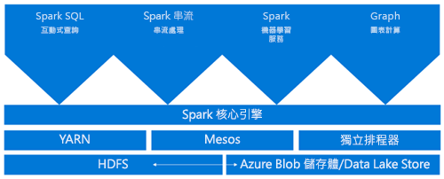
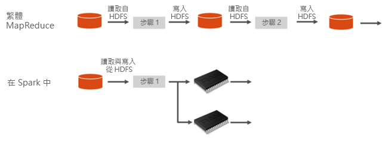
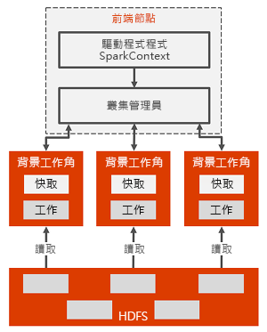

# Spark on HDInsight 簡介

本文為您提供 Spark on HDInsight 簡介。 <a href="http://spark.apache.org/" target="_blank">Apache Spark</a> 是一個開放原始碼平行處理架構，可支援記憶體內部處理，大幅提升巨量資料分析應用程式的效能。 HDInsight 上的 Spark 叢集也能與 Azure 儲存體 (WASB) 以及 Azure Data Lake Store 相容。 因此，您可以輕鬆地透過 Spark 叢集處理儲存在 Azure 中的現有資料。

[!INCLUDE [hdinsight-price-change](../../../includes/hdinsight-enhancements.md)]

當您在 HDInsight 上建立 Spark 叢集時，就是建立了已安裝及設定 Spark 的 Azure 計算資源。 在 HDInsight 中建立 Spark 叢集只需要約 10 分鐘。 系統會將要處理的資料儲存在 Azure 儲存體或 Azure Data Lake Store 中。 請參閱[搭配 HDInsight 使用 Azure 儲存體](../hdinsight-hadoop-use-blob-storage.md)。

## Spark 與傳統 MapReduce

是什麼讓 Spark 變快速？ Apache Spark 架構與傳統 MapReduce 的差異，讓它可以提供更好的資料共用效能？

Spark 提供用於記憶體內部叢集運算的基本項目。 Spark 作業可將資料載入並快取到記憶體中，重複查詢它，速度比磁碟型系統還要快。 Spark 也會整合到 Scala 程式設計語言中，讓您處理分散式資料集 (像是本機集合)。 您不需要將一切建構成對應和縮減作業。

在 Spark 中，作業之間的資料共用比較快速，因為資料位於記憶體中。 相反地，Hadoop 透過 HDFS 共用資料，其所需的處理時間比較長。

## 什麼是 Apache Spark on Azure HDInsight？
HDInsight 上的 Spark 叢集可提供完全受控的 Spark 服務。 在 HDInsight 上建立 Spark 叢集的優點如下所列。

| 功能 | 說明 |
| --- | --- |
| 容易建立 Spark 叢集 |您可以使用 Azure 入口網站、Azure PowerShell 或 HDInsight .NET SDK，在幾分鐘之內於 HDInsight 上建立新的 Spark 叢集。 請參閱 [開始使用 HDInsight 中的 Spark 叢集](apache-spark-jupyter-spark-sql.md) |
| 容易使用 |HDInsight 上的 Spark 叢集包含 Jupyter 和 Zeppelin Notebook。 您可以使用這些 Notebook 來進行互動式的資料處理和視覺化。|
| REST API |HDInsight 中的 Spark 叢集包含 [Livy](https://github.com/cloudera/hue/tree/master/apps/spark/java#welcome-to-livy-the-rest-spark-server)，它是 REST-API 型 Spark 作業伺服器，可用來遠端提交及監視作業。 |
| 支援 Azure Data Lake Store | HDInsight 上的 Spark 叢集可以設定為使用 Azure Data Lake Store 作為額外的儲存體以及主要儲存體 (只適用於 HDInsight 3.5 叢集)。 如需有關 Data Lake Store 的詳細資訊，請參閱 [Azure Data Lake Store 概觀](../../data-lake-store/data-lake-store-overview.md)。 |
| Azure 服務整合 |HDInsight 上的 Spark 叢集附有連線 Azure 事件中樞的連接器。 除了 Spark 已經提供的 [Kafka](http://kafka.apache.org/)之外，客戶還可以使用事件中樞來建置串流應用程式。 |
| 支援 R 伺服器 | 您可以在 HDInsight Spark 叢集上設定 R 伺服器，以 Spark 叢集所承諾的速度執行分散式 R 計算。 如需詳細資訊，請參閱 [開始使用 HDInsight 上的 R 伺服器](../r-server/r-server-get-started.md)。 |
| 第三方 IDE 整合 | HDInsight 會提供 IDEs like IntelliJ IDEA 和 Eclipse 的外掛程式，以供您建立應用程式並將其提交至 HDInsight Spark 叢集。 如需詳細資訊，請參閱[使用 Azure Toolkit for IntelliJ](apache-spark-intellij-tool-plugin.md) 和[使用 Azure Toolkit for Eclipse](apache-spark-eclipse-tool-plugin.md)。|
| 並行查詢 |HDInsight 中的 Spark 叢集支援並行查詢。 它能讓一位使用者執行多個查詢，或讓不同的使用者執行多個查詢，以及讓應用程式共用相同的叢集資源。 |
| SSD 快取 |您可以選擇將資料快取在記憶體中，或快取在連接叢集節點的 SSD 中。 記憶體快取能提供最高的查詢效能，但可能所費不疵。SSD 快取是改善查詢效能的絕佳選項，而且您不需要根據記憶體中的整個資料集建立滿足其需求的叢集規模。 |
| BI 工具整合 |HDInsight 上的 Spark 叢集會為 BI 工具 (例如 [Power BI](http://www.powerbi.com/) 和 [Tableau](http://www.tableau.com/products/desktop)) 提供資料分析所需的連接器。 |
| 預先載入的 Anaconda 程式庫 |HDInsight 上的 Spark 叢集附有預先安裝的 Anaconda 程式庫。 [Anaconda](http://docs.continuum.io/anaconda/) 為機器學習、資料分析、視覺化等主題提供將近 200 個程式庫。 |
| 延展性 |雖然您可以在建立時指定叢集的節點數，但您可以擴大或縮小叢集以配合工作負載。 所有 HDInsight 叢集都允許您變更叢集中的節點數目。 此外，由於所有資料都儲存在 Azure 儲存體或 Data Lake Store 內，因此您可以在不遺失資料的情況下卸除 Spark 叢集。 |
| 全天候支援 |HDInsight 上的 Spark 叢集附有企業級的全天候支援和保證正常運作時間達 99.9% 的 SLA。 |

## Spark 叢集架構

以下是 Spark 叢集架構與其運作方式：

前端節點的 Spark 主節點可管理應用程式數目，而應用程式會對應到 Spark 驅動程式。 Spark 主節點會以各種方式管理每個應用程式。 Spark 可以部署在 Mesos、YARN 或 Spark 叢集管理員之上，其可將背景工作節點資源配置給應用程式。 在 HDInsight 中，使用 YARN 叢集管理員可執行 Spark。 叢集中的資源是由 HDInsight 中的 Spark 主節點管理。 這表示 Spark 主節點曉得哪些資源 (如記憶體) 遭到佔用或可用於背景工作節點上。

驅動程式會執行使用者的主要功能，並且在背景工作節點上執行各種平行作業。 然後，驅動程式會收集作業的結果。 背景工作節點會在 Hadoop 分散式檔案系統 (HDFS) 中讀取和寫入資料。 背景工作節點也會將記憶體內部已轉換的資料快取為彈性分散式資料集 (RDD)。

一旦在 Spark 主節點中建立應用程式，Spark 主節點就會將資源配置給應用程式，並建立稱為 Spark 驅動程式的執行檔。 Spark 驅動程式也會建立 SparkContext，而且會開始建立 RDD。 RDD 的中繼資料會儲存在 Spark 驅動程式上。

Spark 驅動程式會連線到 Spark 主節點，而且負責將應用程式轉換為個別工作的有向圖 (DAG)，而這些工作會在背景工作節點上的執行程式處理序內執行。 每個應用程式都會取得自己的執行程式處理序，而這些處理序會在整個應用程式的持續時間保持運作，並且在多個執行緒中執行工作。

## HDInsight 上的 Spark 有哪些使用案例？
HDInsight 中的 Spark 叢集適用於下列重要案例：

### 互動式資料分析和 BI
[觀看教學課程](apache-spark-use-bi-tools.md)

HDInsight 中的 Apache Spark 會將資料儲存在 Azure 儲存體或 Azure Data Lake Store 中。 商務專家和重要決策者可以利用這些資料來進行分析及建立報告，並使用 Microsoft Power BI 來根據分析資料建置互動式報告。 分析師可以從叢集儲存體中的非結構化/半結構化資料著手、使用 Notebook 來定義資料的結構描述，然後再使用 Microsoft Power BI 來建置資料模型。 HDInsight 中的 Spark 叢集也支援 Tableau 等多個第三方 BI 工具，因此能成為資料分析師、商務專家及重要決策者的理想平台。

### Spark 機器學習服務
[看看教學課程：利用 HVAC 資料來預測建築物的溫度](apache-spark-ipython-notebook-machine-learning.md)

[看看教學課程：預測食物檢查結果](apache-spark-machine-learning-mllib-ipython.md)

Apache Spark 隨附 [MLlib](http://spark.apache.org/mllib/)，這是以 Spark 為基礎的機器學習程式庫，您可以從 HDInsight 中的 Spark 叢集使用。 HDInsight 上的 Spark 叢集也包含 Anaconda，這是提供各種機器學習套件的 Python 散發。 搭配內建的 Jupyter 和 Zeppelin Notebook 支援，您將擁有最先進的機器學習應用程式建立環境。

### Spark 串流和即時資料分析
[觀看教學課程](apache-spark-eventhub-streaming.md)

HDInsight 上的 Spark 叢集提供豐富的支援供您建置即時分析解決方案。 雖然 Spark 已附有從 Kafka、Flume、Twitter、ZeroMQ 或 TCP 通訊端等眾多來源擷取資料的連接器，不過 HDInsight 中的 Spark 仍加入首屈一指的支援，供您從 Azure 事件中樞擷取資料。 事件中樞是 Azure 上最廣泛使用的佇列服務。 擁有立即可用的事件中樞支援，讓 HDInsight 中的 Spark 叢集成為建置即時分析管線的理想平台。

## Spark 叢集包含哪些元件？
依預設，HDInsight 中的 Spark 叢集能經由叢集提供下列元件。

* [Spark Core](https://spark.apache.org/docs/1.5.1/)。 包括 Spark Core、Spark SQL、Spark 串流 API、GraphX 及 MLlib。
* [Anaconda](http://docs.continuum.io/anaconda/)
* [Livy](https://github.com/cloudera/hue/tree/master/apps/spark/java#welcome-to-livy-the-rest-spark-server)
* [Jupyter Notebook](https://jupyter.org)
* [Zeppelin Notebook](http://zeppelin-project.org/)

HDInsight 中的 Spark 叢集也提供 [ODBC 驅動程式](http://go.microsoft.com/fwlink/?LinkId=616229)，讓您能從 BI 工具 (例如 Microsoft Power BI 和 Tableau) 連線到 HDInsight 中的 Spark 叢集。

## 我該從哪裡開始？
請從在 HDInsight 上建立 Spark 叢集開始。 請參閱[快速入門：在 HDInsight Linux 上建立 Spark 叢集並利用 Jupyter 執行互動式查詢](apache-spark-jupyter-spark-sql.md)。 

## 後續步驟
### 案例
* [Spark 和 BI：在 HDInsight 中搭配使用 Spark 和 BI 工具執行互動式資料分析](apache-spark-use-bi-tools.md)
* [Spark 和機器學習服務：使用 HDInsight 中的 Spark，利用 HVAC 資料來分析建築物溫度](apache-spark-ipython-notebook-machine-learning.md)
* [Spark 和機器學習服務：使用 HDInsight 中的 Spark 來預測食品檢查結果](apache-spark-machine-learning-mllib-ipython.md)
* [Spark 串流：使用 HDInsight 中的 Spark 來建置即時串流應用程式](apache-spark-eventhub-streaming.md)
* [使用 HDInsight 中的 Spark 進行網站記錄分析](apache-spark-custom-library-website-log-analysis.md)

### 建立及執行應用程式
* [使用 Scala 建立獨立應用程式](apache-spark-create-standalone-application.md)
* [利用 Livy 在 Spark 叢集上遠端執行作業](apache-spark-livy-rest-interface.md)

### 工具和擴充功能
* [使用 IntelliJ IDEA 的 HDInsight Tools 外掛程式來建立和提交 Spark Scala 應用程式](apache-spark-intellij-tool-plugin.md)
* [使用 IntelliJ IDEA 的 HDInsight Tools 外掛程式遠端偵錯 Spark 應用程式](apache-spark-intellij-tool-plugin-debug-jobs-remotely.md)
* [利用 HDInsight 上的 Spark 叢集來使用 Zeppelin Notebook](apache-spark-zeppelin-notebook.md)
* [HDInsight 的 Spark 叢集中 Jupyter Notebook 可用的核心](apache-spark-jupyter-notebook-kernels.md)
* [搭配 Jupyter Notebook 使用外部套件](apache-spark-jupyter-notebook-use-external-packages.md)
* [在電腦上安裝 Jupyter 並連接到 HDInsight Spark 叢集](apache-spark-jupyter-notebook-install-locally.md)

### 管理資源
* [在 Azure HDInsight 中管理 Apache Spark 叢集的資源](apache-spark-resource-manager.md)
* [追蹤和偵錯在 HDInsight 中的 Apache Spark 叢集上執行的作業](apache-spark-job-debugging.md)
* [Azure HDInsight 中 Apache Spark 的已知問題](apache-spark-known-issues.md)。
