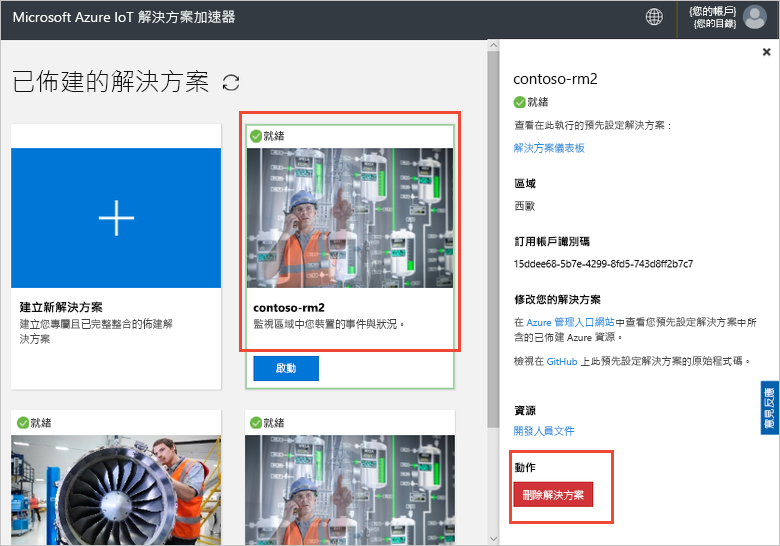

# 將 MXChip IoT DevKit AZ3166 連線到 IoT 遠端監視解決方案加速器

[!INCLUDE [iot-suite-selector-connecting](../../includes/iot-suite-selector-connecting.md)]

您將會了解如何在 IoT DevKit 上執行範例應用程式，以將感應器資料傳送至解決方案加速器。

[MXChip IoT DevKit](https://aka.ms/iot-devkit) 是全方位 Arduino 相容板，具有豐富的週邊設備和感應器。 您可以使用 Visual Studio Code 中的 [Azure IoT Workbench](https://marketplace.visualstudio.com/items?itemName=vsciot-vscode.vscode-iot-workbench) 來對它進行開發。 它隨附不斷增長的[專案目錄](https://microsoft.github.io/azure-iot-developer-kit/docs/projects/)，以引導您設定運用 Microsoft Azure 服務的物聯網 (IoT) 解決方案原型。

## 您需要什麼

請參閱[使用者入門指南](https://docs.microsoft.com/azure/iot-hub/iot-hub-arduino-iot-devkit-az3166-get-started)並**完成下列章節**：

* 準備硬體
* 設定 Wi-Fi
* 開始使用 DevKit
* 準備開發環境

## 在 VS Code 中開啟遠端監視範例

1. 確定 IoT DevKit **未**連線至您的電腦。 先啟動 VS Code，然後將 DevKit 連線至您的電腦。

2. 按一下 `F1` 開啟命令選擇區，輸入並選取 [IoT Workbench: 範例]。 然後選取 [IoT DevKit] 作為面板。

3. 找出 [遠端監視]，並按一下 [開啟範例]。 這會開啟一個內含專案資料夾的新 VS Code 視窗。
  [遠端監視範例]

## 設定 IoT 中樞裝置連接字串

1. 將 IoT DevKit 切換為**設定模式**。 若要這樣做：
   * 按住 **A** 按鈕。
   * 按下再放開 [重設] 按鈕。

2. 畫面會顯示 DevKit 識別碼和 [設定]。
   
  

3. 按一下 `F1` 開啟命令選擇區，輸入並選取 [IoT Workbench：裝置 > 配置裝置設定]。

4. 貼上您剛才複製的連接字串，並按一下 `Enter` 進行設定。

## 組建並上傳裝置程式碼

1. 按一下 `F1` 開啟命令選擇區，輸入並選取 [IoT Workbench：裝置 > 裝置上傳]。
  

1. VS Code 接著會開始程式碼，並上傳到您的 DevKit。
  

DevKit 會重新開機，然後開始執行程式碼。

## 測試專案

### 檢視傳送至遠端監視解決方案的遙測資料

當範例應用程式執行時，DevKit 會透過 Wi-Fi 將感應器資料傳送至遠端監視解決方案。 若要查看結果，請遵循下列步驟：

1. 移至解決方案儀表板，然後按一下 [裝置]。

2. 按一下裝置名稱，在右邊索引標籤上，您可以即時看到 DevKit 的感應器狀態。
  

### 傳送 C2D 訊息

遠端監視解決方案可讓您在裝置上叫用遠端方法。 選取感應器時，可以在 [方法] 區段中看到範例程式碼發佈的三種方法。

讓我們嘗試使用「LedColor」方法變更其中一個 DevKit LED 的色彩。

1. 從裝置清單中選取裝置名稱，並按一下 [作業]。

  

2. 如下所示設定作業，並按一下 [套用]。
  * 選取作業：**執行方法**
  * 方法名稱：**LedColor**
  * 作業名稱：**ChangeLedColor**
  
  

在幾秒鐘內，您的 DevKit 應會變更 RGB LED 的色彩 (A 按鈕下方)。

## 清除資源

如果您打算繼續進行教學課程，請將已部署的遠端監視解決方案加速器保留下來。

如果您不再需要解決方案加速器，可選取該加速器，然後按一下 [刪除解決方案]，從已佈建的解決方案頁面中加以刪除：

## 問題與意見反應

如果發生問題，請參閱 [IoT DevKit 常見問題集](https://microsoft.github.io/azure-iot-developer-kit/docs/faq/)，或使用下列管道與我們連絡：

* [Gitter.im](http://gitter.im/Microsoft/azure-iot-developer-kit)
* [Stackoverflow](https://stackoverflow.com/questions/tagged/iot-devkit)

## 後續步驟

您已了解如何將 DevKit 裝置連線至 Azure IoT 遠端監視解決方案加速器並將感應器資料視覺化，以下是建議的後續步驟：

* [Azure IoT 解決方案加速器概觀](https://docs.microsoft.com/azure/iot-suite/)
* [自訂 UI](../iot-accelerators/iot-accelerators-remote-monitoring-customize.md)
* [將 IoT DevKit 連線到 Azure IoT Central 應用程式](../iot-central/howto-connect-devkit.md)