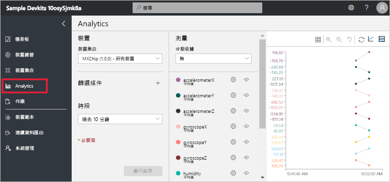

# 開始導覽 Azure IoT 中心 UI

本文為您介紹 Microsoft Azure IoT 中心 UI。 您可以使用此 UI 來建立、管理和使用 Azure IoT 中心解決方案及其連線的裝置。

「建置者」可使用 Azure IoT 中心 UI 來定義 Azure IoT 中心解決方案。 您可以使用 UI：

- 定義可連線到您的解決方案的裝置類型。
- 為您的裝置設定規則和動作。
- 為使用您的解決方案的「操作員」自訂 UI。

「操作員」可使用 Azure IoT 中心 UI 來管理 Azure IoT 中心解決方案。 您可以使用 UI：

- 監視您的裝置。
- 設定您的裝置。
- 針對裝置問題進行移難排解並修復。
- 佈建新裝置。

## 使用左側導覽功能表

您可以使用左側導覽功能表來存取應用程式的不同區域：

| 功能表 | 說明 |
| ---- | ----------- |
|  | <ul><li>[首頁] 按鈕會顯示您應用程式的首頁。 建置者可以為操作員自訂此首頁。</li><li>[裝置總管] 按鈕可列出您應用程式中定義的裝置範本，以及與每個裝置範本相關聯的模擬和實際裝置。 操作員可使用 [裝置總管] 來管理已連線的裝置。</li><li>[裝置集合] 按鈕可讓您檢視和建立裝置集合。 操作員可以建立裝置集合，作為查詢所指定的裝置邏輯集合。</li><li>[分析] 按鈕可針對裝置和裝置集合，顯示衍生自裝置遙測的分析。 操作員可以根據裝置資料建立自訂檢視，以從您的應用程式衍生見解。</li><li>[應用程式建置者] 按鈕可顯示建置者所使用的工具，例如 [建立裝置範本] 工具。</li><li>[系統管理] 按鈕可顯示應用程式系統管理頁面，讓管理員可以管理應用程式設定、使用者和角色。</li></ul> |

## 搜尋、說明及支援

頂端功能表會出現在每個頁面上：

- 若要搜尋裝置範本與裝置，請選擇 [搜尋] 圖示。
- 若要取得說明及支援，請選擇 [說明] 下拉式功能表以取得資源清單。
- 若要控制教學課程，請變更 UI 佈景主題，或登出應用程式，選擇 [帳戶] 圖示。

您可以為 UI 選擇淺色佈景主題或深色調佈景主題：

## 首頁

首頁是當您登入 Azure IoT 中心應用程式時所看到的第一個頁面。 建置者可以藉由新增圖格，為應用程式的其他使用者自訂首頁。 若要深入了解，請參閱[自訂 Azure IoT 中心操作員的檢視](tutorial-customize-operator.md)教學課程。

## 裝置總管

總管頁面可顯示您 Azure IoT 中心應用程式中的_裝置範本_和_裝置_。

* 裝置範本會定義可以連線到您應用程式的裝置類型。 若要深入了解，請參閱[在 Azure IoT 中心應用程式中定義新的裝置類型](tutorial-define-device-type.md)。
* 裝置代表應用程式中的實際或模擬裝置。 若要深入了解，請參閱[將新的裝置新增至 Azure IoT 中心應用程式](tutorial-add-device.md)。

## 裝置集合

「裝置集合」頁面可顯示建置者所建立的裝置集合。 裝置集合為相關裝置的集合。 建置者可定義查詢，以識別裝置集合中包含的裝置。 當您在應用程式中自訂分析時，您可使用裝置集合。 若要深入了解，請參閱[在 Azure IoT 中心應用程式中使用裝置集合](howto-use-device-sets.md)一文。

## 分析

分析頁面會顯示圖表，協助您了解連線到您應用程式的裝置行為。 操作員可使用此頁面來監視及調查已連線裝置的問題。 建置者可以定義在此頁面上顯示的圖表。 若要深入了解，請參閱[為 Azure IoT 中心應用程式建立自訂分析](howto-create-analytics.md)。

## 應用程式建置者

[應用程式建置者] 頁面包含建置者用來建立 Azure IoT 中心應用程式之工具的連結，例如建立裝置範本及設定首頁。 若要深入了解，請參閱[在 Azure IoT 中心應用程式中定義新的裝置類型](tutorial-define-device-type.md)。

## 系統管理

[系統管理] 頁面包含管理員使用之工具的連結，例如在應用程式中定義使用者和角色。 若要深入了解，請參閱[管理 Azure IoT 中心應用程式](howto-administer.md)一文。

## 後續步驟

您現在已大致了解 Azure IoT 中心並熟悉 UI 版面配置，下一個建議步驟是完成[建立 Azure IoT 中心應用程式](quick-deploy-iot-central.md)快速入門。