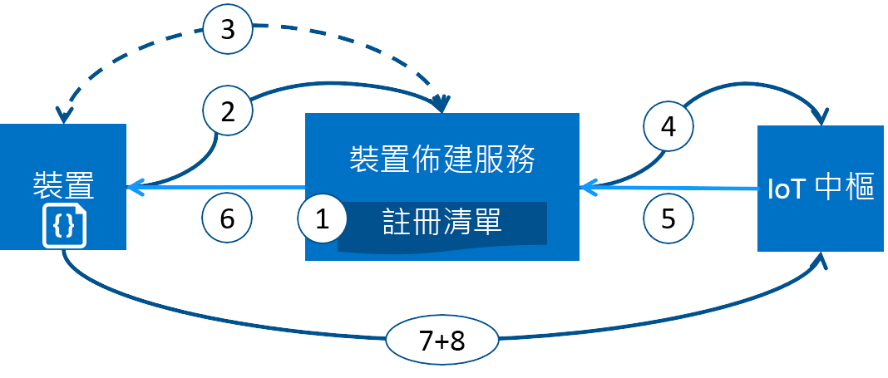

# 使用 Azure IoT 中樞裝置佈建服務來佈建裝置
Microsoft Azure 提供一組豐富的整合式公用雲端服務，可滿足所有的 IoT 方案需求。 IoT 中樞裝置佈建服務是 IoT 中樞的協助程式服務，無須人為介入，即可對正確的 IoT 中樞進行 Just-In-Time 自動佈建，讓客戶能以安全又可調整的方式佈建數百萬個裝置。

## 何時要使用裝置佈建服務
在許多佈建情節中，裝置佈建服務是使裝置連線及設定 IoT 中樞的絕佳選擇，例如：

* 無須人為介入佈建到單一 IoT 解決方案，無須在出廠時硬式編碼 IoT 中樞連線資訊 (初始安裝)
* 跨多個中樞負載平衡的裝置
* 以銷售交易資料作為基礎，將裝置連線到其擁有者的 IoT 解決方案 (多組織用戶管理)
* 根據使用案例，將裝置連線到特定的 IoT 解決方案 (解決方案隔離)
* 以最低的延遲將裝置連線到 IoT 中樞 (地區分區化)
* 以裝置中的變更作為基礎重新佈建
* 移動裝置所用的金鑰，以連線到 IoT 中樞 (不使用 X.509 憑證連線時)

## 在幕後
上一節中所列的所有情節，都可以相同的流程使用無須人為介入佈建的佈建服務來完成。 傳統上包含於佈建的許多手動步驟，都會使用裝置佈建服務加以自動化，從而減少部署 IoT 裝置的時間，並降低手動錯誤的風險。 下一節說明佈建裝置背後的運作原理。 第一個步驟為手動，所有的後續步驟則為自動的。

1. 裝置製造商會將裝置註冊資訊新增至 Azure 入口網站中的註冊清單。
2. 裝置會連絡出廠時設定的佈建服務端點。 裝置會將識別資訊傳遞給佈建服務來證明其身分識別。
3. 佈建服務會驗證裝置的身分識別，方法是使用 nonce 挑戰 ([信賴平台模組](https://trustedcomputinggroup.org/work-groups/trusted-platform-module/)) 或標準 X.509 驗證 (X.509)，來驗證註冊清單項目的註冊識別碼和金鑰。
4. 佈建服務會使用 IoT 中樞來註冊裝置，並填入裝置的[必要對應項狀態](../iot-hub/iot-hub-devguide-device-twins.md)。
5. IoT 中樞會將裝置識別碼資訊傳回給佈建服務。
6. 佈建服務會將 IoT 中樞連線資訊傳回給裝置。 裝置現在可以開始直接將資料傳送到 IoT 中樞。
7. 裝置會連線到 IoT 中樞。
8. 裝置會在 IoT 中樞從其裝置對應項取得所需的狀態。

## 佈建程序
裝置的部署程序中有兩個不同的步驟，裝置佈建服務會參與其中，並能夠獨立完成：

* 建立裝置及出廠時準備的**製造步驟**，和
* **雲端安裝步驟**，可在其中設定裝置佈建服務以進行自動佈建。

這兩個步驟能順暢地符合現有的製造和部署程序。 裝置佈建服務甚至可簡化某些部署程序，這些程序需要大量手動工作才能取得裝置的連線資訊。

### 製造步驟
這個步驟是關於製造線的事項。 此步驟中所涉及的角色包括矽設計工具、矽製造商、整合者及/或裝置的製造商。 這個步驟是關於建立本身的硬體。

裝置佈建服務不會在製造過程中導入新的步驟；相反地，它所繫結的現有步驟會在裝置上安裝初始軟體和 (在理想情況下) HSM。 裝置會使用佈建服務資訊來進行程式設計，而不是在此步驟中建立裝置識別碼；因此裝置會呼叫佈建服務，在它開啟時取得其連線資訊/IoT 解決方案指派。

在這個步驟中，製造商也會提供裝置部署器/運算子，當中包含識別金鑰資訊。 提供該資訊可能很簡單，就像確認所有裝置都具有由裝置部署者/操作員提供之簽署憑證所產生的 X.509 憑證；也可能很複雜，就像從每個 TPM 裝置擷取 TPM 簽署金鑰的公開部分。 這些服務目前由許多矽製造商所提供。

### 雲端安裝步驟
這個步驟與設定適用於自動佈建的雲端相關。 通常雲端安裝步驟中會包含兩種類型的使用者：知道裝置必須初始設定方式的使用者 (裝置運算子)，以及其他知道裝置如何在 IoT 中樞 (方案運算子) 之間分割的使用者。

佈建必須進行一次性的初始安裝，這通常是由解決方案運算子處理。 一旦佈建服務設定之後，就不需要修改，除非使用案例有所變更。

服務設定為自動佈建之後，必須準備進行註冊裝置。 這個步驟是由裝置運算子完成，該裝置運算子知道裝置的必要設定，並在尋找其 IoT 中樞時，負責確定佈建服務可以適當證明裝置的身分識別。 裝置運算子會向製造商取得識別金鑰資訊，並將它新增至註冊清單。 隨著使用裝置的最新相關資訊來新增新的項目或更新現有的項目時，會對註冊清單進行後續更新。

## 註冊和佈建
佈建表示根據在當中使用字詞的產業之各種項目。 在將 IoT 裝置佈建到其雲端解決方案的內容中，佈建是一個包含兩個部分的程序：

1. 第一個部分是在裝置與 IoT 解決方案之間註冊裝置來建立初始連線。
2. 第二個部分是以其註冊之解決方案的特定需求作為基礎套用正確的組態。

這兩個步驟都完成之後，該裝置才算佈建完成。 有些雲端服務只提供佈建程序的第一個步驟，也就是將裝置註冊至 IoT 解決方案端點，但並未提供初始組態。 裝置佈建服務會自動進行這兩個步驟，為裝置提供順暢的佈建體驗。

## 裝置佈建服務的功能
裝置佈建服務有許多功能，適合用來佈建裝置。

* **安全證明**支援 X.509 與 TPM 型身分識別。
* **註冊清單**包含可能在某處註冊的完整裝置記錄/裝置群組。 一旦註冊後，註冊清單就會包含裝置所需設定的相關資訊，並可以在任何時間進行更新。
* **多個配置原則**可控制裝置佈建服務將裝置指派給 IoT 中樞的方式，從而支援您的情節。
* **監視和診斷記錄**並確定一切運作正常。
* **多重中樞支援**可讓裝置佈建服務來將裝置指派給一個以上的 IoT 中樞。 裝置佈建服務可與多個 Azure 訂用帳戶之間的中樞通訊。
* **跨區域支援**可讓「裝置佈建服務」將裝置指派到其他區域的 IoT 中樞。

您可以在[裝置概念](concepts-device.md)、[服務概念](concepts-service.md)和[安全性概念](concepts-security.md)中，深入了解裝置佈建中包含的概念和功能。

## 跨平台支援
裝置佈建服務，如同所有 Azure IoT 服務，能跨平台適用於各種作業系統。 Azure 提供多種[程式設計語言](https://github.com/Azure/azure-iot-sdks)的開放原始碼 SDK，以協助建立裝置的連線及管理服務。 「裝置佈建服務」支援使用下列通訊協定建立裝置的連線：

* HTTPS
* AMQP
* 透過 Web 通訊端的 AMQP
* MQTT
* 透過 Web 通訊端的 MQTT

「裝置佈建服務」只支援服務作業的 HTTPS 連線。

## 區域
「裝置佈建服務」在許多區域中都可以使用。 所有服務的現有和最新宣佈區域的更新清單位於 [Azure 區域](https://azure.microsoft.com/regions/)。 您可以在 [Azure 狀態](https://azure.microsoft.com/status/)頁面上檢查裝置佈建服務的可用性。

> [!NOTE]
> 「裝置佈建服務」是全球性的，而非僅限於某個位置。 不過，您必須指定一個區域，與您「裝置佈建服務」設定檔相關聯的中繼資料會位在該區域。

## 可用性
裝置佈建服務有 99.9% 的服務等級協定，而且您可以[閱讀 SLA](https://azure.microsoft.com/support/legal/sla/iot-hub/)。 完整 [Azure SLA](https://azure.microsoft.com/support/legal/sla/) 說明保證的 Azure 整體可用性。

## 配額
每個 Azure 訂用帳戶都有預設配額限制，而此限制會對 IoT 解決方案的範圍造成影響。 目前每個訂用帳戶的限制為每個訂用帳戶 10 個裝置佈建服務。

如需有關配額限制的詳細資料：

* [Azure 訂用帳戶服務限制](../azure-subscription-service-limits.md)

## 相關的 Azure 元件
裝置佈建服務可使用 Azure IoT 中樞將裝置佈建自動化。 深入了解 [IoT 中樞](https://docs.microsoft.com/azure/iot-hub/)。

## 後續步驟
現在您已了解 Azure 中 IoT 裝置的概觀。 下一個步驟是嘗試端對端 IoT 情節。
> [!div class="nextstepaction"]
> [使用 Azure 入口網站設定 IoT 中樞裝置佈建服務](quick-setup-auto-provision.md)
> [建立及佈建模擬裝置](quick-create-simulated-device.md)
> [設定佈建的裝置](tutorial-set-up-device.md)
