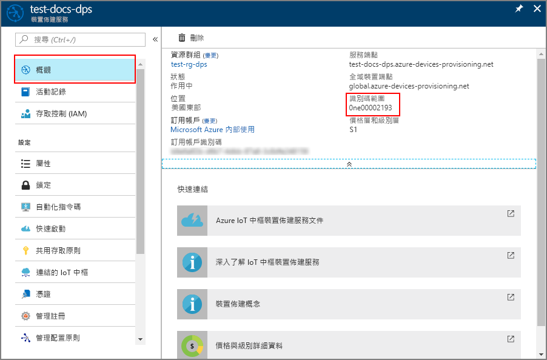

# <a name="how-to-provision-legacy-devices-using-symmetric-keys"></a>如何使用對稱金鑰佈建繼承裝置


許多繼承裝置的常見問題是它們通常具有由單一資訊組成的身分識別。 此身分識別資訊通常是 MAC 位址或序號。 繼承裝置可能沒有憑證、TPM 或任何其他可用來安全地識別裝置的安全性功能。 IoT 中樞的裝置佈建服務包括對稱金鑰證明。 對稱金鑰證明可用於根據 MAC 位址或序號等資訊來識別裝置。

如果您可以輕鬆地安裝[硬體安全性模組 (HSM)](concepts-security.md#hardware-security-module) 和憑證，那麼這可能是識別和佈建裝置較好的方法。 由於該方法可讓您略過更新部署至所有裝置的程式碼，而且您的裝置映像不會內嵌祕密金鑰。

本文假設 HSM 或憑證不是可行的選項。 但是，假設您確實有一些更新裝置程式碼的方法，以使用裝置佈建服務來佈建這些裝置。 

本文也假設裝置會在安全的環境中進行更新，以防止未經授權存取主要群組金鑰或衍生的裝置金鑰。

此文章以 Windows 工作站為基礎來說明。 不過，您可以在 Linux 上執行上述程序。 如需 Linux 範例，請參閱[如何針對多組織用戶管理佈建](how-to-provision-multitenant.md)。


## <a name="overview"></a>概觀

將根據識別該裝置的資訊，為每個裝置定義唯一的註冊識別碼。 例如，MAC 位址或序號。

將使用裝置佈建服務建立使用[對稱金鑰證明](concepts-symmetric-key-attestation.md)的註冊群組。 註冊群組將包含群組主要金鑰。 該主要金鑰將用於雜湊每個唯一的註冊識別碼，以便為每個裝置產生唯一的裝置金鑰。 裝置將搭配使用該衍生裝置金鑰及其唯一的註冊識別碼，以證明裝置佈建服務，並指派至 IoT 中樞。

本文中示範的裝置程式碼將依循與[快速入門：使用對稱金鑰佈建模擬裝置](quick-create-simulated-device-symm-key.md)相同的模式。 該程式碼將使用 [Azure IoT C SDK](https://github.com/Azure/azure-iot-sdk-c) 中的範例來模擬裝置。 模擬裝置將證明註冊群組，而非個別註冊，如快速入門中所示。

[!INCLUDE [quickstarts-free-trial-note](../../includes/quickstarts-free-trial-note.md)]


## <a name="prerequisites"></a>必要條件

* 完成[使用 Azure 入口網站設定 IoT 中樞裝置佈建服務](./quick-setup-auto-provision.md)快速入門。
* 啟用[「使用 C++ 進行桌面開發」](https://www.visualstudio.com/vs/support/selecting-workloads-visual-studio-2017/)工作負載的 Visual Studio 2015 或 [Visual Studio 2017](https://www.visualstudio.com/vs/)。
* 已安裝最新版的 [Git](https://git-scm.com/download/)。


## <a name="prepare-an-azure-iot-c-sdk-development-environment"></a>準備 Azure IoT C SDK 開發環境

在此節中，您會準備用來建置 [Azure IoT C SDK](https://github.com/Azure/azure-iot-sdk-c) 的開發環境。 

SDK 包含模擬裝置的範例程式碼。 這個模擬裝置將會嘗試在裝置開機順序期間進行佈建。

1. 下載 [CMake 建置系統](https://cmake.org/download/)3.11.4 版。 請確認下載的二進位檔使用對應的密碼編譯雜湊值。 下列範例使用 Windows PowerShell 來驗證 x64 MSI 發行版本 3.11.4 的密碼編譯雜湊：

    ```PowerShell
    PS C:\Downloads> $hash = get-filehash .\cmake-3.11.4-win64-x64.msi
    PS C:\Downloads> $hash.Hash -eq "56e3605b8e49cd446f3487da88fcc38cb9c3e9e99a20f5d4bd63e54b7a35f869"
    True
    ```
    
    在撰寫此文章時，CMake 網站上列出了3.11.4 版的下列雜湊值：

    ```
    6dab016a6b82082b8bcd0f4d1e53418d6372015dd983d29367b9153f1a376435  cmake-3.11.4-Linux-x86_64.tar.gz
    72b3b82b6d2c2f3a375c0d2799c01819df8669dc55694c8b8daaf6232e873725  cmake-3.11.4-win32-x86.msi
    56e3605b8e49cd446f3487da88fcc38cb9c3e9e99a20f5d4bd63e54b7a35f869  cmake-3.11.4-win64-x64.msi
    ```

    在開始安裝 `CMake` **之前**，請務必將 Visual Studio 先決條件 (Visual Studio 和「使用 C++ 進行桌面開發」工作負載) 安裝在您的機器上。 在符合先決條件，並且驗證過下載項目之後，請安裝 CMake 建置系統。

2. 開啟命令提示字元或 Git Bash 殼層。 執行下列命令以複製 Azure IoT C SDK GitHub 存放庫：
    
    ```cmd/sh
    git clone https://github.com/Azure/azure-iot-sdk-c.git --recursive
    ```
    此存放庫的大小目前約為 220 MB。 預期此作業需要幾分鐘的時間才能完成。


3. 在 git 存放庫的根目錄中建立 `cmake` 子目錄，並瀏覽至該資料夾。 

    ```cmd/sh
    cd azure-iot-sdk-c
    mkdir cmake
    cd cmake
    ```

4. 請執行下列命令，以建置您開發用戶端平台特有的 SDK 版本。 `cmake` 目錄中會產生模擬裝置的 Visual Studio 解決方案。 

    ```cmd
    cmake -Dhsm_type_symm_key:BOOL=ON -Duse_prov_client:BOOL=ON  ..
    ```
    
    如果 `cmake` 找不到 C++ 編譯，您在執行上述命令時，可能會收到建置錯誤。 如果發生這種情況，請嘗試在 [Visual Studio 命令提示字元](https://docs.microsoft.com/dotnet/framework/tools/developer-command-prompt-for-vs)中執行此命令。 

    建置成功後，最後幾行輸出會類似於下列輸出：

    ```cmd/sh
    $ cmake -Dhsm_type_symm_key:BOOL=ON -Duse_prov_client:BOOL=ON  ..
    -- Building for: Visual Studio 15 2017
    -- Selecting Windows SDK version 10.0.16299.0 to target Windows 10.0.17134.
    -- The C compiler identification is MSVC 19.12.25835.0
    -- The CXX compiler identification is MSVC 19.12.25835.0

    ...

    -- Configuring done
    -- Generating done
    -- Build files have been written to: E:/IoT Testing/azure-iot-sdk-c/cmake
    ```


## <a name="create-a-symmetric-key-enrollment-group"></a>建立對稱金鑰註冊群組

1. 登入 [Azure 入口網站](https://portal.azure.com)，並開啟您的裝置佈建服務執行個體。

2. 選取 [管理註冊] 索引標籤，然後按一下頁面頂端的 [新增註冊群組] 按鈕。 

3. 在 [新增註冊群組] 上輸入下列資訊，然後按一下 [儲存] 按鈕。

   - **群組名稱**：輸入 **mylegacydevices**。

   - **證明類型**：選取 [對稱金鑰]。

   - **自動產生金鑰**：核取此方塊。

   - **選取將裝置指派給中樞的方式**：選取 [靜態設定]，以便指派給特定的中樞。

   - **選取可作為此群組之指派對象的 IoT 中樞**：選取您的其中一個中樞。

     

4. 一旦儲存您的註冊，將會產生 [主要金鑰] 與 [次要金鑰] 並新增到註冊項目。 您的對稱金鑰註冊群組會在 [註冊群組] 索引標籤的 [群組名稱] 資料行之下，顯示為 **mylegacydevices**。 

    開啟註冊並複製您產生之 [主要金鑰] 的值。 此金鑰是您的主要群組金鑰。


## <a name="choose-a-unique-registration-id-for-the-device"></a>為裝置選擇唯一的註冊識別碼

必須定義唯一的註冊識別碼以識別每個裝置。 您可以使用 MAC 位址、序號或裝置的任何唯一資訊。 

在此範例中，我們使用 MAC 位址和序號的組合，為註冊識別碼組成下列字串。

```
sn-007-888-abc-mac-a1-b2-c3-d4-e5-f6
```

為您的裝置建立唯一的註冊識別碼。 有效字元為小寫英數字元與破折號 ('-')。


## <a name="derive-a-device-key"></a>衍生裝置金鑰 

為了產生裝置金鑰，請使用群組主要金鑰，為裝置計算唯一註冊識別碼的 [HMAC-SHA256](https://wikipedia.org/wiki/HMAC)，並將結果轉換為 Base64 格式。

請勿在裝置程式碼中包含群組主要金鑰。


#### <a name="linux-workstations"></a>Linux 工作站

如果您使用 Linux 工作站，您可以使用 openssl 來產生衍生的裝置金鑰，如下列範例所示。

將 **KEY** 的值取代為您先前記下的 [主要金鑰]。

將 **REG_ID** 的值取代為您的註冊識別碼。

```bash
KEY=8isrFI1sGsIlvvFSSFRiMfCNzv21fjbE/+ah/lSh3lF8e2YG1Te7w1KpZhJFFXJrqYKi9yegxkqIChbqOS9Egw==
REG_ID=sn-007-888-abc-mac-a1-b2-c3-d4-e5-f6

keybytes=$(echo $KEY | base64 --decode | xxd -p -u -c 1000)
echo -n $REG_ID | openssl sha256 -mac HMAC -macopt hexkey:$keybytes -binary | base64
```

```bash
Jsm0lyGpjaVYVP2g3FnmnmG9dI/9qU24wNoykUmermc=
```


#### <a name="windows-based-workstations"></a>以 Windows 為基礎的工作站

如果您使用以 Windows 為基礎的工作站，您可以使用 PowerShell 來產生衍生的裝置金鑰，如下列範例所示。

將 **KEY** 的值取代為您先前記下的 [主要金鑰]。

將 **REG_ID** 的值取代為您的註冊識別碼。

```PowerShell
$KEY='8isrFI1sGsIlvvFSSFRiMfCNzv21fjbE/+ah/lSh3lF8e2YG1Te7w1KpZhJFFXJrqYKi9yegxkqIChbqOS9Egw=='
$REG_ID='sn-007-888-abc-mac-a1-b2-c3-d4-e5-f6'

$hmacsha256 = New-Object System.Security.Cryptography.HMACSHA256
$hmacsha256.key = [Convert]::FromBase64String($KEY)
$sig = $hmacsha256.ComputeHash([Text.Encoding]::ASCII.GetBytes($REG_ID))
$derivedkey = [Convert]::ToBase64String($sig)
echo "`n$derivedkey`n"
```

```PowerShell
Jsm0lyGpjaVYVP2g3FnmnmG9dI/9qU24wNoykUmermc=
```


您的裝置將使用衍生裝置金鑰與唯一註冊識別碼，於佈建期間搭配註冊群組執行對稱金鑰證明。


## <a name="create-a-device-image-to-provision"></a>建立裝置映像以進行佈建

在本節中，您將在先前設定的 Azure IoT C SDK 中更新名為 **prov\_dev\_client\_sample** 的佈建範例。 

此範例程式碼會模擬將佈建要求傳送至裝置佈建服務執行個體的裝置開機順序。 此開機順序會使裝置接受辨識，並指派至您在註冊群組中設定的 IoT 中樞。

1. 在 Azure 入口網站中，選取您裝置佈建服務的 [概觀] 索引標籤，並記下 [識別碼範圍] 值。

     

2. 在 Visual Studio 中，開啟先前藉由執行 CMake 而產生的 **azure_iot_sdks.sln** 解決方案檔案。 該方案檔案應位於下列位置：

    ```
    \azure-iot-sdk-c\cmake\azure_iot_sdks.sln
    ```

3. 在 Visual Studio 的 [方案總管] 視窗中，瀏覽至 **Provision\_Samples** 資料夾。 展開名為 **prov\_dev\_client\_sample** 的範例專案。 展開 [來源檔案]，然後開啟 **prov\_dev\_client\_sample.c**。

4. 尋找 `id_scope` 常數，並以您稍早複製的**識別碼範圍**值取代該值。 

    ```c
    static const char* id_scope = "0ne00002193";
    ```

5. 在相同的檔案中找出 `main()` 函式的定義。 確定 `hsm_type` 變數已設定為 `SECURE_DEVICE_TYPE_SYMMETRIC_KEY`，如下所示：

    ```c
    SECURE_DEVICE_TYPE hsm_type;
    //hsm_type = SECURE_DEVICE_TYPE_TPM;
    //hsm_type = SECURE_DEVICE_TYPE_X509;
    hsm_type = SECURE_DEVICE_TYPE_SYMMETRIC_KEY;
    ```

6. 在 **prov\_dev\_client\_sample.c** 中尋找已標示為註解之 `prov_dev_set_symmetric_key_info()` 的呼叫。

    ```c
    // Set the symmetric key if using they auth type
    //prov_dev_set_symmetric_key_info("<symm_registration_id>", "<symmetric_Key>");
    ```

    請將函式呼叫取消註解，並以您產生的裝置唯一註冊識別碼和衍生裝置金鑰取代預留位置值 (包括角括號)。

    ```c
    // Set the symmetric key if using they auth type
    prov_dev_set_symmetric_key_info("sn-007-888-abc-mac-a1-b2-c3-d4-e5-f6", "Jsm0lyGpjaVYVP2g3FnmnmG9dI/9qU24wNoykUmermc=");
    ```
   
    儲存檔案。

7. 以滑鼠右鍵按一下 **prov\_dev\_client\_sample** 專案，然後選取 [設定為起始專案]。 

8. 在 Visual Studio 功能表中，選取 [偵錯] > [啟動但不偵錯] 以執行解決方案。 出現重新建置專案的提示時，按一下 [是]，以在執行前重新建置專案。

    下列輸出是模擬裝置成功開機，並連線到佈建服務執行個體以準備指派給 IoT 中樞的範例：

    ```cmd
    Provisioning API Version: 1.2.8

    Registering Device

    Provisioning Status: PROV_DEVICE_REG_STATUS_CONNECTED
    Provisioning Status: PROV_DEVICE_REG_STATUS_ASSIGNING
    Provisioning Status: PROV_DEVICE_REG_STATUS_ASSIGNING

    Registration Information received from service: 
    test-docs-hub.azure-devices.net, deviceId: sn-007-888-abc-mac-a1-b2-c3-d4-e5-f6

    Press enter key to exit:
    ```

9. 在入口網站中，瀏覽到獲指派您模擬裝置的 IoT 中樞，然後按一下 [IoT 裝置] 索引標籤。一旦模擬裝置成功佈建到中樞，其裝置識別碼會出現在 [IoT 裝置] 刀鋒視窗上，且 [狀態] 顯示為 [已啟用]。 您可能需要按一下頂端的 [重新整理] 按鈕。 

     


## <a name="security-concerns"></a>安全性考量

請注意，這會將衍生的裝置金鑰包含在映像的一部分中，這不是建議的安全性最佳作法。 這就是為什麼安全性和易用性之間需互做取捨。 


## <a name="next-steps"></a>後續步驟

* 若要深入了解如何重新佈建，請參閱 [IoT 中樞裝置重新佈建的概念](concepts-device-reprovision.md) 
* [快速入門：使用對稱金鑰佈建模擬的裝置](quick-create-simulated-device-symm-key.md)
* 若要了解有关取消设置的详细信息，请参阅[如何取消设置以前自动预配的设备](how-to-unprovision-devices.md) 


