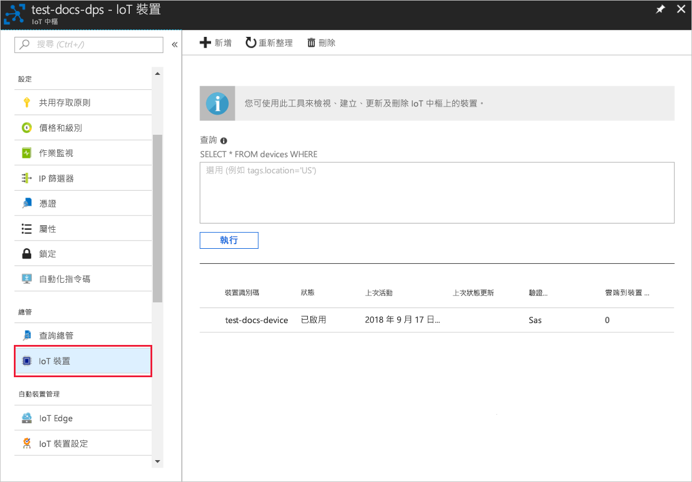

# <a name="quickstart-provision-a-simulated-device-with-symmetric-keys"></a>快速入門：使用對稱金鑰佈建模擬的裝置

在此快速入門中，您將了解如何在 Windows 開發機器上建立並執行裝置模擬器。 您將設定此模擬裝置，以使用對稱金鑰來搭配裝置佈建服務執行個體進行驗證並指派給 IoT 中樞。 來自 [Azure IoT C SDK](https://github.com/Azure/azure-iot-sdk-c) 的程式碼範例將用來模擬起始佈建之裝置的開機順序。 將根據佈建服務執行個體並指派給 IoT 中樞的個別註冊來識別裝置。

雖然此文章示範如何使用個別註冊來佈建，但您也可以搭配註冊群組使用相同的程序。 唯一的差異是，您必須使用具有裝置唯一註冊識別碼的衍生裝置金鑰。 使用註冊群組時，不會直接使用註冊的對稱金鑰。 雖然對稱金鑰註冊群組不僅限於傳統裝置，但[如何使用對稱金鑰證明來佈建傳統裝置](how-to-legacy-device-symm-key.md)提供了註冊群組範例。 如需詳細資訊，請參閱[對稱金鑰證明的群組註冊](concepts-symmetric-key-attestation.md#group-enrollments)。

如果您不熟悉自動佈建程序，請檢閱[自動佈建概念](concepts-auto-provisioning.md)。 

此外，繼續進行此快速入門之前，請務必完成[使用 Azure 入口網站設定 IoT 中樞裝置佈建服務](./quick-setup-auto-provision.md)中的步驟。 此快速入門要求您必須已建立您的裝置佈建服務執行個體。

此文章以 Windows 工作站為基礎來說明。 不過，您可以在 Linux 上執行上述程序。 如需 Linux 範例，請參閱[如何針對多組織用戶管理佈建](how-to-provision-multitenant.md)。


[!INCLUDE [quickstarts-free-trial-note](../../includes/quickstarts-free-trial-note.md)]


## <a name="prerequisites"></a>必要條件

* 啟用[「使用 C++ 進行桌面開發」](https://www.visualstudio.com/vs/support/selecting-workloads-visual-studio-2017/)工作負載的 Visual Studio 2015 或 [Visual Studio 2017](https://www.visualstudio.com/vs/)。
* 已安裝最新版的 [Git](https://git-scm.com/download/)。


<a id="setupdevbox"></a>

## <a name="prepare-an-azure-iot-c-sdk-development-environment"></a>準備 Azure IoT C SDK 開發環境

在此節中，您會準備用來建置 [Azure IoT C SDK](https://github.com/Azure/azure-iot-sdk-c) 的開發環境。 

SDK 包含模擬裝置的範例程式碼。 這個模擬裝置將會嘗試在裝置開機順序期間進行佈建。

1. 下載 [CMake 建置系統](https://cmake.org/download/)3.11.4 版。 請確認下載的二進位檔使用對應的密碼編譯雜湊值。 下列範例使用 Windows PowerShell 來驗證 x64 MSI 發行版本 3.11.4 的密碼編譯雜湊：

    ```PowerShell
    PS C:\Downloads> $hash = get-filehash .\cmake-3.11.4-win64-x64.msi
    PS C:\Downloads> $hash.Hash -eq "56e3605b8e49cd446f3487da88fcc38cb9c3e9e99a20f5d4bd63e54b7a35f869"
    True
    ```
    
    在撰寫此文章時，CMake 網站上列出了3.11.4 版的下列雜湊值：

    ```
    6dab016a6b82082b8bcd0f4d1e53418d6372015dd983d29367b9153f1a376435  cmake-3.11.4-Linux-x86_64.tar.gz
    72b3b82b6d2c2f3a375c0d2799c01819df8669dc55694c8b8daaf6232e873725  cmake-3.11.4-win32-x86.msi
    56e3605b8e49cd446f3487da88fcc38cb9c3e9e99a20f5d4bd63e54b7a35f869  cmake-3.11.4-win64-x64.msi
    ```

    在開始安裝 `CMake` **之前**，請務必將 Visual Studio 先決條件 (Visual Studio 和「使用 C++ 進行桌面開發」工作負載) 安裝在您的機器上。 在符合先決條件，並且驗證過下載項目之後，請安裝 CMake 建置系統。

2. 開啟命令提示字元或 Git Bash 殼層。 執行下列命令以複製 Azure IoT C SDK GitHub 存放庫：
    
    ```cmd/sh
    git clone https://github.com/Azure/azure-iot-sdk-c.git --recursive
    ```
    此存放庫的大小目前約為 220 MB。 預期此作業需要幾分鐘的時間才能完成。


3. 在 git 存放庫的根目錄中建立 `cmake` 子目錄，並瀏覽至該資料夾。 

    ```cmd/sh
    cd azure-iot-sdk-c
    mkdir cmake
    cd cmake
    ```

4. 請執行下列命令，以建置您開發用戶端平台特有的 SDK 版本。 `cmake` 目錄中會產生模擬裝置的 Visual Studio 解決方案。 

    ```cmd
    cmake -Dhsm_type_symm_key:BOOL=ON -Duse_prov_client:BOOL=ON  ..
    ```
    
    如果 `cmake` 找不到 C++ 編譯，您在執行上述命令時，可能會收到建置錯誤。 如果發生這種情況，請嘗試在 [Visual Studio 命令提示字元](https://docs.microsoft.com/dotnet/framework/tools/developer-command-prompt-for-vs)中執行此命令。 

    建置成功後，最後幾行輸出會類似於下列輸出：

    ```cmd/sh
    $ cmake -Dhsm_type_symm_key:BOOL=ON -Duse_prov_client:BOOL=ON  ..
    -- Building for: Visual Studio 15 2017
    -- Selecting Windows SDK version 10.0.16299.0 to target Windows 10.0.17134.
    -- The C compiler identification is MSVC 19.12.25835.0
    -- The CXX compiler identification is MSVC 19.12.25835.0

    ...

    -- Configuring done
    -- Generating done
    -- Build files have been written to: E:/IoT Testing/azure-iot-sdk-c/cmake
    ```


## <a name="create-a-device-enrollment-entry-in-the-portal"></a>在入口網站中建立裝置註冊項目

1. 登入 Azure 入口網站，按一下左側功能表上的 [所有資源] 按鈕，然後開啟您的裝置佈建服務。

2. 選取 [管理註冊] 索引標籤，然後按一下頂端的 [新增個別註冊] 按鈕。 

3. 在 [新增註冊] 上，輸入下列資訊，然後按一下 [儲存] 按鈕。

   - **機制**：選取 [對稱金鑰] 作為身分識別證明*機制*。

   - **自動產生金鑰**：核取此方塊。

   - **註冊識別碼**：輸入註冊識別碼以識別註冊。 只使用小寫英數字元與破折號 ('-') 字元。 例如： `symm-key-device-007`。

   - **IoT 中樞裝置識別碼：** 輸入裝置識別碼。 例如，**device-007**。

     

4. 一旦儲存您的註冊，將會產生 [主要金鑰] 與 [次要金鑰] 並新增到註冊項目。 您的對稱金鑰裝置註冊會在 [個別註冊] 索引標籤中的 [註冊識別碼] 欄下顯示為 **symm-key-device-007**。 

    開啟註冊並複製您產生之 [主要金鑰] 的值。


<a id="firstbootsequence"></a>

## <a name="simulate-first-boot-sequence-for-the-device"></a>模擬裝置的第一個開機順序

在本節中，您可以更新範例程式碼來將裝置的開機順序傳送至裝置佈建服務執行個體。 此開機順序會使裝置經過辨識，並指派到連結至裝置佈建服務執行個體的 IoT 中樞。


1. 在 Azure 入口網站中，選取您裝置佈建服務的 [概觀] 索引標籤，並記下 [識別碼範圍] 值。

     

2. 在 Visual Studio 中，開啟透過執行 CMake 而產生的 **azure_iot_sdks.sln** 方案檔案。 該方案檔案應位於下列位置：

    ```
    \azure-iot-sdk-c\cmake\azure_iot_sdks.sln
    ```

3. 在 Visual Studio 的 [方案總管] 視窗中，瀏覽至 **Provision\_Samples** 資料夾。 展開名為 **prov\_dev\_client\_sample** 的範例專案。 展開 [來源檔案]，然後開啟 **prov\_dev\_client\_sample.c**。

4. 尋找 `id_scope` 常數，並以您稍早複製的**識別碼範圍**值取代該值。 

    ```c
    static const char* id_scope = "0ne00002193";
    ```

5. 在相同的檔案中找出 `main()` 函式的定義。 確定 `hsm_type` 變數已設定為 `SECURE_DEVICE_TYPE_SYMMETRIC_KEY`，如下所示：

    ```c
    SECURE_DEVICE_TYPE hsm_type;
    //hsm_type = SECURE_DEVICE_TYPE_TPM;
    //hsm_type = SECURE_DEVICE_TYPE_X509;
    hsm_type = SECURE_DEVICE_TYPE_SYMMETRIC_KEY;
    ```

6. 在 **prov\_dev\_client\_sample.c** 中尋找已標成註解之 `prov_dev_set_symmetric_key_info()` 的呼叫。

    ```c
    // Set the symmetric key if using they auth type
    //prov_dev_set_symmetric_key_info("<symm_registration_id>", "<symmetric_Key>");
    ```

    取消註解函式呼叫，並將預留位置值 (包括角括號) 取代為您的註冊識別碼和主索引鍵值。

    ```c
    // Set the symmetric key if using they auth type
    prov_dev_set_symmetric_key_info("symm-key-device-007", "your primary key here");
    ```
   
    儲存檔案。

7. 以滑鼠右鍵按一下 **prov\_dev\_client\_sample** 專案，然後選取 [設定為起始專案]。 

8. 在 Visual Studio 功能表中，選取 [偵錯] > [啟動但不偵錯] 以執行解決方案。 出現重新建置專案的提示時，按一下 [是]，以在執行前重新建置專案。

    下列輸出是模擬裝置成功開機，並連線到佈建服務執行個體以準備指派給 IoT 中樞的範例：

    ```cmd
    Provisioning API Version: 1.2.8

    Registering Device

    Provisioning Status: PROV_DEVICE_REG_STATUS_CONNECTED
    Provisioning Status: PROV_DEVICE_REG_STATUS_ASSIGNING
    Provisioning Status: PROV_DEVICE_REG_STATUS_ASSIGNING

    Registration Information received from service: 
    test-docs-hub.azure-devices.net, deviceId: device-007    
    Press enter key to exit:
    ```

9. 在入口網站中，瀏覽到獲指派您模擬裝置的 IoT 中樞，然後按一下 [IoT 裝置] 索引標籤。一旦模擬裝置成功佈建到中樞，其裝置識別碼會出現在 [IoT 裝置] 刀鋒視窗上，且 [狀態] 顯示為 [已啟用]。 您可能需要按一下頂端的 [重新整理] 按鈕。 

     


## <a name="clean-up-resources"></a>清除資源

如果您打算繼續使用並探索裝置用戶端範例，請勿清除在此快速入門中建立的資源。 如果您不打算繼續，請使用下列步驟來刪除本快速入門建立的所有資源。

1. 在您的電腦上關閉裝置用戶端範例輸出視窗。
1. 從 Azure 入口網站的左側功能表中，按一下 [所有資源]，然後選取您的裝置佈建服務。 為您的服務開啟 [管理註冊]，然後按一下 [個別註冊] 索引標籤。選取您在本快速入門中註冊的裝置之 [註冊識別碼]，然後按一下頂端的 [刪除] 按鈕。 
1. 從 Azure 入口網站的左側功能表中，按一下 [所有資源]，然後選取您的 IoT 中樞。 為您的中樞開啟 [IoT 裝置]，選取您在本快速入門中註冊的裝置 [裝置識別碼]，然後按一下頂端的 [刪除] 按鈕。

## <a name="next-steps"></a>後續步驟

在此快速入門中，您已在 Windows 電腦上建立模擬裝置，並搭配入口網站上的 Azure IoT 中樞裝置佈建服務使用對稱金鑰，將它佈建到 IoT 中樞。 若要了解如何以程式設計方式註冊您的裝置，請繼續閱讀以程式設計方式註冊 X.509 裝置的快速入門。 

> [!div class="nextstepaction"]
> [Azure 快速入門 - 向 Azure IoT 中樞裝置佈建服務註冊 X.509 裝置](quick-enroll-device-x509-java.md)
