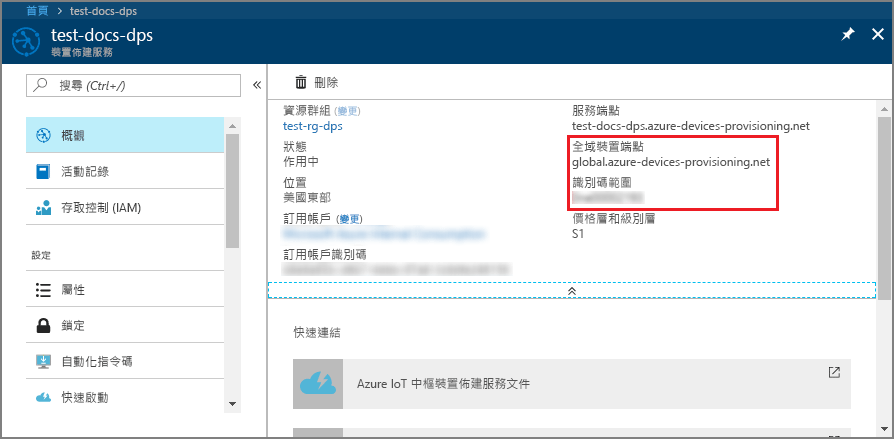

# <a name="create-and-provision-a-simulated-tpm-device-using-python-device-sdk-for-iot-hub-device-provisioning-service"></a>使用適用於 IoT 中樞裝置佈建服務的 Python 裝置 SDK 來建立及佈建模擬 TPM 裝置

[!INCLUDE [iot-dps-selector-quick-create-simulated-device-tpm](../../includes/iot-dps-selector-quick-create-simulated-device-tpm.md)]

這些步驟顯示如何在執行 Windows 作業系統的開發電腦上建立模擬裝置、執行 Windows TPM 模擬器作為裝置的[硬體安全性模組 (HSM)](https://azure.microsoft.com/blog/azure-iot-supports-new-security-hardware-to-strengthen-iot-security/)，並使用 Python 程式碼範例，將模擬裝置與裝置佈建服務和 IoT 中樞進行連線。 

繼續之前，請務必完成[使用 Azure 入口網站設定 IoT 中樞裝置佈建服務](./quick-setup-auto-provision.md)中的步驟。

[!INCLUDE [IoT DPS basic](../../includes/iot-dps-basic.md)]

## <a name="prepare-the-environment"></a>準備環境 

1. 確定您已在電腦上安裝 [Visual Studio 2015](https://www.visualstudio.com/vs/older-downloads/) 或 [Visual Studio 2017](https://www.visualstudio.com/vs/)。 為了 Visual Studio 安裝，您必須啟用「C ++ 桌面開發」工作負載。

1. 下載並安裝 [CMake 建置系統](https://cmake.org/download/)。

1. 確定 `git` 已安裝在電腦上，並已新增至命令視窗可存取的環境變數。 請參閱[軟體自由保護協會的 Git 用戶端工具](https://git-scm.com/download/)以取得所要安裝的最新版 `git` 工具，其中包括 **Git Bash** (您可用來與本機 Git 存放庫互動的命令列應用程式)。 

1. 開啟命令提示字元或 Git Bash。 複製裝置模擬程式碼範例的 GitHub 存放庫：
    
    ```cmd/sh
    git clone https://github.com/Azure/azure-iot-sdk-python.git --recursive
    ```

1. 在此 GitHub 存放庫的本機複本中針對 CMake 建置流程建立資料夾。 

    ```cmd/sh
    cd azure-iot-sdk-python/c
    mkdir cmake
    cd cmake
    ```

1. 程式碼範例會使用 Windows TPM 模擬器。 執行下列命令以啟用 SAS 權杖驗證。 這也會為模擬裝置產生 Visual Studio 解決方案。

    ```cmd/sh
    cmake -Duse_prov_client:BOOL=ON -Duse_tpm_simulator:BOOL=ON ..
    ```

1. 在個別的命令提示字元中，瀏覽至 TPM 模擬器資料夾，並執行 [TPM](https://docs.microsoft.com/windows/device-security/tpm/trusted-platform-module-overview) 模擬器。 按一下 [允許存取]。 它會透過連接埠 2321年和 2322 上的通訊端接聽。 請勿關閉此命令視窗；您必須讓此模擬器保持執行，直到此快速入門指南結束。 

    ```cmd/sh
    .\azure-iot-sdk-python\c\provisioning_client\deps\utpm\tools\tpm_simulator\Simulator.exe
    ```

    


## <a name="create-a-device-enrollment-entry"></a>建立裝置註冊項目

1. 開啟在 *cmake* 資料夾中產生的方案 (名為 `azure_iot_sdks.sln`)，並且在 Visual Studio 中建置。

1. 以滑鼠右鍵按一下 **tpm_device_provision** 專案，然後選取 [設為起始專案]。 執行方案。 輸出視窗會顯示裝置註冊所需的 [簽署金鑰] 和 [登錄識別碼]。 請記下這些值。 

    

1. 登入 Azure 入口網站，按一下左側功能表上的 [所有資源] 按鈕，然後開啟您的裝置佈建服務。

1. 在裝置佈建服務摘要刀鋒視窗上，選取 [管理註冊]。 選取 [個別註冊] 索引標籤，然後按一下頂端的 [新增] 按鈕。 

1. 在 [新增註冊清單項目] 之下，輸入下列資訊：
    - 選取 [TPM] 作為身分識別證明「機制」。
    - 輸入 TPM 裝置的 [註冊識別碼] 和 [簽署金鑰]。 
    - 選取與您的佈建服務連結的 IoT 中樞。
    - 輸入唯一的裝置識別碼。 替您的裝置命名時，務必避免使用敏感性資料。
    - 使用裝置所需的初始組態更新**初始裝置對應項狀態**。
    - 完成後，按一下 [儲存] 按鈕。 

      

   註冊成功時，您裝置的「登錄識別碼」將會出現在「個別註冊」索引標籤之下的清單中。 


## <a name="simulate-the-device"></a>模擬裝置

1. 下載並安裝 [Python 2.x 或 3.x](https://www.python.org/downloads/)。 請務必使用安裝程式所需的 32 位元或 64 位元安裝。 在安裝期間出現系統提示時，務必將 Python 新增至平台特有的環境變數。
    - 如果您是使用 Windows 作業系統，則 [Visual C++ 可轉散發套件](http://www.microsoft.com/download/confirmation.aspx?id=48145)允許使用 Python 的原生 DLL。

1. 請遵循[這些指示](https://github.com/Azure/azure-iot-sdk-python/blob/master/doc/python-devbox-setup.md)來建置 Python 套件。

    > [!NOTE]
        > 如果是執行 `build_client.cmd`，請務必使用 `--use-tpm-simulator` 旗標。

    > [!NOTE]
        > 如果是使用 `pip`，另請確定安裝 `azure-iot-provisioning-device-client` 套件。 請注意，所發行的 PIP 套件是使用實際的 TPM，而非模擬器。 若要使用模擬器，您必須使用 `--use-tpm-simulator` 旗標，從來源進行編譯。

1. 瀏覽至範例資料夾。

    ```cmd/sh
    cd azure-iot-sdk-python/provisioning_device_client/samples
    ```

1. 使用您的 Python IDE，編輯名為 **provisioning\_device\_client\_sample.py** 的 python 指令碼。 將 _GLOBAL\_PROV\_URI_ 和 _ID\_SCOPE_ 變數修改為先前所述的值。

    ```python
    GLOBAL_PROV_URI = "{globalServiceEndpoint}"
    ID_SCOPE = "{idScope}"
    SECURITY_DEVICE_TYPE = ProvisioningSecurityDeviceType.TPM
    PROTOCOL = ProvisioningTransportProvider.HTTP
    ```

    

1. 執行範例。 

    ```cmd/sh
    python provisioning_device_client_sample.py
    ```

1. 請注意，模擬裝置開機並連線至裝置佈建服務的訊息，以取得您的 IoT 中樞資訊。 

    

1. 模擬裝置成功佈建到與佈建服務連結的 IoT 中樞時，裝置識別碼會出現在中樞的 [裝置總管] 刀鋒視窗上。

     

    如果您在裝置的註冊項目中變更了*初始裝置對應項狀態* (變更自預設值)，它即可從中樞提取所需的對應項狀態並採取適當的動作。 如需詳細資訊，請參閱[了解和使用 Azure IoT 中樞的裝置對應項](../iot-hub/iot-hub-devguide-device-twins.md)


## <a name="clean-up-resources"></a>清除資源

如果您打算繼續使用並探索裝置用戶端範例，請勿清除在此快速入門中建立的資源。 如果您不打算繼續，請使用下列步驟來刪除本快速入門建立的所有資源。

1. 在您的電腦上關閉裝置用戶端範例輸出視窗。
1. 在您的電腦上關閉 TPM 模擬器視窗。
1. 從 Azure 入口網站的左側功能表中，按一下 [所有資源]，然後選取您的裝置佈建服務。 開啟您服務的 [管理註冊] 刀鋒視窗，然後按一下 [個別註冊] 索引標籤。選取您在本快速入門中註冊的裝置之 [註冊識別碼]，然後按一下頂端的 [刪除] 按鈕。 
1. 從 Azure 入口網站的左側功能表中，按一下 [所有資源]，然後選取您的 IoT 中樞。 開啟您中樞的 [IoT 裝置] 刀鋒視窗，選取您在本快速入門中註冊之裝置的 [裝置識別碼]，然後按一下頂端的 [刪除] 按鈕。

## <a name="next-steps"></a>後續步驟

在本快速入門中，您已在電腦上建立的 TPM 模擬裝置，並使用 IoT 中樞裝置佈建服務將它佈建到 IoT 中樞。 若要了解如何以程式設計方式註冊您的 TPM 裝置，請繼續閱讀以程式設計方式註冊 TPM 裝置的快速入門。 

> [!div class="nextstepaction"]
> [Azure 快速入門 - 向 Azure IoT 中樞裝置佈建服務註冊 TPM 裝置](quick-enroll-device-tpm-java.md)
