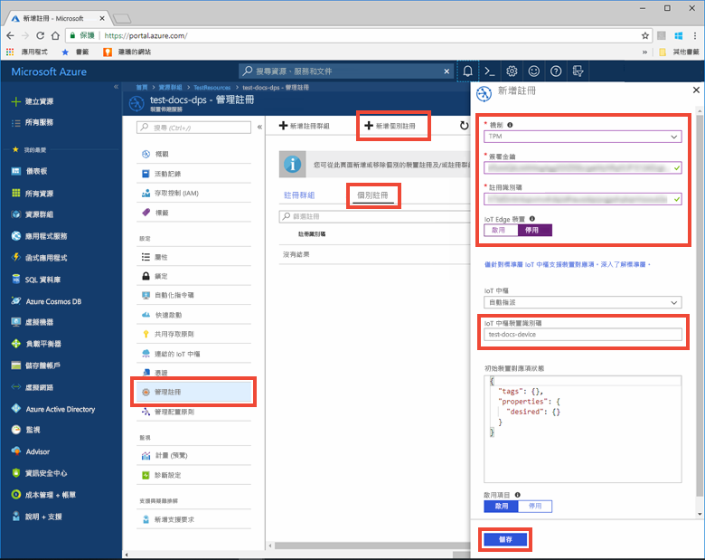

# <a name="create-and-provision-a-simulated-device-using-iot-hub-device-provisioning-service-preview"></a>使用 IoT 中樞裝置佈建服務 (預覽) 來建立及佈建模擬裝置
> [!div class="op_single_selector"]
> * [TPM](quick-create-simulated-device.md)
> * [X.509](quick-create-simulated-device-x509.md)

這些步驟顯示如何在執行 Windows 作業系統的開發電腦上建立模擬裝置、執行 Windows TPM 模擬器作為裝置的[硬體安全性模組 (HSM)](https://azure.microsoft.com/blog/azure-iot-supports-new-security-hardware-to-strengthen-iot-security/)，並使用程式碼範例來連線模擬裝置與裝置佈建服務和 IoT 中樞。 

繼續之前，請務必完成[使用 Azure 入口網站設定 IoT 中樞裝置佈建服務](./quick-setup-auto-provision.md)中的步驟。

<a id="setupdevbox"></a>
## <a name="prepare-the-development-environment"></a>準備開發環境 

1. 確定您已在電腦上安裝 Visual Studio 2015 或 [Visual Studio 2017](https://www.visualstudio.com/vs/)。 為了 Visual Studio 安裝，您必須啟用「C ++ 桌面開發」工作負載。

2. 下載並安裝 [CMake 建置系統](https://cmake.org/download/)。

3. 確定 `git` 已安裝在電腦上，並已新增至命令視窗可存取的環境變數。 請參閱[軟體自由保護協會的 Git 用戶端工具](https://git-scm.com/download/)以取得所要安裝的最新版 `git` 工具，其中包括 **Git Bash** (您可用來與本機 Git 存放庫互動的命令列應用程式)。 

4. 開啟命令提示字元或 Git Bash。 複製裝置模擬程式碼範例的 GitHub 存放庫：
    
    ```cmd/sh
    git clone https://github.com/Azure/azure-iot-sdk-c.git --recursive
    ```

5. 在此 GitHub 存放庫的本機複本中針對 CMake 建置流程建立資料夾。 

    ```cmd/sh
    cd azure-iot-sdk-c
    mkdir cmake
    cd cmake
    ```

6. 程式碼範例會使用 Windows TPM 模擬器。 執行下列命令以啟用 SAS 權杖驗證。 這也會為模擬裝置產生 Visual Studio 解決方案。

    ```cmd/sh
    cmake -Ddps_auth_type=tpm_simulator ..
    ```

7. 在個別的命令提示字元中，瀏覽至 GitHub 根資料夾並執行 [TPM](https://docs.microsoft.com/windows/device-security/tpm/trusted-platform-module-overview) 模擬器。 它會透過連接埠 2321年和 2322 上的通訊端接聽。 請勿關閉此命令視窗；您必須讓此模擬器保持執行，直到此快速入門指南結束。 

    ```cmd/sh
    .\azure-iot-sdk-c\dps_client\deps\utpm\tools\tpm_simulator\Simulator.exe
    ```

## <a name="create-a-device-enrollment-entry-in-the-device-provisioning-service"></a>在裝置佈建服務中建立裝置註冊項目

1. 開啟在 *cmake* 資料夾中產生的方案 (名為 `azure_iot_sdks.sln`)，並且在 Visual Studio 中建置。

2. 以滑鼠右鍵按一下 **tpm_device_provision** 專案，然後選取 [設為起始專案]。 執行方案。 輸出視窗會顯示裝置註冊所需的 [簽署金鑰] 和 [登錄識別碼]。 請記下這些值。 

3. 登入 Azure 入口網站，按一下左側功能表上的 [所有資源] 按鈕，然後開啟您的裝置佈建服務。

4. 在裝置佈建服務摘要刀鋒視窗上，選取 [管理註冊]。 選取 [個別註冊] 索引標籤，然後按一下頂端的 [新增] 按鈕。 

5. 在 [新增註冊清單項目] 之下，輸入下列資訊：
    - 選取 [TPM] 作為身分識別證明「機制」。
    - 輸入 TPM 裝置的 [註冊識別碼] 和 [簽署金鑰]。 
    - 選取與您的佈建服務連結的 IoT 中樞。
    - 輸入唯一的裝置識別碼。 替您的裝置命名時，務必避免使用敏感性資料。
    - 使用裝置所需的初始組態更新**初始裝置對應項狀態**。
    - 完成後，按一下 [儲存] 按鈕。 

      

   註冊成功時，您裝置的「登錄識別碼」將會出現在「個別註冊」索引標籤之下的清單中。 


<a id="firstbootsequence"></a>
## <a name="simulate-first-boot-sequence-for-the-device"></a>模擬裝置的第一個開機順序

1. 在 Azure 入口網站中，選取您裝置佈建服務的 [概觀] 刀鋒視窗，並記下的 [全域裝置端點] 和 [識別碼範圍] 值。

     

2. 在您電腦上的 Visual Studio 中，選取名為 **dps_client_sample** 的範例專案並開啟 **dps_client_sample.c** 檔案。

3. 將「識別碼範圍」值指派給 `dps_scope_id` 變數。 請注意，`dps_uri` 變數會以相同的值作為「全域裝置端點」。 

    ```c
    static const char* dps_uri = "global.azure-devices-provisioning.net";
    static const char* dps_scope_id = "[DPS Id Scope]";
    ```

4. 以滑鼠右鍵按一下 **dps_client_sample** 專案，然後選取 [設為起始專案]。 執行範例。 請注意，模擬裝置開機並連線至裝置佈建服務的訊息，以取得您的 IoT 中樞資訊。 模擬裝置成功佈建到與佈建服務連結的 IoT 中樞時，裝置識別碼會出現在中樞的 [裝置總管] 刀鋒視窗上。 

     

    如果您在裝置的註冊項目中變更了*初始裝置對應項狀態* (變更自預設值)，它即可從中樞提取所需的對應項狀態並採取適當的動作。 如需詳細資訊，請參閱[了解和使用 Azure IoT 中樞的裝置對應項](../iot-hub/iot-hub-devguide-device-twins.md)


## <a name="clean-up-resources"></a>清除資源

如果您打算繼續使用並探索裝置用戶端範例，請勿清除在此快速入門中建立的資源。 如果您不打算繼續，請使用下列步驟來刪除本快速入門建立的所有資源。

1. 在您的電腦上關閉裝置用戶端範例輸出視窗。
1. 在您的電腦上關閉 TPM 模擬器視窗。
1. 從 Azure 入口網站的左側功能表中，按一下 [所有資源]，然後選取您的裝置佈建服務。 在 [所有資源] 刀鋒視窗的頂端，按一下 [刪除]。  
1. 從 Azure 入口網站的左側功能表中，按一下 [所有資源]，然後選取您的 IoT 中樞。 在 [所有資源] 刀鋒視窗的頂端，按一下 [刪除]。  

## <a name="next-steps"></a>後續步驟

在本快速入門中，您已在電腦上建立的 TPM 模擬裝置，並使用 Azure IoT 中樞裝置佈建服務將它佈建到 IoT 中樞。 若要深入了解裝置佈建，請繼續在 Azure 入口網站中進行裝置佈建服務設定的教學課程。 

> [!div class="nextstepaction"]
> [Azure IoT 中樞裝置佈建服務教學課程](./tutorial-set-up-cloud.md)
