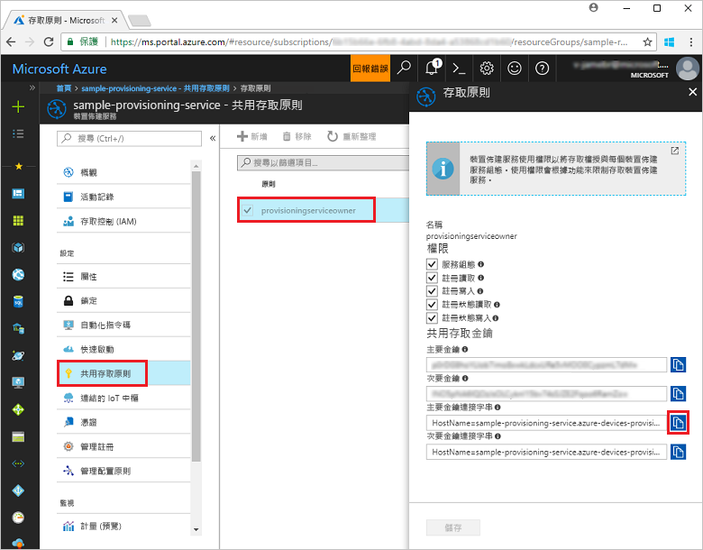
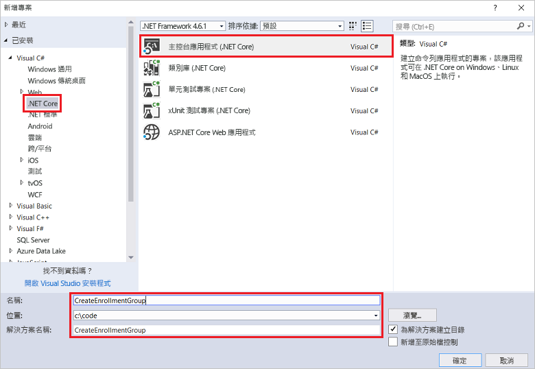
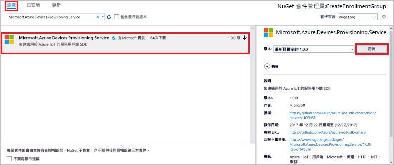
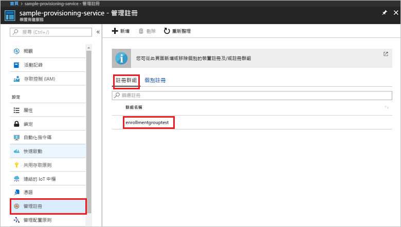

# <a name="enroll-x509-devices-to-iot-hub-device-provisioning-service-using-c-service-sdk"></a>使用 C# 服務 SDK 向 IoT 中樞裝置佈建服務註冊 X.509 裝置

[!INCLUDE [iot-dps-selector-quick-enroll-device-x509](../../includes/iot-dps-selector-quick-enroll-device-x509.md)]


這些步驟說明如何使用 [C# 服務 SDK](https://github.com/Azure/azure-iot-sdk-csharp) 和 C# .NET Core 應用程式範例，以程式設計方式建立中繼或根 CA X.509 憑證的註冊群組。 註冊群組可針對共用憑證鏈結中通用簽署憑證的裝置，控制對於佈建服務的存取權。 若要深入了解，請參閱[使用 X.509 憑證控制對於佈建服務的裝置存取](./concepts-security.md#controlling-device-access-to-the-provisioning-service-with-x509-certificates)。 如需使用以 X.509 憑證為基礎的公開金鑰基礎結構 (PKI) 搭配 Azure IoT 中樞和裝置佈建服務的詳細資訊，請參閱 [X.509 CA 憑證安全性概觀](https://docs.microsoft.com/en-us/azure/iot-hub/iot-hub-x509ca-overview)。 雖然本文中的步驟在 Windows 和 Linux 電腦上都可運作，但本文將使用 Windows 開發電腦。

## <a name="prepare-the-development-environment"></a>準備開發環境

1. 確定您已在電腦上安裝 [Visual Studio 2017](https://www.visualstudio.com/vs/)。 
2. 確定您已在電腦上安裝 [.Net Core SDK](https://www.microsoft.com/net/download/windows)。 
3. 繼續之前，請務必完成[使用 Azure 入口網站設定 IoT 中樞裝置佈建服務](./quick-setup-auto-provision.md)中的步驟。
4. 您需要 .pem 或 .cer 檔案，該檔案包含已上傳並向佈建服務驗證之中繼或根 CA X.509 憑證的公開部分。 [Azure IoT C SDK](https://github.com/Azure/azure-iot-sdk-c) 包含的工具可協助您建立 X.509 憑證鏈結、從該鏈結上傳根或中繼憑證，並使用驗證憑證的服務來執行所有權證明。 若要使用此工具，請將 [azure-iot-sdk-c/tools/CACertificates](https://github.com/Azure/azure-iot-sdk-c/tree/master/tools/CACertificates) 資料夾的內容下載到您電腦上的工作資料夾，並依照 [azure-iot-sdk-c\tools\CACertificates\CACertificateOverview.md](https://github.com/Azure/azure-iot-sdk-c/blob/master/tools/CACertificates/CACertificateOverview.md) 中的步驟操作。 除了 C SDK 中的工具，**C# 服務 SDK** 中的[群組憑證驗證範例](https://github.com/Azure/azure-iot-sdk-csharp/tree/master/provisioning/service/samples/GroupCertificateVerificationSample)會示範如何執行含現有 X.509 中繼或根 CA 憑證的擁有權證明。 

  > [!IMPORTANT]
  > 使用 SDK 工具建立的憑證只能用於開發。 若要了解如何取得生產程式碼適用的憑證，請參閱 Azure IoT 中樞文件中的[如何取得 X.509 CA 憑證](https://docs.microsoft.com/en-us/azure/iot-hub/iot-hub-x509ca-overview#how-to-get-an-x509-ca-certificate)。

## <a name="get-the-connection-string-for-your-provisioning-service"></a>取得佈建服務的連接字串

對於本快速入門中的範例，您需要佈建服務的連接字串。
1. 登入 Azure 入口網站，按一下左側功能表上的 [所有資源] 按鈕，然後開啟您的裝置佈建服務。 
2. 按一下 [共用存取原則]，然後按一下您要用來開啟其屬性的存取原則。 在 [存取原則] 視窗中，複製並記下主要索引鍵連接字串。 

    

## <a name="create-the-enrollment-group-sample"></a>建立註冊群組範例 

本節中的步驟說明如何建立 .NET Core 主控台應用程式，以將註冊群組新增至您的佈建服務。 進行一些修改後，您也可以遵循下列步驟來建立 [Windows IoT Core](https://developer.microsoft.com/en-us/windows/iot) 主控台應用程式以新增註冊群組。 若要深入了解如何使用 IoT Core 進行開發，請參閱 [Windows IoT Core 開發人員文件](https://docs.microsoft.com/en-us/windows/iot-core/)。
1. 在 Visual Studio 中，使用 [主控台應用程式 (.NET Core)] 專案範本，將 Visual C# .NET Core 主控台應用程式專案新增至新的解決方案。 確定 .NET Framework 為 4.5.1 或更新版本。 將專案命名為 **CreateEnrollmentGroup**。

    

2. 在 [方案總管] 中，以滑鼠右鍵按一下 [CreateEnrollmentGroup] 專案，然後按一下 [管理 NuGet 套件]。
3. 在 [Nuget 套件管理員] 視窗中選取 [瀏覽]、搜尋 **Microsoft.Azure.Devices.Provisioning.Service**、選取 [安裝] 以安裝 **Microsoft.Azure.Devices.Provisioning.Service** 套件，並接受使用規定。 此程序會下載及安裝 [Azure IoT 佈建服務用戶端 SDK](https://www.nuget.org/packages/Microsoft.Azure.Devices.Provisioning.Service/) NuGet 套件及其相依項目，並新增對它的參考。

    

4. 在 **Program.cs** 檔案的頂端，將下列 `using` 陳述式新增於其他 `using` 陳述式之後：
   
   ```csharp
   using System.Security.Cryptography.X509Certificates;
   using System.Threading.Tasks;
   using Microsoft.Azure.Devices.Provisioning.Service;
   ```
    
5. 將下列欄位新增到 **Program** 類別。  
   - 使用您想要建立註冊之佈建服務的連接字串，取代 **ProvisioningConnectionString** 預留位置值。
   - 使用 .pem 或 .cer 檔案的路徑取代 **X509RootCertPath** 預留位置值，而 .pem 或 .cer 檔案代表先前已上傳並向佈建服務驗證之中繼或根 CA X.509 憑證的公開部分。
   - 您可以選擇性地變更 **EnrollmentGroupId** 值。 此字串只可包含小寫字元和連字號。 

   > [!IMPORTANT]
   > 在生產程式碼中，請注意下列安全性考量：
   >
   > - 替佈建服務管理員將連接字串硬式編碼會違反安全性最佳做法。 連接字串應以安全的方式保存，例如保存在安全的組態檔或保存在登錄中。
   > - 務必僅只上傳簽署憑證的公開部分。 決不將包含私密金鑰的 .pfx (PKCS12) 或 .pem 檔案上傳至佈建服務。
        
   ```csharp
   private static string ProvisioningConnectionString = "{Your provisioning service connection string}";
   private static string EnrollmentGroupId = "enrollmentgrouptest";
   private static string X509RootCertPath = @"{Path to a .cer or .pem file for a verified root CA or intermediate CA X.509 certificate}";
   ```
    
6. 將下列方法新增至 **Program** 類別。 此程式碼會建立註冊群組項目，然後在 **ProvisioningServiceClient** 上呼叫 **CreateOrUpdateEnrollmentGroupAsync** 方法，以將註冊群組新增到佈建服務。
   
   ```csharp
   public static async Task RunSample()
   {
       Console.WriteLine("Starting sample...");
 
       using (ProvisioningServiceClient provisioningServiceClient =
               ProvisioningServiceClient.CreateFromConnectionString(ProvisioningConnectionString))
       {
           #region Create a new enrollmentGroup config
           Console.WriteLine("\nCreating a new enrollmentGroup...");
           var certificate = new X509Certificate2(X509RootCertPath);
           Attestation attestation = X509Attestation.CreateFromRootCertificates(certificate);
           EnrollmentGroup enrollmentGroup =
                   new EnrollmentGroup(
                           EnrollmentGroupId,
                           attestation)
                   {
                       ProvisioningStatus = ProvisioningStatus.Enabled
                   };
           Console.WriteLine(enrollmentGroup);
           #endregion
 
           #region Create the enrollmentGroup
           Console.WriteLine("\nAdding new enrollmentGroup...");
           EnrollmentGroup enrollmentGroupResult =
               await provisioningServiceClient.CreateOrUpdateEnrollmentGroupAsync(enrollmentGroup).ConfigureAwait(false);
           Console.WriteLine("\nEnrollmentGroup created with success.");
           Console.WriteLine(enrollmentGroupResult);
           #endregion
 
       }
   }
   ```

7. 最後，使用下列幾行取代 **Main** 方法的主體：
   
   ```csharp
   RunSample().GetAwaiter().GetResult();
   Console.WriteLine("\nHit <Enter> to exit ...");
   Console.ReadLine();
   ```
        
8. 建置方案。

## <a name="run-the-enrollment-group-sample"></a>執行註冊群組範例
  
1. 在 Visual Studio 中執行此範例，以建立註冊群組。
 
2. 成功建立時，命令視窗會顯示新註冊群組的屬性。

    

3. 若要驗證是否已建立註冊群組，請在 Azure 入口網站的 [裝置佈建服務摘要] 刀鋒視窗上，選取 [管理註冊]，然後選取 [註冊群組] 索引標籤。您應會看到對應至您在此範例中使用之註冊識別碼的新註冊項目。 按一下此項目以確認該項目的憑證指紋和其他屬性。

    
 
## <a name="clean-up-resources"></a>清除資源
如果您打算探索 C# 服務範例，請勿清除在此快速入門中建立的資源。 如果您不打算繼續，請使用下列步驟來刪除本快速入門建立的所有資源。

1. 在您的電腦上關閉 C# 範例輸出視窗。
2. 在 Azure 入口網站中，瀏覽至您的裝置佈建服務，按一下 [管理註冊]，然後選取 [註冊群組] 索引標籤。選取您使用本快速入門建立之註冊項目的 [註冊識別碼]，然後按一下刀鋒視窗頂端的 [刪除] 按鈕。  
3. 在 Azure 入口網站中，從您的裝置佈建服務中按一下 [憑證]，按一下您為本快速入門上傳的憑證，然後按一下 [憑證詳細資料] 視窗頂端的 [刪除] 按鈕。  
 
## <a name="next-steps"></a>後續步驟
在本快速入門中，您已使用 Azure IoT 中樞裝置佈建服務，建立了 X.509 中繼或根 CA 憑證的註冊群組。 若要深入了解裝置佈建，請繼續在 Azure 入口網站中進行裝置佈建服務設定的教學課程。 
 
> [!div class="nextstepaction"]
> [Azure IoT 中樞裝置佈建服務教學課程](./tutorial-set-up-cloud.md)
