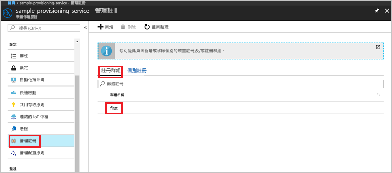

# <a name="enroll-x509-devices-to-iot-hub-device-provisioning-service-using-nodejs-service-sdk"></a>使用 Node.js 服務 SDK 向 IoT 中樞裝置佈建服務註冊 X.509 裝置

[!INCLUDE [iot-dps-selector-quick-enroll-device-x509](../../includes/iot-dps-selector-quick-enroll-device-x509.md)]


這些步驟說明如何使用 [Node.js 服務 SDK](https://github.com/Azure/azure-iot-sdk-node) 和 Node.js 範例，以程式設計方式建立中繼或根 CA X.509 憑證的註冊群組。 雖然在 Windows 和 Linux 電腦上都可運作這些步驟，本文將使用 Windows 開發電腦。
 

## <a name="prerequisites"></a>先決條件

- 請務必完成[使用 Azure 入口網站設定 IoT 中樞裝置佈建服務](./quick-setup-auto-provision.md)中的步驟。 

 
- 請確定您在電腦上已安裝 [Node.js 4.0 或更新版本](https://nodejs.org)。


- 您需要包含中繼或根 CA X.509 憑證的 .pem 檔案，已上傳至佈建服務並已向佈建服務驗證。 **Azure IoT c SDK** 包含的工具可協助您建立 X.509 憑證鏈結、從該鏈結上傳根或中繼憑證，並使用驗證憑證的服務來執行所有權證明。 若要使用此工具，請複製 [Azure IoT c SDK](https://github.com/Azure/azure-iot-sdk-c)，並在您的電腦上遵循 [azure-iot-sdk-c\tools\CACertificates\CACertificateOverview.md](https://github.com/Azure/azure-iot-sdk-c/blob/master/tools/CACertificates/CACertificateOverview.md) 的步驟。

## <a name="create-the-enrollment-group-sample"></a>建立註冊群組範例 

 
1. 從工作資料夾中的命令視窗中，執行：
  
     ```cmd\sh
     npm install azure-iot-provisioning-service
     ```  

2. 使用文字編輯器，在工作資料夾中建立 **create_enrollment_group.js** 檔案。 將下列程式碼新增至檔案，並加以儲存：

    ```
    'use strict';
    var fs = require('fs');

    var provisioningServiceClient = require('azure-iot-provisioning-service').ProvisioningServiceClient;

    var serviceClient = provisioningServiceClient.fromConnectionString(process.argv[2]);

    var enrollment = {
      enrollmentGroupId: 'first',
      attestation: {
        type: 'x509',
        x509: {
          signingCertificates: {
            primary: {
              certificate: fs.readFileSync(process.argv[3], 'utf-8').toString()
            }
          }
        }
      },
      provisioningStatus: 'disabled'
    };

    serviceClient.createOrUpdateEnrollmentGroup(enrollment, function(err, enrollmentResponse) {
      if (err) {
        console.log('error creating the group enrollment: ' + err);
      } else {
        console.log("enrollment record returned: " + JSON.stringify(enrollmentResponse, null, 2));
        enrollmentResponse.provisioningStatus = 'enabled';
        serviceClient.createOrUpdateEnrollmentGroup(enrollmentResponse, function(err, enrollmentResponse) {
          if (err) {
            console.log('error updating the group enrollment: ' + err);
          } else {
            console.log("updated enrollment record returned: " + JSON.stringify(enrollmentResponse, null, 2));
          }
        });
      }
    });
    ````

## <a name="run-the-enrollment-group-sample"></a>執行註冊群組範例
 
1. 若要執行範例，您需要佈建服務的連接字串。 
    1. 登入 Azure 入口網站，按一下左側功能表上的 [所有資源] 按鈕，然後開啟您的裝置佈建服務。 
    2. 按一下 [共用存取原則]，然後按一下您要用來開啟其屬性的存取原則。 在 [存取原則] 視窗中，複製並記下主要索引鍵連接字串。 

     


3. 如 [[必要條件]](#prerequisites) 中所述，您還需要包含 X.509 中繼或根 CA 憑證的 .pem 檔案，先前已上傳至佈建服務並已向佈建服務驗證。 若要檢查您的憑證是否已上傳和驗證，請在 Azure 入口網站的 [裝置佈建服務摘要] 頁面上，按一下 [憑證]。 找出需要用於群組註冊的憑證，並確認其狀態值已驗證。

     

1. 若要建立憑證的註冊群組，請執行下列命令 (包括命令列引數的括號)：
 
     ```cmd\sh
     node create_enrollment_group.js "<the connection string for your provisioning service>" "<your certificate's .pem file>"
     ```
 
3. 成功建立時，命令視窗會顯示新註冊群組的屬性。

     

4. 請確認已建立註冊群組。 在 Azure 入口網站的 [裝置佈建服務摘要] 刀鋒視窗上，選取 [管理註冊]。 選取 [註冊群組] 索引標籤，並確認新的註冊項目 (第一個) 存在。

     
 
## <a name="clean-up-resources"></a>清除資源
如果您打算探索 Node.js 服務範例，請勿清除本快速入門中建立的資源。 如果您不打算繼續，請使用下列步驟來刪除本快速入門建立的所有 Azure 資源。
 
1. 在您的電腦上關閉 Node.js 範例輸出視窗。
2. 在 Azure 入口網站中，瀏覽至您的裝置佈建服務，按一下 [管理註冊]，然後選取 [註冊群組] 索引標籤。選取您使用本快速入門建立之註冊項目的 [註冊識別碼]，然後按一下刀鋒視窗頂端的 [刪除] 按鈕。  
3. 在 Azure 入口網站中，從您的裝置佈建服務中按一下 [憑證]，按一下您為本快速入門上傳的憑證，然後按一下 [憑證詳細資料] 視窗頂端的 [刪除] 按鈕。  
 
## <a name="next-steps"></a>後續步驟
在本快速入門中，您已使用 Azure IoT 中樞裝置佈建服務，建立了 X.509 中繼或根 CA 憑證的群組註冊。 若要深入了解裝置佈建，請繼續在 Azure 入口網站中進行裝置佈建服務設定的教學課程。 
 
> [!div class="nextstepaction"]
> [Azure IoT 中樞裝置佈建服務教學課程](./tutorial-set-up-cloud.md)