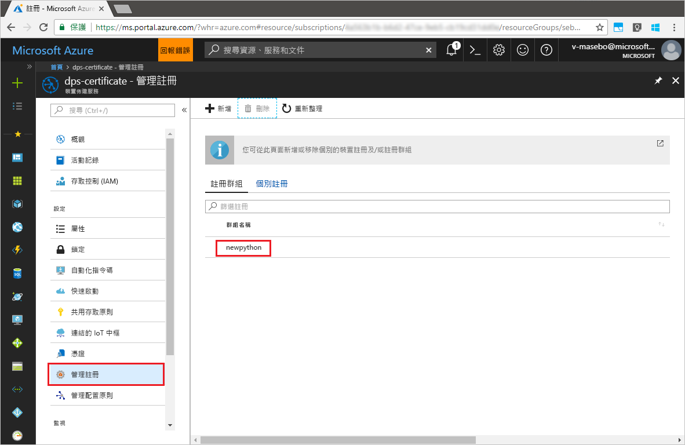

# <a name="enroll-x509-devices-to-iot-hub-device-provisioning-service-using-python-provisioning-service-sdk"></a>使用 Python 佈建服務 SDK 向 IoT 中樞裝置佈建服務註冊 X.509 裝置
[!INCLUDE [iot-dps-selector-quick-enroll-device-x509](../../includes/iot-dps-selector-quick-enroll-device-x509.md)]

這些步驟顯示如何使用 [Python 佈建服務 SDK](https://github.com/Azure/azure-iot-sdk-python/tree/master/provisioning_service_client) 與範例 Python 應用程式的說明，以程式設計方式向 Azure IoT 中樞裝置佈建服務註冊 X.509 模擬裝置的群組。 雖然 Java 服務 SDK 在 Windows 和 Linux 電腦上都適用，本文會使用 Windows 開發電腦來逐步引導進行註冊程序。

繼續之前，請務必[使用 Azure 入口網站設定 IoT 中樞裝置佈建服務](./quick-setup-auto-provision.md)。

> [!NOTE]
> 本快速入門僅支援**註冊群組**。 經由 _Python 佈建服務 SDK_ 的**個別註冊**仍在建置中。
> 

<a id="prepareenvironment"></a>

## <a name="prepare-the-environment"></a>準備環境 

1. 下載並安裝 [Python 2.x 或 3.x](https://www.python.org/downloads/)。 請務必使用安裝程式所需的 32 位元或 64 位元安裝。 在安裝期間出現系統提示時，務必將 Python 新增至平台特有的環境變數。 

1. 選擇下列其中一個選項：

    - 建置和編譯 **Azure IoT Python SDK**。 請遵循[這些指示](https://github.com/Azure/azure-iot-sdk-python/blob/master/doc/python-devbox-setup.md)來建置 Python 套件。 如果您使用 Windows 作業系統，則請同時安裝 [Visual C++ 可轉散發套件](http://www.microsoft.com/download/confirmation.aspx?id=48145)，以允許使用 Python 的原生 DLL。

    - [安裝或升級 *pip* (Python 套件管理系統)](https://pip.pypa.io/en/stable/installing/)，並透過下列命令安裝套件：

        ```cmd/sh
        pip install azure-iothub-provisioningserviceclient
        ```

1. 您需要包含中繼或根 CA X.509 憑證的 .pem 檔案，已上傳至佈建服務並已向佈建服務驗證。 **Azure IoT C SDK** 包含的工具可協助您建立 X.509 憑證鏈結、從該鏈結上傳根或中繼憑證，並使用驗證憑證的服務來執行所有權證明。 若要使用此工具，請複製 [Azure IoT C SDK](https://github.com/Azure/azure-iot-sdk-c)，並在您的電腦上遵循 [azure-iot-sdk-c\tools\CACertificates\CACertificateOverview.md](https://github.com/Azure/azure-iot-sdk-c/blob/master/tools/CACertificates/CACertificateOverview.md) 的步驟。


## <a name="modify-the-python-sample-code"></a>修改 Python 範例程式碼

本節說明如何將 X.509 裝置的佈建詳細資料新增至範例程式碼。 

1. 使用文字編輯器建立新的 **EnrollmentGroup.py** 檔案。

1. 在 **EnrollmentGroup.py** 檔案開頭處新增下列 `import` 陳述式和變數。 然後，將 `dpsConnectionString` 取代為您的連接字串；您可以使用 **Azure 入口網站** 在您**裝置佈建服務**的**共用存取原則**下找到此字串。 將憑證預留位置取代為先前在[準備環境](quick-enroll-device-x509-python.md#prepareenvironment)中建立的憑證。 最後，建立唯一 `registrationid`；切記其中只能包含小寫英數字元與連字號。  
   
    ```python
    from provisioningserviceclient import ProvisioningServiceClient
    from provisioningserviceclient.models import EnrollmentGroup, AttestationMechanism

    CONNECTION_STRING = "{dpsConnectionString}"

    SIGNING_CERT = """-----BEGIN CERTIFICATE-----
    XXXXXXXXXXXXXXXXXXXXXXXXXXXXXXXXXXXXXXXXXXXXXXXXXXXXXXXXXXXXXXXX
    XXXXXXXXXXXXXXXXXXXXXXXXXXXXXXXXXXXXXXXXXXXXXXXXXXXXXXXXXXXXXXXX
    XXXXXXXXXXXXXXXXXXXXXXXXXXXXXXXXXXXXXXXXXXXXXXXXXXXXXXXXXXXXXXXX
    XXXXXXXXXXXXXXXXXXXXXXXXXXXXXXXXXXXXXXXXXXXXXXXXXXXXXXXXXXXXXXXX
    XXXXXXXXXXXXXXXXXXXXXXXXXXXXXXXXXXXXXXXXXXXXXXXXXXXXXXXXXXXXXXXX
    XXXXXXXXXXXXXXXXXXXXXXXXXXXXXXXXXXXXXXXXXXXXXXXXXXXXXXXXXXXXXXXX
    XXXXXXXXXXXXXXXXXXXXXXXXXXXXXXXXXXXXXXXXXXXXXXXXXXXXXXXXXXXXXXXX
    XXXXXXXXXXXXXXXXXXXXXXXXXXXXXXXXXXXXXXXXXXXXXXXXXXXXXXXXXXXXXXXX
    XXXXXXXXXXXXXXXXXXXXXXXXXXXXXXXXXXXXXXXXXXXXXXXXXXXXXXXXXXXXXXXX
    XXXXXXXXXXXXXXXXXXXXXXXXXXXXXXXXXXXXXXXXXXXXXXXXXXXXXXXXXXXXXXXX
    XXXXXXXXXXXXXXXXXXXXXXXXXXXXXXXXXXXXXXXXXXXXXXXXXXXXXXXXXXXXXXXX
    XXXXXXXXXXXXXXXXXXXXXXXXXXXXXXXXXXXXXXXXXXXXXXXXXXXXXXXXXXXXXXXX
    XXXXXXXXXXXXXXXXXXXXXXXXXXXXXXXXXXXXXXXXXXXXXXXXXXXXXXXXXXXXXXXX
    XXXXXXXXXXXXXXXXXXXXXXXXXXXXXXXXXXXXXXXXXXXXXXXXXXXXXXXXXXXXXXXX
    XXXXXXXXXXXXXXXXXXXXXXXXXXXXXXXXXXXXXXXXXXXXXXXXXXXXXXXX
    -----END CERTIFICATE-----"""

    GROUP_ID = "{registrationid}"
    ```

1. 新增下列函式和函式呼叫，以實作群組註冊建立：
   
    ```python
    def main():
        print ( "Initiating enrollment group creation..." )

        psc = ProvisioningServiceClient.create_from_connection_string(CONNECTION_STRING)
        att = AttestationMechanism.create_with_x509_signing_certs(SIGNING_CERT)
        eg = EnrollmentGroup.create(GROUP_ID, att)

        eg = psc.create_or_update(eg)
    
        print ( "Enrollment group created." )

    if __name__ == '__main__':
        main()
    ```

1. 儲存並關閉 **EnrollmentGroup.py** 檔案。
 

## <a name="run-the-sample-group-enrollment"></a>執行範例群組註冊

1. 開啟命令提示字元，並執行指令碼。

    ```cmd/sh
    python EnrollmentGroup.py
    ```

1. 觀察成功註冊的輸出。

1. 在 Azure 入口網站中，瀏覽至您的佈建服務。 按一下 [管理註冊]。 請注意，您 X.509 裝置的群組會出現在 [註冊群組] 索引標籤下，並使用先前建立的名稱 `registrationid`。 

      


## <a name="clean-up-resources"></a>清除資源
如果您打算探索 Java 服務範例，請勿清除在此快速入門中建立的資源。 如果您不打算繼續，請使用下列步驟來刪除本快速入門建立的所有資源。

1. 在您的電腦上關閉 Java 範例輸出視窗。
1. 在您的電腦上關閉 _X509 憑證產生器_ 視窗。
1. 在 Azure 入口網站中，瀏覽至您的裝置佈建服務，按一下 [管理註冊]，然後選取 [註冊群組] 索引標籤。選取您使用本快速入門註冊之 X.509 裝置的群組名稱，然後按一下刀鋒視窗頂端的 [刪除] 按鈕。  


## <a name="next-steps"></a>後續步驟
在本快速入門中，您已向裝置佈建服務註冊 X.509 裝置的模擬群組。 若要深入了解裝置佈建，請繼續在 Azure 入口網站中進行裝置佈建服務設定的教學課程。 

> [!div class="nextstepaction"]
> [Azure IoT 中樞裝置佈建服務教學課程](./tutorial-set-up-cloud.md)
