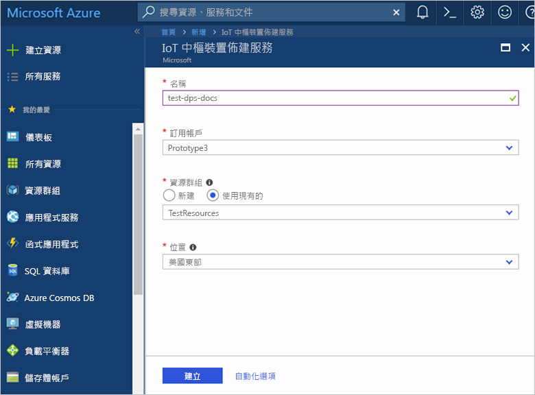
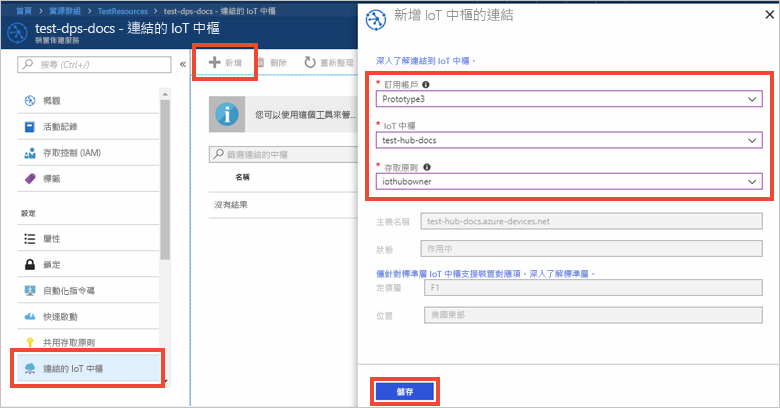

# 使用 Azure 入口網站設定 IoT 中樞裝置佈建服務 (預覽)

這些步驟顯示如何在入口網站中設定 Azure 雲端資源，以便佈建裝置。 這包括建立 IoT 中樞、建立新的 IoT 中樞裝置佈建服務，以及將兩個服務連結在一起。 

如果您沒有 Azure 訂用帳戶，請在開始前建立 [免費帳戶](https://azure.microsoft.com/free/?WT.mc_id=A261C142F) 。

## 登入 Azure 入口網站

登入 [Azure 入口網站](https://portal.azure.com/)。

## 建立 IoT 中樞

1. 按一下 Azure 入口網站左上角的 [新增] 按鈕。

2. 選取 [物聯網]，選取 [IoT 中樞]，然後按一下 [建立] 按鈕。 

3. 輸入 IoT 中樞的 [名稱]。 從可用的價格選項選取，輸入 [IoT 中樞單位](https://azure.microsoft.com/pricing/details/iot-hub/)，選取裝置到雲端訊息的分割數目，以及要用於此資源的訂用帳戶。 輸入新的或現有資源群組的名稱，然後選取位置。 完成時，按一下 [建立]。

      

4. 成功部署 IoT 中樞後，中樞摘要刀鋒視窗會自動開啟。

## 建立 IoT 中樞裝置佈建服務的新執行個體

1. 按一下 Azure 入口網站左上角的 [新增] 按鈕。

2. 針對**裝置佈建服務***搜尋 Marketplace*。 選取 **IoT 裝置佈建服務 (預覽)**，然後按一下 [建立] 按鈕。 

3. 輸入裝置佈建服務執行個體的 [名稱]。 選取要用於此執行個體的訂用帳戶，並且為新的或現有資源群組命名。 選取位置。 完成時，按一下 [建立]。

      

4. 成功部署服務後，其摘要刀鋒視窗會自動開啟。

## 連結 IoT 中樞與裝置佈建服務

1. 按一下 Azure 入口網站左側功能表中的 [所有資源] 按鈕。 選取您在上一節中建立的裝置佈建服務執行個體。  

2. 在裝置佈建服務摘要刀鋒視窗上，選取 [連結的 IoT 中樞]。 按一下位於頂端的 [+ 新增] 按鈕。 

3. 在 [將連結新增至 IoT 中樞] 入口網站刀鋒視窗中，選取目前的訂用帳戶，或輸入其他訂用帳戶的名稱和連接字串。 從下拉式清單中選取中樞的名稱。 完成時，按一下 [儲存]。 

      

3. 您現在應會在 [連結的 IoT 中樞] 刀鋒視窗之下看到所選的中樞。 

## 清除資源

此集合中的其他快速入門會以本快速入門為基礎。 如果您打算繼續進行後續的快速入門或教學課程，請勿清除在此快速入門中建立的資源。 如果您不打算繼續，請使用下列步驟，在 Azure 入口網站中刪除本快速入門所建立的所有資源。

1. 從 Azure 入口網站的左側功能表中，按一下 [所有資源]，然後選取您的裝置佈建服務。 在 [所有資源] 刀鋒視窗的頂端，按一下 [刪除]。  
2. 從 Azure 入口網站的左側功能表中，按一下 [所有資源]，然後選取您的 IoT 中樞。 在 [所有資源] 刀鋒視窗的頂端，按一下 [刪除]。  

## 後續步驟

在本快速入門中，您已部署 IoT 中樞和裝置佈建服務執行個體，並已連結這兩個資源。 若要深入了解如何使用這項設定來佈建模擬裝置，請繼續進行建立模擬裝置的快速入門。

> [!div class="nextstepaction"]
> [建立模擬裝置的快速入門](./quick-create-simulated-device.md)
