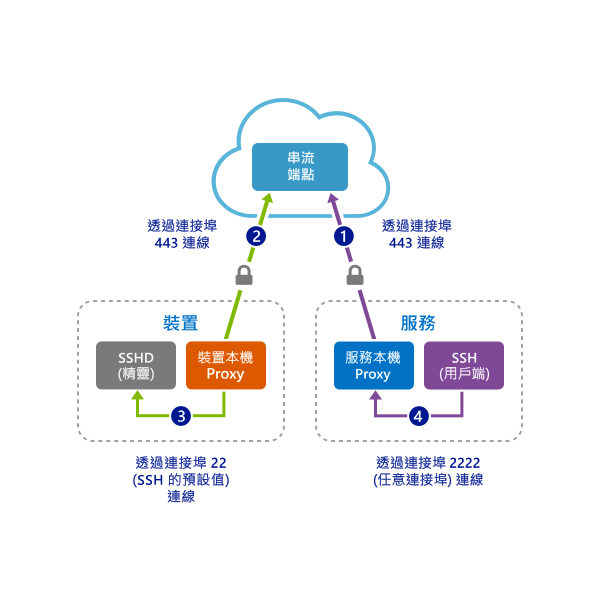

# <a name="quickstart-sshrdp-over-an-iot-hub-device-stream-using-a-c-proxy-application-preview"></a>快速入門：使用 C Proxy 應用程式透過 IoT 中樞裝置串流進行 SSH/RDP 輸送 (預覽)

[!INCLUDE [iot-hub-quickstarts-4-selector](../../includes/iot-hub-quickstarts-4-selector.md)]

Microsoft Azure IoT 中樞目前支援裝置串流作為[預覽功能](https://azure.microsoft.com/support/legal/preview-supplemental-terms/)。

[IoT 中樞裝置串流](./iot-hub-device-streams-overview.md)可讓服務和裝置應用程式以安全且便於設定防火牆的方式進行通訊。 如需設定的概觀，請參閱[本機 Proxy 範例頁面](./iot-hub-device-streams-overview.md#local-proxy-sample-for-ssh-or-rdp)。

本文件說明透過裝置串流來輸送 SSH 流量 (使用連接埠 22) 的設定。 RDP 流量的設定也相類似，但需要稍微變更組態。 由於裝置串流與應用程式或通訊協定無關，因此現有的快速入門可在修改後 (藉由變更通訊連接埠) 用於其他類型的應用程式流量。

## <a name="how-it-works"></a>運作方式

下圖說明如何設定將會在 SSH 用戶端與 SSH 服務精靈程序之間啟用端對端連線的裝置和服務本機 Proxy 程式。 在公開預覽期間，C SDK 僅支援裝置端上的裝置串流。 因此，本快速入門僅提供執行裝置本機 Proxy 應用程式的指示。 您應該執行下列其中一個服務端快速入門：

* [使用 C# Proxy 透過 IoT 中樞裝置串流進行 SSH/RDP 輸送](./quickstart-device-streams-proxy-csharp.md)

* [使用 NodeJS Proxy 透過 IoT 中樞裝置串流進行 SSH/RDP 輸送](./quickstart-device-streams-proxy-nodejs.md)。



1. 服務本機 Proxy 連線至 IoT 中樞，並啟動對目標裝置的裝置串流。

2. 裝置本機 Proxy 完成串流起始交握，並透過 IoT 中樞對服務端的串流端點建立端對端串流通道。

3. 裝置本機 Proxy 連線至在裝置上接聽連接埠 22 的 SSH 精靈 (SSHD) (此連接埠可依照[＜執行裝置本機 Proxy 應用程式＞  一節](#run-the device-local-proxy-application)中的說明進行設定)。

4. 服務本機 Proxy 藉由接聽指定的連接埠 (在此案例中為連接埠 2222，也可以依照[執行裝置本機 Proxy 應用程式一節](#run-the-device-local-proxy-application)中的說明進行設定) 等候來自使用者的新 SSH 連線。 當使用者透過 SSH 用戶端連線時，通道可讓 SSH 應用程式流量能夠在 SSH 用戶端與伺服器程式之間傳輸。

> [!NOTE]
> 透過裝置串流傳送的 SSH 流量將經由 IoT 中樞的串流端點進行輸送，而不是直接在服務與裝置之間傳送。 如需詳細資訊，請閱讀[使用 IoT 中樞裝置串流的優點](iot-hub-device-streams-overview.md#benefits)。 此外，圖中也說明在與裝置本機 Proxy 相同的裝置 (或機器) 上執行的 SSH 精靈。 在本快速入門中，提供 SSH 精靈的 IP 位址也可讓裝置本機 Proxy 與精靈在不同的機器上執行。

[!INCLUDE [cloud-shell-try-it.md](../../includes/cloud-shell-try-it.md)]

如果您沒有 Azure 訂用帳戶，請在開始前建立[免費帳戶](https://azure.microsoft.com/free/?WT.mc_id=A261C142F) 。

## <a name="prerequisites"></a>必要條件

* 裝置串流的預覽版目前僅支援在下列區域建立的 IoT 中樞：

   * **美國中部**

   * **美國中部 EUAP**

* 安裝 [Visual Studio 2019](https://www.visualstudio.com/vs/) 並啟用[使用 C++ 的桌面開發](https://www.visualstudio.com/vs/support/selecting-workloads-visual-studio-2017/)工作負載。
* 安裝最新版的 [Git](https://git-scm.com/download/)。

* 執行下列命令，將適用於 Azure CLI 的 Microsoft Azure IoT 擴充功能新增至您的 Cloud Shell 執行個體。 IoT 擴充功能可將 IoT 中樞、IoT Edge 和 IoT 裝置佈建服務的特定命令新增至 Azure CLI。

   ```azurecli-interactive
   az extension add --name azure-cli-iot-ext
   ```

## <a name="prepare-the-development-environment"></a>準備開發環境

針對此快速入門，您將使用[適用於 C 的 Azure IoT 裝置 SDK](iot-hub-device-sdk-c-intro.md)。您將準備用來從 GitHub 複製並建置 [Azure IoT C SDK](https://github.com/Azure/azure-iot-sdk-c) \(英文\) 的開發環境。 GitHub 上的 SDK 包括此快速入門中使用的範例程式碼。 


1. 下載 [CMake 建置系統](https://cmake.org/download/)。

    在開始安裝 `CMake` **之前**，請務必將 Visual Studio 先決條件 (Visual Studio 和「使用 C++ 進行桌面開發」工作負載) 安裝在您的機器上。 在符合先決條件，並且驗證過下載項目之後，請安裝 CMake 建置系統。

2. 開啟命令提示字元或 Git Bash 殼層。 執行下列命令以複製 [Azure IoT C SDK](https://github.com/Azure/azure-iot-sdk-c) GitHub 存放庫：

    
   ```
   git clone https://github.com/Azure/azure-iot-sdk-c.git --recursive -b public-preview
   ```

   預期此作業需要幾分鐘的時間才能完成。

3. 在 git 存放庫的根目錄中建立 `cmake` 子目錄，並瀏覽至該資料夾。 

   ```
   cd azure-iot-sdk-c
   mkdir cmake
   cd cmake
   ```

4. 從 `cmake` 目錄執行下列命令 (該命令會建置您開發用戶端平台特有的 SDK 版本)。

   * 在 Linux 中：

      ```bash
      cmake ..
      make -j
      ```

   * 在 Windows 中，請在 Visual Studio 2015 或 2017 的開發人員命令提示字元中執行下列命令。 `cmake` 目錄中會產生模擬裝置的 Visual Studio 解決方案。

      ```cmd
      rem For VS2015
      cmake .. -G "Visual Studio 14 2015"

      rem Or for VS2017
      cmake .. -G "Visual Studio 15 2017"

      rem Then build the project
      cmake --build . -- /m /p:Configuration=Release
      ```

## <a name="create-an-iot-hub"></a>建立 IoT 中樞

[!INCLUDE [iot-hub-include-create-hub-device-streams](../../includes/iot-hub-include-create-hub-device-streams.md)]

## <a name="register-a-device"></a>註冊裝置

裝置必須向的 IoT 中樞註冊，才能進行連線。 在此節中，您將使用 Azure Cloud Shell 搭配 [IoT 擴充功能](https://docs.microsoft.com/cli/azure/ext/azure-cli-iot-ext/iot?view=azure-cli-latest)來註冊模擬裝置。

1. 在 Azure Cloud Shell 中執行下列命令，以建立裝置身分識別。

   **YourIoTHubName**：以您為 IoT 中樞選擇的名稱取代此預留位置。

   **MyDevice**：這是為已註冊裝置指定的名稱。 使用所示的 MyCDevice。 如果您為裝置選擇不同的名稱，則也必須在本文中使用該名稱，並先在範例應用程式中更新該裝置名稱，再執行應用程式。

    ```azurecli-interactive
    az iot hub device-identity create --hub-name YourIoTHubName --device-id MyDevice
    ```

2. 在 Azure Cloud Shell 中執行下列命令，以取得您所註冊裝置的「裝置連接字串」  ：

   **YourIoTHubName**：以您為 IoT 中樞選擇的名稱取代此預留位置。

    ```azurecli-interactive
    az iot hub device-identity show-connection-string --hub-name YourIoTHubName --device-id MyDevice --output table
    ```

    記下裝置連接字串，如下列範例所示：

   `HostName={YourIoTHubName}.azure-devices.net;DeviceId=MyDevice;SharedAccessKey={YourSharedAccessKey}`

    您稍後會在快速入門中使用此值。

## <a name="ssh-to-a-device-via-device-streams"></a>透過裝置串流使用 SSH 連線至裝置

在本節中，您會建立端對端串流來以通道輸送 SSH 流量。

### <a name="run-the-device-local-proxy-application"></a>執行裝置本機 Proxy 應用程式

1. 編輯資料夾 `iothub_client/samples/iothub_client_c2d_streaming_proxy_sample/` 中的原始程式檔 `iothub_client_c2d_streaming_proxy_sample.c`，並提供您的裝置連接字串、目標裝置的 IP/主機名稱，以及 SSH 連接埠 22：

   ```C
   /* Paste in the your iothub connection string  */
   static const char* connectionString = "[Connection string of IoT Hub]";
   static const char* localHost = "[IP/Host of your target machine]"; // Address of the local server to connect to.
   static const size_t localPort = 22; // Port of the local server to connect to.
   ```

2. 編譯範例：

   ```bash
   # In Linux
   # Go to the sample's folder cmake/iothub_client/samples/iothub_client_c2d_streaming_proxy_sample
   make -j
   ```

   ```cmd
   rem In Windows
   rem Go to cmake at root of repository
   cmake --build . -- /m /p:Configuration=Release
   ```

3. 在裝置上執行已編譯的程式：

   ```bash
   # In Linux
   # Go to the sample's folder cmake/iothub_client/samples/iothub_client_c2d_streaming_proxy_sample
   ./iothub_client_c2d_streaming_proxy_sample
   ```

   ```cmd
   rem In Windows
   rem Go to the sample's release folder cmake\iothub_client\samples\iothub_client_c2d_streaming_proxy_sample\Release
   iothub_client_c2d_streaming_proxy_sample.exe
   ```

### <a name="run-the-service-local-proxy-application"></a>執行服務本機 Proxy 應用程式

如[運作方式一節](#how-it-works)中所說明，要建立用來輸送 SSH 流量的端對端串流，兩端 (即服務和裝置) 都必須要有本機 Proxy。 在公開預覽期間，IoT 中樞 C SDK 僅支援裝置端上的裝置串流。 若要建置及執行服務本機 Proxy，請遵循下列其中一個快速入門中提供的執行服務本機 Proxy 步驟：

   * [使用 C# Proxy 應用程式透過 IoT 中樞裝置串流進行 SSH/RDP 輸送](./quickstart-device-streams-proxy-csharp.md)

   * [使用 Node.js Proxy 應用程式透過 IoT 中樞裝置串流進行 SSH/RDP 輸送](./quickstart-device-streams-proxy-nodejs.md)。

### <a name="establish-an-ssh-session"></a>建立 SSH 工作階段

當裝置和服務本機 Proxy 皆在執行中之後，請使用 SSH 用戶端程式，並經由連接埠 2222 連線至服務本機 Proxy (而不是直接使用 SSH 精靈)。

```cmd/sh
ssh <username>@localhost -p 2222
```

此時，您將看到要求您輸入認證的 SSH 登入提示。

經由 `IP_address:22` 連線至 SSH 精靈的裝置本機 Proxy 上的主控台輸出：

SSH 用戶端程式的主控台輸出 (SSH 用戶端藉由連線至服務本機 Proxy 所接聽的連接埠 22 與 SSH 精靈通訊)：

## <a name="clean-up-resources"></a>清除資源

[!INCLUDE [iot-hub-quickstarts-clean-up-resources](../../includes/iot-hub-quickstarts-clean-up-resources-device-streams.md)]

## <a name="next-steps"></a>後續步驟

在本快速入門中，您已設定 IoT 中樞、註冊裝置、部署裝置和服務本機 Proxy 程式以透過 IoT 中樞建立裝置串流，並使用 Proxy 輸送 SSH 流量。

使用下列連結深入了解裝置串流：

> [!div class="nextstepaction"]
> [裝置串流概觀](./iot-hub-device-streams-overview.md)
