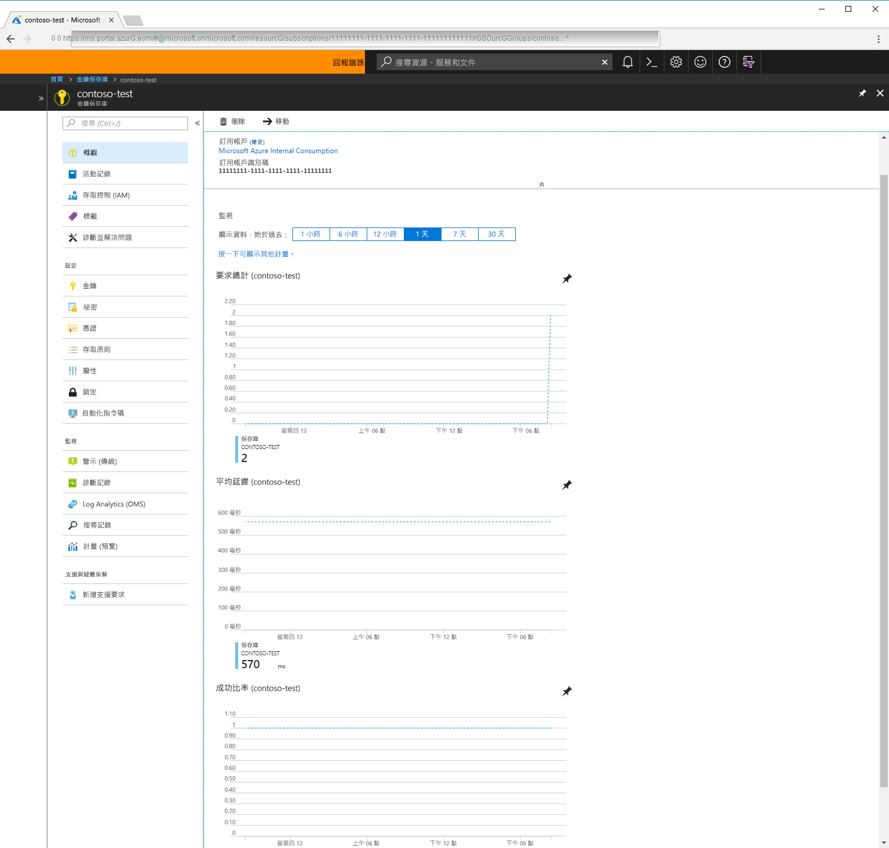

# 什麼是 Azure 金鑰保存庫？

Azure Key Vault 是一項雲端服務，可作為安全的祕密存放區。

您有密碼、連接字串，以及讓您的應用程式保持運作所需的其他資訊。 您想要確保這項資訊可用，但。 這正是為什麼您需要 Azure Key Vault 的協助。 Azure Key Vault 可協助您安全地儲存和管理應用程式祕密。

Key Vault 可讓您建立多個安全的容器，稱之為保存庫。 這些保存庫由硬體安全性模組 (HSM) 支援。 保存庫藉由集中儲存應用程式祕密，協助減少意外遺失安全性資訊的機會。 Key Vault 也會控制和記錄其中所儲存項目的存取權。 Azure Key Vault 可以處理要求及更新傳輸層安全性 (TLS) 憑證，並提供穩健憑證生命週期管理解決方案所需的功能。

 Azure Key Vault 設計用來支援應用程式金鑰和祕密。 Key Vault 的用意並非作為使用者密碼的存放區。

## 為何使用 Azure Key Vault？

### 集中儲存應用程式祕密

在 Azure Key Vault 中集中儲存應用程式祕密，可讓您控制其散發。 這可大幅減少不小心洩露祕密的機會。 使用 Key Vault 時，應用程式開發人員不再需要在其應用程式中儲存安全性資訊。 這樣就不需要讓此資訊成為程式碼的一部分。 例如，應用程式可能需要連線到資料庫。 在 Key Vault 中妥善保存連接字串，而不用在應用程式程式碼中儲存連接字串。

您的應用程式可以使用 URI 安全地存取所需的資訊，而在應用程式的金鑰或祕密儲存在 Azure Key Vault 之後，URI 可讓它們能擷取特定的祕密版本。 發生這種情況，不需要撰寫自訂程式碼來保護任何祕密資訊。

### 安全地儲存祕密

Azure 使用會業界標準演算法、金鑰長度和硬體安全性模組 (HSM) 保護金鑰。 使用的 HSM 經過美國聯邦資訊處理標準 (FIPS) 140-2 Level 2 驗證。

金鑰保存庫的存取權需要先經過適當的驗證和授權，呼叫者 (使用者或應用程式) 才能取得存取權。 驗證會建立呼叫者的身分識別，授權則會判斷呼叫者可以執行的作業。

驗證會透過 Azure Active Directory 進行。 授權可以透過角色型存取控制 (RBAC) 或 Key Vault 存取原則進行。 在處理保存庫的管理時會使用 RBAC，而在嘗試存取保存庫中儲存的資料時會使用金鑰保存庫存取原則。

Azure Key Vault 可能受軟體或硬體 HSM 保護。 在您需要加強保證的情況下，您可以在硬體安全模組 (HSM) 中匯入或產生無需離開 HSM 界限的金鑰。 Microsoft 會使用 Thales 硬體安全性模型。 您可以使用 Thales 工具將金鑰從您的 HSM 移至 Azure Key Vault。

最後，Azure Key Vault 的設計便是讓 Microsoft 無法看見或擷取您的金鑰。

### 監視存取和使用

建立一些 Key Vault 之後，您會想要監視存取金鑰和祕密的方式和時機。 您可以啟用 Key Vault 的記錄功能來達成目的。 您可以如下設定 Azure Key Vault：

- 封存至儲存體帳戶。
- 串流至事件中樞。
- 將記錄傳送至 Log Analytics。

您可以控制您的記錄，藉由限制存取權來保護它們，也可以刪除您不再需要的記錄。

### 簡化應用程式祕密的管理

在儲存珍貴資料時，您必須採取幾個步驟。 安全性資訊必須受到保護，它必須遵循生命週期，同時必須保持高可用性。 Azure Key Vault 簡化此作業的方式如下：

- 免除 HSM 的內部知識需求。
- 在短時間內相應增加，以符合組織的使用尖峰。
- 將區域內的 Key Vault 內容複寫到次要區域。 這可確保高可用性，並免除管理員採取任何動作來觸發容錯移轉的需求。
- 透過入口網站、Azure CLI 和 PowerShell 提供標準 Azure 系統管理選項。
- 自動執行您向公開 CA 購買憑證時的一些作業，例如註冊或續約。

此外，Azure Key Vault 可讓您隔離應用程式祕密。 應用程式只能存取它們有權存取的保存庫，且受限於僅只執行特定作業。 您可以為每個應用程式建立 Azure Key Vault，並將 Key Vault 中儲存的祕密限制於特定應用程式和開發人員小組。

### 與其他 Azure 服務整合

Key Vault 是 Azure 中的安全存放區，可用來簡化 [Azure 磁碟加密](../security/azure-security-disk-encryption.md)、SQL 伺服器和 Azure SQL 中的[一律加密]( https://docs.microsoft.com/sql/relational-databases/security/encryption/always-encrypted-database-engine)功能、[Azure Web 應用程式]( https://docs.microsoft.com/azure/app-service/web-sites-purchase-ssl-web-site)等案例。 Key Vault 本身可與儲存體帳戶、事件中樞和記錄分析整合。

## 後續步驟

- [快速入門：使用 CLI 建立 Azure Key Vault](quick-create-cli.md)
- [將 Azure Web 應用程式設定為從 Key Vault 讀取祕密](tutorial-web-application-keyvault.md)